# 《中国云图》PDF 第 1-20 页

本页由扫描版 PDF 自动提取生成。每个条目保留原页图像，并附 OCR 文本供检索和后续校订。

## PDF 第 1 页


!!! note "OCR 状态"
    本页暂未识别出可靠文本，保留原页图像。

## PDF 第 2 页

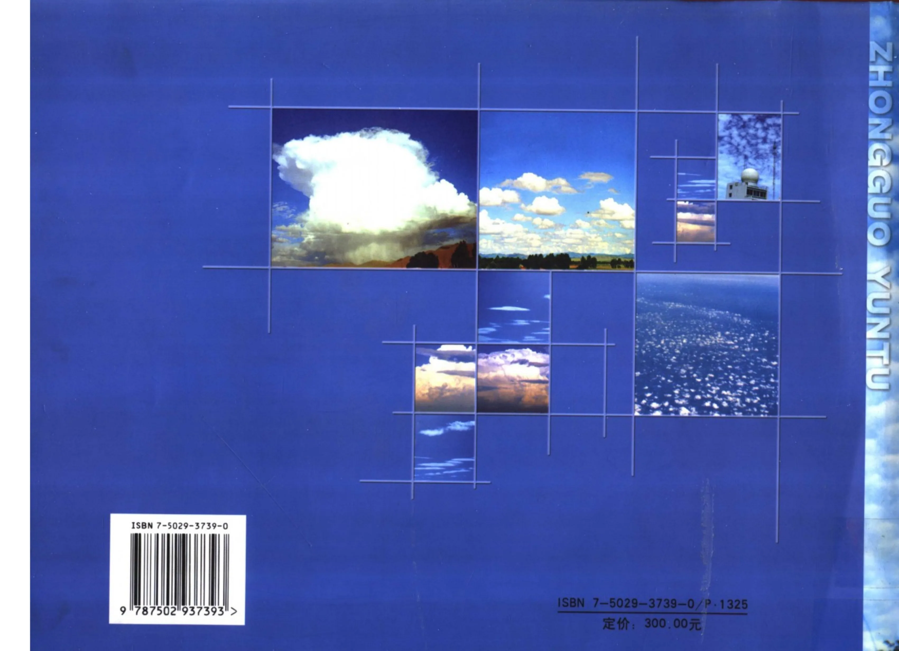

### OCR 文本

```text
ISBN 7-5029-3739-0

787502"937393
```

## PDF 第 3 页

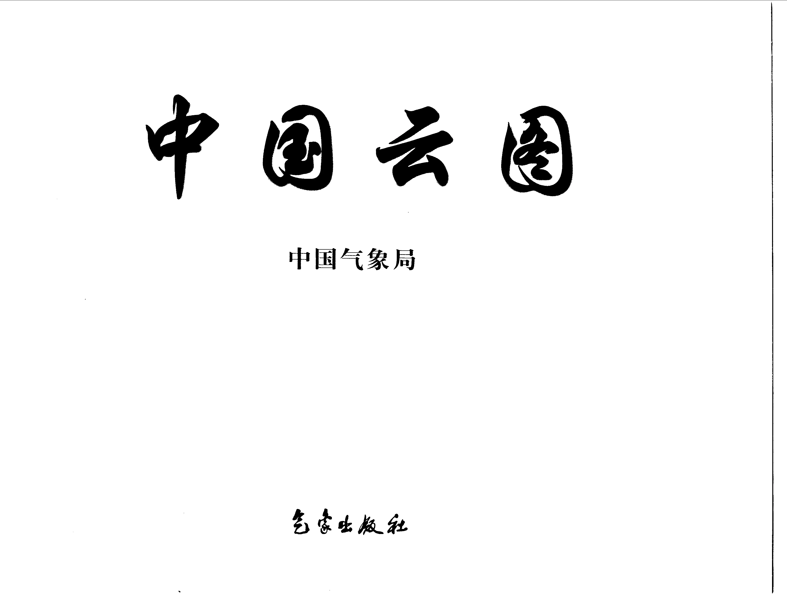

!!! note "OCR 状态"
    本页暂未识别出可靠文本，保留原页图像。

## PDF 第 4 页

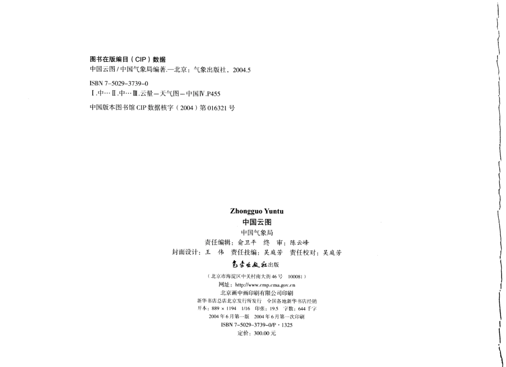

### OCR 文本

```text
图书在版编目 ( CIP ) 数据
中国云图/中国气象局编著.一北京: 气象出版社，2004.5

ISBN 7-5029-3739-0
Life Tp at — KAA — PV .P455

中国版本图书馆 CIP 数据核字 ( 2004 ) 4 016321 号

Zhongguo Yuntu
中国云图
中国气象局
责任编辑: 俞卫平 终 审: 陈云峰
封面设计: £ th 责任技编: RAF ”责任校对: 吴庭芳
Bb ok Me Ge ili li
( 北京市海淀区中关村南大街46导 100081 )
网址: http://www.emp.cma.gov.en
北京画中男印刷有限公司印刷
新华书店总店北京发行所发行 ”全国各地新华书店经销
WAS; 889 x 1194 1/16 印线: 195 字数: 644 TE
2004 年6月第一版 2004年6月第一次印刷
ISBN 7-5029-3739-0/P ' 1325
定价; 300.00 76

. eee 一一一 2
i a a A -一一一一 一 Ce
```

## PDF 第 5 页

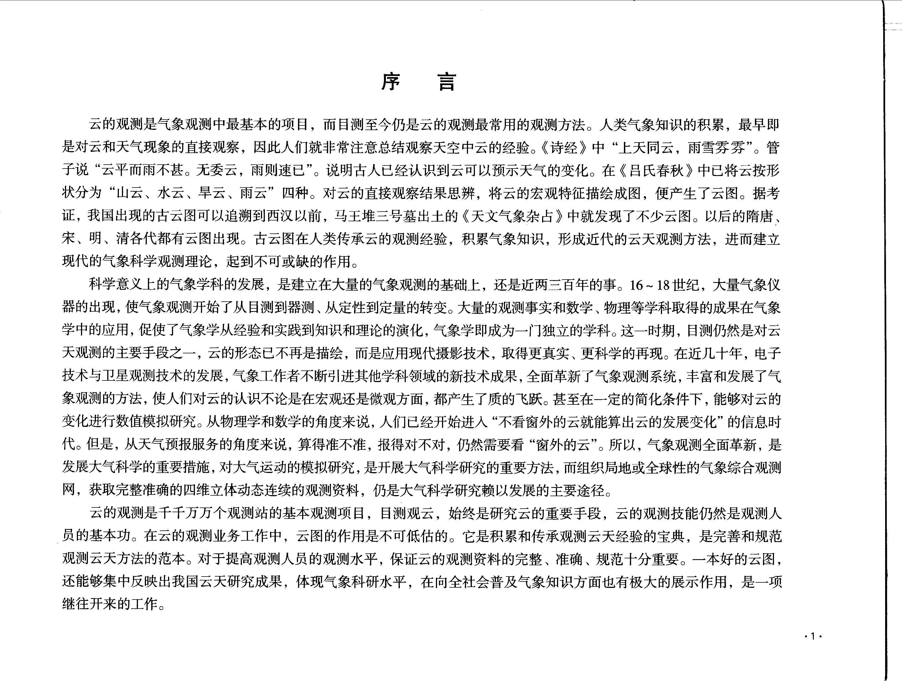

### OCR 文本

```text
序

云的观测是气象观测中最基本的项目，而目测至今仍是云的观测最常用的观测方法。人类气象知识的积累，最早即
是对云和天气现象的直接观察，因此人们就非常注意总结观察天空中云的经验。《诗经》中“上天同云，雨雪雾雾”。管
子说“云平而雨不甚。无委云，雨则速已”。说明古人已经认识到云可以预示天气的变化。在《吕氏春秋》中已将云按形
状分为“山云、水云、旱云、雨云”四种。对云的直接观察结果思辨,将云的宏观特征描绘成图，便产生了云图。据考
证,我国出现的古云图可以追溯到西汉以前，马王堆三号募出土的《天文气象杂占》中就发现了不少云图。以后的隋唐、
宋、明、清各代都有云图出现。古云图在人类传承云的观测经验，积累气象知识，形成近代的云天观测方法，进而建立
现代的气象科学观测理论，起到不可或缺的作用。

科学意义上的气象学科的发展，是建立在大量的气象观测的基础上，还是近两三百年的事。16 ~ 18 世纪，大量气象仪
器的出现, 使气象观测开始了从目测到器测、从定性到定量的转变。 大量的观测事实和数学、物理等学科取得的成果在气象
学中的应用, 促使了气象学从经验和实践到知识和理论的演化, 气象学即成为一门独立的学科。 这一时期,目测仍然是对云
天观测的主要手段之一，云的形态已不再是描绘，而是应用现代摄影技术, 取得更真实、更科学的再现。在近几十年, 电子
技术与卫星观测技术的发展, 气象工作者不断引进其他学科领域的新技术成果, 全面革新了气象观测系统, 丰富和发展了气
象观测的方法, 使人们对云的认识不论是在宏观还是微观方面, ARP AE TE GR, 甚至在一定的简化条件下 , 能够对云的
变化进行数值模拟研究。从物理学和数学的角度来说, 人们已经开始进入“不看窗外的云就能算出云的发展变化”的信息时
代。但是,从天气预报服务的角度来说, 算得准不准, 报得对不对, 仍然需要看“窗外的云"。所以, 气象观测全面革新, 是
发展大气科学的重要措施, 对大气运动的模拟研究, 是开展大气科学研究的重要方法, 而组织局地或全球性的气象综合观测
网，获取完整准确的四维立体动态连续的观测资料，仍是大气科学研究赖以发展的主要途径。

云的观测是千千万万个观测站的基本观测项目，目测观云，始终是研究云的重要手段，云的观测技能仍然是观测人
 员的基本功。在云的观测业务工作中，云图的作用是不可低估的。它是积累和传承观测云天经验的宝典，是完善和规范
观测云天方法的范本。对于提高观测人员的观测水平，保证云的观测资料的完整 、准确、规范十分重要。一本好的云图，
还能够集中反映出我国云天研究成果，体现气象科研水平，在向全社会普及气象知识方面也有极大的展示作用，是一项
继往开来的工作。

了路
```

## PDF 第 6 页

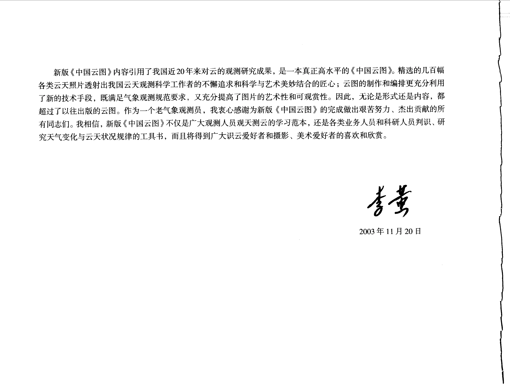

### OCR 文本

```text
新版《中国云图》内容引用了我国近20年来对云的观测研究成果, 是一本真正高水平的《中国云图六 精选的几百幅
各类云天照片透射出我国云天观测科学工作者的不懈追求和科学与艺术美妙结合的匠心; 云图的制作和编排更充分利用
了新的技术手段，既满足气象观测规范要求，又充分提高了图片的艺术性和可观赏性。因此，无论是形式还是内容， 都
超过了以往出版的云图。作为一个老气象观测员 ，我衷心感谢为新版《中国云图》的完成做出艰苦努力、杰出贡献的所
abel. 我相信， 新版《中国云图》不仅是广大观测人员观天测云的学习范本, 还是各类业务人员和科研人员判识、研
天气变化与云天状况规律的工具书，而且将得到广大识云爱好者和摄影、美术爱好者的喜欢和欣赏。

4S

2003 4E 11 A 208
```

## PDF 第 7 页

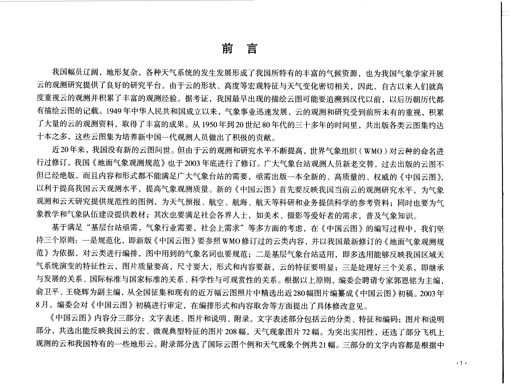

### OCR 文本

```text
了中

前

我国幅员辽阔，地形复杂，各种天气系统的发生发展形成了我国所特有的丰富的气候资源，也为我国气象学家开展
云的观测研究提供了良好的研究平台。由于云的形状、高度等宏观特征与天气变化密切相关，因此，自古以来人们就高
度重视云的观测并积累了丰富的观测经验。据考证，我国最早出现的描绘云图可能要追溯到汉代以前，以后历朝历代都
有描绘云图的记载。1949 年中华人民共和国成立以来,气象事业迅速发展，云的观测和研究受到前所未有的重视，积累
了大量的云的观测资料，取得了丰富的成果。从 1950 年到20世纪 80年代的三十多年的时间里，共出版各类云图集约达
十本之多，这些云图集为培养新中国一代观测人员做出了积极的贡献。

近20年来, 我国没有新的云图问世。但由于云的观测和研究水平不断提高,世界气象组织 (WMO ) 对云种的命名进
行过修订, 我国《地面气象观测规范》也于 2003 年底进行了修订。广大气象台站观测人员新老交替，过去出版的云图不
但已经绝版，而且内容和形式都不能满足广大气象台站的需要，目需出版一本全新的、高质量的、权威的《中国云图》
以利于提高我国云天观测水平，提高气象观测质量。新的《中国云图》首先要反映我国当前云的观测研究水平，为气象
观测和云天研究提供规范性的图例，为天气预报、航空 、航海 、航天等科研和业务提供科学的参考资料;同时也要为气
象教学和气象队伍建设提供教材;其次也要满足社会各界人士，如美术、摄影等爱好者的需求，普及气象知识。

ETRE GR Gwin, WaT, HAAR” SSRs, EPR) Was, RK
持三个原则: 一是规范化,即新版《中国云图》要参照叉MO 修订过的云类内容，并以我国最新修订的《地面气象观测规
范》 为依据，对云类进行编排，图中用到的气象名词也要规范; 二是基层气象台站适用，即多选用能够反映我国区域天
气系统演变的特征性云，图片质量要高，尺十要大，形式和内容要新，云的特征要明显; 三是处理好三个关系，即继承
与发展的关系、国际标准与国家标准的关系、科学性与可观赏性的关系。根据以上原则，编委会聘请专家郭恩铭为主编，
俞卫平、王晓辉为副主编, 从全国征集和现有的近万幅云图照片中精选出近280幅图片编纂成《中国去图》初稿。2003年
8 月，编委会对《中国云图》初稿进行审定，在编排形式和内容取舍等方面提出了具体修改意见。

《中国云图》内容分三部分: 文字表述、图片和说明、附录。文字表述部分包括云的分类、特征和编码; 图片和说明
部分，共选出能反映我国云的宏、微观典型特征的图片 208 幅，天气现象图片 72 幅。为突出实用性，还选了部分飞机上
观测的云和我国特有的一些地形云。附录部分选了国际云图个例和天气现象个例共21 幅。三部分的文字内容都是根据中
```

## PDF 第 8 页

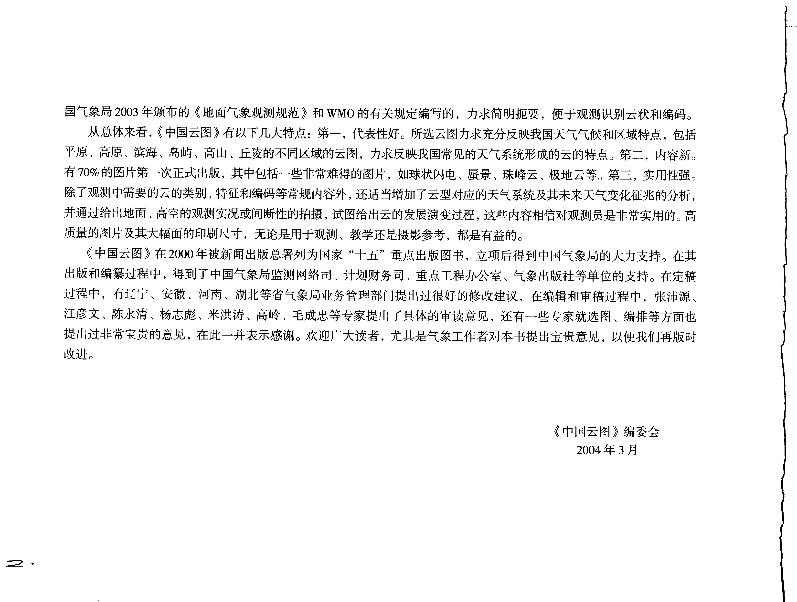

### OCR 文本

```text
国气象局 2003 年颁布的《地面气象观测规范》和 WMO 的有关规定编写的，力求简明扼要，便于观测识别云状和编码。

从总体来看,《中国云图》有以下几大特点: 第一，代表性好。所选云图力求充分反映我国天气气候和区域特点,包括
平原、高原、滨海、岛屿、高山、丘著的不同区域的云图，力求反映我国常见的天气系统形成的云的特点。第二，内容新。
A 70% 的图片第一次正式出版，其中包括一些非常难得的图片，如球状闪电、故景、珠峰云、极地云等。第三，实用性强。
除了观测中需要的云的类别、 特征和编码等常规内容外, 还适当增加了云型对应的天气系统及其末来天气变化征兆的分析，
并通过给出地面、 高空的观测实况或间断性的拍摄, 试图给出云的发展演变过程, 这些内容相信对观测员是非常实用的。高
质量的图片及其大幅面的印刷尺寸，无论是用于观测 、教学还是摄影参考，都是有益的。

《中国云图》在 2000 年被新闻出版总署列为国家“十五”重点出版图书，立项后得到中国气象局的大力支持。在其
出版和编篆过程中, 得到了中国气象局监测网络司、计划财务司、重点工程办公室、气象出版社等单位的支持。在定稿
过程中，有辽宁、安徽、河南、湖北等省气象局业务管理部门提出过很好的修改建议，在编辑和审稿过程中，张沛源、
江彦文、陈永清、杨志彪、米洪涛、高岭、毛成忠等专家提出了具体的审读意见，还有一些专家就选图 、编排等方面也
提出过非常宝贵的意见,在此一并表示感谢。欢迎广大读者，尤其是气象工作者对本书提出宝贵意见，以便我们再版时
改进。

《中国云图》编委会
2004年3月
```

## PDF 第 9 页

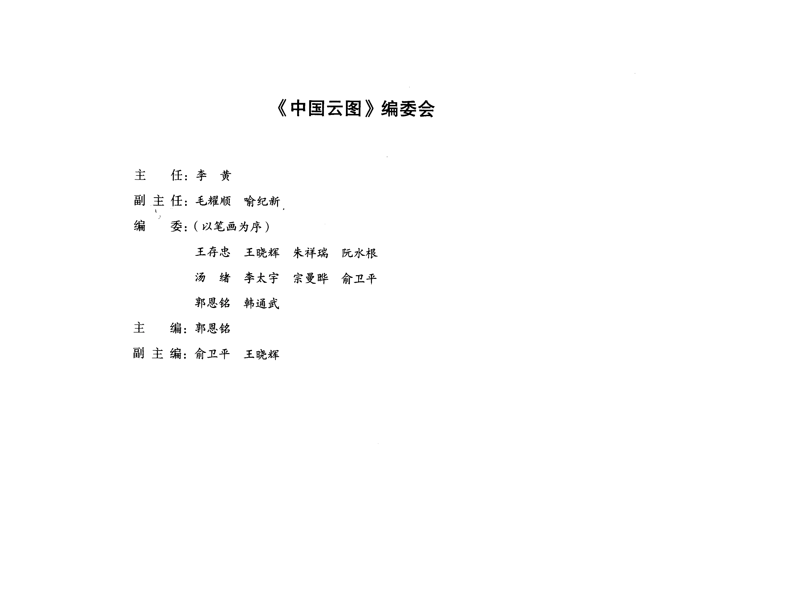

### OCR 文本

```text
主 OE:
副 ff:
编 OB,

主 编:
Bl 主 Si:

《中国云图》编委会

李 黄

毛砍顺”喻纪新，

( 以笔画为序 )

LGR LRA Rif OKIE
A we RF KAZE HEF
REG HK

I

ALP EAE
```

## 图 1

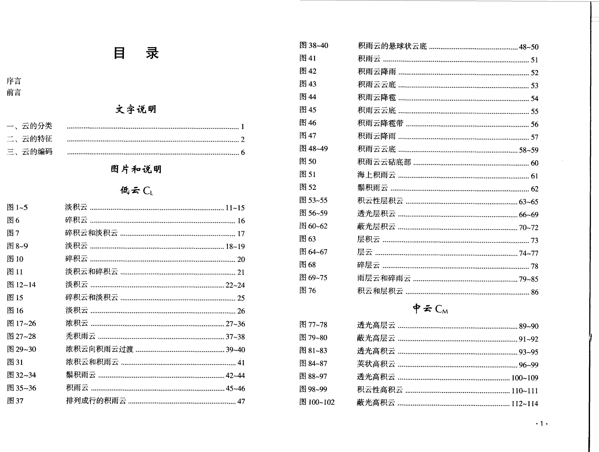

| 字段 | 内容 |
| --- | --- |
| 图号 | 图 1 |

### OCR 文本

```text
加
Ml
还
at
ie!

图 1~5
图6

图7

图8~9
图 10

图 11

图 12~14
图 1s

图 16

图 17~26
图 27~28
图 29~30
图31

图 32~34
图 35~36
图 37

文字说明
生生 1
Le 2
sessessssessusecessscsssesssecssnsesasesssecsisesssssssssessnecessaessecssutesseessesecuee 6

图片和说明
低云 Cy
淡积云 .ee 11~15
碎积去 oeccecccceccescsscsssssssesesssecssseesseeseesssceseessseesutessessseestess16
碎积云和淡积云 17
淡积去 .es 18~19
碎租去 oeccccccecseccsesssesssessessessensssessessecsecssessessessstsstsssesnens 20
淡积云和碎积云 oo eecccecceccscessessseessecsseeesessesecsseeseesesesseeases 21
淡积去 coeccecscessecssessseessessseseesessscssessessssesseessessesateasesass 22~24
碎积云和淡积云 25
PRAAD ecceccsessssssssecssseesneeseessesssucssesssecssvcssssesseesecsseceseceners 26
浓积云 cesceccsecsssescssssssssuessuscsssessssecssstessseessesscsscessvensess 27~36
FPA ZS oo eececcsccseccssessecseseeessessessessecssesssecsusenessessense 37~38
浓积云向积雨云过渡 rr 39~40
WARTS AAAI Ze oc eecceccseecssesssesecsecessesessesssuessuesseeeesneece 41
BEAD Ze .es 42~44
积雨去 .0 45~46
排列成行的积雨云 .ps 47

图 38~40
图41
图 42
图 43
图 44
图 45
图 46
图 47
 48~49
图 50
Al 51
图 52
图 53~55
图 56~59
图 60~62
图 63
图 64~67
图 68
图 69~75
图 76

图 77~78
图 79~80
图 81~83
图 84~87
 88~97
图 98~99
图 100~102

积雨云的悬球状云廊 coe cccceccseecsesseesssesssesscssseessseseaee 48~50
FARR Zo .0 51
FRR ZS EID eee esccccecssccssucsssesucssuccatescssneesueessavessesens 52
FAB ZS ZS VEG osecesccesessesssesssccsscsssesssesscessscsatsaeesseessncssecesnees53
RBA Zo PBB oes eecccceecseeessscsesssssssssusarecsscsesssesuesstucsssesees 54
积雨云云谋 oes eccesscsseessesessscssscsstssessscsaceceseesseesseessecsecenees55
积雨云降蜀带 eee ecccescsseesseecssecsssecssnsecvesssessnssscsseeceseee 56
积雨去降雨 ec ec ccecseceessssssesssessesssssessseccesersateensesenensees 57
ABR ZS ZS VEG co eccccesscsseesecsessssasssessesscsecasececseseesecseesneesees 58~59
积雨云云砧底部 occ eecseccssessesscsesssessssvcssuesnucessuesesseeensece 60
PEE PAD ZS oo esccccccececssteesssssssssssssesessecccnscsseeessuevessseeeeens 61
紧积雨云62
积云性层积云 eoeccecccsccssessessssssesssssessesssecsecsesarenectecees 63~65
透光层积云 66~69
BOWER ARTS oe ecccccccesssssessesssessssssscssessseecseceessseessveessees 70~72
展积云 73
FEDS cecsecsessssssssssssesessesscssucssessecsscsscsssssecsassucsnesseeraneases 74~77
FREE ZS oe eeseccssessssecssccssscesscsssecssesssnessecssssessucssuesssatessaveesneees78
雨层云和碎雨去 79~85
职云和层积云86
F & Cy

透光高层云 89~90
项光高层云 91~92
透光高积云 93~95
莱状高积云 96-99
透光高积云 100~109
积云性高积云 eccceccceccecessescssecssesenscessecssesesseees 110~111

藏光高积云 eecceccecccccsesecsescsscsecseceessessasesecsesssessssese 112~114
```

## 图 103

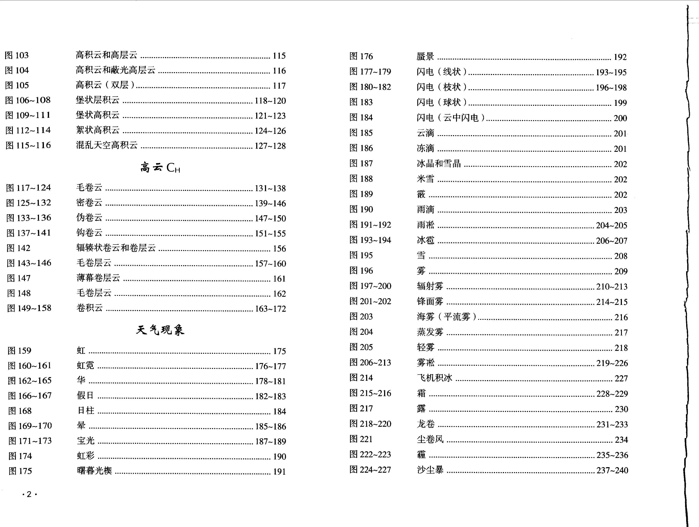

| 字段 | 内容 |
| --- | --- |
| 图号 | 图 103 |

### OCR 文本

```text
图 103
图 104
图 105
图 106~108
 109~111
图 112~114
图115$~116

图 117~124
 125~132
图 133~136
图 137~141
 142
图 143~146
图 147
图148
图 149~158

图 159
图 160~161
图 162~165
 166~167
图 168
图 169~170
图 171~173
图 174
图 175

高积云和高层云
高积云和项光高层云
高积云 ( 双层 )

混乱天空高积云

图 176

 177~179
图 180~182

图 183
图 184
图 185
图 186
图 187
图 188
图 189
图 190

图 191~192
图 193~194

图 195
图 196

图 197~200
图 201~202

图 203
图 204
图 205

图 206~213

图214

FA 215~216

图 217

图 218~220

图 221

图 222~223
 224~227

FB cece cecccccsccsscscsecsecsccscsececsecsessesessssesasscsesnessecsesnees 192
```

## 图 257

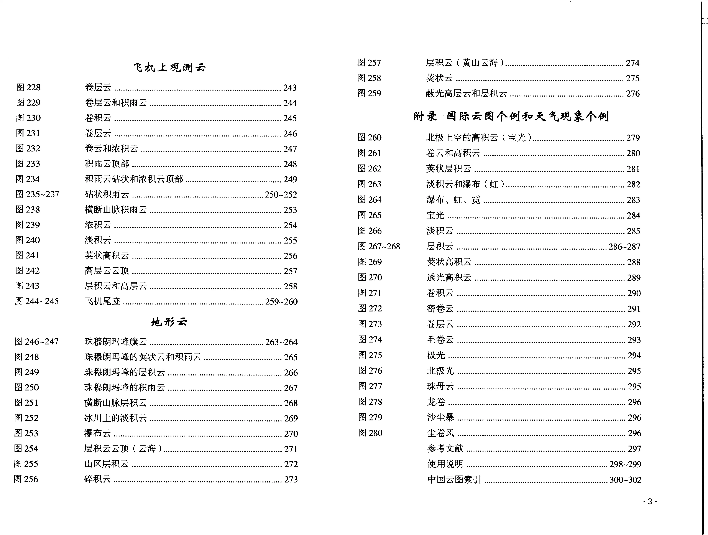

| 字段 | 内容 |
| --- | --- |
| 图号 | 图 257 |

### OCR 文本

```text
飞 机上观测 云 图 257 层积云 (黄山云海 ) 274

 图 258 BEIR DE .es 275
图 228 眷层云 ooescecccsescsssnesssseesssesssnecesnecssesesecsssesssssessseessseessesens 243 图259 HEHE FUT 376
图 229 卷层云和积雨去 os ceecceccssecseecseesseessseseesssesssseeseeseeeseeesees 244
图230 卷积云 245 附录 国际云图个例和天和气现象个例
图231 眷展去 cevcccccccsesssecssssssesscssessecssesseesessecssessessusessessssseeneeses 246 图260 北极上空的高积云 (宝光) 279
图 232 着云和浓积去 ee 247 图261 着云和高积云 280
图233 aS 248 262 BENR BART .es 281
图234 积雨云砧状和浓积云顶部 ners nnnnerrninennn 249 图 263 淡积云和瀑布 (虹 ) 282
图235~237 BSI ZS ee 250-252 图 264 瀑布、虹 、需 access eccccccccecssssseseessessstesssesassuseeeesssee 283
 238 BRB RF 2. ee 253 图 265 FG cccecsessecsecssecsecsesssnsceseessssesaseseesaceaeesessnssasesseseseaseass 284
F239 RAR 2 eee EE 204 266 淡积去 osccsccsssssesssneeseessnnnnseessssnnmseesseccessnneeseeeseessssneeseses 285
图 240 淡积去 .4 255 图267_268 FU 386-287
FA 241 美状高积到ee 236 图 269 BEAR BAZ .es 288
图 242 高层云云顶 257 图270 BMS 389
F243 FEEL FUE ZS errr 258 图 271 PEAR coceccecccsssstssssessessecssssssesscssesssssessessessseeseseeseesseeseees 290
He 244-245 ROUEE I esnr neni 299-260 图 272 密眷云 291
地形云 图273 FEIT oc ccccsssssssssssssssssssssessssseseesvsseussssssevessetsnusessseseesee 292
图 246~247 珠穆朗玛峰旗云 263-264 274 毛眷云 293
图248 珠穆朗玛峰的莱状云和积雨云 cecccccccccccccecscasecsseesseene 265 图 275 极冰.es 294
图249 珠穆朗玛峰的层积云 266 图 276 北极疮 ceccescescesscsscsccsssssssessesssscssessssessessesessesssssseseeseseesss 295
图 250 珠穆朗玛峰的积雨云 .ee 267 图 277 BREEZE .es 295
图251 横断山脉层积去 occ ceceeccesecseessesseeseensessseeseesesessesesseeenees 268 图278 TEAS escescccsesssssssecsessessessessessessecsscrecssesseeersssecssensasseesseenss 296
图 252 冰川上的淡积去 .ee 269 图 279 沙尘暴 .4 296
图253 瀑布云 oocecssecccsecssssssssecssesscsseecssnecsnsssssessssssessecssenessesessecs 270 图 280 ASHER ceececccssesssssecssecesecsneessecssucsssesssnsessecssssssseessanessseesess 296
 254 层积云云顶〈 云海 ) .ee 271 参考文献 ec cecccccccscsscssssesssessssesesscsucsecucsscsecsesseesesecseeeneees 297
图 255 出区层积云 .4 272 使用说明 oo eceecccescsessesssesssesssesseesessseeseseseessseeneesseees 298~299

Al 256 碎积云 oecceccccssecsccesssccssenecscressessessessesaessnesassscsesareneeaeesses 273 中国云图索引| eee ececcescceccecececcesecsessesecsescseeneceees 300~302
```

## PDF 第 13 页 - Ns

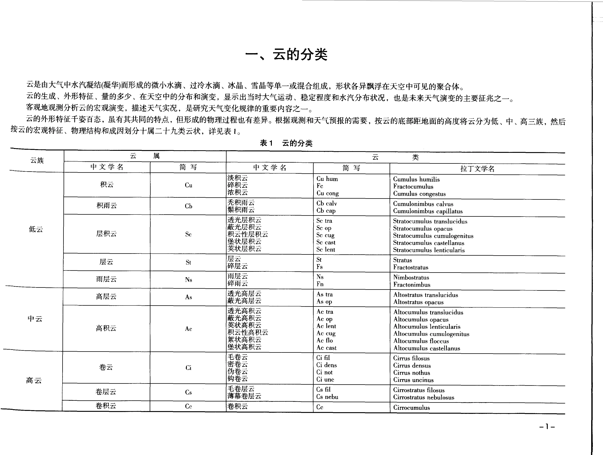

| 字段 | 内容 |
| --- | --- |
| 云类代码 | Ns |

### OCR 文本

```text
去是由大气中水汽凝结(凝华)而形成的微小水滴、过冷水滴、冰齐、雪唱等单一或混合组成，形状各异际浮在天空中可见的聚合体。

云的生成、外形特征、量的多少、在 EREOSGRNE, BRUMMALD, BEBRRAROERE, wea METRES

客观地观测分析云的宏观演变，描述天气实况，是研究天气变化规律的重要内容之一。

云的外形特征千姿百态，虽有其共同的特点,但形成的物理过程也有差异。根据观测和天气预报的需要, 按云的底部距地面的高度将云分为低、中、高三族,然后
按云的宏观特征、物理结构和成因划分十属二十九类云状，详见表 1。

表1 云的分类

类

拉丁文学名

Cumulus humilis
Fractocumulus
Cumulus congestus

Cumulonimbus calvus
Cumulonimbus capillatus

Se tra Stratocumulus translucidus

低云 Sc op Stratocumulus opacus
Se cug Stratocumulus cumulogenitus
Se cast Stratocumulus castellanus
Se lent Stratocumulus lenticularis
St Stratus
Fs Fractostratus
Ns Nimbostratus
Fn Fractonimbus
As tra Altostratus translucidus
As op Altostratus opacus
透光高 Ac tra Altocumulus translucidus
中云 光高条 Ac op Altocumulus opacus
Ac lent Altocumulus lenticularis
Ac cug Altocumulus cumulogenitus
Be Ac flo Altocumulus floccus
状高 Ac cast Altocumulus castellanus
zB Ci fil Cirrus filosus
aay Ci dens Cirrus densus
y Ci not Cirrus nothus
高云 sy Ci une Cirrus uncinus
卷层云 毛卷层云 Cs fil Cirrostratus filosus
WEIR B Cs nebu Cirrostratus nebulosus
卷积去 一一人党一一 Cirrocurnulus
```

## PDF 第 14 页 - Cu

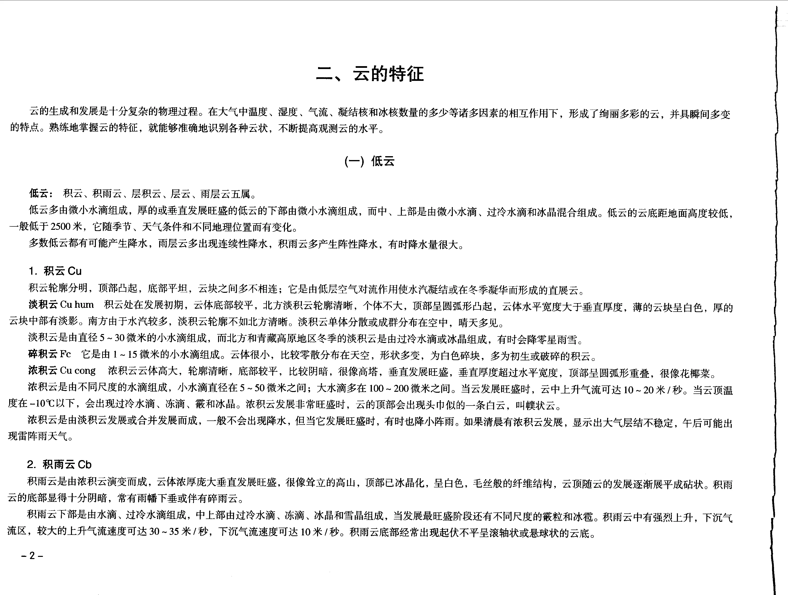

| 字段 | 内容 |
| --- | --- |
| 云类代码 | Cu |

### OCR 文本

```text
二、云的特征

云的生成和发展是十分复杂的物理过程。在大气中温度、湿度、气流、凝结核和冰核数量的多少等诸多因素的相互作用下，形成了绚丽多彩的云，并具瞬间多变
的特点。熟练地掌握云的特征，就能够准确地识别各种云状，不断提高观测云的水平。

(一) 低云

Ma: 积云、积雨云、层积云、层云、雨层云五属。

低云多由微小水滴组成，厚的或垂直发展旺盛的低云的下部由微小水滴组成，而中、上部是由微小水滴、过冷水滴和冰晶混合组成。低云的云底距地面高度较低，
一般低于2500米，它随季节、天气条件和不同地理位置而有变化。

多数低云都有可能产生降水，雨层云多出现连续性降水，积雨云多产生阵性降水，有时降水量很大。

1. 积云 Cu

积云轮廊分明，项部凸起，底部平坦，云块之间多不相连; 它是由低层空气对流作用使水汽弟结或在冬季凝华而形成的直展云。

RAZ Cuhum ” 积云处在发展初期，云体底部较平，北方淡积云轮廓清晰，个体不大，顶部呈圆弧形凸起，云体水平宽度大于垂直厚度，薄的云块旦白色，厚的
云块中部有淡影。南方由于水汽较多，淡积云轮廓不如北方清晰。淡积云单体分散或成群分布在空中，晴天多见。

淡积云是由直径 5 ~ 30 微米的小水滴组成，而北方和青藏高原地区冬季的淡积云是由过冷水滴或冰晶组成，有时会降零星两雪。

BAZ Fe 它是由1~ 15 微米的小水滴组成。云体很小，比较零散分布在天空，形状多变，为白色碎块，多为初生或破碎的积云。

浓积云 Cu cong ”浓积云云体高大，轮廓清晰 ，底部较平，比较阴暗，很像高塔，垂直发展旺盛，垂直厚度超过水平宽度，顶部呈圆弧形重伯，很像花椰菜。

浓积云是由不同尺度的水滴组成，小水滴直径在 5 ~ 50 微米之间; 大水滴多在 100 ~ 200 微米之间。当云发展旺盛时，云中上升气流可达 10 ~ 20米/秒。当云顶温
度在 -10%以下，会出现过冷水滴、冻滴、埠和冰晶。浓积云发展非常旺盛时，云的顶部会出现头巾似的一条白云，叫由状云。

浓积云是由淡积云发展或合并发展而成,一般不会出现降水, 但当它发展旺盛时，有时也降小阵雨。如果清晨有浓积云发展，显示出大气层结不稳定, 午后可能出
现雷阵雨天气。

2. 积雨云 Cb

积雨云是由浓积云演变而成，云体浓厚庞大垂直发展旺盛，很像符立的高山，项部已冰晶化, 呈白色，毛丝般的纤维结构，云顶随云的发展逐渐展平成砧状。积十
云的底部显得十分阴暗，常有雨赌下垂或伴有碎雨云。

积雨云下部是由水滴、过冷水滴组成，中上部由过冷水滴、冻滴、冰唱和雪晶组成，当发展最旺盛阶段还有不同尺度的截粒和冰雹。积雨云中有强烈上升,下沉气
流区，较大的上升气流速度可达 30 ~ 35 米/秒，下沉气流速度可达 10 米 /秒。积雨云底部经常出现起伏不平呈滚轴状或悬球状的云底。

-2-
```

## PDF 第 15 页 - Cb

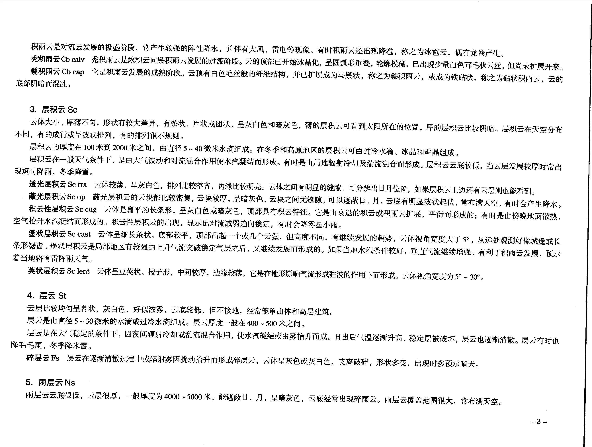

| 字段 | 内容 |
| --- | --- |
| 云类代码 | Cb |

### OCR 文本

```text
积雨云是对流云发展的极盛阶段，常产生较强的阵性降水，并伴有大风、雷电等现象。 有时积雨云还出现降雹，称之为冰雹云，偶有龙卷产生。

秃积雨云 Cb calv”秃积雨云是浓积云向秋积雨云发展的过渡阶段。云的顶部已开始冰晶化， 2ANCEE, 轮廓模糊，已出现少量白色车毛状云丝, 但尚未扩展开来。

RAMA Cbcap 它是积雨云发展的成熟阶段。云项有白色毛丝般的纤维结构，并已扩 展成为马轩状，称之为楼积雨云，或成为铁砧状，称之为砧状积雨云，云的
底部阴暗而混乱。

3. RAZ Sc

云体大小、厚菏不匀，形状有较大差异，有条状、片状或团状，呈灰白色和暗灰色， 薄的层积云可看到太阳所在的位置，厚的层积云比较阴暗。 层积云在天空分布
不同，有的成行或呈波状排列，有的排列很不规则。

层积云的厚度在 100米到 2000米之间，由直径5 ~ 40 微米水滴组成。 在冬季和高原地区的层积云可由过冷水滴、 冰晶和雪晶组成。

层积云在一般天气条件下,是由大气波动和对流混合作用使水汽凝结而形成。 有时是由局地辐射冷却及淇流混合而形成。层积云云底较低， 当云层发展较厚时常出

透光层积云 Sc tra”云体较薄，呈灰白色，排列比较整齐，边缘比较明亮。云体之间有明显的缝隙， 可分辨出日月位置，如果层积云上边还有云层则也能看到。

项光层积云Sc op ”项光层积云的云块都比较密集, 云块较厚, SHIR, 云块之间无颖阶,， TURE A, 云底有明显波状起伏, 常布满天空, 有时会产生降水。

积云性层积云 Sc cug ”云体是扁平的长条形，呈灰白色或暗灰色，顶部具有积云特征。 它是由衰退的积云或积雨云扩展，平衔而形成的， 有 时是由傍晚地面散热，
空气抬升水汽凝结而形成的。积云性层积云的出现，显示出对流减弱趋向稳定，有时会降零星小十

堡状层积云 Sc cast ”云体呈细长条状，底部较平，顶部凸起一个或几个云堡，但高度不同， 有继续发展的趋势，云体视角宽度大于 $。 。从远处观测好像城堡或长
条形锯齿。堡状层积云是局部地区有较强的上升气流突破稳定气层之后，又继续发展而形成的。 如果当地水汽条件较好,垂直气流继续增强,有利于积雨云发展，预示

芙状层积云 Sc lent”云体呈豆荚状、梭子形，中间较厚，边缘较薄， 它是在地形影响气流形成驻波的作用下而形成。云体视角宽度为5 ~ 30°,

4. Ba St

BEB RRR, RAG, HRS, BRK, (RB, SOEUR ES,

层云是由直径 5 ~ 30微米的水滴或过冷水滴组成。层云厚度一般在 400 ~ 500米之间。

层云是在大气稳定的条件下，因夜间辐射冷却或乱流混合作用，使水汽凝结或由雾抬升而成。 日出后气温逐渐升高,稳定层被破坏，层云也逐渐消散。层云有时也
降毛毛雨，冬季降米雪。

碎层云Fs ”层云在逐渐消散过程中或辐射雾因扰动抬升而形成碎层云， 云体呈灰色或灰白色，支离破碎，形状多变，出现时多预示晴天。

5. 雨层云 Ns
雨层云云底很低，云层很厚，一般厚度为 4000 ~50002K, BERRA. A, eet, 云底经常出现碎雨云。雨层云覆盖范围很大，常布满天空。
```

## PDF 第 16 页 - As

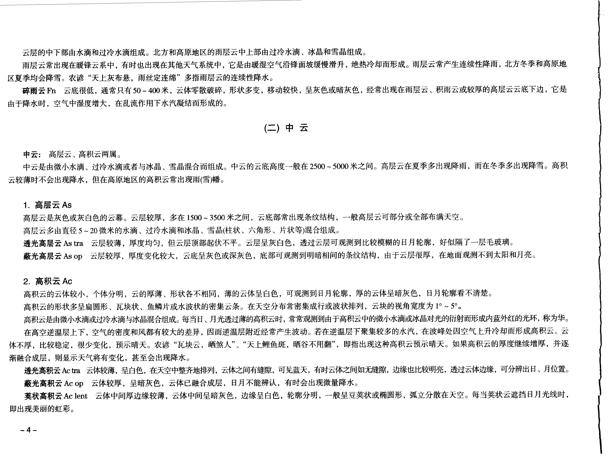

| 字段 | 内容 |
| --- | --- |
| 云类代码 | As |

### OCR 文本

```text
云层的中下部由水滴和过冷水滴组成。北方和高原地区的雨层云中上部由过冷水满、冰唱和雪晶组成。

雨层云常出现在暖锋云系中,有时也出现在其他天气系统中, 它是由暖湿空气沿锋面坡缓慢滑升, 绝热冷却而形成。雨层云常产生连续性降雨,北方冬季和高原地

RMA Fn 云底很低, 通常只有 50 ~ 400米,云体零散破碎,形状多变,移动较快，呈灰色或暗灰色,经常出现在两层云、积雨云或较厚的高层云云确下边，它是
由于降水时，空气中湿度增大，在乱流作用下水汽凝结而形成的。

(=) Fa

中云是由微小水滴、过冷水滴或者与冰晶、雪唱混合而组成。中云的云底高度一般在 2500 ~5000 KZ, HZBERES LIEN, MELSS UMS, HB
云较薄时不会出现降水，但在高原地区的高积云常出现雨(雪)见。

1. 高层云 As

高层云是灰色或灰白色的云幕。云层较厚，多在 1500 ~ 3500 米之间，云底部常出现条纹结构，一般高层云可部分或全部布满天空 。

高层云多由直径 ~ 20 微米的水滴、过冷水滴和冰晶、雪晶(柱状、六角形 、片状等?混合组成。

透光高层云 As tra， 云层较萍，厚度均匀，但云层顶部起伏不平。云层旺灰白色，透过云层可观测到比较模糊的日月轮廓，好似隔了一层毛玻璃。

项光高层云 As op ”云层较厚，厚度变化较大，云底呈灰色或深灰色，底部可观测到明暗相间的条纹结构，由于云层很厚，在地面观测不到太阳和月亮。

2. 高积云 Ac

高积云的云体较小,个体分明，云的厚薄、形状各不相同，薄的云体呈白色，可观测到日月轮廓，厚的云体呈暗灰色，日月轮廓看不清楚。

高积云的形状多呈扁圆形 、瓦块状、鱼鳞片或水波状的密集云条。在天空分布常密集成行或波状排列，云块的视角宽度为1" ~ 5°,

高积云是由微小水滴或过冷水滴与冰晶混合组成。每当日、月光透过菏的高积云时, 常常观测到由于高积云中的微小水滴或冰晶对光的衍射而形成内蓝外红的光环, 称为华。

在高空着温层上下, 空气的密度和风都有较大的差异，因而首温层附近经常产生波动。若在斤温层下聚集较多的水汽, 在波峰处因空气上升冷却而形成高积云。云
体不厚，比较稳定，很少变化，预示畏天。农访“瓦块云，盯艇人”、“天上鲤鱼斑，晒谷不用翻"”，即指出现这种高积云预示畏天。如果高积云的厚度继续增厚，并逐
渐融合成层，则显示天气将有变化，甚至会出现降水。

透光高积云 Actra ZINE, A, 在天空中整齐地排列，云体之间有缝隙，可见蓝天，有时云体之间如无颖隙，边缘也比较明亮，透过云体边缘，可分辨出日、月位置。

蔽光高积云 Ac op ”云体较厚，呈有瞳灰色，云体已融合成层，日月不能辨认，有时会出现微量降水。

莱状高积云Ac lent ”云体中间厚边缘较薄，云体中间旺暗灰色，边缘呈白色,轮廓分明, 一般呈豆荚状或机圆形，弧立分散在天空。每当莹状云遮挡日月光线时，
即出现美丽的虹彩。

-4-
```

## PDF 第 17 页 - Ac

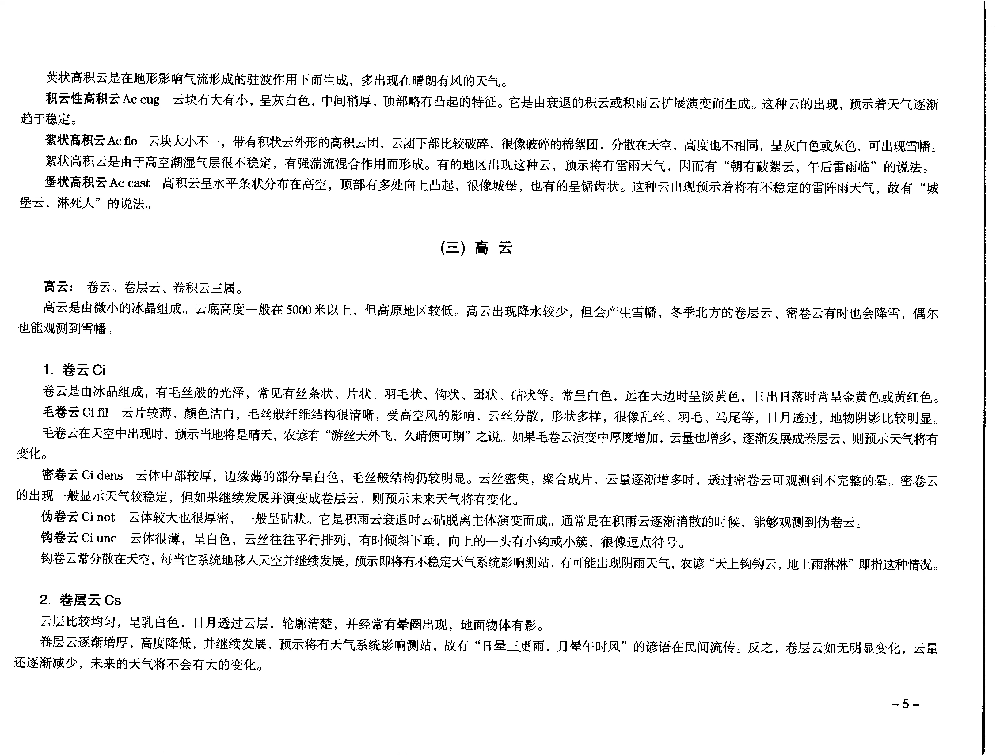

| 字段 | 内容 |
| --- | --- |
| 云类代码 | Ac |

### OCR 文本

```text
莱状高积云是在地形影响气流形成的驻波作用下而生成，多出现在晴朗有风的天气。

积云性高积云Ac cug BRAKA), BRAG, 中间稍厚，顶部略有凸起的特征。它是由衰退的积云或积雨云扩展演变而生成。这种云的出现， 预示着天气逐渐
趋于稳定。

絮状高积云 Ac ho ”云块大小不一，带有积状云外形的高积云团，云团下部比较破碎，很像破碎的棉架团，分散在天空，高度也不相同，呈灰白色或灰色，可出现雪幅。

架状高积云是由于高空潮湿气层很不稳定，有强滑流混合作用而形成。有的地区出现这种云，预示将有雷雨天气，因而有“朝有破絮云，午后雷雨临”的说法。

BRWAAS Ac cast 高积云旦水平条状分布在高空，项部有多处向上凸起，很像城堡，也有的呈锯齿状。这种云出现预示着将有不稳定的雷阵雨天气，故有“城
堡云，淋死人”的说法。

RA: 卷云、卷层云、卷积云三属。
高去是由微小的冰晶组成。云底高度一般在 5000米以上，但高原地区较低。高云出现降水较少，但会产生雪幅，冬季北方的卷层云、密卷去有时也会降雪，侦尔

1. 卷云 Ci

卷云是由冰晶组成，有毛丝般的光泽，常见有丝条状、片状、羽毛状、钩状、团状、砧状等。常呈白色，远在天边时呈淡黄色，日出日落时常呈金黄色或黄红色。

BSS Cifl 云片较薄，颜色洁白，毛丝般纤维结构很清晰 ，受高空风的影响，云丝分散,形状多样，很像乱丝、羽毛 、马尾等，日月透过，地物阴影比较明显。

毛眷云在天空中出现时，预示当地将是晴天，农详有“游丝天外飞，久睛便可期”之说。如果毛卷云演变中厚度增加，云量也增多, 逐渐发展成卷层云，则预示天气将有
变化。

密卷云 Ci dens ”云体中部较厚，边缘薄的部分呈和白色，毛丝般结构仍较明显。云丝密集，聚合成片，云量逐渐增多时，透过密卷云可观测到不完整的学。密卷云
的出现一般显示天气较稳定，但如果继续发展并演变成卷层云，则预示未来天气将有变化。

伪卷云 Cinot 云体较大也很厚密，一般呈砧状。它是积雨云衰退时云砧脱离主体演变而成。通常是在积雨云逐渐消散的时候，能够观测到伪卷云。

Wea Ciunc ”云体很薄，呈白色，云丝往往平行排列，有时倾斜下垂，向上的一头有小钩或小能，很像逗点符号。

钩卷云常分散在天空, 每当它系统地移人天空并继续发展，预示即将有不稳定天气系统影响测站, 有可能出现阴雨天气, 农恋“天上钩钩云, 地上两淋淋”即指这种情况。

2. BACs

云层比较均匀，呈乳白色，日月透过云层，轮廓清楚，并经常有学圈出现，地面物体有影。 .

卷层云逐渐增厚，高度降低，并继续发展，预示将有天气系统影响测站，故有“日学三更十,月学午时风”的谚语在民间流传。反之，卷层云如无明显变化，云量
还逐渐减少，未来的天气将不会有大的变化。
```

## PDF 第 18 页 - Cs

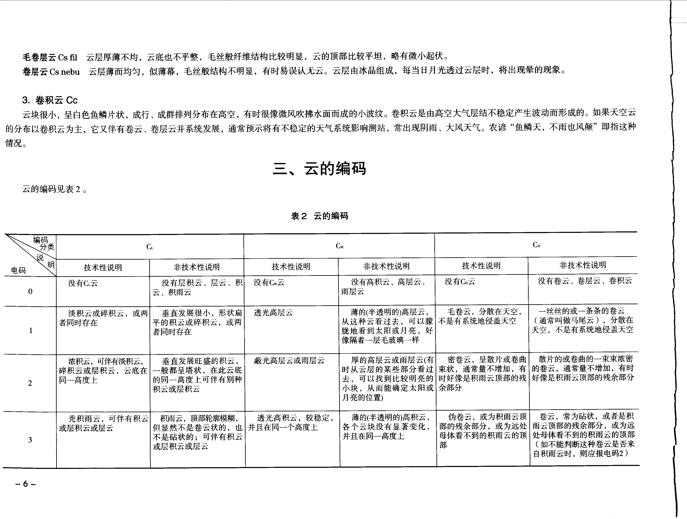

| 字段 | 内容 |
| --- | --- |
| 云类代码 | Cs |

### OCR 文本

```text
毛卷层云 Cs 外”云层厚薄不均，云底也不平整，毛丝般纤维结构比较明显，云的顶部比较平坦，略有微小起伏。
卷层云 Cs nebu ”云层薄而均匀，似薄幕，毛丝般结构不明显，有时易误认无云。云层由冰划组成，每当日月光透过云层时，将出现学的现象。

3. 卷积云 Cc
云块很小, 旦白色鱼鳞片状,成行、成群排列分布在高空，有时很像微风吹拂水面而成的小波纹。卷积云是由高空大气层结不稳定产生波动而形成的。如果天空云
的分布以卷积云为主，它又伴有卷云、卷层云并系统发展，通常预示将有不稳定的天气系统影响测站，常出现阴雨、大风天气。农详“鱼鳞天,不雨也风颠”即指这种

三、云的编码

云的编码见表 2 。
表2 云的编码
技术性说明 | 。 。 非技术性说明 技术性说明 非技术性说明

没有高积云、高层云、
雨层去

没有层积云、层云、积 没有Cn云 没有卷云、卷层云 BRS

淡积云或碎积云，或两| ”垂直发展很小,形状扁| ”透光高层云 Bi CAHN) Res, BEB, 分散在天空， 一丝丝的或一条条的卷云
者同时存在 平的积云或碎积云，或两 从这种云看过去，可以膀|不是有系统地侵盖天空 | (通常叫做马尾云 ) ，分散在

者同时存在 胱地看到太阳或月亮，好 天空，不是有系统地侵盖天空
像隔着一层毛玻璃一样
WIRD, PARES, 垂直发展旺盛的积云，| ”项光高层云或雨层云 厚的高层云或雨层云有| Ba, BBs) ”散片的或卷曲的一束束浓密
碎积云或层积云，云底在|一般都呈塔状，在此云底 时从云层的某些部分看过|束状，通常量不增加，有 | 的卷云，通常量不增加，有时
2 同一高度上 的同一高度上可伴有别种 去，可以找到比较明亮的|时好像是积雨云顶部的残| 好像是积雨云顶部的残余部分
积云或层积云 小块，从而能确定太阳或|余部分
月亮的位置)
秃积雨云，可伴有积云| ”积雨云，顶部轮廊模糊， 透光高积云，较稳定， 薄的(半透明的)高积云， 伪卷云，或为积雨云项| 卷云，常为砧状，或者是积
或层积云或层云 但显然不是卷云状的，也 |并且在同一个高度上 各个云块没有显著变化，| 部的残余部分，或为远处 | 雨云顶部的残余部分，或为远
3 不是砧状的;可伴有积云 并且在同一高度上 母体看不到的积雨云的顶| 处母体看不到的积雨云的顶部

部 ( 如不能判断这种卷云是否来
自积雨云时，则应报电码2 )

或层积云或层云
```

## PDF 第 19 页 - Cr

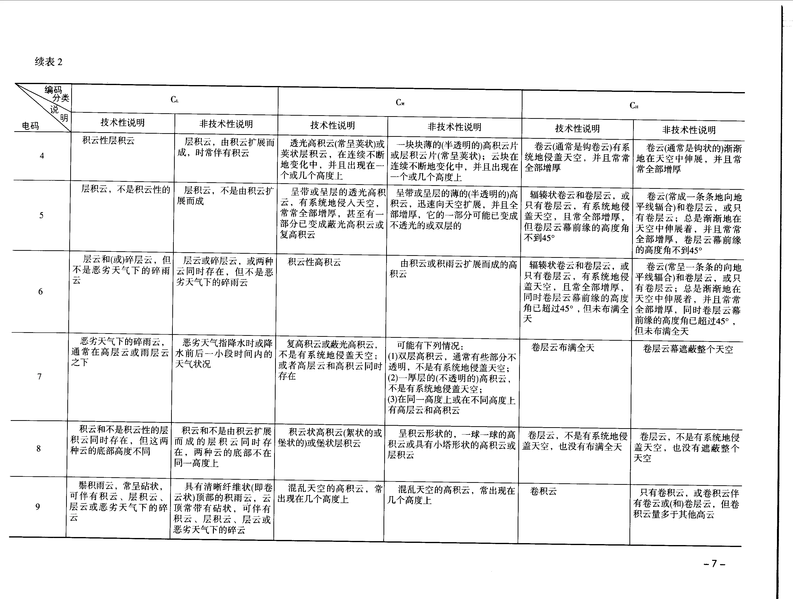

| 字段 | 内容 |
| --- | --- |
| 云类代码 | Cr |

### OCR 文本

```text
Cr

非技术性说明

技术性说明 技术性说明 非技术性说明 技术性说明 非技术性说明
积云性层积云 层积云，由积云扩展而| DG Ra eR) 一块块薄的(半透明的)高积云片| ”卷云(通常是钓卷云)有系| Baad Ee Ra
4 成，时常伴有积云 荚状层积云，在连续不断 BULB Z HC BIOR), 云块在| 统地侵盖天空，并且常常|地在尺空中伸展，并且党
地变化中，并且出现在一|连续不断地变化中，并且出现在| 全部增厚 常全部增厚
Keowee a 一个或几个高度上 |
BES. 不是机二全出| BRE REARED 呈带或呈层的透光高积| 呈带或呈层的薄的(半透明的)高| 辐畴状卷云和卷层云，或| Bade AM eh
展而成 云，有系统地侵入天空，| 积云，迅速向天空扩展，并且全| 只有卷层云，有系统地侵|平线辑合)和着层云 RE
 常常全部增厚，甚至有一 |部增厚，它的一部分可能已变成| RRS, KARI, 有卷层云;总是渐渐地在
部分已变成蔽光高积云或| 不透光的或双层的 但卷层云幕前缘的高度角|天空中伸展着，并且常党
复高积云 不到4S。 全部增厘，卷层云幕前缘
| 的高度角不到45。
层去和(或)碎层云，但| 层云或碎层云，或两种| 积云性高积云 由积云或积雨云扩展而成的高| AR AIT ok 卷云(常呈-一条条的向地
不是恶劣天气下的碎雨|云同时存在，但不是亚 积云 只有卷层云，有系统地侵| 平线辐合)和卷层云，或只
云 劣天气下的碎雨云 盖天空，且常全部增厚，| 有卷层云; 总是渐渐地在
6 同时卷层云幕前缘的高度|天空中伸展着，并且常党
角已超过45。, ARS | SIE, RR
天 前缘的高度角已超过45。，
_| 上 但未布满全天
恶劣天气下的碎雨云，| 恶劣天气指降水时或降| 复高积云或蔽光高积云，| maa PSUR. 卷层云布满全天 | SEewneE RS
通常在高层云或雨层云|水前后一小段时间内的|不是有系统地侵盖天空，|()双层高积云，通常有些部分不
之下 天气状况 或者高层云和高积云同时|透明，不是有系统地侵盖天空
 存在 (2)一厚层的(不透明的)高积云，
不是有系统地侵盖天空;
(3)在同一高度上或在不同高度上

有高层云和高积云

积云和不是积云性的层| 积云和不是由积云扩展| ，”积云状高积云(絮状的或 呈积云形状的，一球一球的高| 卷层云，不是有系统地侵
积云同时存在，但这两|而成的层积云同时存|堡状的)或堡状层积云 积云或具有小塔形状的高积云或| 盖天空，也没有布满全天
8 种云的底部高度不同 在，两种云的底部不在 层积云
同一高度上
| SeNnE, HBR, A Ot ERED | 混乱天空的高积云，常| ”混乱天空的高积云，常出现在
可伴有积云、层积云 、|云状)顶部的积雨云，云| 出现在几个高度上 几个高度上
9 顶常带有砧状，可伴有

层云或恶劣天气下的碎
a

Ba. Bea. BAR
恶劣天气下的碎云

aD, RE ASHE
aS, LP UE CE
天空

只有卷积云，或卷积云伴
有卷云或(和)卷层云，但卷
积云量多于其他高云
```

## PDF 第 20 页


!!! note "OCR 状态"
    本页暂未识别出可靠文本，保留原页图像。
