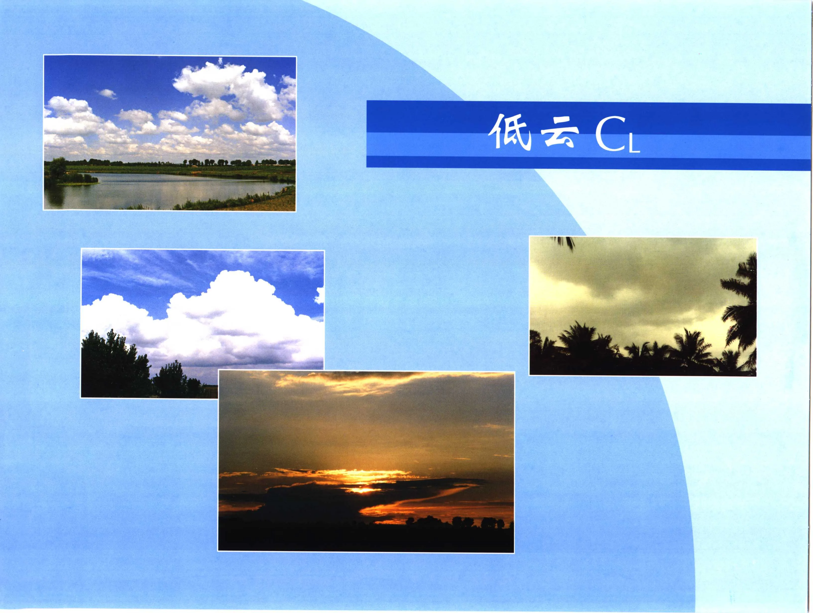
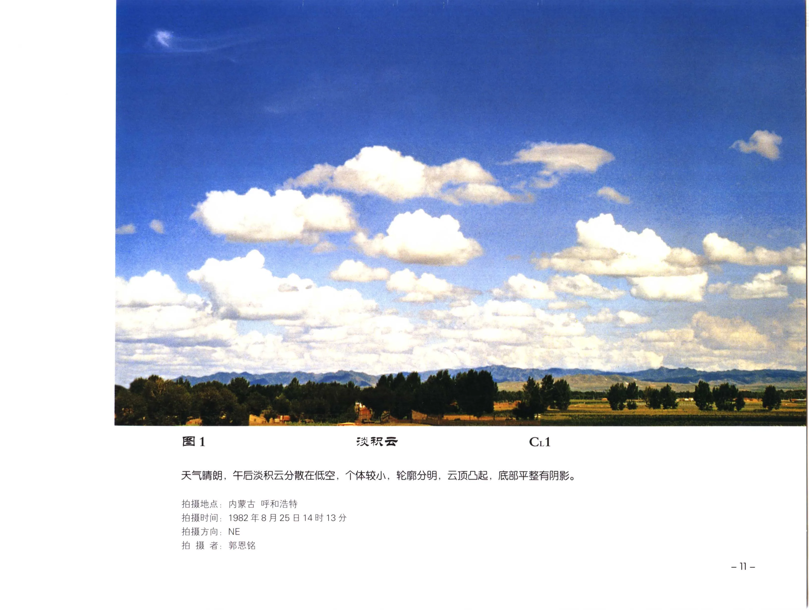

# 《中国云图》PDF 第 21-40 页

本页由扫描版 PDF 自动提取生成。每个条目保留原页图像，并附 OCR 文本供检索和后续校订。

## PDF 第 21 页



!!! note "OCR 状态"
    本页暂未识别出可靠文本，保留原页图像。

## PDF 第 22 页


!!! note "OCR 状态"
    本页暂未识别出可靠文本，保留原页图像。

## PDF 第 23 页



| 字段 | 内容 |
| --- | --- |
| 拍摄地点 | 拍摄时间 : |
| 拍摄时间 | 拍摄方向; |
| 拍摄方向 | ; |
| 拍摄者 | 内蒙古 呼和浩特 |

### OCR 文本

```text
csa
cx

FAA, FERRED, MAR, HORI, BIA, Ra ARAR.

拍摄地点:
拍摄时间 :
拍摄方向;
拍 摄 者:

内蒙古 呼和浩特
1982年8月25日14时13 分

NE
Eis

7

铭

At

ss

-ll-
```

## 图 2 - C11


| 字段 | 内容 |
| --- | --- |
| 图号 | 图 2 |
| 云类代码 | C11 |
| 拍摄地点 | ; 辽宁 Ap |
| 拍摄时间 | 1990年6月15日11时10分 |
| 拍摄方向 | ，N |
| 拍摄者 | ，郭恩铭 |

### OCR 文本

```text
‘i, F i ae = Cees Fo ~
ti cash yg paliie iin geak ge Be evgueer pt me 二

图2

RRB C11

\

蓝色的天空，漂浮着一洒洒白色的淡积云，个体较小，边缘破碎，云底较平有阴影，云顶凸起，水平宽度大于垂直高

Kitt

°

拍摄地点; 辽宁 Ap

拍摄时间: 1990年6月15日11时10分
拍摄方向，N

拍 摄 者，郭恩铭

-12 -
```

## PDF 第 25 页 - C11


| 字段 | 内容 |
| --- | --- |
| 云类代码 | C11 |
| 拍摄地点 | 辽宁 鞍山 |
| 拍摄时间 | 1992年7月19日13时10分 |
| 拍摄方向 | ， N |
| 拍摄者 | ; 郭恩铭 |

### OCR 文本

```text
~ ST) Amarr,

3 FAIRE C11

淡积云个体大小不同，排列不齐，有的云体松散并伴有碎积云。

拍摄地点: 辽宁 鞍山

拍摄时间: 1992年7月19日13时10分
拍摄方向， N

拍 摄 者; 郭恩铭

-13-
```

## 图 4


| 字段 | 内容 |
| --- | --- |
| 图号 | 图 4 |
| 拍摄地点 | ;黑龙江 哈尔滨 |
| 拍摄时间 | 1982727116 |
| 拍摄方向 | ，N |
| 拍摄者 | -~14- |

### OCR 文本

```text
图4

测站受低压天气系统影响，积云处于发展阶段，云体较厚，底部较平，有阴影。云顶呈圆红形凹起。左上角的碎积云呈深灰色。

拍摄地点;黑龙江 哈尔滨
拍摄时间: 1982727116
拍摄方向，N

拍 摄 者:

-~14-

Yt

Bam

a}

11 时 52 分

o
os
7人

az

RAR

=

CrL1
```

## 图 5


| 字段 | 内容 |
| --- | --- |
| 图号 | 图 5 |
| 拍摄地点 | ， |
| 拍摄时间 | ; |
| 拍摄方向 | 拍 摄 者 |
| 拍摄者 | 北京 北海 |

### OCR 文本

```text
图5

秋季的淡积云，由于对流不强，

拍摄地点，
拍摄时间 ;
拍摄方向
拍 摄 者

北京 北海
1995年 10
SW
郭恩铭

月 13 日

13 时10 分

个体略呈扁平，云顶凸起不太明显，云底有阴影，

图中还有和雪散的碎积云。

=]5=
```

## 图 6


| 字段 | 内容 |
| --- | --- |
| 图号 | 图 6 |
| 拍摄地点 | 北京 八达 |
| 拍摄时间 | ，1990年7 |
| 拍摄方向 | ; E |

### OCR 文本

```text
图6
夏季天和气睛朗，瞬湿空气受八达岭山地抬升的作用，

云将逐渐发展成淡积云。

拍摄地点: 北京 八达
拍摄时间，1990年7
拍摄方向; E

拍 HR 者;，郭恩铭
-16-

rd

月 10

11 BY 30 分

IRE RARIOARG , AAT IS. BIR RABIRAR
```

## 图 7 - Crl


| 字段 | 内容 |
| --- | --- |
| 图号 | 图 7 |
| 云类代码 | Crl |
| 拍摄地点 | ; 广西 桂林 |
| 拍摄时间 | 1997年6月15日11时10分 |
| 拍摄方向 | ，W |

### OCR 文本

```text
图7 和碎积云和和淡积云 Crl

碎积云边缘破碎，零散地分布在低空,云体变化较快，正逐渐发展成淡积云。右侧山顶上空的初生淡积云，受山地气流影
响，底部不甚平坦，略微向上倾斜。

拍摄地点; 广西 桂林
拍摄时间: 1997年6月15日11时10分
拍摄方向，W

拍 RS. PAR

-17-
```

## 图 8 - C11


| 字段 | 内容 |
| --- | --- |
| 图号 | 图 8 |
| 云类代码 | C11 |
| 拍摄地点 | 西藏 拉萨 |
| 拍摄时间 | 1981年6月11日16时35分 |
| 拍摄方向 | ESE |
| 拍摄者 | WR |

### OCR 文本

```text
图8 TRIRE C11

处于发展阶段的淡积云。测站当日下午对流较强, 并受地形抬升作用, GLU MAAR. BASA
引状凹起，远处有边缘破碎、轮廊很不完整的碎积云。

拍摄地点: 西藏 拉萨

拍摄时间: 1981年6月11日16时35分

拍摄方向: ESE

拍 摄 者: WR

-18-
```

## 图 9 - Ci


| 字段 | 内容 |
| --- | --- |
| 图号 | 图 9 |
| 云类代码 | Ci |
| 拍摄地点 | ; |
| 拍摄时间 | 拍摄方向: |
| 拍摄方向 | 拍 摄 者: |
| 拍摄者 | 内蒙古 |

### OCR 文本

```text
图9

淡积云个体较大，正处于发展阶段，顶部向上上起，底部有阴影，远处还有正在发展的碎积云和淡积云，

TRIRE

上去好像相互连接，实际上仍是个体分明。

拍摄地点;
拍摄时间 :
拍摄方向:
拍 摄 者:

内蒙古

pes
FE 5

2000 4
NE
郭恩铭

浩特
1

14时10分

Ci

由于视角关系看

~19-
```

## PDF 第 32 页 - Cul


| 字段 | 内容 |
| --- | --- |
| 云类代码 | Cul |
| 拍摄地点 | ; 云南 石林 |
| 拍摄时间 | 1980年1月11日13时30分 |
| 拍摄方向 | ，N |

### OCR 文本

```text
|
人本 雇 rj
 10 BRR Cul

冬季出现的碎积云，形状多变，边缘破碎，轮廓很不完整，靠左边的一块碎积云，正向淡积云发展。

拍摄地点; 云南 石林

拍摄时间: 1980年1月11日13时30分
拍摄方向，N

拍 RH. BH

~20-
```

## 图 11 - Cul


| 字段 | 内容 |
| --- | --- |
| 图号 | 图 11 |
| 云类代码 | Cul |
| 拍摄地点 | ; 海南 永兴岛 |
| 拍摄时间 | 1982年6月1日06时10分 |
| 拍摄方向 | E |

### OCR 文本

```text
图11 TRAR Le FORRES Cul

海面上形成的淡积云和碎积云，云体较大，边缘有些散乱，由于逆光云体呈瞳灰色，碎积云个体很小，云体堆
散而形状多变。高空是卷层云。

拍摄地点; 海南 永兴岛

拍摄时间: 1982年6月1日06时10分

拍摄方向: E

拍 iS. PAK

-21-
```

## 图 12 - Crl


| 字段 | 内容 |
| --- | --- |
| 图号 | 图 12 |
| 云类代码 | Crl |
| 拍摄地点 | 拍摄时间 ; |
| 拍摄时间 | ; |
| 拍摄方向 | 拍 摄 者: |
| 拍摄者 | —~22- |

### OCR 文本

```text
图 12

TRIRE Crl

处于发展阶段的淡积云，云顶呈圆红形凸起，云体水平宽度大于垂直厚度，底部较平，有阴影，云体有互相连接的趋势。

拍摄地点:
拍摄时间 ;
拍摄方向:
拍 摄 者:

—~22-

西藏 日喀则
2000年7月19日14时25分
NE

FIR
```

## PDF 第 35 页


| 字段 | 内容 |
| --- | --- |
| 拍摄地点 | 拍摄时间 : |
| 拍摄时间 | 拍摄方向 |
| 拍摄方向 | 拍 摄 者 |

### OCR 文本

```text
I 13

由于逆光云体呈暗黑色，太阳丁下，在云层之间出现霞光。

RARBG MARE, BAAD,

拍摄地点
拍摄时间 :
拍摄方向
拍 摄 者
```

## 图 14 - Crl


| 字段 | 内容 |
| --- | --- |
| 图号 | 图 14 |
| 云类代码 | Crl |
| 拍摄时间 | 1982年5月15日10时50分 |
| 拍摄方向 | ，W/ |

### OCR 文本

```text
图14 TRIRE Crl

淡积云个体不大，底部平整，顶部呈圆缴形凸起, 由
于受陆风的影响，正由岸上向海面球移。

拍摄时间: 1982年5月15日10时50分
拍摄方向，W/
拍 RS. PBS

~24-
```

## 图 15 - Crl


| 字段 | 内容 |
| --- | --- |
| 图号 | 图 15 |
| 云类代码 | Crl |
| 拍摄者 | ; |

### OCR 文本

```text
图15

BERR ZS FOLK AIRE Crl

早晨,海面上对流不强，有淡积云、碎积云形成，云
体很小, 边缘破碎，轮廓也不完整。由于逆光云体呈
暗灰色。

拍摄
拍摄

拍摄

地点，
时间 :
拍 摄 者;

1982 年6月
SE
郭恩铭

3

06 BY 05 分

-25-
```

## PDF 第 38 页


| 字段 | 内容 |
| --- | --- |
| 拍摄地点 | ; |
| 拍摄时间 | HBA: W |
| 拍摄者 | ~26- |

### OCR 文本

```text
显得云块较大，

云

线的关系距飞机较近的淡积

同的白色云块分布在低空,由于视

显得很小, 排列也不整齐。上方白色云条是密卷云。

场,大小不

的淡积云云
个体
e
1984 4 9 A 20 8 10 8 30 4

空拍摄
RBM
河南上

拍摄地点: ;
郭恩铭

AS
yy

拍摄时间 :
HBA: W
拍 摄 者:
~26-

在9000米高
而远处的
```

## 图 17 - C12


| 字段 | 内容 |
| --- | --- |
| 图号 | 图 17 |
| 云类代码 | C12 |
| 拍摄地点 | 辽宁 绥中 |
| 拍摄时间 | 1991年9月2日10时30分 |
| 拍摄方向 | ，NVWV |
| 拍摄者 | ，郭恩铭 |

### OCR 文本

```text
图 17 IRE C12

前排是三块浓积云, 云体垂直高度大于水平宽度, 云底较平整并有暗影。 中间一块浓积云正在向上发展， 另外两块浓积
去云顶向左倾斜。前排后边还有几个浓积云正处于发展阶段，初看起来好似互相联接，高空有几条密卷云。

拍摄地点: 辽宁 绥中

拍摄时间: 1991年9月2日10时30分
拍摄方向，NVWV

拍 摄 者，郭恩铭

= OF =
```

## 图 18 - C12


| 字段 | 内容 |
| --- | --- |
| 图号 | 图 18 |
| 云类代码 | C12 |
| 拍摄地点 | 辽宁 鞍山 |
| 拍摄时间 | 1994年7月16日16时30分 |
| 拍摄方向 | SE |
| 拍摄者 | 张生利 |

### OCR 文本

```text
图 18 RIRE C12

发展旺盛的浓积云，顶部的对流泡体正向上凸起,好似花椰菜形状，云的底部较宽，云底较平呈暗灰色。上部还有
几块碎积云。

拍摄地点: 辽宁 鞍山

拍摄时间: 1994年7月16日16时30分

拍摄方向: SE
拍 摄 者: 张生利

-28 —
```
