# 《中国云图》PDF 第 41-60 页

本页由扫描版 PDF 自动提取生成。每个条目保留原页图像，并附 OCR 文本供检索和后续校订。

## PDF 第 41 页 - Cs

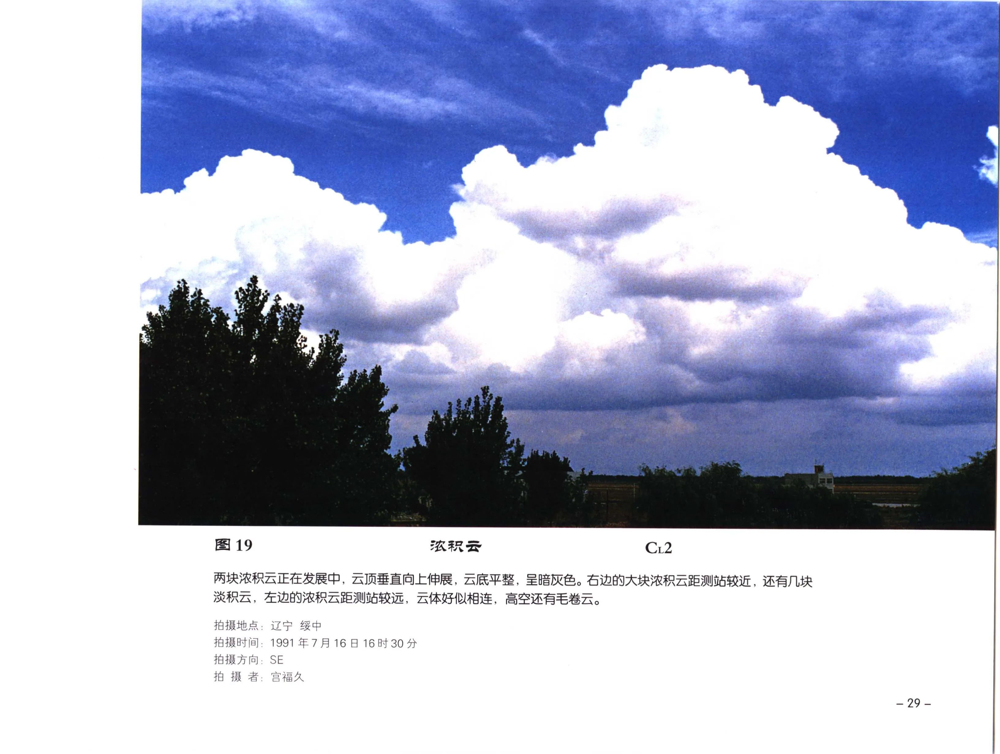

| 字段 | 内容 |
| --- | --- |
| 云类代码 | Cs |
| 拍摄地点 | 辽宁 绥中 |
| 拍摄时间 | 1991年7月16日16时30分 |
| 拍摄方向 | SE |

### OCR 文本

```text
eC

PEO OS el
" Cs

 19 LAIRD C12

两块浓积云正在发展中, 云顶垂直向上伸展，云底平整，呈暗灰色。右边的大块浓积云距测站较近, 还有几块
淡积云，左边的浓积云距测站较远，云体好似相连，高空还有毛卷云。

拍摄地点: 辽宁 绥中
拍摄时间: 1991年7月16日16时30分
拍摄方向 SE

拍 A: BMA

~29-
```

## 图 20 - C12

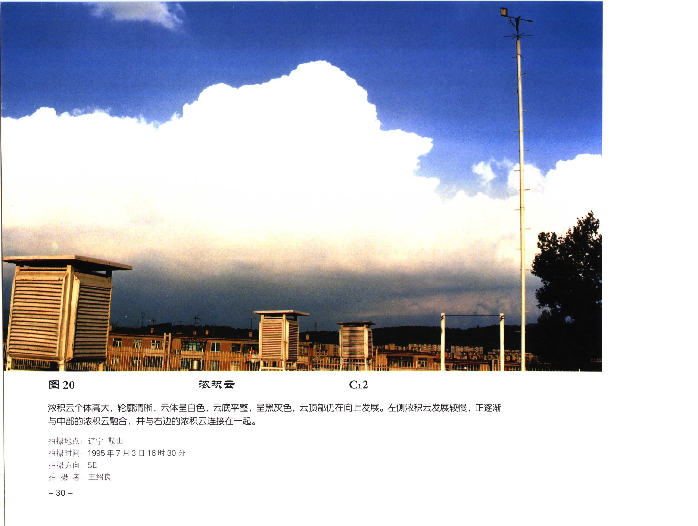

| 字段 | 内容 |
| --- | --- |
| 图号 | 图 20 |
| 云类代码 | C12 |
| 拍摄地点 | ; 辽宁 鞍山 |
| 拍摄时间 | 1995年7月3日16时30分 |
| 拍摄方向 | SE |
| 拍摄者 | EAR |

### OCR 文本

```text
|
图 20 TRIR ES C12

RRO MASA, EAI, BALSA, GREE, SRR, 云顶部仍在向上发展。左侧浓积云发展较慢,，正逐渐
与中部的浓积云融合，并与右边的浓积云连接在一起。

拍摄地点; 辽宁 鞍山

拍摄时间: 1995年7月3日16时30分

拍摄方向: SE

拍 摄 者: EAR
= 30
```

## 图 21 - C12

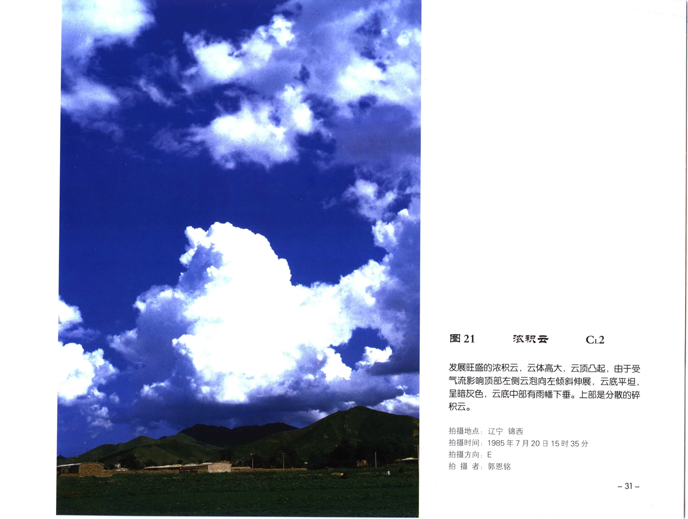

| 字段 | 内容 |
| --- | --- |
| 图号 | 图 21 |
| 云类代码 | C12 |
| 拍摄地点 | 辽宁 锦西 |
| 拍摄时间 | 1985年7月20日15时35分 |
| 拍摄方向 | E |
| 拍摄者 | 郭恩铭 |

### OCR 文本

```text
图21 RIRE C12

发展旺盛的浓积云，云体高大，云顶凸起，由于受
气流影响顶部左侧云泡向左倾斜伸展，云底平坦，
SRE, GRPAAMB TE, PSMA
积云。

拍摄地点: 辽宁 锦西

拍摄时间: 1985年7月20日15时35分
拍摄方向: E

拍 摄 者: 郭恩铭

-31-
```

## 图 22

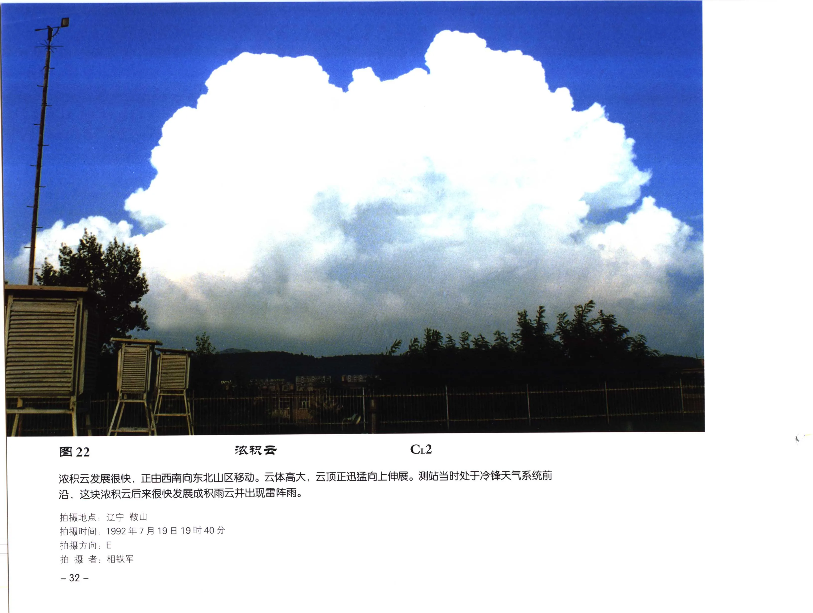

| 字段 | 内容 |
| --- | --- |
| 图号 | 图 22 |
| 拍摄地点 | ; 辽宁 鞍山 |
| 拍摄时间 | 1992年7 月 |
| 拍摄方向 | E |
| 拍摄者 | 相铁军 |

### OCR 文本

```text
图 22

浓积云发展很快，正由西南向东北山区移动。云体高大，云顶正迅猛向上伸展。测站当时处于冷锋天气系统前
沿 ，这块浓积云后来很快发展成积雨云并出现

拍摄地点; 辽宁 鞍山

拍摄时间: 1992年7 月

拍摄方向: E
拍 摄 者: 相铁军

-32 -

H 19 时 40 分
```

## 图 23

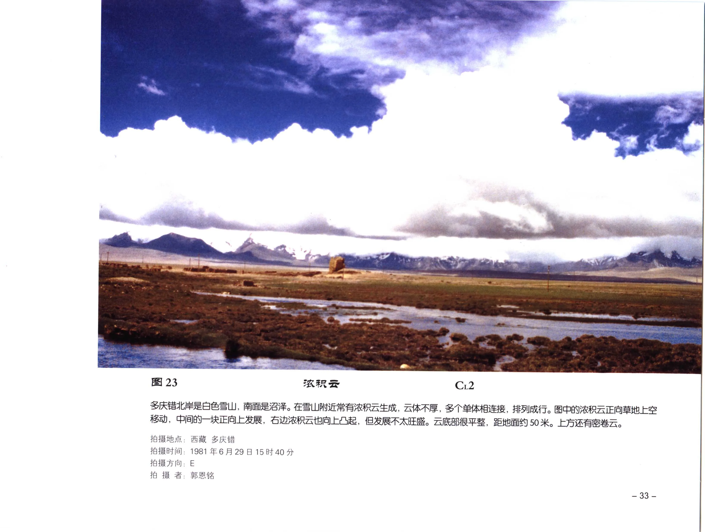

| 字段 | 内容 |
| --- | --- |
| 图号 | 图 23 |
| 拍摄地点 | 拍摄时间 : |
| 拍摄时间 | 拍摄方向; |
| 拍摄方向 | ; |
| 拍摄者 | 西藏 多庆错 |

### OCR 文本

```text
图23

多庆错北岸是白色雪山, 南面

拍摄地点:
拍摄时间 :
拍摄方向;
拍 摄 者:

西藏 多庆错
1981年6月29日15时40分

郭恩铭

在雪山附近常有浓积去生成, GANS, 多个单体相连接, 排列成行。图中的浓积云正向草地上空
移动，中间的一块正向上发展，右边浓积云也向上凸起，但发展不太旺盛。云底部很平整，距地面约 50 米。上方还有密卷云。

-33 -
```

## 图 24 - C12

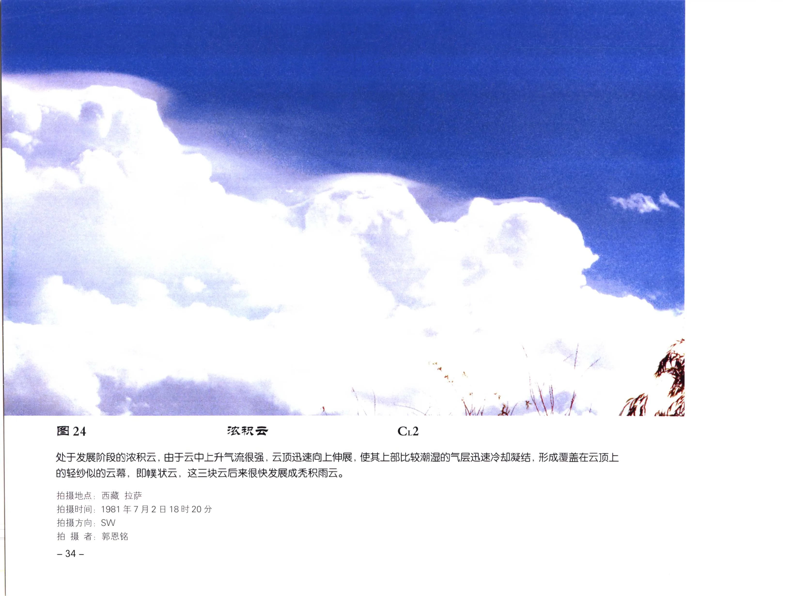

| 字段 | 内容 |
| --- | --- |
| 图号 | 图 24 |
| 云类代码 | C12 |
| 拍摄地点 | 西藏 拉萨 |
| 拍摄时间 | 1981年7月2日18时20分 |
| 拍摄方向 | SW |
| 拍摄者 | 郭恩铭 |

### OCR 文本

```text
nm

‘

图 24 RIRE C12

2

处于发展阶段的浓积云, 由于云中上升气流很强, 云顶迅速向上伸展, 使其上部比较潮湿的气层迅速冷却此结, 形成覆盖在云顶上
的轻纱似的云幕，即翌状云，这三块云后来很快发展成秃积雨云。

拍摄地点: 西藏 拉萨

拍摄时间: 1981年7月2日18时20分
拍摄方向: SW

拍 摄 者: 郭恩铭

-34-
```

## 图 25 - C12

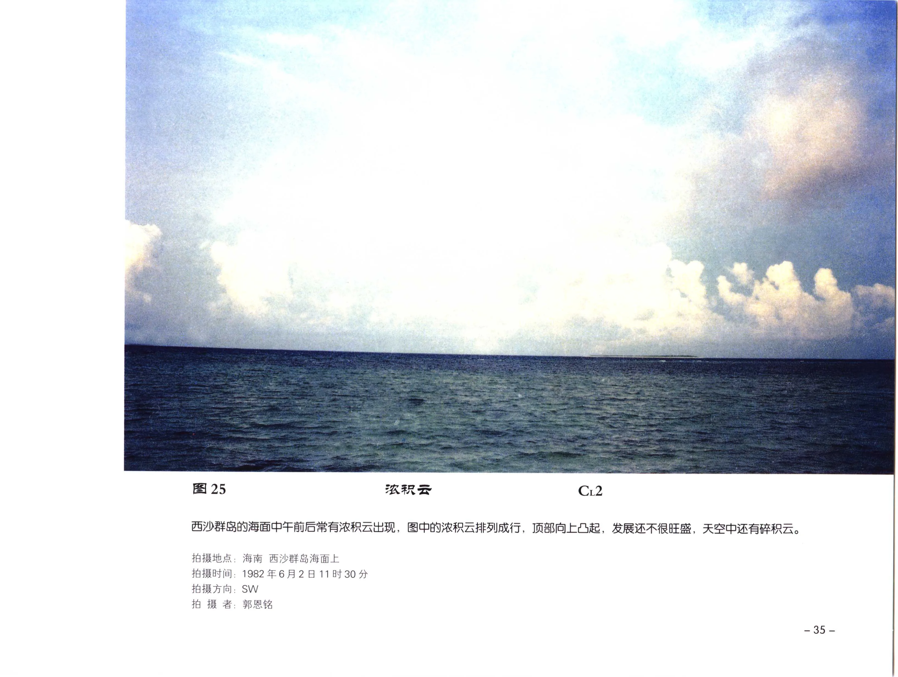

| 字段 | 内容 |
| --- | --- |
| 图号 | 图 25 |
| 云类代码 | C12 |
| 拍摄地点 | 海南 西沙群岛海面上 |
| 拍摄时间 | 1982年6月2日11时30分 |
| 拍摄方向 | ，SVW |

### OCR 文本

```text
图 25 IRE C12

西沙群岛的海面中午前后常有浓积云出现，图中的浓积云排列成行，顶部向上凸起，发展还不很旺盛，天空中还有碎积云。

拍摄地点: 海南 西沙群岛海面上
拍摄时间: 1982年6月2日11时30分
拍摄方向，SVW

拍 ROS. 郭恩铭

= 95=
```

## 图 26 - C12

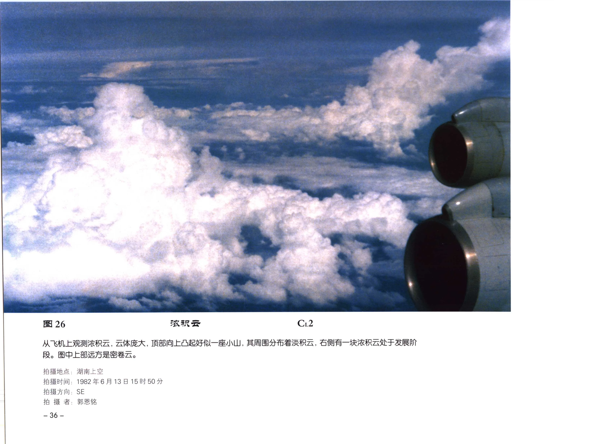

| 字段 | 内容 |
| --- | --- |
| 图号 | 图 26 |
| 云类代码 | C12 |
| 拍摄地点 | 湖南上空 |
| 拍摄时间 | 1982年6月13日15时50分 |
| 拍摄方向 | ; SE |

### OCR 文本

```text
图 26 IRE C12

从飞机上观测浓积云, 云体庞大, ABOLGRHU-BNW, 其周围分布着淡积云, 右侧有一块浓积云处于发展阶
段。图中上部远方是密卷云。

拍摄地点: 湖南上空

拍摄时间: 1982年6月13日15时50分
拍摄方向; SE

jh RA. PRR

~ 36-
```

## PDF 第 49 页 - C13

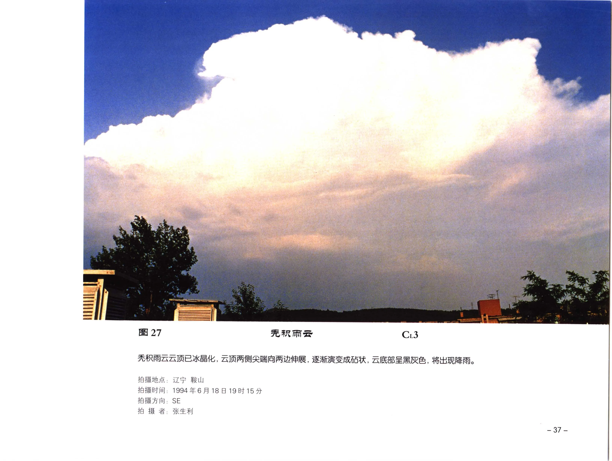

| 字段 | 内容 |
| --- | --- |
| 云类代码 | C13 |
| 拍摄地点 | 辽宁 鞍山 |
| 拍摄时间 | 1994年6月18日19时15分 |
| 拍摄方向 | SE |
| 拍摄者 | 张生利 |

### OCR 文本

```text
=|

 27 FORE C13

UNUM) |

秃积十去云顶已冰晶化, 云顶两侧尖端向两边伸展, AR EMIOK, 云底部呈黑灰色, 将出现降雨。

拍摄地点: 辽宁 鞍山

拍摄时间: 1994年6月18日19时15分
拍摄方向: SE

拍 摄 者: 张生利

— 37'=
```

## PDF 第 50 页 - Cr3

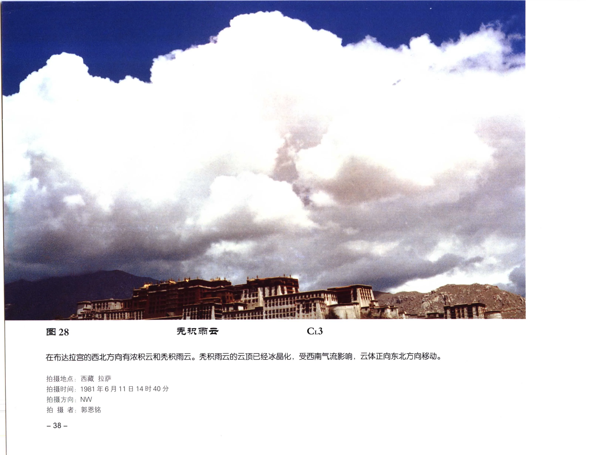

| 字段 | 内容 |
| --- | --- |
| 云类代码 | Cr3 |
| 拍摄地点 | 西藏 拉萨 |
| 拍摄时间 | 1981年6月11日14时40分 |
| 拍摄方向 | NW |
| 拍摄者 | BER |

### OCR 文本

```text
=

 28 FLAIR Cr3

在布达拉宫的西北方向有浓积云和秀积雨云。秃积雨云的云顶已经冰晶化，受西南气流影响，云体正向东北方向移动。

拍摄地点: 西藏 拉萨

拍摄时间: 1981年6月11日14时40分
拍摄方向: NW

拍 摄 者 BER

一38-一
```

## PDF 第 51 页

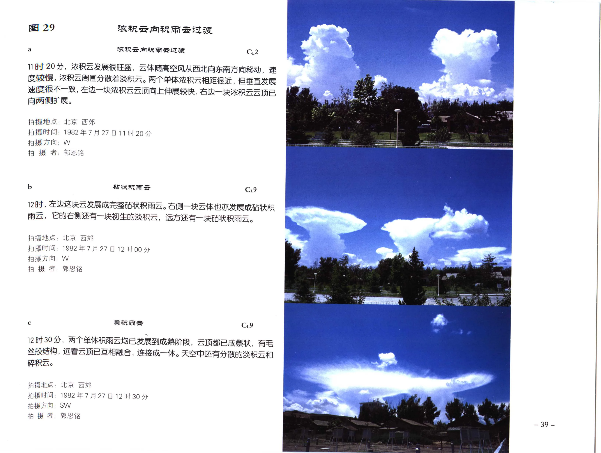

!!! note "OCR 状态"
    本页暂未识别出可靠文本，保留原页图像。

## 图 30 - Cr2

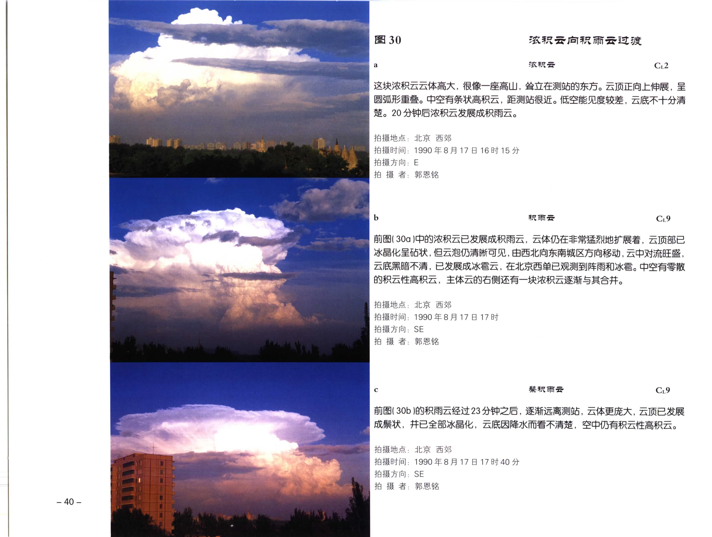

| 字段 | 内容 |
| --- | --- |
| 图号 | 图 30 |
| 云类代码 | Cr2 |
| 拍摄地点 | 北京 西郊 |
| 拍摄时间 | 1990年8月17日16时15 分 |
| 拍摄方向 | E |
| 拍摄者 | 郭恩铭 |

### OCR 文本

```text
图30 RAR BFR iL
a RARE Cr2

» 这块浓积云云体高大, 很像一座高山谷立在测站的东方。云顶正向上伸展, 呈
圆疏形重登。中空有条状高积云，距测站很近。低空能见度较差，云底不十分清
Eo 20 分钟后浓积云发展成积雨云。

拍摄地点: 北京 西郊

拍摄时间: 1990年8月17日16时15 分
拍摄方向: E

拍 摄 者: 郭恩铭

b RRR C19

BUS 300 )中的浓积云已发展成积雨云，云体仍在非常猛烈地扩展着, 云顶部已
冰晶化呈码状, 但云泡仍清晰可见, 由西北向东南城区方向移动 , 云中对流旺盛，
云底黑暗不清, 已发展成冰需云, 在北京西单已观测到阵雨和冰示。中空有去散
的积云性高积云，主体云的右侧还有一块浓积云逐渐与其合并。

拍摄地点: 北京 西郊

拍摄时间: 1990年8月17日17时
拍摄方向: SE

拍 摄 者; PRR

C RAE Cr9

前图( 30b )的积雨云经过23 分钟之后, 逐渐远离测站, 云体更庞大, 云顶已发展
成紧状，并已全部冰晶化，云底因降水而看不清楚 ，空中仍有积云性高积云。

拍摄地点: 北京 西郊

拍摄时间: 1990年8月17日17时40分
拍摄方向: SE

拍 摄 者: 郭恩铭

-40 -
```

## 图 31 - C19

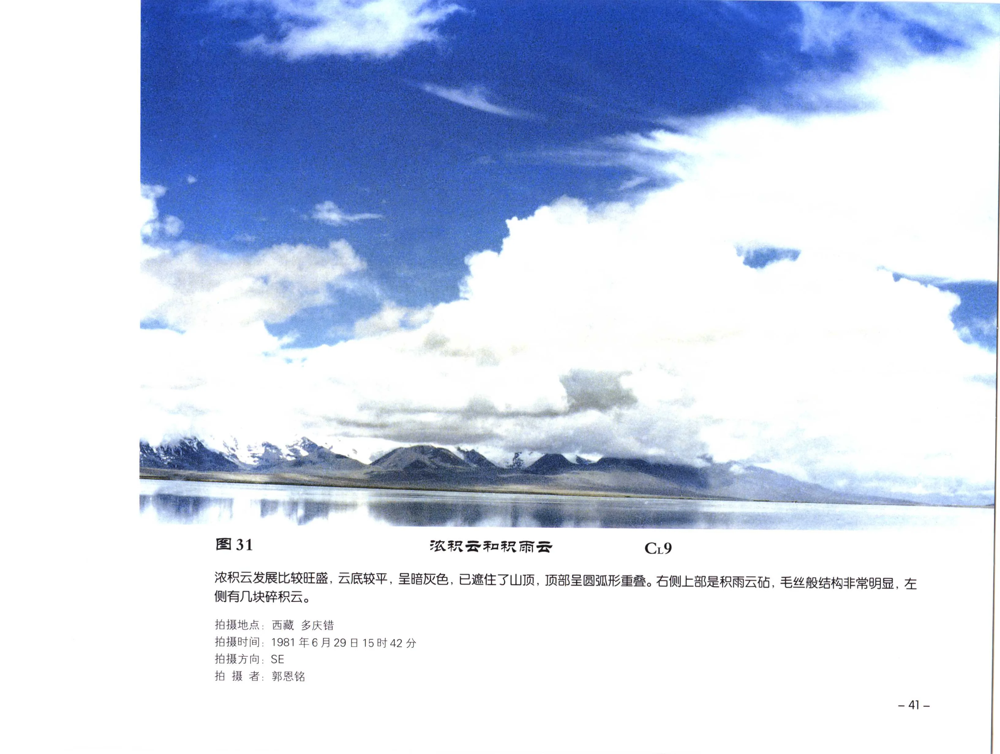

| 字段 | 内容 |
| --- | --- |
| 图号 | 图 31 |
| 云类代码 | C19 |
| 拍摄地点 | ;: 西藏 多庆错 |
| 拍摄时间 | 1981年6月29日15时42 分 |
| 拍摄方向 | ， SE |
| 拍摄者 | ; PB |

### OCR 文本

```text
图31 RIR DE FOR C19

浓积云发展比较旺盛, 云底较平，呈暗灰色, SRaETUA, APLHMVSE. GMEBSARMAI, 毛丝般结构非常明显, 左
侧有几块碎积云。

拍摄地点;: 西藏 多庆错

拍摄时间: 1981年6月29日15时42 分
拍摄方向， SE

拍 摄 者; PB

_41-
```

## PDF 第 54 页

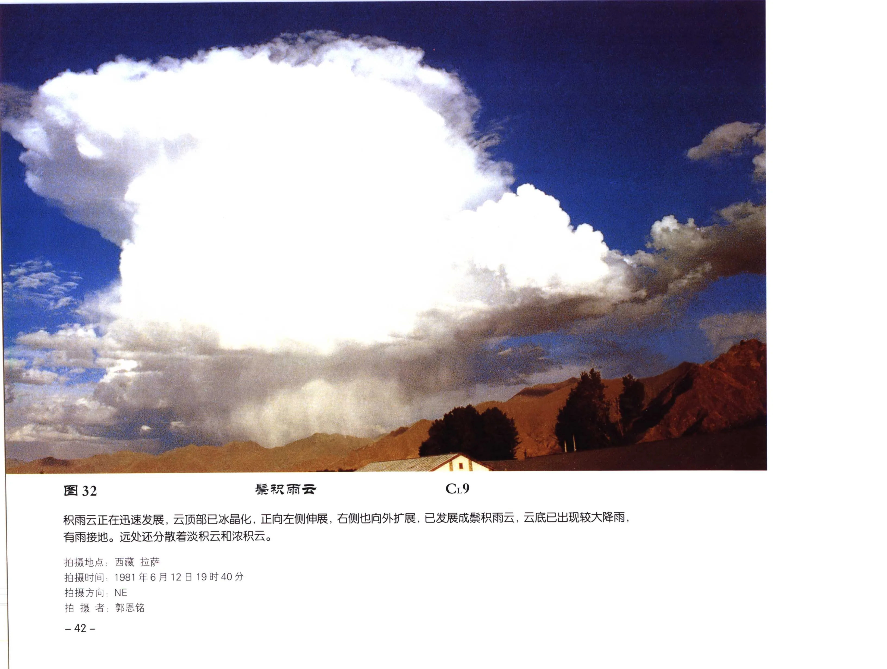

| 字段 | 内容 |
| --- | --- |
| 拍摄地点 | 拍摄时间 : |
| 拍摄时间 | 拍摄方向: |
| 拍摄方向 | 拍 摄 者: |
| 拍摄者 | -42 - |

### OCR 文本

```text
只雨云正在迅速发展, 云顶部已冰晶化, 正向左侧伸展, 右侧也向外扩展, PARES. 云底已出现较大降雨，

IRR

ANSE. AUADRSRRGN ARB

拍摄地点:
拍摄时间 :
拍摄方向:
拍 摄 者:

-42 -

西藏 拉萨

1981年6
NE
BAS

No

412

19 BY 40 分
```

## 图 33 - C19

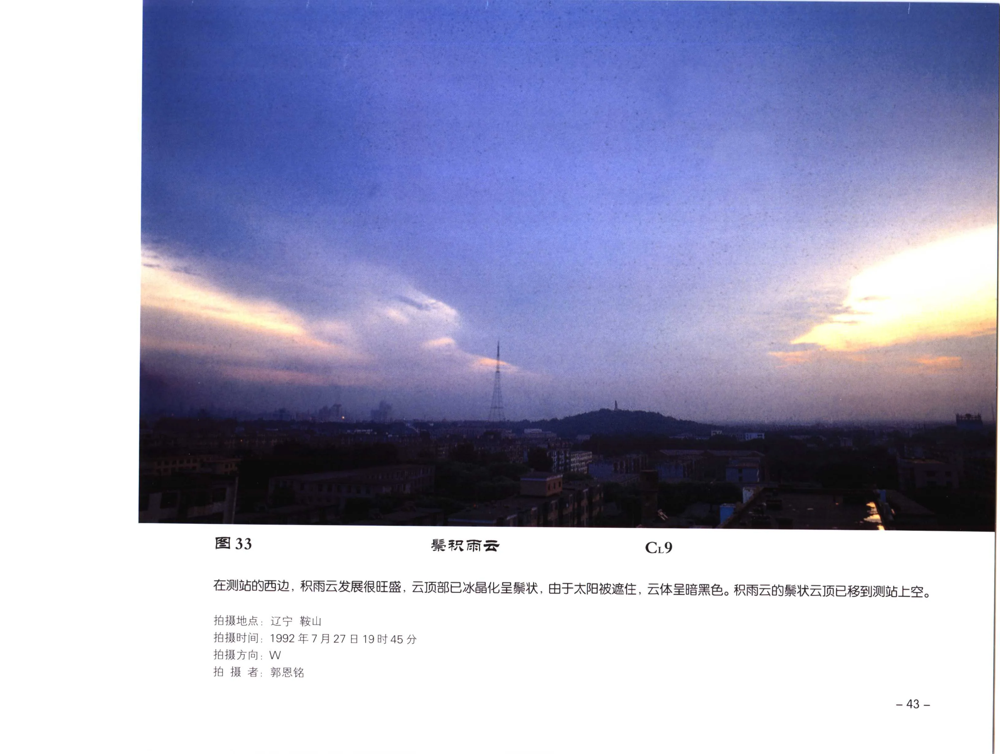

| 字段 | 内容 |
| --- | --- |
| 图号 | 图 33 |
| 云类代码 | C19 |
| 拍摄地点 | 辽宁 鞍山 |
| 拍摄时间 | 1992 年7 |
| 拍摄方向 | W |
| 拍摄者 | BAK |

### OCR 文本

```text
图33

C19

在测站的西边, 积雨云发展很旺盛, BRAD KLS I, HFA, BALSLE, RGHAHWSKRAMCRAMIS EZ,

拍摄地点: 辽宁 鞍山

拍摄时间: 1992 年7

拍摄方向: W
拍 摄 者: BAK

J 27

19 时 45 分

AF cs
```

## 图 34

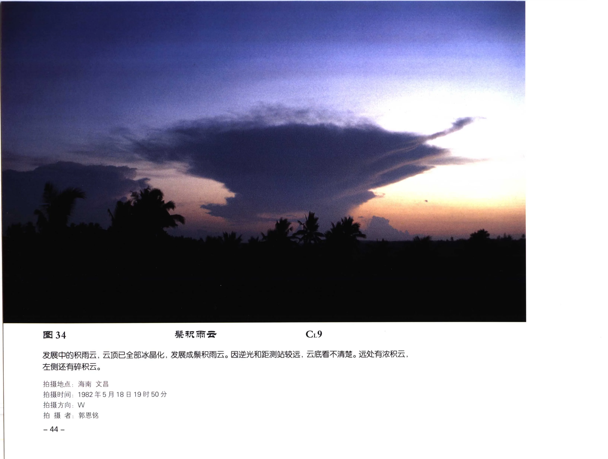

| 字段 | 内容 |
| --- | --- |
| 图号 | 图 34 |

### OCR 文本

```text
图34

发展中的积雨云, 云顶已全部冰晶化, 发展成紧积雨云。因逆光和距测站较远,云底看不清楚。远处有浓积云，

左侧还有碎积云。

日摄 地点 :
白摄时间 :

日摄 者:
_44 -

f
f
tia 7]: W
f

海南 文昌
1982年5月18日19时50分

郭恩铭

RAE
```

## PDF 第 57 页 - C19

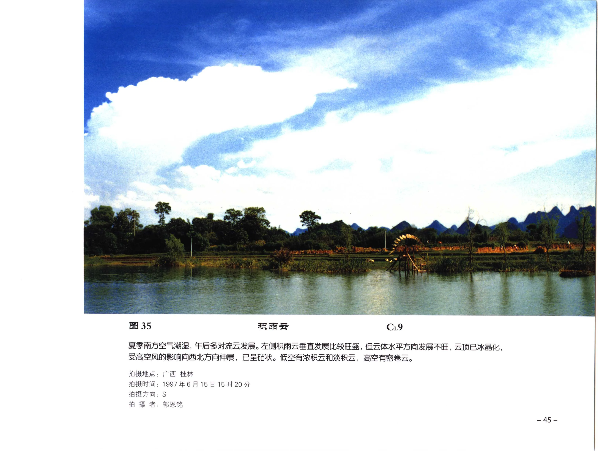

| 字段 | 内容 |
| --- | --- |
| 云类代码 | C19 |
| 拍摄地点 | ; 广西 桂林 |
| 拍摄时间 | 1997年6月15日15时20分 |
| 拍摄方向 | S |

### OCR 文本

```text
35 AR El C19

夏季南方空气潮湿, 午后多对流云发展。左侧积雨云垂直发展比较旺盛, 但云体水平方向发展不旺, 云顶已冰晶化，
受高空风的影响向西北方向伸展，已呈丰状。低空有浓积云和淡积云，高空有密卷云。

拍摄地点; 广西 桂林

拍摄时间: 1997年6月15日15时20分
拍摄方向: S
拍 摄 A. BA

=45 =
```

## 图 36 - C19

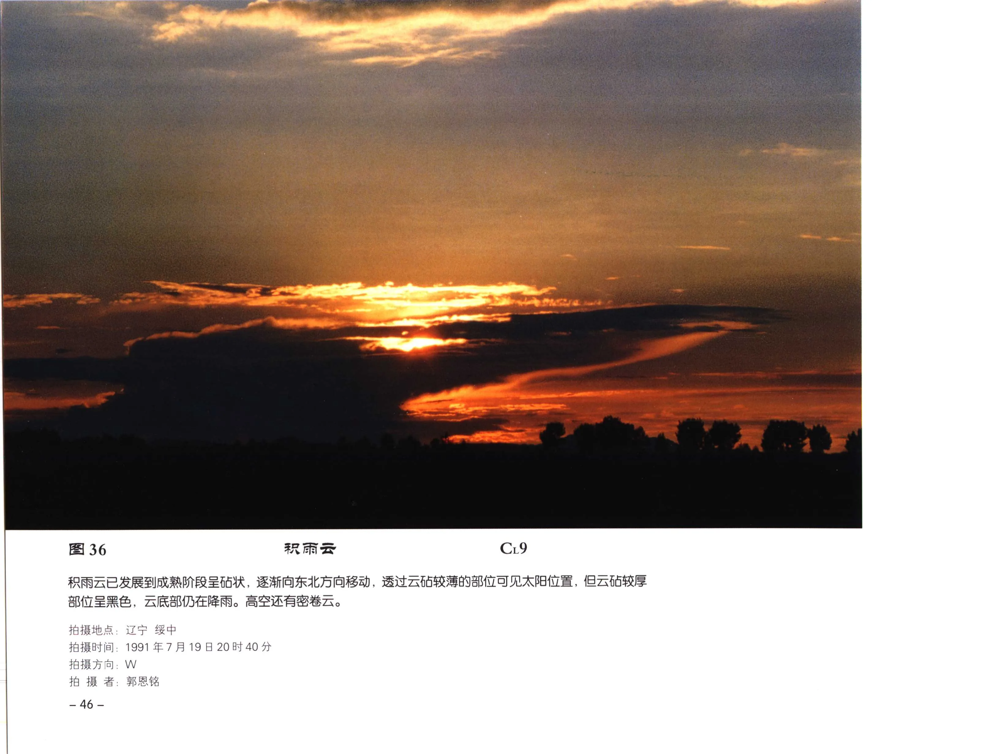

| 字段 | 内容 |
| --- | --- |
| 图号 | 图 36 |
| 云类代码 | C19 |
| 拍摄地点 | 辽宁 绥中 |
| 拍摄时间 | 1991年7月19日20时40分 |
| 拍摄方向 | ，W |

### OCR 文本

```text
图 36 RR C19

积雨云已发展到成熟阶段呈砧状，逐渐向东北方向移动，透过云码较薄的部位可见太阳位置, 但云大较厚
部位呈黑色，云底部仍在降雨。高空还有密卷云。

拍摄地点: 辽宁 绥中

拍摄时间: 1991年7月19日20时40分
拍摄方向，W

拍 ik SB. WEB

= 46 =
```

## 图 37 - C19

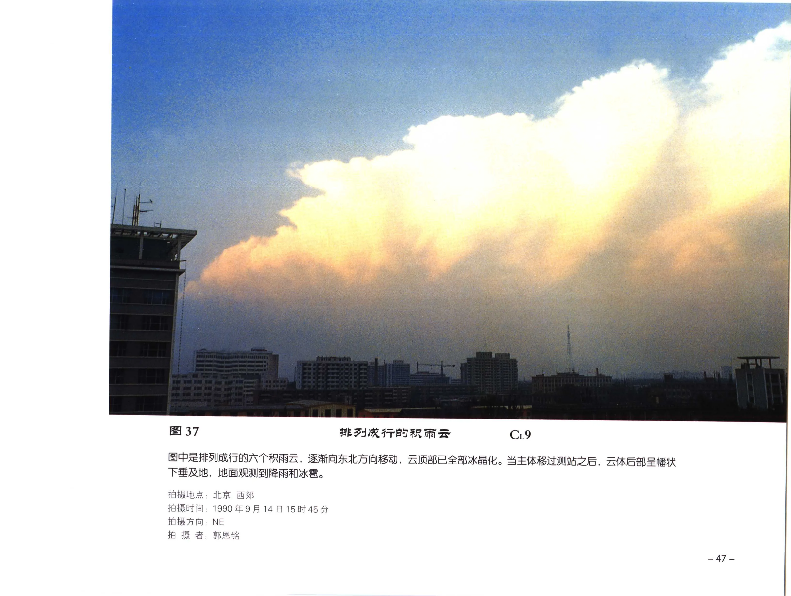

| 字段 | 内容 |
| --- | --- |
| 图号 | 图 37 |
| 云类代码 | C19 |
| 拍摄地点 | ; |
| 拍摄时间 | 拍摄方向; |
| 拍摄方向 | ; |
| 拍摄者 | 北京 西郊 |

### OCR 文本

```text
图37

图中是排列成行的六个积雨云，逐渐向东北方向移动，云顶部已全部冰晶化。当主体移过测站之后，云体后部呈幅状

FERIO, WEAMM BESTA,

拍摄地点;
拍摄时间 :
拍摄方向;
拍 摄 者:

北京 西郊
1990年9
NE

了恩铭

sop

A 14 8 15 BY 45 分

排列成行的积雨云

C19

= AT =
```

## PDF 第 60 页 - C9

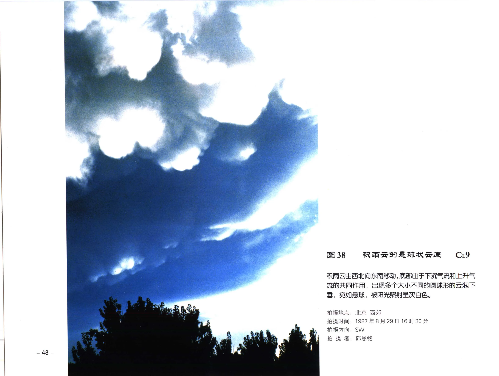

| 字段 | 内容 |
| --- | --- |
| 云类代码 | C9 |
| 拍摄地点 | 北京 西郊 |
| 拍摄时间 | 1987年8月29日16时30分 |
| 拍摄方向 | SW |
| 拍摄者 | 郭恩铭 |

### OCR 文本

```text
_48 -

 38 RRA PI IRB C9

积雨云由西北向东南移动 ,底部由于下沉气流和上升气
流的共同作用，出现多个大小不同的圆球形的云泡下
垂，宛如悬球，被阳光照射择灰白色。

拍摄地点: 北京 西郊

拍摄时间: 1987年8月29日16时30分
拍摄方向: SW

拍 摄 者: 郭恩铭
```
