# 《中国云图》PDF 第 61-80 页

本页由扫描版 PDF 自动提取生成。每个条目保留原页图像，并附 OCR 文本供检索和后续校订。

## 图 39

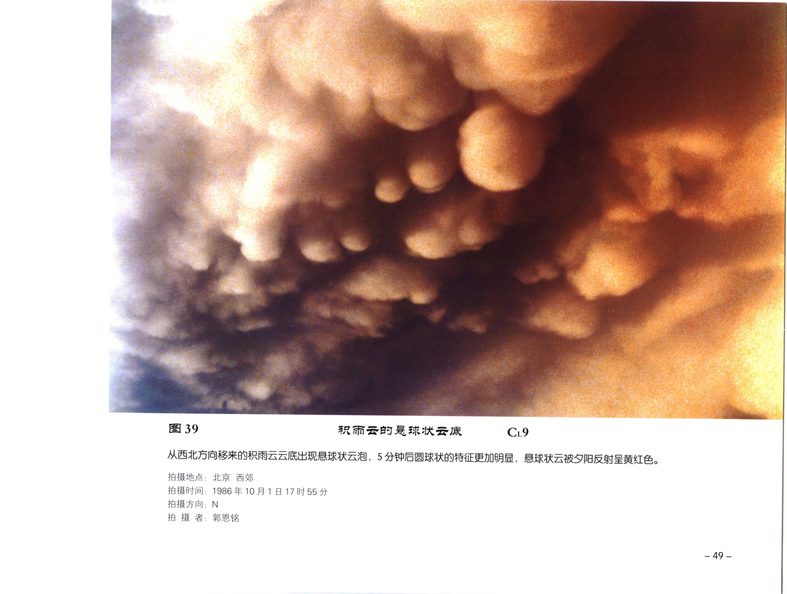

| 字段 | 内容 |
| --- | --- |
| 图号 | 图 39 |
| 拍摄地点 | 拍摄时间 |
| 拍摄时间 | 拍摄方向: |
| 拍摄方向 | 拍 摄 者; |
| 拍摄者 | ; |

### OCR 文本

```text
图39

从西北方向移来的积雨云云底出现悬球状云泡，5 分钟后圆球状的特征更加明显，悬球状云被夕阳反射呈黄红色。

拍摄地点:
拍摄时间
拍摄方向:
拍 摄 者;

北京 西郊
1986年10月1日17时55分

N
郭恩铭

AR A SB SER AR TR

~4A9-
```

## 图 40 - C19

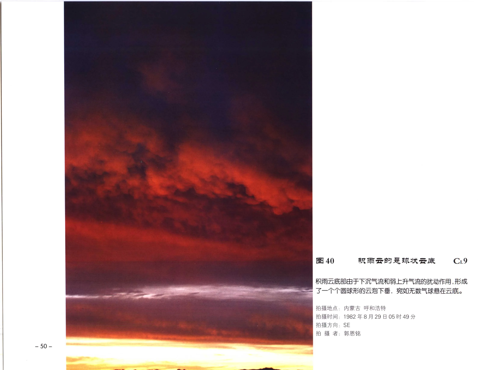

| 字段 | 内容 |
| --- | --- |
| 图号 | 图 40 |
| 云类代码 | C19 |
| 拍摄地点 | 内蒙古 呼和浩特 |
| 拍摄时间 | 1982 8 A 29 日05时49分 |
| 拍摄方向 | SE |

### OCR 文本

```text
图 40 ARR BT SRA TR C19

积雨云底部由于下沉气流和弱上升气流的扰动作用 ,形成
了一个个圆球形的云泡下垂，宛如无数气球悬在云底。

拍摄地点: 内蒙古 呼和浩特

拍摄时间: 1982 8 A 29 日05时49分
用 拍摄方向: SE

Pie. BE

-~50-
```

## 图 41 - C19

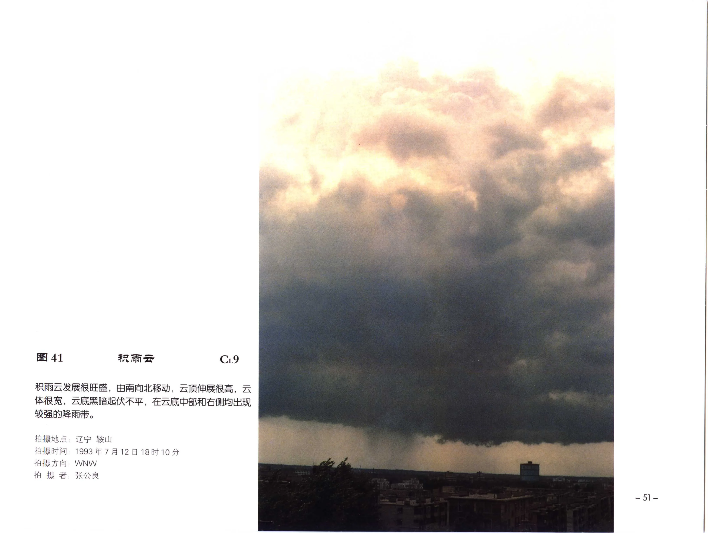

| 字段 | 内容 |
| --- | --- |
| 图号 | 图 41 |
| 云类代码 | C19 |
| 拍摄地点 | 辽宁 鞍山 |
| 拍摄时间 | 1993年7月12日18时10分 |
| 拍摄方向 | ，WNVW |
| 拍摄者 | KAR |

### OCR 文本

```text
图41 AR C19

积雨云发展很旺盛，由南向北移动，云顶伸展很高，云
体很宽，云底黑暗起伏不平，在云底中部和右侧均出现
较强的降雨带。

拍摄地点: 辽宁 鞍山

拍摄时间: 1993年7月12日18时10分
拍摄方向，WNVW

拍 摄 者: KAR

ex ep ae
```

## 图 42

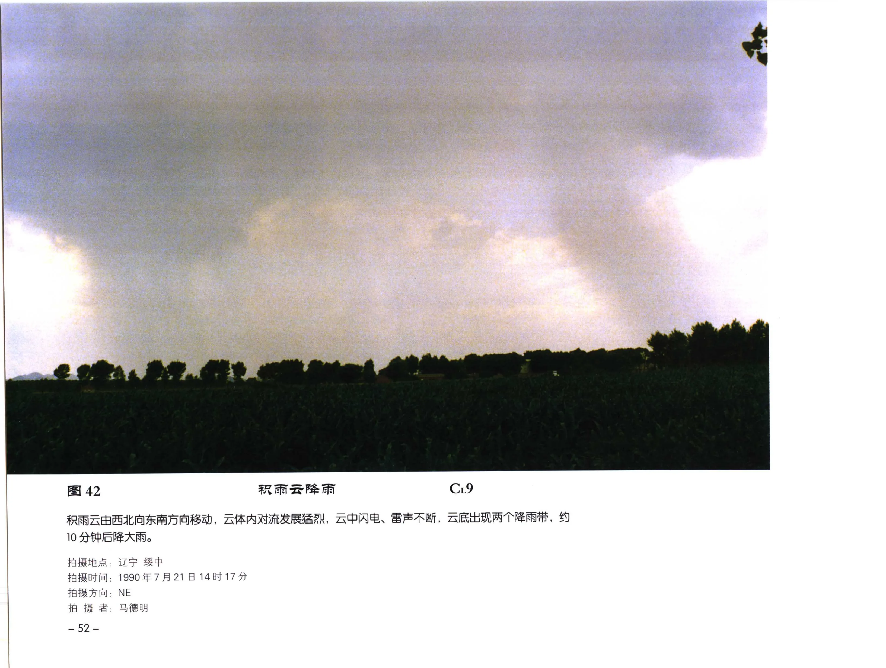

| 字段 | 内容 |
| --- | --- |
| 图号 | 图 42 |
| 拍摄地点 | ; 辽宁 绥中 |
| 拍摄时间 | 1990年7 |
| 拍摄方向 | ， NE |
| 拍摄者 | 马德明 |

### OCR 文本

```text
图 42

积雨云由西北向东南方向移动，云体内对流发展猛烈，云中闪电、雷声不断，云底出现两个降雨带，约

10 分钟后降大雨。

拍摄地点; 辽宁 绥中

拍摄时间: 1990年7
拍摄方向， NE
拍 摄 者: 马德明

~52-

21

14 BY 17 分

BR En Ze PA eh
```

## 图 43 - C19

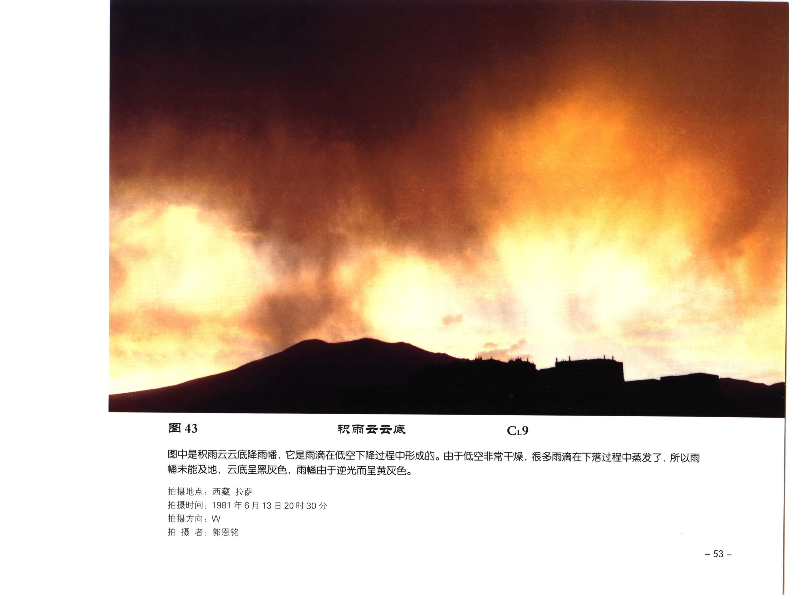

| 字段 | 内容 |
| --- | --- |
| 图号 | 图 43 |
| 云类代码 | C19 |
| 拍摄地点 | 西藏 拉萨 |
| 拍摄时间 | 1981 426 A 13 8 208t 30 4 |
| 拍摄方向 | W |
| 拍摄者 | 郭恩铭 |

### OCR 文本

```text
图 43 AR ER TR C19

BPERSGORMS, 它是雨滴在低空下降过程中形成的。由于低空非常干燥,很多雨滴在下落过程中蒸发了, 所以十
幅未能及地，云底呈黑灰色，雨幅由于逆光而呈黄灰色。

拍摄地点: 西藏 拉萨

拍摄时间: 1981 426 A 13 8 208t 30 4
拍摄方向: W

拍 摄 者: 郭恩铭

= =
```

## 图 44

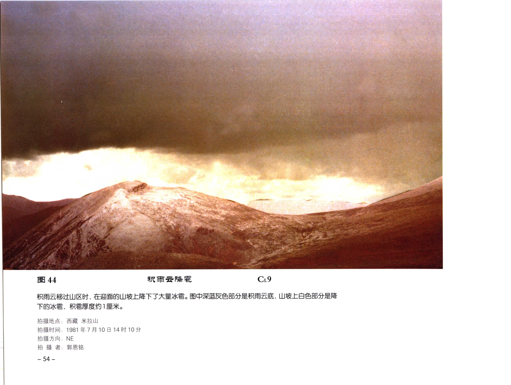

| 字段 | 内容 |
| --- | --- |
| 图号 | 图 44 |
| 拍摄地点 | 拍摄时间 : |
| 拍摄时间 | 拍摄方向， |
| 拍摄方向 | ， |
| 拍摄者 | -54 - |

### OCR 文本

```text
图44

拍摄地点
拍摄时间 :
拍摄方向，
拍 摄 者:

-54 -

积置厚度约 1 厘米。

西藏 米拉山

1981年7月10日14时10分
NE

FR

FR eB

积雨云移过山区时, AWRAWIRERT TASKS. SPREKERDSRMGE, 山坡上白色部分是降
FAVA,
```

## 图 45

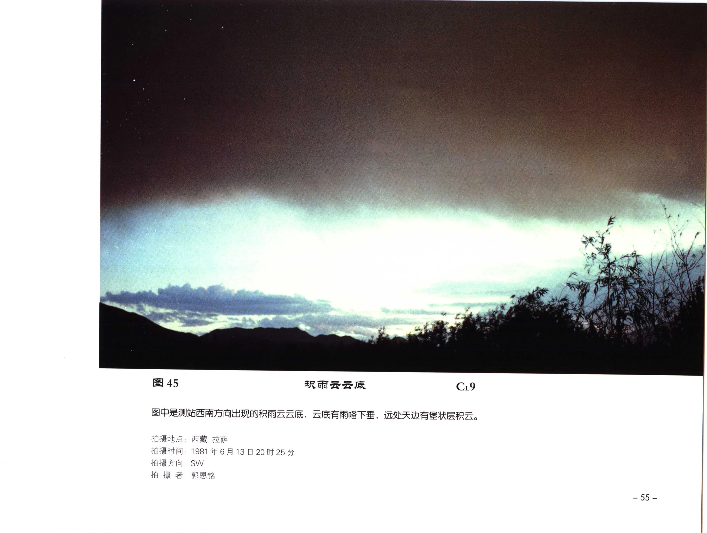

| 字段 | 内容 |
| --- | --- |
| 图号 | 图 45 |
| 拍摄地点 | 西藏 拉萨 |
| 拍摄时间 | 拍摄方向: |
| 拍摄方向 | 拍 摄 者 |
| 拍摄者 | 1981年6 |

### OCR 文本

```text
图 45

图中是测站西南方向出现的积雨云云底，云底有雨性下垂，远处天边有堡状层积云。

拍摄地点: 西藏 拉萨

拍摄时间:
拍摄方向:
拍 摄 者

1981年6
SW
郭恩铭

月 13

20 时 25 分

~55-
```

## 图 46 - Cr9

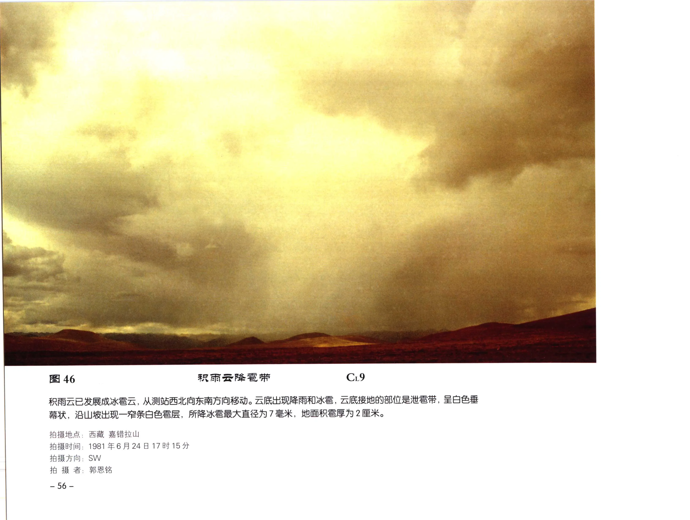

| 字段 | 内容 |
| --- | --- |
| 图号 | 图 46 |
| 云类代码 | Cr9 |
| 拍摄地点 | 西藏 嘉错拉山 |
| 拍摄时间 | 1981年6月24日17时15分 |
| 拍摄方向 | SW |
| 拍摄者 | WAS |

### OCR 文本

```text
图 46 FR ee Ee Cr9

积雨云已发展成冰霜云, 从测站西北向东南方向移动。云底出现降十和冰雹, ARN StS, SASH
幕状，沿山坡出现一罕条白色需层，所降冰索最大直径为 7 毫米，地面积蜀厚为 2 厘米。

拍摄地点: 西藏 嘉错拉山

拍摄时间: 1981年6月24日17时15分
拍摄方向: SW

拍 摄 者: WAS

- 56 -
```

## 图 47 - C19

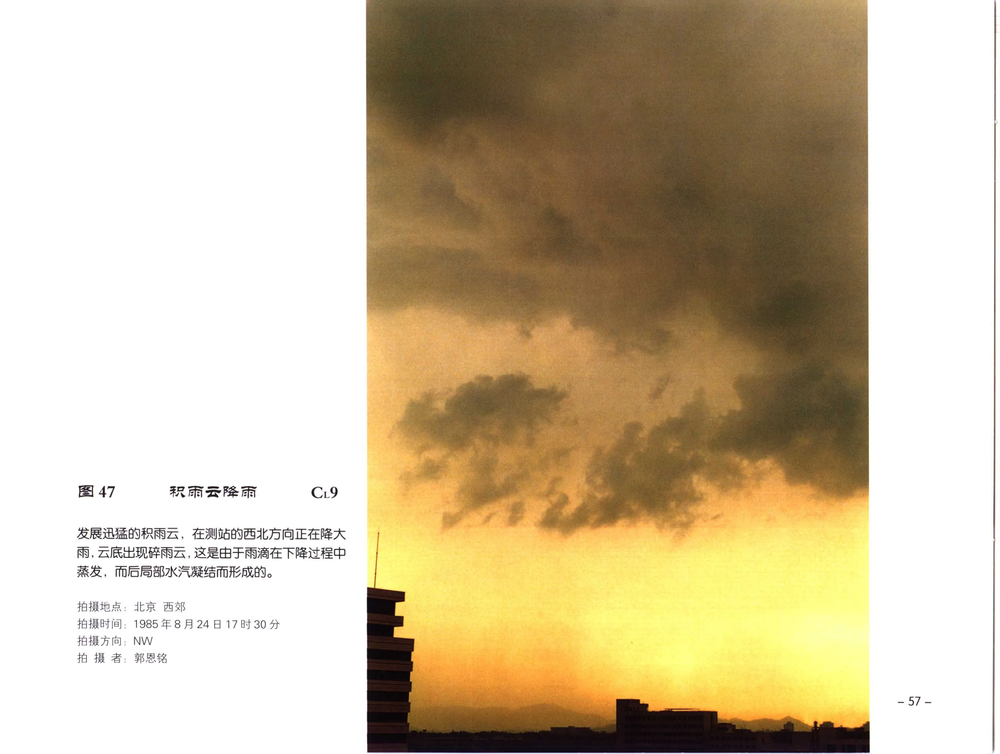

| 字段 | 内容 |
| --- | --- |
| 图号 | 图 47 |
| 云类代码 | C19 |
| 拍摄地点 | 北京 西郊 |
| 拍摄时间 | 1985年8月24日17时30分 |
| 拍摄方向 | NW |
| 拍摄者 | 郭恩铭 |

### OCR 文本

```text
图 47 AR Fe oe PH C19

ARMANRMIZ , FEMGSAIERAC EERE
W, 云底出现碎雨云, 这是由于雨滴在下降过程中
RA, MGA AEA MAA.

拍摄地点: 北京 西郊

拍摄时间: 1985年8月24日17时30分
拍摄方向: NW

拍 摄 者: 郭恩铭

= 57 =
```

## 图 48

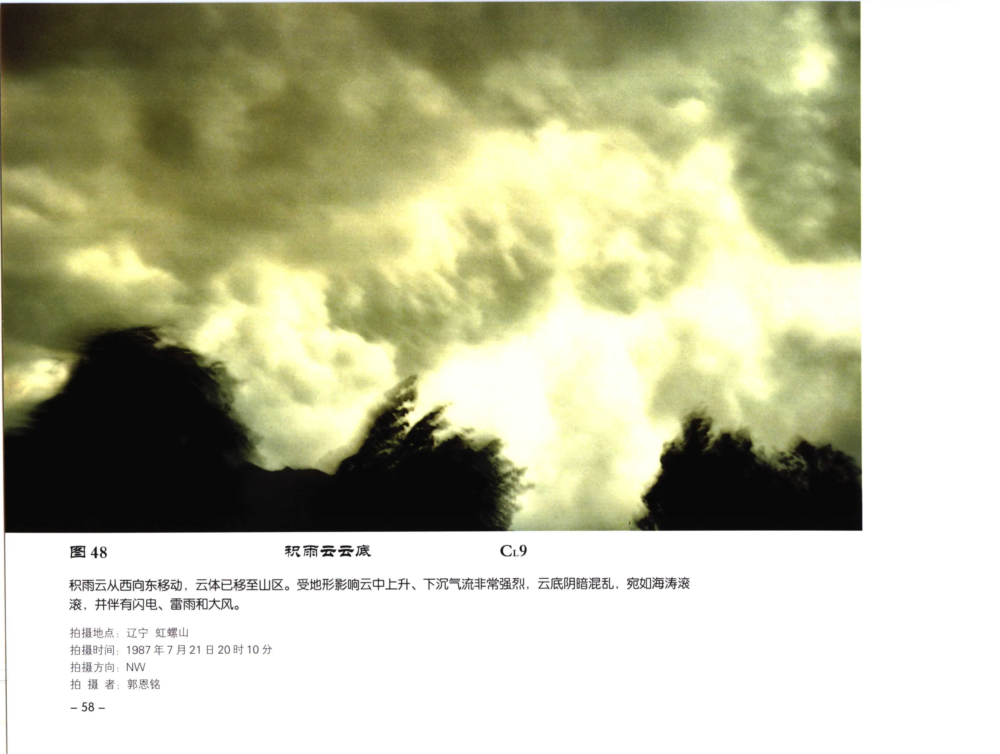

| 字段 | 内容 |
| --- | --- |
| 图号 | 图 48 |
| 拍摄地点 | 拍摄时间 : |
| 拍摄时间 | 拍摄方向: |
| 拍摄方向 | 拍 摄 者: |
| 拍摄者 | -58 - |

### OCR 文本

```text
图 48

只雨云从西向东移动 ，云体已移至山区。受地形影响云中上升、下;

滚，并伴有闪电、雷十和大风。

拍摄地点:
拍摄时间 :
拍摄方向:
拍 摄 者:

-58 -

辽宁 虹螺山

1987 年7
NW
郭恩铭

月21 日20时10分

流非常强烈，云底阴暗混乱，宛如海涛滚
```

## PDF 第 71 页 - C19

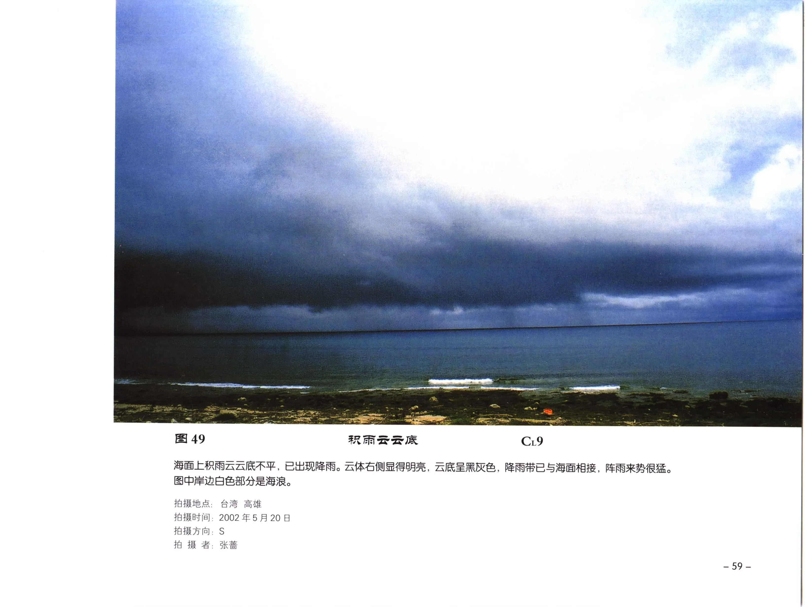

| 字段 | 内容 |
| --- | --- |
| 云类代码 | C19 |
| 拍摄地点 | ; 台湾 高雄 |
| 拍摄时间 | ,， 2002 £5 A 208 |
| 拍摄方向 | ; S |
| 拍摄者 | ; hE |

### OCR 文本

```text
49 AR ER TR C19

海面上积雨云云底不平，已出现降雨。云体右侧显得明亮,云底呈黑灰色,降雨带已与海面相接，阵雨来势很猛。
图中岸边白色部分是海浪。

拍摄地点; 台湾 高雄

拍摄时间,， 2002 £5 A 208

拍摄方向; S
拍 摄 者; hE

= 5Oi
```

## 图 50

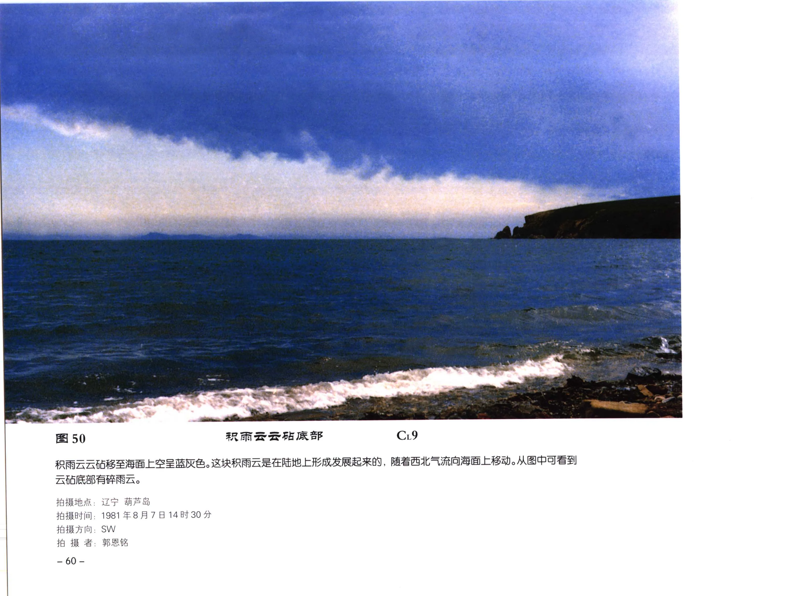

| 字段 | 内容 |
| --- | --- |
| 图号 | 图 50 |
| 拍摄地点 | ; |
| 拍摄时间 | 拍摄方向; |
| 拍摄方向 | ; |
| 拍摄者 | ; |

### OCR 文本

```text
图50

积雨云云砧移至海面上空呈蓝灰色。这块积雨云是在陆地上形成发展起来的，随着西北气流向海面上移动。 从图中可看到

云砧底部有碎雨云。

拍摄地点;
拍摄时间 :
拍摄方向;
拍 摄 者;

-060 -

辽宁 APS
1981年8月7
SW

郭恩铭

14 时 30 分

积雨云云正庶部

CrL9
```

## PDF 第 73 页 - Cr9

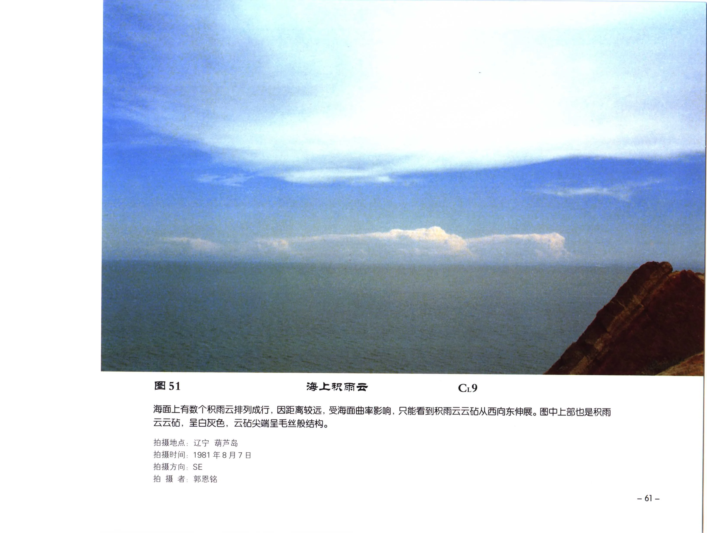

| 字段 | 内容 |
| --- | --- |
| 云类代码 | Cr9 |
| 拍摄地点 | 辽宁 AES |
| 拍摄时间 | 1981年8月7日 |
| 拍摄方向 | ，SE |
| 拍摄者 | ，郭恩铭 |

### OCR 文本

```text
51 海上积雨云 Cr9

海面上有数个积雨云排列成行, 因距离较远，受海面曲率影响,只能看到积雨云云厦从西向东伸展。图中上部也是积十
云云个，呈白灰色，云砧尖端呈毛丝般结构。

拍摄地点: 辽宁 AES
拍摄时间: 1981年8月7日
拍摄方向，SE

拍 摄 者，郭恩铭

-61-
```

## 图 52 - Cr9

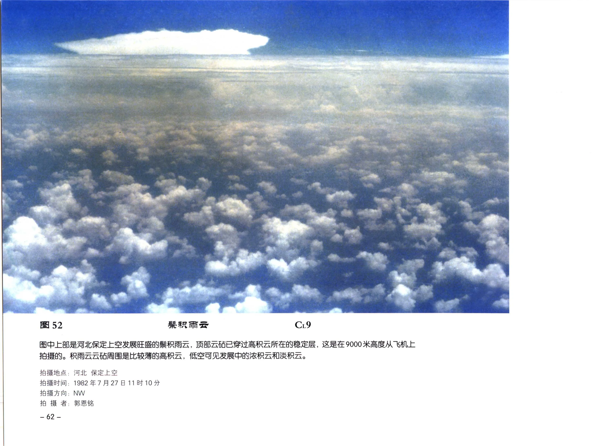

| 字段 | 内容 |
| --- | --- |
| 图号 | 图 52 |
| 云类代码 | Cr9 |
| 拍摄地点 | ; 河北 保定上空 |
| 拍摄时间 | 1982年7月27日11时10分 |
| 拍摄方向 | ，NW |
| 拍摄者 | ; WBE |

### OCR 文本

```text
图 52 BR Cr9

图中上部是河北保定上空发展旺盛的景积雨云，顶部云丰已穿过高积云所在的稳定层， 这是在9000米高度从飞机上
拍摄的。积雨云云砧周围是比较薄的高积云，低空可见发展中的浓积云和淡积云。

拍摄地点; 河北 保定上空

拍摄时间: 1982年7月27日11时10分

拍摄方向，NW
拍 摄 者; WBE

~62-
```

## 图 53 - Cr4


| 字段 | 内容 |
| --- | --- |
| 图号 | 图 53 |
| 云类代码 | Cr4 |
| 拍摄地点 | ;: 辽宁 鞍山 |
| 拍摄时间 | 1999年6月24日06时30分 |
| 拍摄方向 | E |
| 拍摄者 | ; SPA |

### OCR 文本

```text
图53 积云性层积云 Cr4

由积云平衍扩展而成的积云性层积云。云体多呈长条形, 中间向上上起仍保持积云的特征。由于逆光云体被朝阳
映照呈深灰色，并华有霞光，高空还分散着小块高积云。

拍摄地点;: 辽宁 鞍山

拍摄时间: 1999年6月24日06时30分
拍摄方向 E

拍 摄 者; SPA

-63-
```

## PDF 第 76 页


| 字段 | 内容 |
| --- | --- |
| 拍摄地点 | ; 北京 海淀 |
| 拍摄时间 | 1984年9月17日06时10分 |
| 拍摄方向 | E |
| 拍摄者 | ; PB |

### OCR 文本

```text
54 积云性层积云

图中的积云性层积云是由早晨空中分散的积云减弱扩展而形成的,逆光呈瞳灰色。云的形状很不规则, 多为长条形, 中
间驯起，也有大小不同的块状，云块间有缝隙。由于早晨空气湿度较大，旭日光辉透过云孙，出现霞光。

拍摄地点; 北京 海淀

拍摄时间: 1984年9月17日06时10分
拍摄方向 E

拍 摄 者; PB

-64-
```

## 图 55 - C14


| 字段 | 内容 |
| --- | --- |
| 图号 | 图 55 |
| 云类代码 | C14 |
| 拍摄地点 | 北京 西郊 |
| 拍摄时间 | 1979年8月25日19时30分 |
| 拍摄方向 | W |

### OCR 文本

```text
图 55 积云性层积云 C14

SIT, MRSALPHRRGNBRA. DAMAGE, 具有积云的特征，呈黄红色。图中低空长条形云是层积云，
它是由积云衰退而形成的。高空分布着云块大小不同的高积云，它的云体也逐渐减弱，边缘有些零散，云底还有幅状。

拍摄地点: 北京 西郊

拍摄时间: 1979年8月25日19时30分
拍摄方向: W

fh 摄 A. 郭恩铭
```

## PDF 第 78 页 - Cr5


| 字段 | 内容 |
| --- | --- |
| 云类代码 | Cr5 |
| 拍摄地点 | ;内蒙古 呼和浩特 |
| 拍摄时间 | 1982年7月9日07时05分 |
| 拍摄方向 | E |
| 拍摄者 | ;郭恩铭 |

### OCR 文本

```text
E56 透光层积云 Cr5

图中是透光层积云，云块呈有灰色，形状不很规则，云块间的缝隙明显呈白色，阳光透过云隙照射到草原上。

拍摄地点;内蒙古 呼和浩特
拍摄时间: 1982年7月9日07时05分
拍摄方向: E

拍 摄 者;郭恩铭

-66-
```

## 图 57


| 字段 | 内容 |
| --- | --- |
| 图号 | 图 57 |
| 拍摄地点 | ， |
| 拍摄时间 | ; |
| 拍摄方向 | ，W |
| 拍摄者 | 贵州 桐林 |

### OCR 文本

```text
图 57

图中是透光层积云，云块排列平整，被夕阳映照呈金黄色。云块间有缝隙，可见蓝天。

拍摄地点，
拍摄时间 ;

拍摄方向，W

拍 摄 者:

贵州 桐林
1980年1月14日17时30分

郭恩铭

透光层积云

=i67 =
```

## PDF 第 80 页 - C15


| 字段 | 内容 |
| --- | --- |
| 云类代码 | C15 |
| 拍摄地点 | ; 北京 顺义 |
| 拍摄时间 | 2001年10月31日08时40分 |
| 拍摄方向 | E |

### OCR 文本

```text
58 透光层积云 C15

透光层积云呈长条形分布在低空 因逆光, 云条呈瞳灰色。透光层积云平行排列，云条之间有缝隙。图中上部白色云块
是高积云，阳光映照着大片高积云，在上部蓝天处出现了霞光。

拍摄地点; 北京 顺义

拍摄时间: 2001年10月31日08时40分
拍摄方向: E

拍 RS. 郭恩铭

-68 -
```
