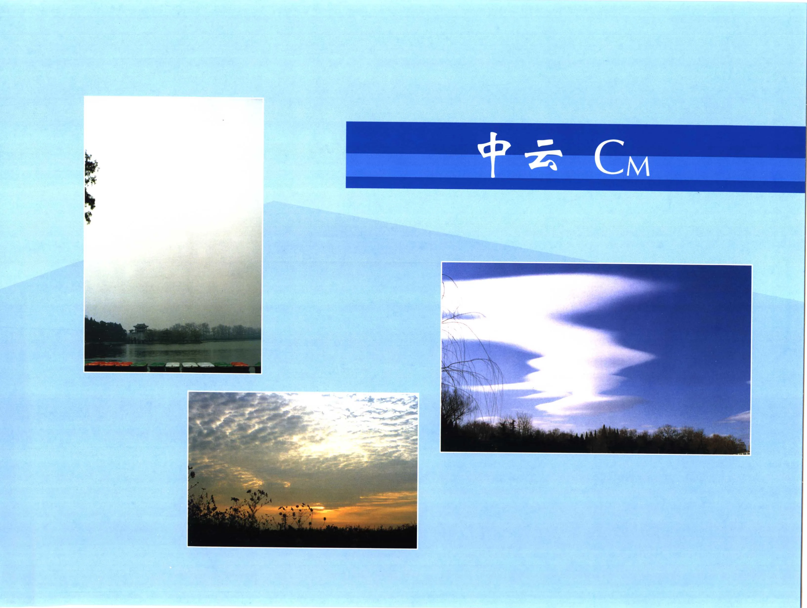

# 《中国云图》PDF 第 81-100 页

本页由扫描版 PDF 自动提取生成。每个条目保留原页图像，并附 OCR 文本供检索和后续校订。

## PDF 第 81 页 - C15


| 字段 | 内容 |
| --- | --- |
| 云类代码 | C15 |
| 拍摄地点 | 北京 西郊 |
| 拍摄时间 | 1986年6月14日10时20 分 |
| 拍摄方向 | NE |

### OCR 文本

```text
59 iZARIRE C15

透光层积云成波状排列，云条厚的部分呈深灰色，云阶处稍薄显得明亮。图中右侧低空还有零碎的层积云。

拍摄地点: 北京 西郊

拍摄时间: 1986年6月14日10时20 分
拍摄方向: NE

fo 摄 者: 郭恩铭
```

## 图 60 - Cr5


| 字段 | 内容 |
| --- | --- |
| 图号 | 图 60 |
| 云类代码 | Cr5 |
| 拍摄地点 | 广东 深圳 |
| 拍摄时间 | 1982年6月8日17时10分 |
| 拍摄方向 | SW |

### OCR 文本

```text
图 60 蔽光层积云 Cr5

蔽光层积云布满全天，呈灰白色。由于云层厚度不均，有深灰浅白之分。远处云底呈暗灰色，已遮盖山顶。

拍摄地点: 广东 深圳

拍摄时间: 1982年6月8日17时10分
拍摄方向: SW

拍 tk 者: 郭恩铭

-70-
```

## PDF 第 83 页 - Cr5


| 字段 | 内容 |
| --- | --- |
| 云类代码 | Cr5 |
| 拍摄地点 | 广西 桂林 |
| 拍摄时间 | 1997 £6 A 16 日14时20分 |
| 拍摄方向 | ; SE |

### OCR 文本

```text
01 蔽光层积云 Cr5

蔽光层积云布满全天呈灰白色。云块大小不均 , 左侧云块较大, 轮廓比较明显, 曾降零星小雨。

拍摄地点: 广西 桂林

拍摄时间: 1997 £6 A 16 日14时20分
拍摄方向; SE

拍 tk 者; BEE

=
```

## 图 62 - C15


| 字段 | 内容 |
| --- | --- |
| 图号 | 图 62 |
| 云类代码 | C15 |
| 拍摄地点 | 广东 BR |
| 拍摄时间 | 1982年6月5日10时10分 |
| 拍摄方向 | ，SE |
| 拍摄者 | ; BA |

### OCR 文本

```text
图 62 RA RIRE C15
蔽光层积云布满全天。云层较厚呈暗灰色，云层很低，远处山顶已被云底遮盖。

拍摄地点: 广东 BR

拍摄时间: 1982年6月5日10时10分
拍摄方向，SE

拍 摄 者; BA

~72-
```

## 图 63


| 字段 | 内容 |
| --- | --- |
| 图号 | 图 63 |
| 拍摄地点 | 拍摄时间 : |
| 拍摄时间 | 拍摄方向: |
| 拍摄方向 | 拍 摄 者; |
| 拍摄者 | ; |

### OCR 文本

```text
vy

图 63

MO.

拍摄地点:
拍摄时间 :
拍摄方向:
拍 摄 者;

潮湿空气抬升形成了层积云，太阳升高后层积云逐渐消散。高空是分散的高积云。

西藏 AE

1981年7月14日07时14分
N

FB

=i
```

## 图 64 - C16


| 字段 | 内容 |
| --- | --- |
| 图号 | 图 64 |
| 云类代码 | C16 |
| 拍摄地点 | 辽宁 A |
| 拍摄时间 | 1998年8月10日08时10分 |
| 拍摄方向 | W |
| 拍摄者 | 郭恩铭 |

### OCR 文本

```text
为
人

图64 BRA C16

>

层云云底很低, 2K. 它是海面形成的浓雳抬升而形成的, 正由南向北移动 , 海岸北边的山顶已被层云云底遮盖。

拍摄地点: 辽宁 A

拍摄时间: 1998年8月10日08时10分
拍摄方向: W

拍 摄 者: 郭恩铭

_74-
```

## PDF 第 87 页 - Cro


| 字段 | 内容 |
| --- | --- |
| 云类代码 | Cro |
| 拍摄地点 | 山东 青岛 |
| 拍摄时间 | ; 1987年5月21日09时30分 |
| 拍摄方向 | ，NE |
| 拍摄者 | ，郭恩铭 |

### OCR 文本

```text
65 层云 Cr0

层云由海雾球移到陆地时抬升而形成。云体均匀成层，

吧友色，云底很低，高楼已被云层掩盖。

拍摄地点: 山东 青岛

拍摄时间; 1987年5月21日09时30分
拍摄方向，NE

拍 摄 者，郭恩铭

~75-
```

## 图 66 - C16


| 字段 | 内容 |
| --- | --- |
| 图号 | 图 66 |
| 云类代码 | C16 |
| 拍摄地点 | 辽宁 大连 |
| 拍摄时间 | 1998年8月12日09时15分 |
| 拍摄方向 | ，S W |

### OCR 文本

```text
ake

图 66 层云

层云的云层较厚，呈暗灰色，由海上向北岸移来，山顶已被层云遮住。

拍摄地点: 辽宁 大连

拍摄时间: 1998年8月12日09时15分
拍摄方向，S W

拍 RS. MAK

~76-

C16
```

## 图 07 - C16


| 字段 | 内容 |
| --- | --- |
| 图号 | 图 07 |
| 云类代码 | C16 |
| 拍摄地点 | 西藏 林芝 |
| 拍摄时间 | 1981 年7 月 |
| 拍摄方向 | ，NW |
| 拍摄者 | 郭恩铭 |

### OCR 文本

```text
图 07 层云

夜雨过后，又出现了浓雳。早晨气温逐渐升高

拍摄地点: 西藏 林芝
拍摄时间: 1981 年7 月
拍摄方向，NW

拍 摄 者: 郭恩铭

mt

4日06时14分

C16

, REBATE MERB. ROBO, EWA.

=F] =
```

## PDF 第 90 页


| 字段 | 内容 |
| --- | --- |
| 拍摄地点 | 拍摄时间 : |
| 拍摄时间 | 拍摄方向， |
| 拍摄方向 | ， |
| 拍摄者 | -78 - |

### OCR 文本

```text
层云受太阳辐射增强的影响，沿山坡抬升演变成碎层云，高空分布着高积云。

拍摄地点:
拍摄时间 :
拍摄方向，
拍 摄 者:

-78 -

西藏 林芝

1981年7月14日08时15分
SW

BB
```

## 图 69 - Cr7


| 字段 | 内容 |
| --- | --- |
| 图号 | 图 69 |
| 云类代码 | Cr7 |
| 拍摄地点 | 安徽 黄山 |
| 拍摄时间 | 1980年9月26日10时15分 |
| 拍摄方向 | E |

### OCR 文本

```text
图 69 i ee FORE = Cr7 CM2

WEBMD, SRE, 当时正在下雨, 云体遮蔽着山
峰。山坡右侧有碎雨云。

拍摄地点: 安徽 黄山

拍摄时间: 1980年9月26日10时15分
拍摄方向: E

th 摄 者; 郭恩铭

_79 -
```

## PDF 第 92 页 - C17


| 字段 | 内容 |
| --- | --- |
| 云类代码 | C17 |
| 拍摄地点 | 海南 海口 |
| 拍摄时间 | 1982年5月14日08时10分 |
| 拍摄方向 | S |
| 拍摄者 | ; 郭恩铭 |

### OCR 文本

```text
70 al ee Ze Fa Ph Ae C17 Cm2

WRoDMER, GRRE, SKE. RRASCELHRN, 4HIEZ EM.

拍摄地点: 海南 海口

拍摄时间: 1982年5月14日08时10分
拍摄方向: S

拍 摄 者; 郭恩铭

~80-
```

## 图 71


| 字段 | 内容 |
| --- | --- |
| 图号 | 图 71 |
| 拍摄地点 | 西藏 LIX |
| 拍摄时间 | 1981年7月1日08时45 4 |
| 拍摄方向 | NNE |
| 拍摄者 | ; 郭恩铭 |

### OCR 文本

```text
图71

雨层云云层很厚，

拍摄地点: 西藏 LIX

SAKE, HAE, GERAIS.

拍摄时间: 1981年7月1日08时45 4

拍摄方向: NNE
拍 摄 者; 郭恩铭

CM2

接近山峰明亮的地方正在降雨。

=Bi=
```

## 图 72


| 字段 | 内容 |
| --- | --- |
| 图号 | 图 72 |
| 拍摄地点 | 拍摄时间: |
| 拍摄时间 | 拍摄方向; |
| 拍摄方向 | ; |
| 拍摄者 | = 82 = |

### OCR 文本

```text
图 72

雨层云正在降雪，山上海拔 4500 米，气温很低，但在公路上气温略高，雪花落地后随即融化。

拍摄地点

拍摄时间:
拍摄方向;
拍 摄 者:

= 82 =

: 西藏 干巴拉山
1981年7月1日

Fh

10 BY 20 分
```

## 图 73 - C17


| 字段 | 内容 |
| --- | --- |
| 图号 | 图 73 |
| 云类代码 | C17 |
| 拍摄地点 | 辽宁 虹螺山 |
| 拍摄时间 | 1985年7月21日15时10分 |
| 拍摄方向 | ， NE |
| 拍摄者 | ; PR |

### OCR 文本

```text
图 73 ioe a C17 Cm2

呈暗灰色的雨层云布满全天，云层很厚，云底很低，由东南向西北方向移动。山顶被雨层云遮住，山上已出现降雨。

拍摄地点: 辽宁 虹螺山

拍摄时间: 1985年7月21日15时10分
拍摄方向， NE

拍 摄 者; PR

~ 83 -
```

## PDF 第 96 页 - C17


| 字段 | 内容 |
| --- | --- |
| 云类代码 | C17 |
| 拍摄地点 | 安徽 BPA |
| 拍摄时间 | 2000年4月25日10时10分 |
| 拍摄方向 | E |

### OCR 文本

```text
E74 i eo C17 CM2

雨层云云底很低，云层很厚，布满全天，呈暗灰色，正在下雨。山峰虽已被碎雨云遮蔽，但山顶仍隐约可见，远处还有碎雨云。

拍摄地点: 安徽 BPA

拍摄时间: 2000年4月25日10时10分
拍摄方向: E

拍 摄 A. 王俊侠

-84 -
```

## PDF 第 97 页 - C17


| 字段 | 内容 |
| --- | --- |
| 云类代码 | C17 |
| 拍摄地点 | 内蒙古 呼和浩特 |
| 拍摄时间 | 1982年8月27日10时20分 |
| 拍摄方向 | ， NE |
| 拍摄者 | ; PRBS |

### OCR 文本

```text
75 Ree C17 Cm2

WRADAER, CERES, SRK. GRRMKLRRRK, HEN.

拍摄地点: 内蒙古 呼和浩特

拍摄时间: 1982年8月27日10时20分
拍摄方向， NE

拍 摄 者; PRBS

一85二
```

## 图 76 - Cr8


| 字段 | 内容 |
| --- | --- |
| 图号 | 图 76 |
| 云类代码 | Cr8 |
| 拍摄地点 | 西藏 拉萨 |
| 拍摄时间 | 1981年6月22日10时10分 |
| 拍摄方向 | 拍 RS. WB |

### OCR 文本

```text
图 76 积云和层积云 Cr8

层积云呈深灰色，云体散乱 ，未布满全天。山峰1附近的层积云正在抬高，发展为淡积云，远处有淡积云。

拍摄地点: 西藏 拉萨

拍摄时间: 1981年6月22日10时10分
拍摄方向:
拍 RS. WB

— 86 =

m
```

## PDF 第 99 页



!!! note "OCR 状态"
    本页暂未识别出可靠文本，保留原页图像。

## PDF 第 100 页


!!! note "OCR 状态"
    本页暂未识别出可靠文本，保留原页图像。
