# 《中国云图》PDF 第 121-140 页

本页由扫描版 PDF 自动提取生成。每个条目保留原页图像，并附 OCR 文本供检索和后续校订。

## 图 97

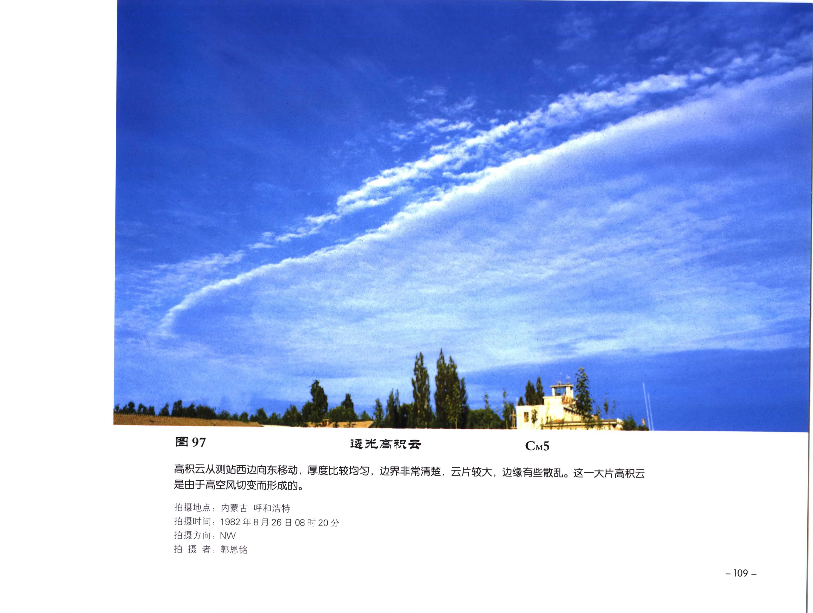

| 字段 | 内容 |
| --- | --- |
| 图号 | 图 97 |
| 拍摄地点 | 内蒙古 呼和浩特 |
| 拍摄时间 | 1982年8月26日08时20分 |
| 拍摄方向 | ，NW |

### OCR 文本

```text
图 97 透光高积云

高积云从测站西边向东移动，厚度比较均匀，边界非常清楚，云片较大，边缘有些散乱。这一大片高积云
是由于高空风切变而形成的。

拍摄地点: 内蒙古 呼和浩特
拍摄时间: 1982年8月26日08时20分
拍摄方向，NW

拍 RH. WBS

- 109 -
```

## 图 98

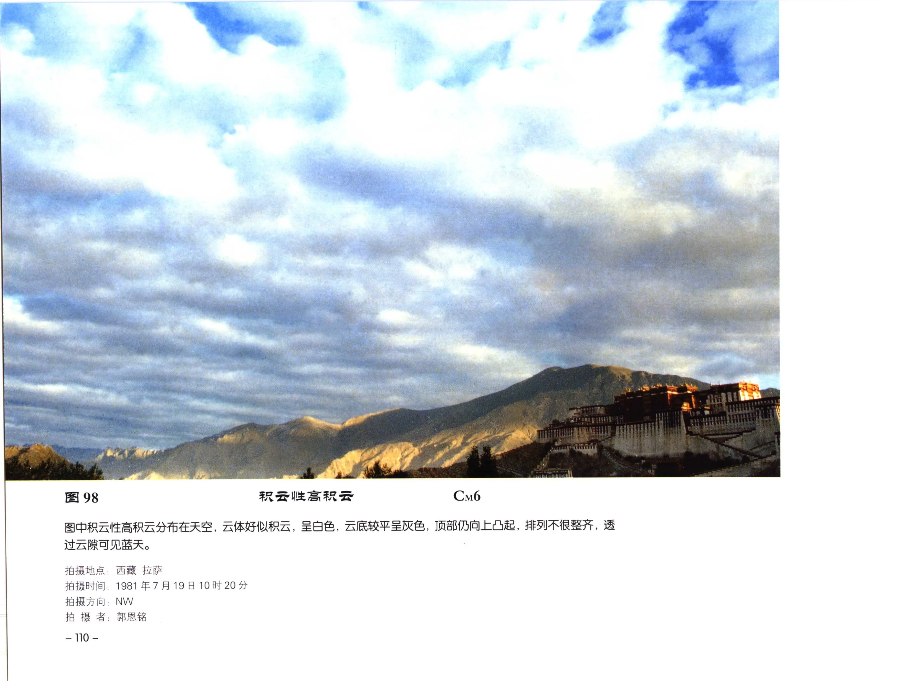

| 字段 | 内容 |
| --- | --- |
| 图号 | 图 98 |
| 拍摄地点 | 西藏 拉萨 |
| 拍摄时间 | 1981年7月19日10时20分 |
| 拍摄方向 | ，NW |
| 拍摄者 | ，郭因铭 |

### OCR 文本

```text
图 98 积云性高积云 CM0

图中积云性高积云分布在天空，云体好似积云，呈白色, 云底较平呈有灰色，顶部仍向上吓起,排列不很整齐，透
过云孙可见蓝天。

拍摄地点: 西藏 拉萨

拍摄时间: 1981年7月19日10时20分

拍摄方向，NW

拍 摄 者，郭因铭

-110-
```

## PDF 第 123 页

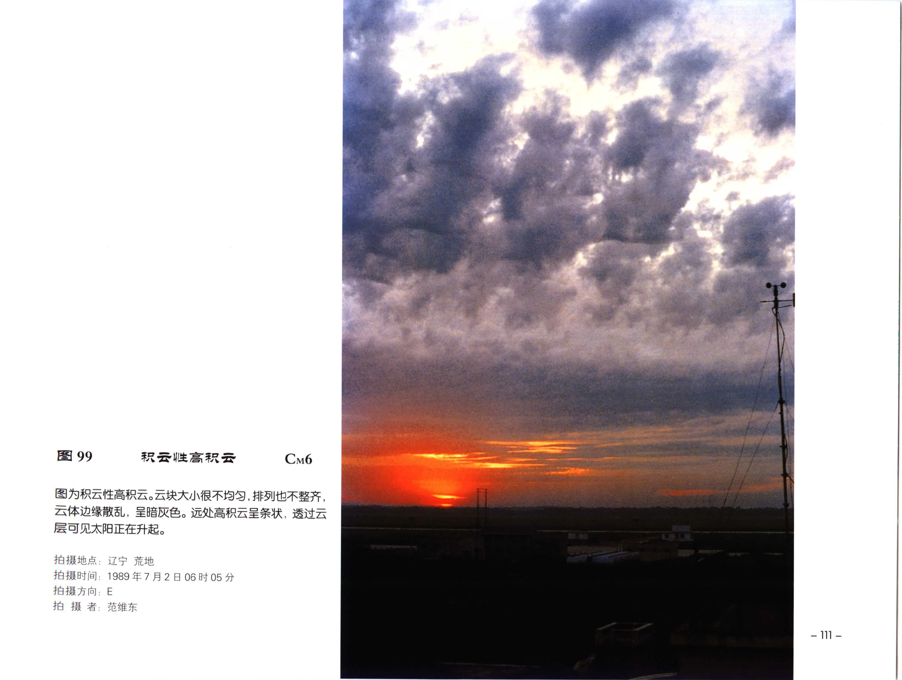

| 字段 | 内容 |
| --- | --- |
| 拍摄地点 | ; 辽宁 荒地 |
| 拍摄时间 | 1989年7月2日06时05分 |
| 拍摄方向 | ; E |
| 拍摄者 | 范维东 |

### OCR 文本

```text
ARE Cm6

tt}

 99 FRE

图为积云性高积云。云块大小很不均匀 ,排列也不整齐，
云体边缘散乱，呈暗灰色。远处高积云呈条状，透过云
层可见太阳正在升起。

拍摄地点; 辽宁 荒地

拍摄时间: 1989年7月2日06时05分
拍摄方向; E

拍 摄 者: 范维东

-111-
```

## 图 100

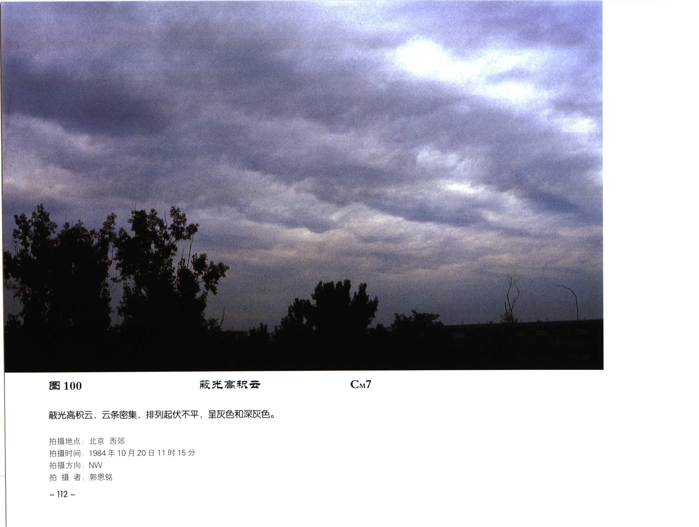

| 字段 | 内容 |
| --- | --- |
| 图号 | 图 100 |
| 拍摄地点 | 拍摄时间 |
| 拍摄时间 | 拍摄方向: |
| 拍摄方向 | 拍 摄 者; |
| 拍摄者 | ; |

### OCR 文本

```text
图 100

蔽光高积云，云条密集，排列起伏不平，呈灰色和

拍摄地点:
拍摄时间
拍摄方向:
拍 摄 者;

-112-

北京 西郊

1984年 10 月
NW
郭恩铭

20日11时15分
```

## PDF 第 125 页

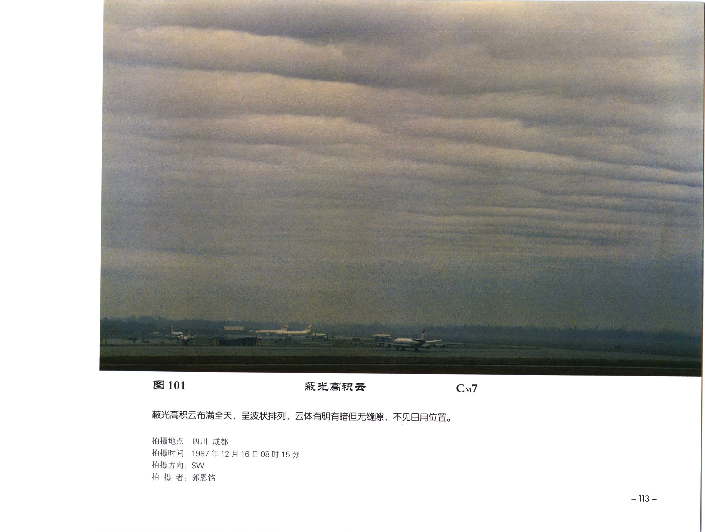

| 字段 | 内容 |
| --- | --- |
| 拍摄地点 | ; 四川 成都 |
| 拍摄时间 | 1987年12月16日08时15分 |
| 拍摄方向 | ，SW |

### OCR 文本

```text
101 RARE CM7

贰光高积云布满全天，呈波状排列，云体有明有暗但无缝除，不见日月位置。

拍摄地点; 四川 成都

拍摄时间: 1987年12月16日08时15分
拍摄方向，SW

拍 摄 OS:
```

## 图 102

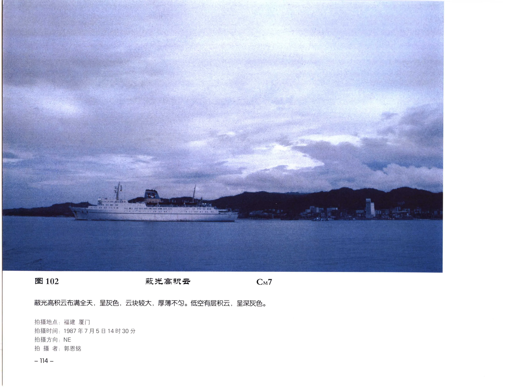

| 字段 | 内容 |
| --- | --- |
| 图号 | 图 102 |
| 拍摄地点 | 福建 厦门 |
| 拍摄时间 | 1987年7月5日14时30分 |
| 拍摄方向 | NE |

### OCR 文本

```text
图 102 RARE Cm7

蔽光高积云布满全天，呈灰色，云块较大，厚薄不勾。低空有层积云，呈深灰色。

拍摄地点: 福建 厦门

拍摄时间: 1987年7月5日14时30分
拍摄方向: NE

拍 摄 A. 郭恩铭

-114 -
```

## PDF 第 127 页

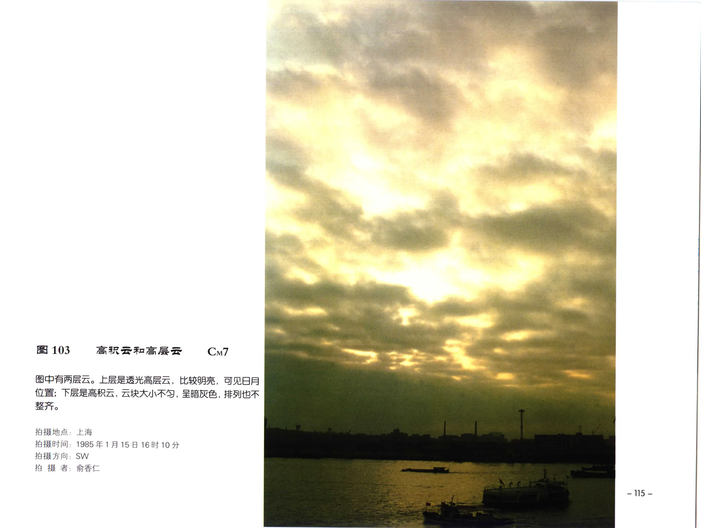

| 字段 | 内容 |
| --- | --- |
| 拍摄地点 | ， 上海 |
| 拍摄时间 | 1985年1月15日16时10分 |
| 拍摄方向 | ，SW |
| 拍摄者 | ; 俞香仁 |

### OCR 文本

```text
103 襄积云和高层云 CM7

图中有两层云。上层是透光高层云，比较明亮，可见日月
位置; 下层是高积云, GRANARY, SIME, 排列也不
整齐。

拍摄地点， 上海

拍摄时间: 1985年1月15日16时10分
拍摄方向，SW

拍 摄 者; 俞香仁

-115-
```

## 图 104

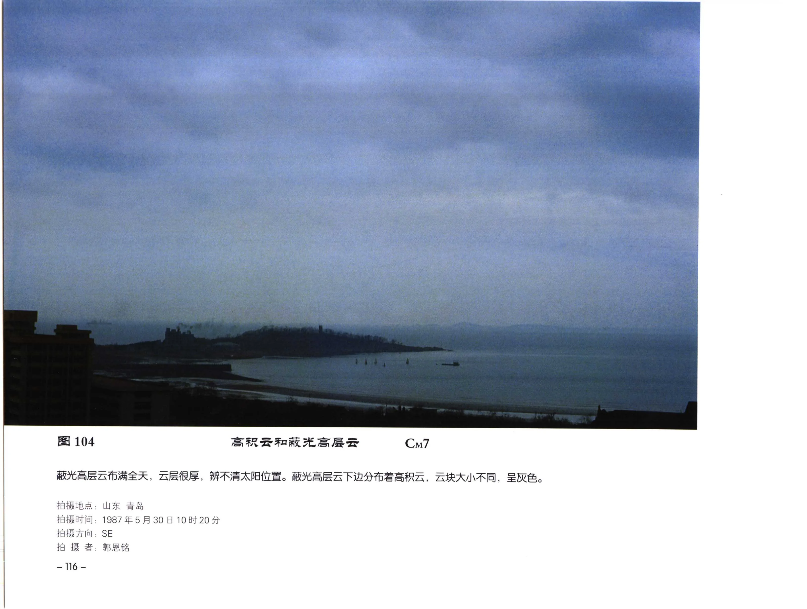

| 字段 | 内容 |
| --- | --- |
| 图号 | 图 104 |
| 拍摄地点 | 拍摄时间 : |
| 拍摄时间 | 拍摄方向: |
| 拍摄方向 | 拍 摄 者; |
| 拍摄者 | ; |

### OCR 文本

```text
图 104

蔽光高层云布满全天，云层很厚，辨不清太阳位置。蔽光高层云下边分布着高积云，云块大小不同，呈灰色。

拍摄地点:
拍摄时间 :
拍摄方向:
拍 摄 者;

— 116 -

山东 青岛
1987年5

郭恩铭

月 30

10 时 20 分

一

= FY

[S

EPRABRRS

Cm7
```

## 图 105

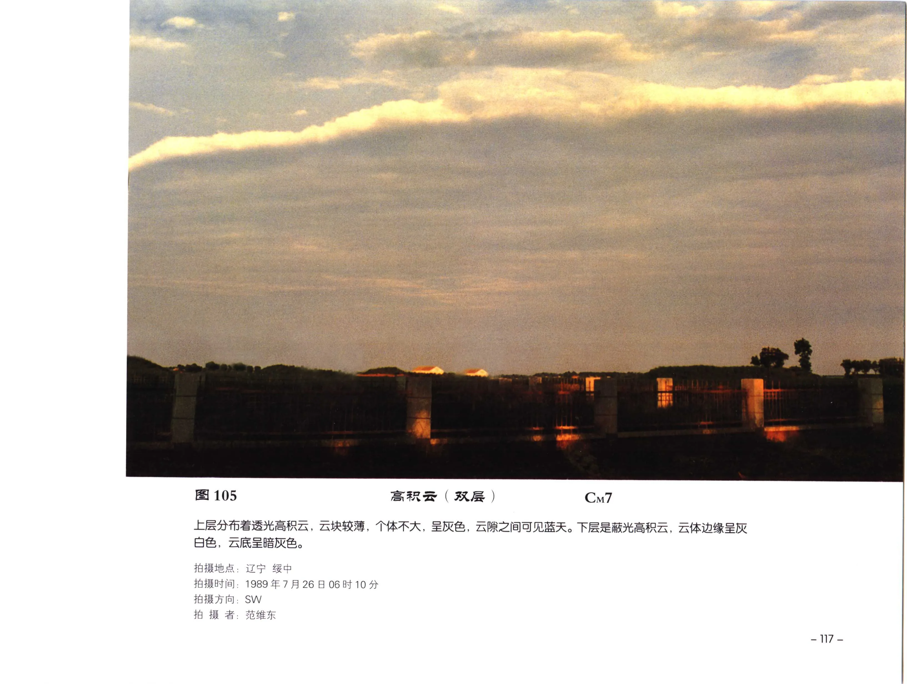

| 字段 | 内容 |
| --- | --- |
| 图号 | 图 105 |
| 拍摄地点 | 拍摄时间 |
| 拍摄时间 | 拍摄方向 |
| 拍摄方向 | 拍 摄 者 |

### OCR 文本

```text
图 105

高积云(双层 )

上层分布着透光高积云，云块较薄,个体不大，呈灰色,云隙之间可见蓝天。下层是蔽光高积云，云体边缘呈灰
Be, ARBRE.

拍摄地点:
拍摄时间
拍摄方向
拍 摄 者
```

## PDF 第 130 页 - Cul

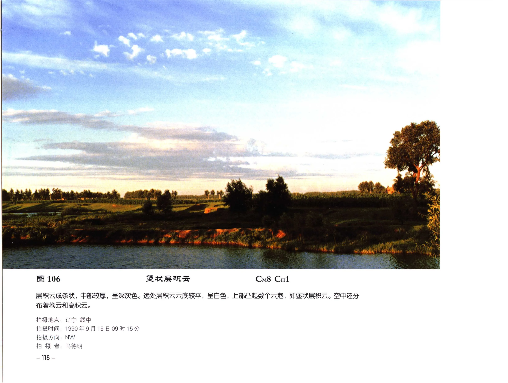

| 字段 | 内容 |
| --- | --- |
| 云类代码 | Cul |
| 拍摄地点 | ; 辽宁 绥中 |
| 拍摄时间 | 1990年9月15日09时15分 |
| 拍摄方向 | ，NW |

### OCR 文本

```text
E 106 ERERE Cm8 Cul

层积云成条状，中部较厚，呈深灰色。远处层积云云底较平，呈白色，上部凸起数个云泡，即堡状展积云。空中还分
布着卷云和高积云。

拍摄地点; 辽宁 绥中

拍摄时间: 1990年9月15日09时15分

拍摄方向，NW

jh 摄 者: 马德明

— 118 -
```

## 图 107

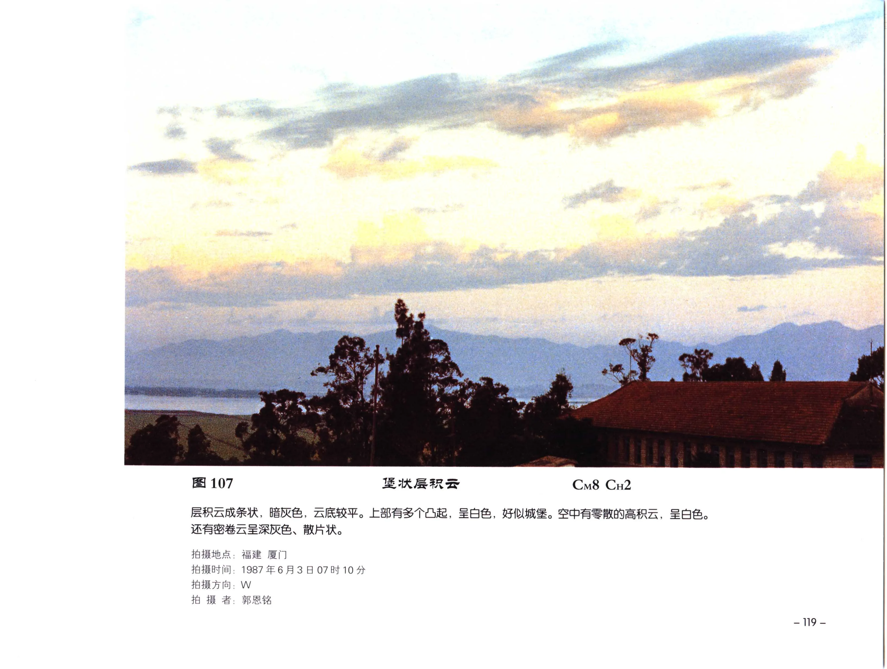

| 字段 | 内容 |
| --- | --- |
| 图号 | 图 107 |
| 拍摄地点 | 福建 厦门 |
| 拍摄时间 | 1987年6月3日07时10分 |
| 拍摄方向 | W |
| 拍摄者 | PBR |

### OCR 文本

```text
图 107 BRERE Cm8 CH2

BRORRK, ERE, GRRE. LRAST He, 266, HUME. SHHSANERG, SHC.
还有密卷云呈深灰色、散片状。

拍摄地点: 福建 厦门

拍摄时间: 1987年6月3日07时10分
拍摄方向: W

拍 摄 者: PBR

-119 -
```

## PDF 第 132 页

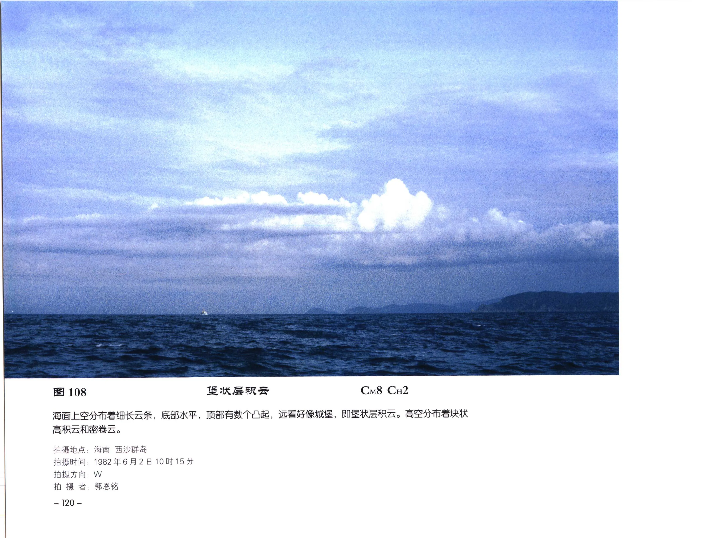

| 字段 | 内容 |
| --- | --- |
| 拍摄地点 | 拍摄时间] |
| 拍摄时间 | ] |
| 拍摄方向 | 拍 摄 者: |
| 拍摄者 | - 120 - |

### OCR 文本

```text
E 108

海面上空分布着细长云条，底部水平，顶部有数个凸起，远看好像城堡，即堡状展积云。高空分布着块状

高积云和密卷云。

拍摄地点:
拍摄时间]
拍摄方向:
拍 摄 者:

- 120 -

海

Ww
郭

本|

南 西沙群岛
1982年6月2日10时15分

恩铭

EEK RF Cm8 CH2
```

## 图 109

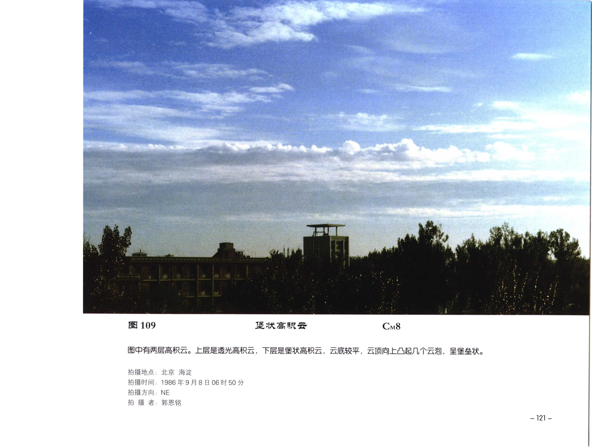

| 字段 | 内容 |
| --- | --- |
| 图号 | 图 109 |
| 拍摄地点 | 拍摄时间 : |
| 拍摄时间 | 拍摄方向: |
| 拍摄方向 | 拍 摄 者: |
| 拍摄者 | 北京 海淀 |

### OCR 文本

```text
图 109

图中有两层高积云。上层是透光高积云，下层是堡状高积云，云底较平，云顶向上凸起几个云光，呈堡垒状。

拍摄地点:
拍摄时间 :
拍摄方向:
拍 摄 者:

北京 海淀

1986年9月8
NE

郭恩铭

06 时 50 分

EK BRE

-121-
```

## 图 110

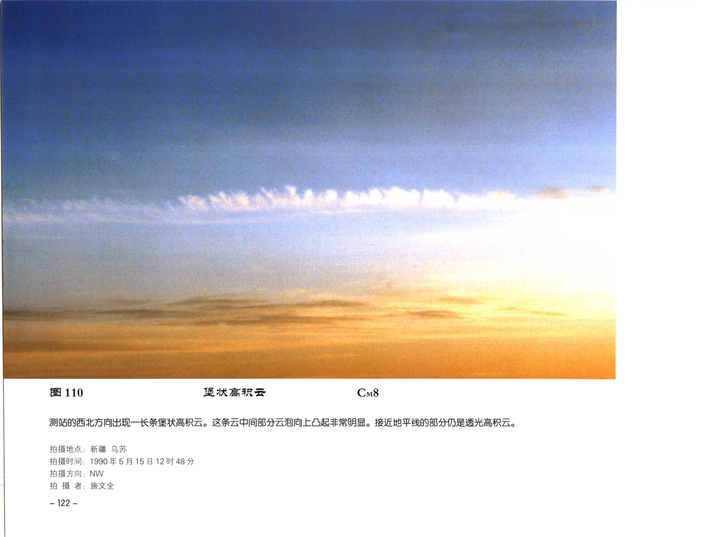

| 字段 | 内容 |
| --- | --- |
| 图号 | 图 110 |
| 拍摄地点 | ; 新疆 SH |
| 拍摄时间 | 1990年5月15日12时48分 |
| 拍摄方向 | ，NW |
| 拍摄者 | 施文全 |

### OCR 文本

```text
图 110 EBKBRE Cm8

测站的西北方向出现一长条堡状高积云。这条云中间部分云泡向上叫起非常明显。接近地平线的部分仍是透光高积云。

拍摄地点; 新疆 SH

拍摄时间: 1990年5月15日12时48分
拍摄方向，NW

拍 摄 者: 施文全

- 122 -
```

## 图 111

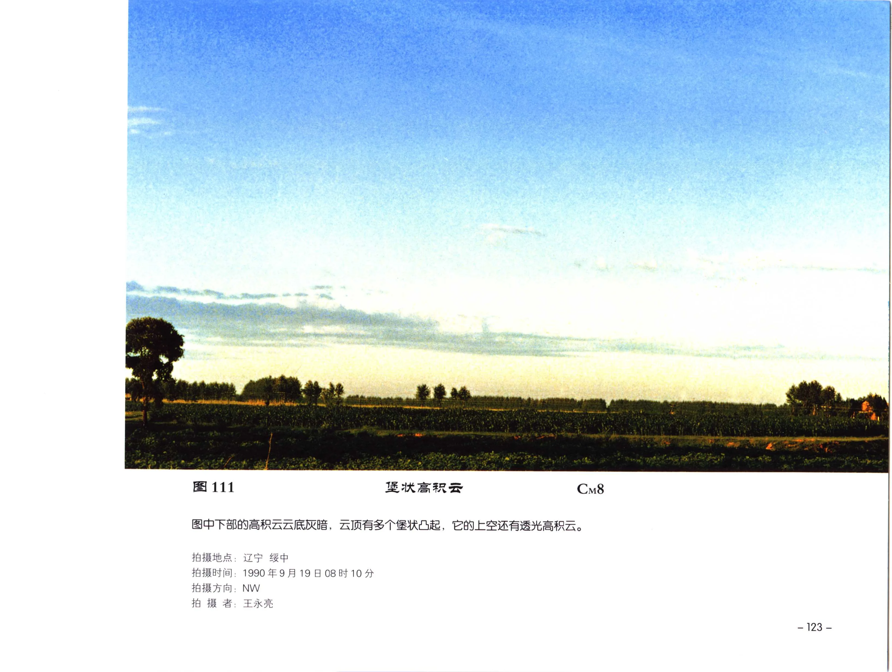

| 字段 | 内容 |
| --- | --- |
| 图号 | 图 111 |
| 拍摄地点 | 辽宁 绥中 |
| 拍摄时间 | 1990 年9 |
| 拍摄方向 | ，NVW |

### OCR 文本

```text
图 111

图中下部的高积云云底灰暗，云顶有多个堡状凹起，它的上空还有透光高积云。

拍摄地点: 辽宁 绥中

拍摄时间: 1990 年9
拍摄方向，NVW
拍 HOS. 王永亮

08 时 10 分

EKARE

- 123 -
```

## 图 112

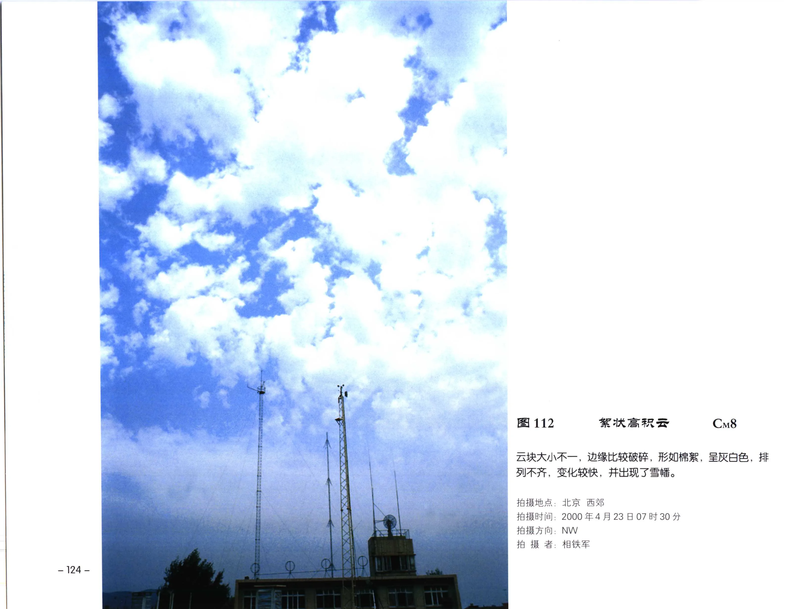

| 字段 | 内容 |
| --- | --- |
| 图号 | 图 112 |
| 拍摄地点 | 北京 西郊 |
| 拍摄时间 | 2000年4月23日07时30分 |
| 拍摄方向 | ，NW |

### OCR 文本

```text
图 112 ERBRE Cm8

云块大小不一，边缘比较破碎，形如棉花 ，呈有灰白色, 排
列不齐，变化较快，并出现了雪幅。

拍摄地点: 北京 西郊

拍摄时间: 2000年4月23日07时30分
拍摄方向，NW

拍 摄 A: HERS

-124 -
```

## 图 113

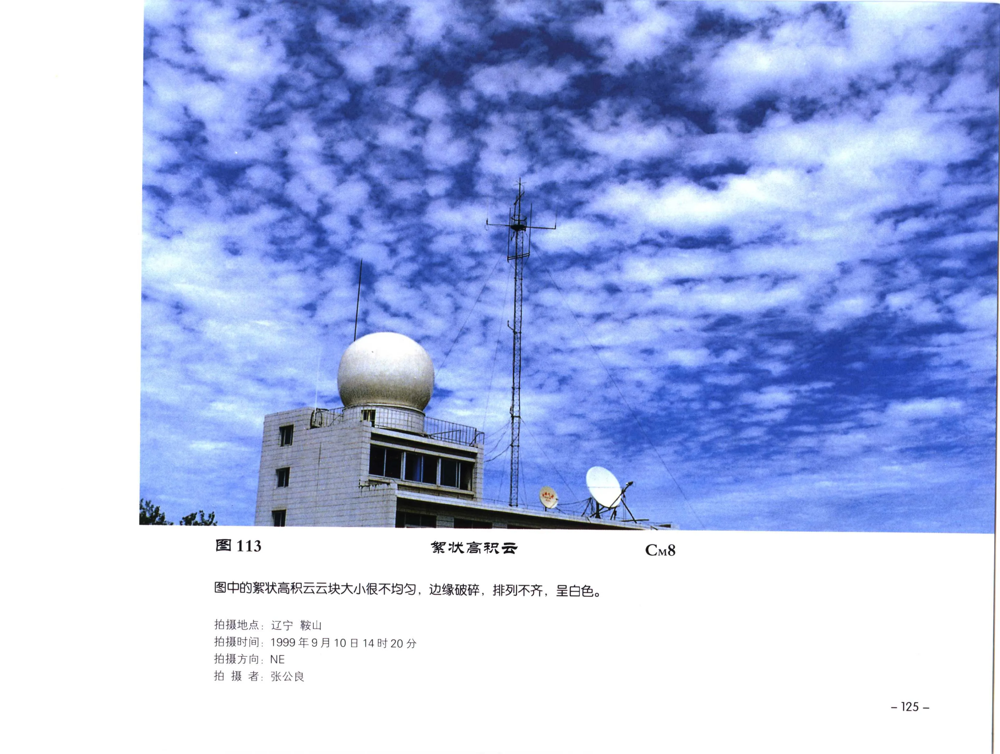

| 字段 | 内容 |
| --- | --- |
| 图号 | 图 113 |
| 拍摄地点 | 辽宁 鞍山 |
| 拍摄时间 | 1999年9月10日14时20分 |
| 拍摄方向 | ，NE |
| 拍摄者 | ; 张公良 |

### OCR 文本

```text
rere)

图 113 RKBRE Cm8

图中的蔡状高积云云块大小很不均匀，边缘破碎，排列不齐，呈白色。

拍摄地点: 辽宁 鞍山

拍摄时间: 1999年9月10日14时20分
拍摄方向，NE

拍 摄 者; 张公良
```

## 图 114

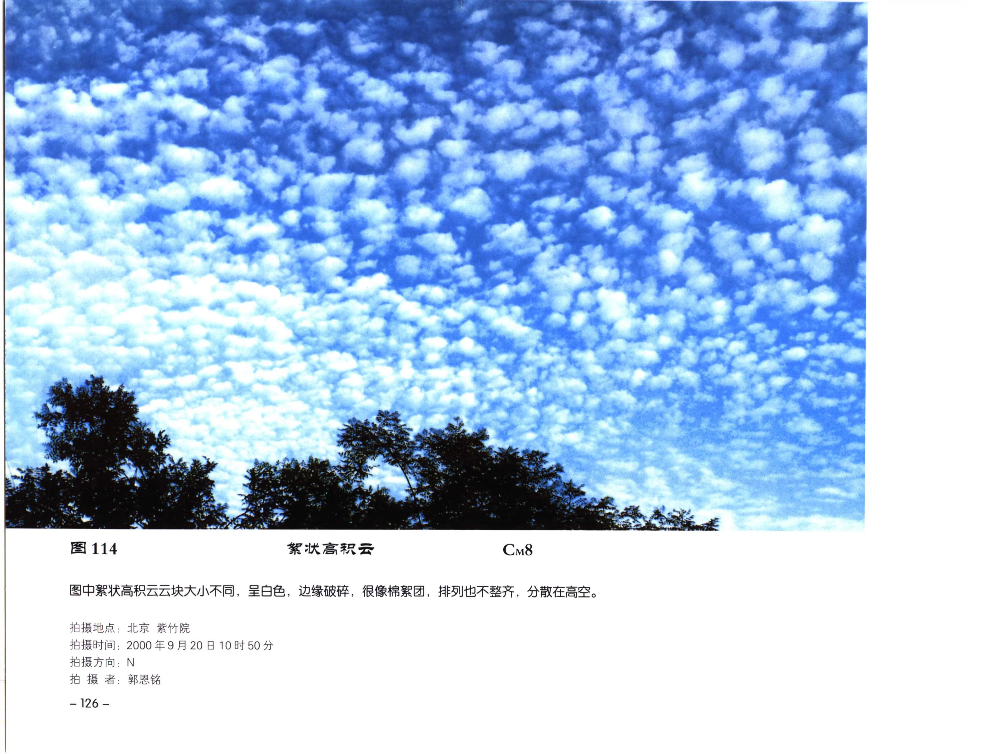

| 字段 | 内容 |
| --- | --- |
| 图号 | 图 114 |
| 拍摄地点 | 北京 紫竹院 |
| 拍摄时间 | 2000年9月20日10时50分 |
| 拍摄方向 | N |
| 拍摄者 | PRK |

### OCR 文本

```text
图114 ERKRBRA Cm8

BPRKRERGGRAIAG, SAG, Wik, RERRA, HIKE, DRESS.

拍摄地点: 北京 紫竹院

拍摄时间: 2000年9月20日10时50分
拍摄方向: N

拍 摄 者: PRK

一126 -
```

## PDF 第 139 页

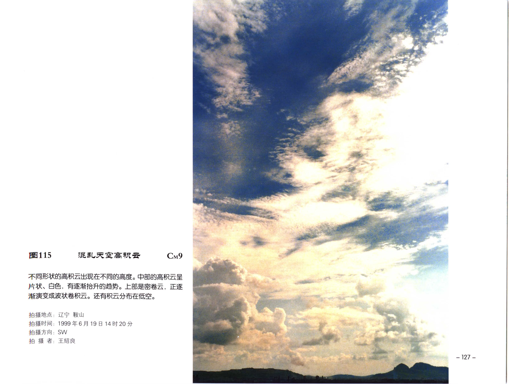

| 字段 | 内容 |
| --- | --- |
| 拍摄地点 | 辽宁 鞍山 |
| 拍摄时间 | 1999年6月19日14时20 分 |
| 拍摄者 | EAR |

### OCR 文本

```text
F115 RELRBAREA CM9

不同形状的高积云出现在不同的高度。中部的高积云呈
片状、白色，有逐渐抬升的趋势。上部是密卷云，正逐
渐演变成波状卷积云。还有积云分布在低空。

拍摄地点: 辽宁 鞍山

拍摄时间: 1999年6月19日14时20 分
HBA: SW

拍 摄 者: EAR

一127 -
```

## PDF 第 140 页

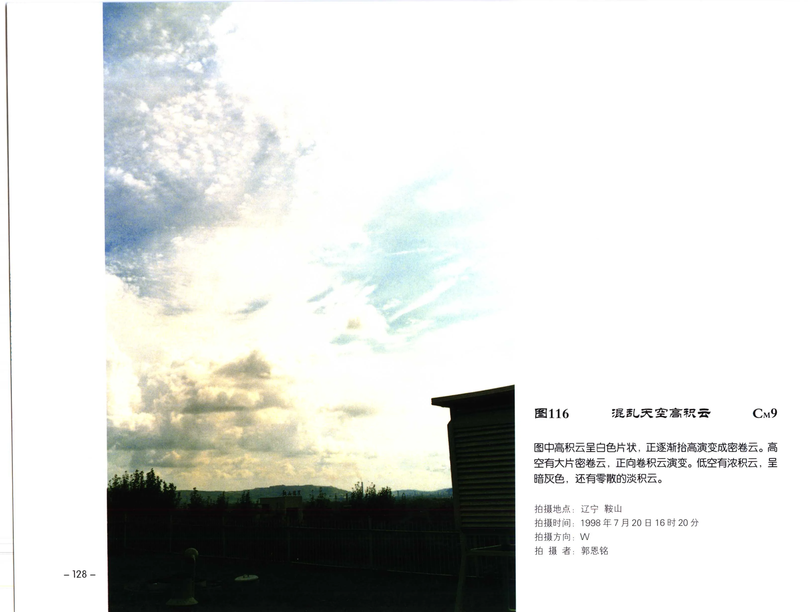

| 字段 | 内容 |
| --- | --- |
| 拍摄地点 | 辽宁 RW |
| 拍摄时间 | 1998年7月20日16时20分 |
| 拍摄方向 | W |

### OCR 文本

```text
21116 RELA ARE Cm9

BPERESHCAK, ISPS RRMBSo.
空有大片密卷云，正向卷积云演变。低空有浓积云，
暗灰色，还有零散的淡积云。

HO aot

拍摄地点: 辽宁 RW

拍摄时间: 1998年7月20日16时20分
拍摄方向: W

jh 摄 者: PBB

一128 -
```
