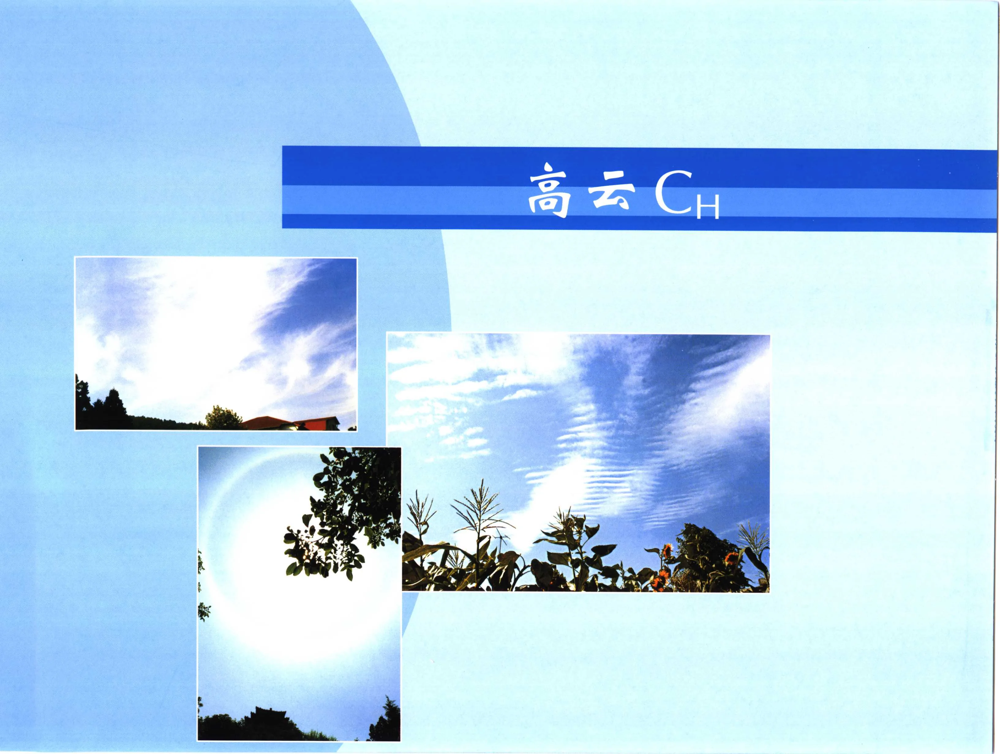

# 《中国云图》PDF 第 141-160 页

本页由扫描版 PDF 自动提取生成。每个条目保留原页图像，并附 OCR 文本供检索和后续校订。

## PDF 第 141 页



!!! note "OCR 状态"
    本页暂未识别出可靠文本，保留原页图像。

## PDF 第 142 页


!!! note "OCR 状态"
    本页暂未识别出可靠文本，保留原页图像。

## 图 117


| 字段 | 内容 |
| --- | --- |
| 图号 | 图 117 |
| 拍摄地点 | 拍摄时间 : |
| 拍摄时间 | 拍摄方向: |
| 拍摄方向 | 拍 te 者: |

### OCR 文本

```text
图 117

白色、明亮带有卷曲和平直丝缕结构的云片是毛卷云，分布在蓝蓝的天空。

拍摄地点:
拍摄时间 :
拍摄方向:
拍 te 者:

辽宁 wp

1991年9
SW
郭恩铭

A

10 BY 10 分

-131-
```

## 图 118


| 字段 | 内容 |
| --- | --- |
| 图号 | 图 118 |
| 拍摄地点 | 辽宁 鞍山 |
| 拍摄时间 | 1999年6月20日06时20分 |
| 拍摄方向 | E |

### OCR 文本

```text
es

wali, wy.

图 118 EAD CaHl

毛卷云的毛丝般纤维结构非常明显，呈马尾状分布在高空。在天边还有密卷云。

拍摄地点: 辽宁 鞍山

拍摄时间: 1999年6月20日06时20分
拍摄方向: E

拍 摄 A. 张生利

一132 -
```

## 图 119


| 字段 | 内容 |
| --- | --- |
| 图号 | 图 119 |
| 拍摄地点 | 拍摄时间 : |
| 拍摄时间 | 江西 庐山 |
| 拍摄方向 | ，W |

### OCR 文本

```text
图 119

毛卷云颜色洁白，呈丝条状，好似羽毛，云片中部稍厚。

拍摄地点:
拍摄时间 :

江西 庐山
2000年10月21

拍摄方向，W

拍 te 者:

FB ES

08 时 20 分
```

## 图 120


| 字段 | 内容 |
| --- | --- |
| 图号 | 图 120 |
| 拍摄地点 | 新疆 乌鲁木齐 |
| 拍摄时间 | 1982年1月4日10时50 分 |
| 拍摄方向 | S |

### OCR 文本

```text
图 120 LAE

毛卷云云丝近似乎行排列，颜色洁白，呈丝条状。云片中部较厚，但其边缘毛丝般纤维结构十分清晰，地面树枝上有雾准。

拍摄地点: 新疆 乌鲁木齐

拍摄时间: 1982年1月4日10时50 分
拍摄方向: S

拍 tk 者: 郭恩铭

i
```

## PDF 第 147 页 - Cu1


| 字段 | 内容 |
| --- | --- |
| 云类代码 | Cu1 |
| 拍摄地点 | 吉林 长白山天池 |
| 拍摄时间 | 1985年9月15日15时50分 |
| 拍摄方向 | ，NE |
| 拍摄者 | SWB |

### OCR 文本

```text
121 ERE Cu1

图中上部是毛卷云，毛丝般纤维结构明显，呈白色。中部是长条状密卷云云条较厚。在山峰背面是高
积云，云顶起伏不平，呈白色。

拍摄地点: 吉林 长白山天池

拍摄时间: 1985年9月15日15时50分
拍摄方向，NE

拍 摄 者: SWB

- 135 -
```

## 图 122 - Cul


| 字段 | 内容 |
| --- | --- |
| 图号 | 图 122 |
| 云类代码 | Cul |
| 拍摄地点 | 内蒙古 呼和浩特 |
| 拍摄时间 | 1980年8月20日18时20分 |
| 拍摄方向 | ， NE |

### OCR 文本

```text
ae

图 122 LAE Cul

毛卷云排列成行，形如羽毛，边缘毛丝般纤维结构非常明显，颜色洁白。低空有零散的淡积云。

拍摄地点: 内蒙古 呼和浩特

拍摄时间: 1980年8月20日18时20分
拍摄方向， NE

jh 摄 者: WB

- 136 -
```

## 图 123


| 字段 | 内容 |
| --- | --- |
| 图号 | 图 123 |
| 拍摄地点 | 北京 香山植物园 |
| 拍摄时间 | 2001年11月2日10时15分 |
| 拍摄方向 | ，N |

### OCR 文本

```text
图 123

毛卷云分散在高空，丝缕般结构明显，由于高空风速较大，致使云体显得散乱。天边处还有几片密卷云。

拍摄地点: 北京 香山植物园
拍摄时间: 2001年11月2日10时15分
拍摄方向，N

拍 HRS. ERK

— 137 -
```

## 图 124


| 字段 | 内容 |
| --- | --- |
| 图号 | 图 124 |
| 拍摄地点 | 拍摄时间 : |
| 拍摄时间 | 拍摄方向: |
| 拍摄方向 | 拍 摄 者: |
| 拍摄者 | — 138 - |

### OCR 文本

```text
图 124

毛卷云云丝洁白, BURR, 纤维结构清晰。受高空气流的作用，毛卷云下部边缘成驱形。低空有淡积云

和浓积云。
拍摄地点

拍摄时间 :

拍摄方向:

拍 摄 者:

— 138 -

西藏 定日

1981年6月25日11时45分
NE

郭恩铭
```

## PDF 第 151 页


| 字段 | 内容 |
| --- | --- |
| 拍摄地点 | ; 辽宁 Ah |
| 拍摄时间 | 1991年9月6日10时30分 |

### OCR 文本

```text
125 BAD CH2

密卷云云块厚密，呈团状、片状，颜色洁白，边缘毛丝
般纤维结构清晰可见。天边有成片的密卷云。

拍摄地点; 辽宁 Ah

拍摄时间: 1991年9月6日10时30分
1B Al. W

拍 4h 者;: BBA

- 139 -
```

## PDF 第 152 页


| 字段 | 内容 |
| --- | --- |
| 拍摄地点 | ; 北京 颐和园 |
| 拍摄时间 | 2000年8月10日14时10分 |
| 拍摄方向 | ; NE |

### OCR 文本

```text
-140-

 126 BBE CH2

密卷去边缘毛丝般结构清晰，云块厚密不很均久， 上边
云块较大，下边云块较小，有逐渐融合的趋势。

拍摄地点; 北京 颐和园

拍摄时间: 2000年8月10日14时10分
拍摄方向; NE

fo 摄 者: 郭恩铭
```

## 图 127


| 字段 | 内容 |
| --- | --- |
| 图号 | 图 127 |
| 拍摄地点 | 拍摄时间 ; |
| 拍摄时间 | ; |
| 拍摄方向 | 拍 摄 者: |
| 拍摄者 | 辽宁 绥中 |

### OCR 文本

```text
图 127

早晨密卷云分散在东方，云块大小很不均匀，日出时薄的云块被映照成红色，厚的云块呈瞳灰色。

拍摄地点:
拍摄时间 ;
拍摄方向:
拍 摄 者:

辽宁 绥中
1989年7月20
E

ia}

了恩铭

hk

日05时55分

由

-141-
```

## 图 128


| 字段 | 内容 |
| --- | --- |
| 图号 | 图 128 |
| 拍摄地点 | 辽宁 鞍山 |
| 拍摄时间 | 2000年9月25日10时20分 |
| 拍摄方向 | ， NW |

### OCR 文本

```text
图 128 ES FEE CH2

三块比较厚密的密卷云分布在高空,密卷云正在降雪性。雪幅是固态降水粒子 kes, Se) 从云中
降落而成。雪幅降落后，母体云块随即将消散。

拍摄地点: 辽宁 鞍山

拍摄时间: 2000年9月25日10时20分

拍摄方向， NW

拍 RS: PBR

-142-
```

## PDF 第 155 页


| 字段 | 内容 |
| --- | --- |
| 拍摄地点 | 北京 香山植物园 |
| 拍摄时间 | 2001年4月25日10时40 分 |
| 拍摄方向 | ，NE |
| 拍摄者 | ，郭恩铭 |

### OCR 文本

```text
N

‘ ‘

CH2

 129 RARE

密卷云边缘毛丝般纤维结构非常清晰，云块中部较厚，呈白色。

拍摄地点: 北京 香山植物园

拍摄时间: 2001年4月25日10时40 分
拍摄方向，NE

拍 摄 者，郭恩铭

-143 -
```

## 图 130


| 字段 | 内容 |
| --- | --- |
| 图号 | 图 130 |
| 拍摄地点 | 江西 庐山 |
| 拍摄时间 | 2000 4 |
| 拍摄方向 | ，W |
| 拍摄者 | KS |

### OCR 文本

```text
图 130

昌色密卷云呈长条形，

块组合成的长条形密卷云，毛丝般结构不明显。

拍摄地点: 江西 庐山

拍摄时间: 2000 4
拍摄方向，W

拍 摄 者 KS
-144 -

E10

| 23

09 BY 30 分

CH2

平行排列在高空，边缘毛丝般纤维结构清晰可辨。图中下部是多个云
```

## 图 131


| 字段 | 内容 |
| --- | --- |
| 图号 | 图 131 |
| 拍摄地点 | 西藏 拉萨 |
| 拍摄时间 | 1981年6月14日18时20分 |
| 拍摄方向 | ，N |
| 拍摄者 | 郭恩铭 |

### OCR 文本

```text
图 131 CH2
布达拉宫北部上空的片状密卷云， 边缘比较散乱，呈白色。密卷去有雪幅成条状下垂, 由于受沿山坡
抬升的气流影响未能继续下电，形似卷发。

拍摄地点: 西藏 拉萨

拍摄时间: 1981年6月14日18时20分
拍摄方向，N

拍 摄 者: 郭恩铭

-145-
```

## 图 132


| 字段 | 内容 |
| --- | --- |
| 图号 | 图 132 |
| 拍摄地点 | ;: 辽宁 锦西 |
| 拍摄时间 | 1981年8月5日05时40分 |
| 拍摄方向 | E |
| 拍摄者 | ; SB |

### OCR 文本

```text
图 132 IS FRE CH2

cal

图中的密卷云呈辐转状移入测站上空。云条较厚密，被朝霞映照呈红黄色，透过云条空隙可见蓝灰色天空。

拍摄地点;: 辽宁 锦西

拍摄时间: 1981年8月5日05时40分
拍摄方向: E

拍 摄 者; SB

-146 -
```

## PDF 第 159 页


| 字段 | 内容 |
| --- | --- |
| 拍摄地点 | 北京 青龙湖 |
| 拍摄时间 | 2002年4月28日11时10分 |
| 拍摄方向 | ，N |

### OCR 文本

```text
i ask ceca

EI 133 BAD CH3

图中是逐渐脱高积雨云主体的码状伪卷云，呈灰白色，随着高空气流由西北向东南方向移动。

拍摄地点: 北京 青龙湖

拍摄时间: 2002年4月28日11时10分
拍摄方向，N

拍 HA. 郭恩铭

-147-
```

## 图 134


| 字段 | 内容 |
| --- | --- |
| 图号 | 图 134 |
| 拍摄地点 | ; 黑龙江 哈尔滨 |
| 拍摄时间 | 1982年7月20日14时30分 |
| 拍摄方向 | ，NE |
| 拍摄者 | BAB |

### OCR 文本

```text
(ERP ee + Sasa i; . et = <
‘ 了 国= — al :
é , a= ‘

#

图 134 BAS CH3

雷阵雨过后的积雨云逐渐消散, 它的砧状部分刚刚脱离母体，沿高空气流向前伸展演变成伪卷云，云体边
缘毛丝般纤维结构不太清晰，呈灰白色。

拍摄地点; 黑龙江 哈尔滨

拍摄时间: 1982年7月20日14时30分
拍摄方向，NE

拍 摄 者: BAB

一148 -
```
