# 《中国云图》PDF 第 181-200 页

本页由扫描版 PDF 自动提取生成。每个条目保留原页图像，并附 OCR 文本供检索和后续校订。

## 图 155


| 字段 | 内容 |
| --- | --- |
| 图号 | 图 155 |
| 拍摄地点 | ; 辽宁 Be |
| 拍摄时间 | 2000年6月5日09时10分 |
| 拍摄方向 | NE |

### OCR 文本

```text
图 155 AIRE CH9

图中右侧上部是受高空气流波动的影响, 由密卷云演变而成的波状卷积云。左侧上部密卷云呈片状，
而下部的密卷云则形似波浪。

拍摄地点; 辽宁 Be

拍摄时间: 2000年6月5日09时10分
拍摄方向: NE

拍 A. 郭恩铭

- 169 -
```

## 图 156


| 字段 | 内容 |
| --- | --- |
| 图号 | 图 156 |
| 拍摄地点 | 拍摄时间 : |
| 拍摄时间 | 拍摄方向: |
| 拍摄方向 | 拍 摄 者: |
| 拍摄者 | : 北京 紫竹院 |

### OCR 文本

```text
- 170 -

图 156

BIRE

CH9

密卷云扩展演变而成卷积云，呈白色，波状排列。

拍摄地点

拍摄时间 :
拍摄方向:
拍 摄 者:

: 北京 紫竹院

2001年6月

15

SW
郭恩铭

08时15分
```

## 图 157


| 字段 | 内容 |
| --- | --- |
| 图号 | 图 157 |
| 拍摄地点 | 拍摄时间 : |
| 拍摄时间 | 拍摄方向: |
| 拍摄方向 | 拍 摄 者 |
| 拍摄者 | 北京 西郊 |

### OCR 文本

```text
图 157

图中的卷积云是由密卷云演变而成，云块较小，密集成群。右上边卷积云排列呈波状，左边是密卷云。

拍摄地点
拍摄时间 :
拍摄方向:
拍 摄 者

北京 西郊

1982 年8 月

NE

FB BLES,

19 BY 20 分

-W7-
```

## PDF 第 184 页


| 字段 | 内容 |
| --- | --- |
| 拍摄地点 | 北京 顺义 |
| 拍摄时间 | 2003年4月20日10时20分 |
| 拍摄方向 | ，NW |
| 拍摄者 | 郭恩铭 |

### OCR 文本

```text
158 BRE CH9

图中卷积云呈鱼鳞片状，它是由密卷云演变而成。右侧仍是密卷云。

拍摄地点: 北京 顺义

拍摄时间: 2003年4月20日10时20分
拍摄方向，NW

拍 摄 者 郭恩铭

-172 -
```

## PDF 第 185 页

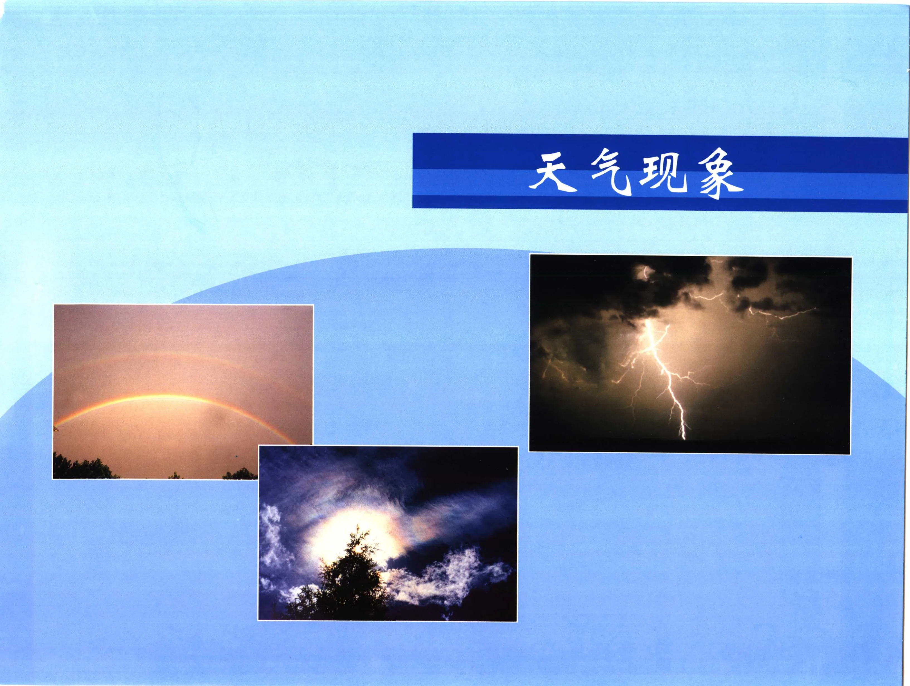

!!! note "OCR 状态"
    本页暂未识别出可靠文本，保留原页图像。

## PDF 第 186 页


!!! note "OCR 状态"
    本页暂未识别出可靠文本，保留原页图像。

## 图 159

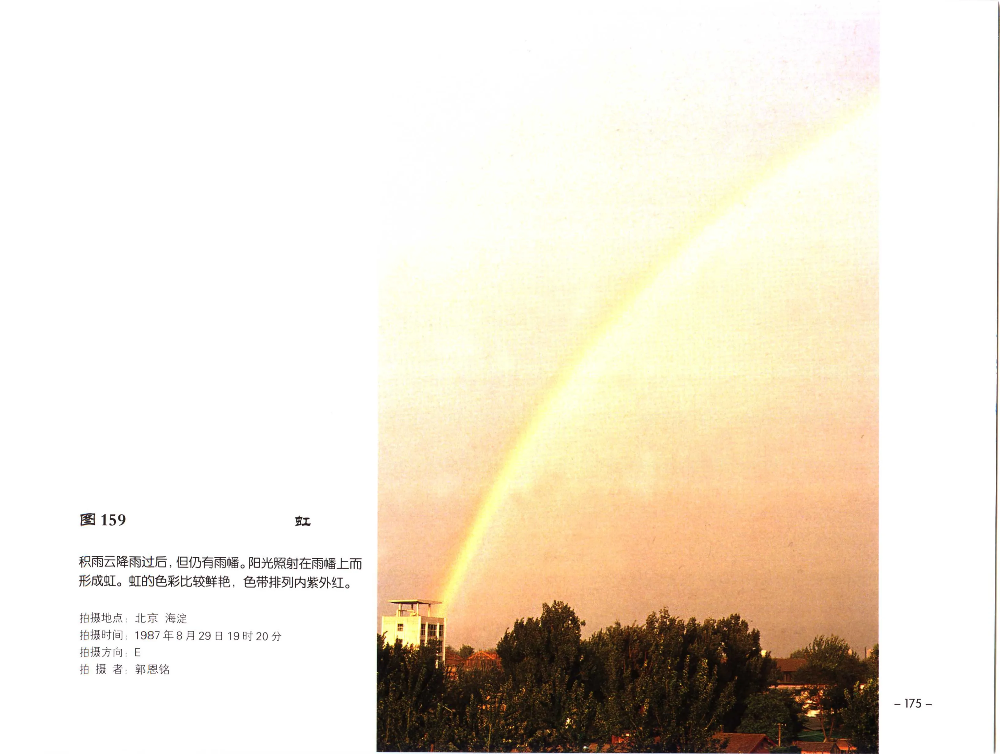

| 字段 | 内容 |
| --- | --- |
| 图号 | 图 159 |
| 拍摄地点 | 北京 海淀 |
| 拍摄时间 | 1987年8月29日19时20分 |
| 拍摄方向 | E |
| 拍摄者 | ;郭恩铭 |

### OCR 文本

```text
图159 BI

只雨去降雨过后, (EID ARS . RES HRSITENSIS Lit
形成虹。虹的色彩比较鲜艳，色带排列内紫外红。

拍摄地点: 北京 海淀

拍摄时间: 1987年8月29日19时20分
拍摄方向: E

拍 摄 者;郭恩铭

-175 -
```

## 图 160


| 字段 | 内容 |
| --- | --- |
| 图号 | 图 160 |
| 拍摄地点 | 拍摄时间 : |
| 拍摄时间 | 拍摄方向: |
| 拍摄方向 | 拍 摄 者: |
| 拍摄者 | - 176 - |

### OCR 文本

```text
图 160

积雨云主体已移出测站, 但云的后部仍在下雨, 由于雨滴对阳光的折射和反射作用而形成内紫外红的

虹与内红外紫的霓。

拍摄地点:
拍摄时间 :
拍摄方向:
拍 摄 者:

- 176 -

北京 五塔寺

1987年9月20日19时30分
E

郭恩铭
```

## 图 161

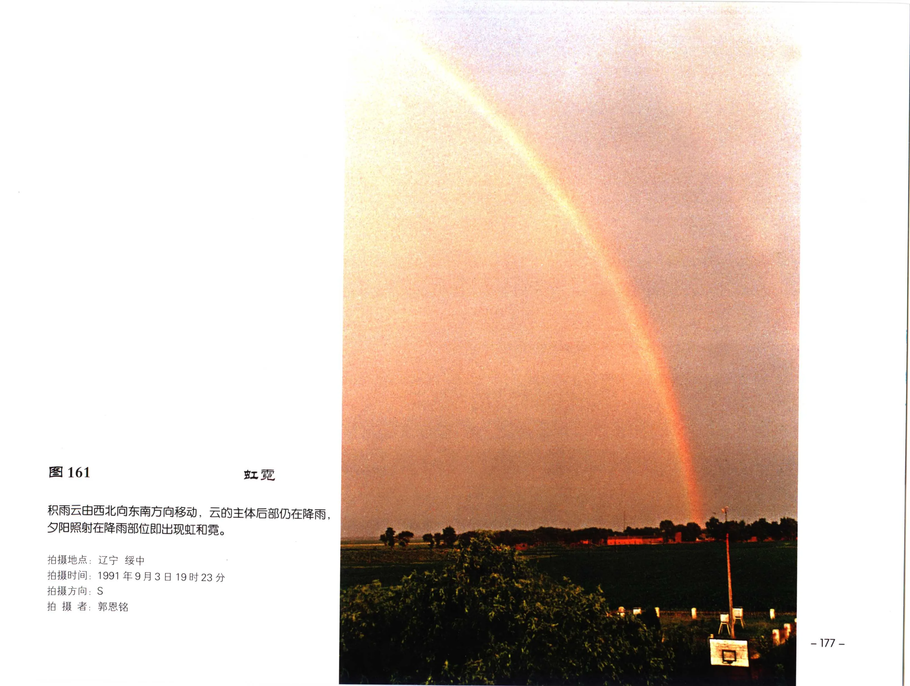

| 字段 | 内容 |
| --- | --- |
| 图号 | 图 161 |
| 拍摄地点 | 拍摄时间 ; |
| 拍摄时间 | ; |
| 拍摄方向 | S |

### OCR 文本

```text
图 161

只雨云由西北向东南方向移动，云的主体后部仍在降雨，

夕阳照射在降雨部位即出现虹和需。

拍摄地点:
拍摄时间 ;

辽宁 绥中

1991年9月3日

拍摄方向: S

拍 ik 者:

郭恩铭

19 时 23 :分

-177 -
```

## 图 162

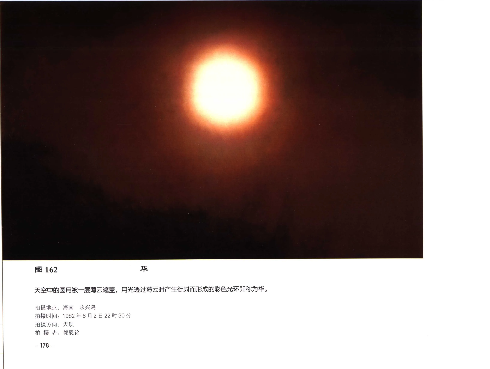

| 字段 | 内容 |
| --- | --- |
| 图号 | 图 162 |
| 拍摄地点 | 海南 “永兴岛 |
| 拍摄时间 | 1982年6月2日22时30分 |
| 拍摄方向 | AM |

### OCR 文本

```text
图 162

天空中的圆月被一层薄云遮盖，月光透过薄云时产生衍射而形成的彩色光环即称为华。

拍摄地点: 海南 “永兴岛

拍摄时间: 1982年6月2日22时30分
拍摄方向: AM

拍 RA. MAB

— 178 -
```

## 图 163

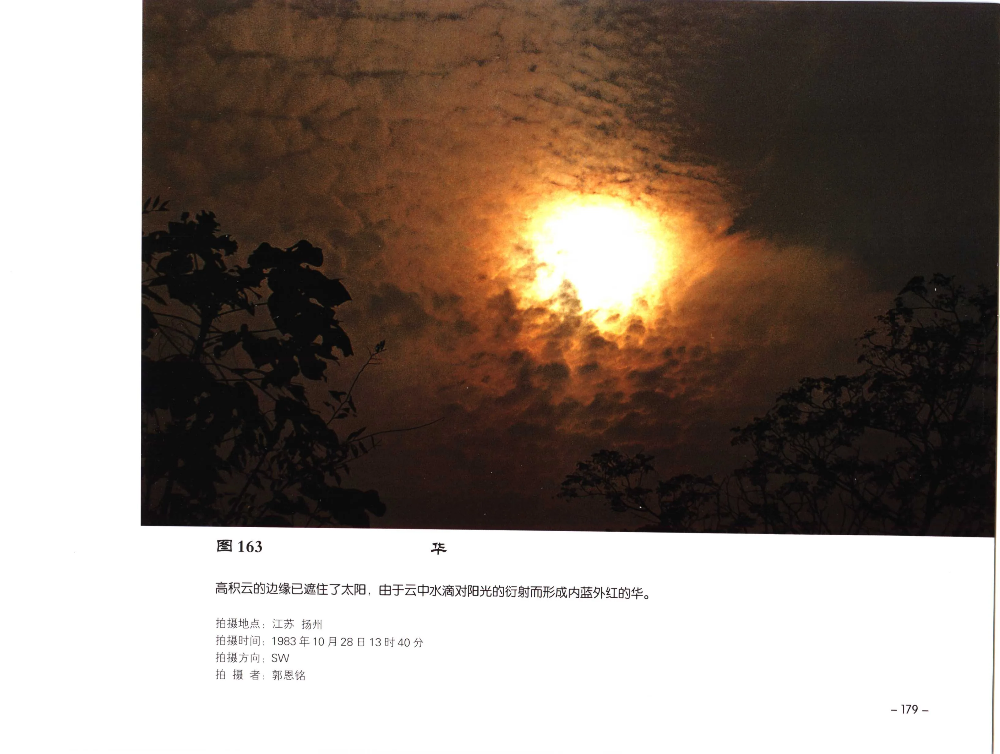

| 字段 | 内容 |
| --- | --- |
| 图号 | 图 163 |
| 拍摄地点 | 江苏 扬州 |
| 拍摄时间 | 1983年10月28日13时40分 |
| 拍摄方向 | SW |
| 拍摄者 | RAS |

### OCR 文本

```text
图 163

高积云的边缘已庶住了太阳，由于云中水滴对阳光的衍射而形成内蓝外红的华。

拍摄地点: 江苏 扬州

拍摄时间: 1983年10月28日13时40分
拍摄方向: SW

拍 摄 者: RAS
```

## 图 164

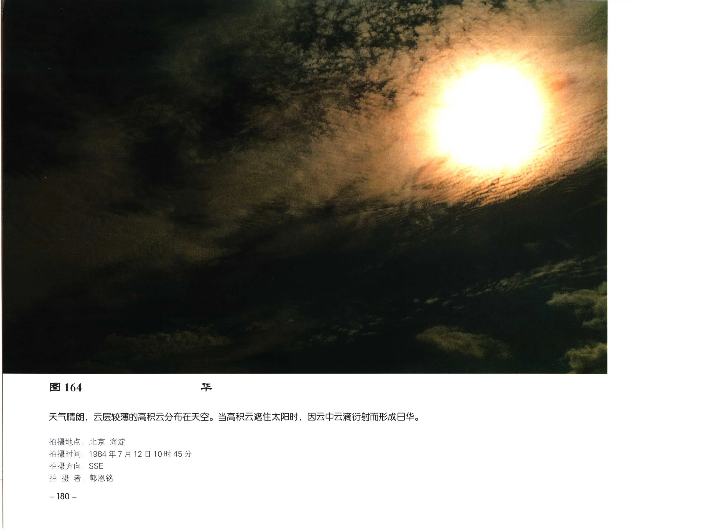

| 字段 | 内容 |
| --- | --- |
| 图号 | 图 164 |
| 拍摄地点 | 北京 海淀 |
| 拍摄时间 | 1984年7月12日10时45分 |
| 拍摄方向 | ， SSE |
| 拍摄者 | ; 郭恩铭 |

### OCR 文本

```text
图 164

天和气有晴朗，云层较薄的高积云分布在天空。当高积云广住太阳时，因云中云滴衍射而形成日华。

拍摄地点: 北京 海淀

拍摄时间: 1984年7月12日10时45分
拍摄方向， SSE

拍 摄 者; 郭恩铭

— 180 -
```

## PDF 第 193 页

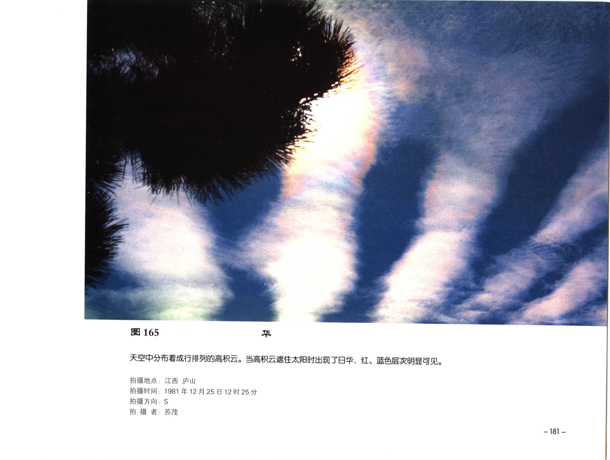

| 字段 | 内容 |
| --- | --- |
| 拍摄地点 | 拍摄时间 |
| 拍摄时间 | 拍摄方向: |
| 拍摄方向 | 拍 摄 者; |
| 拍摄者 | ; |

### OCR 文本

```text
165

天空中分布着成行排列的高积云。当高积云遮住太阳时出现了日华，

拍摄地点:
拍摄时间
拍摄方向:
拍 摄 者;

江西 庐山
1981年12月25日12时25分
S

PIX

红、蓝色层次明显可见。

-181-
```

## 图 166

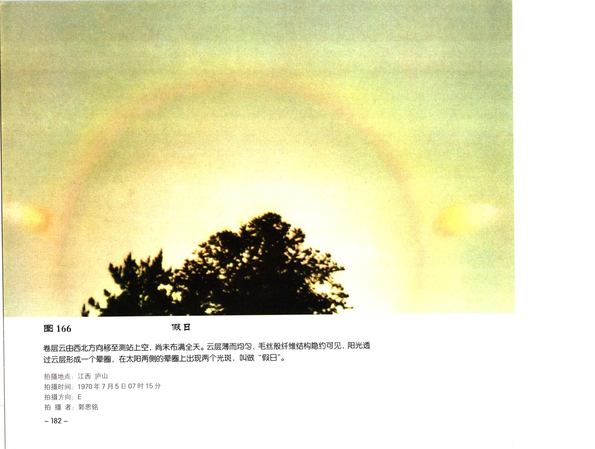

| 字段 | 内容 |
| --- | --- |
| 图号 | 图 166 |
| 拍摄地点 | 江西 庐山 |
| 拍摄时间 | 1970年7月5日07时15分 |
| 拍摄方向 | E |
| 拍摄者 | MAK |

### OCR 文本

```text
图 166 假日

卷层云由西北方向移至测站上空, 尚未布满全天。云层薄而均匀，毛丝般纤维结构隐约可见，阳光透
过云层形成一个晕圈，在太阳两侧的晕圈上出现两个光斑，叫做“假日 。

拍摄地点: 江西 庐山

拍摄时间: 1970年7月5日07时15分

拍摄方向: E

拍 摄 者: MAK

— 182 -
```

## 图 167

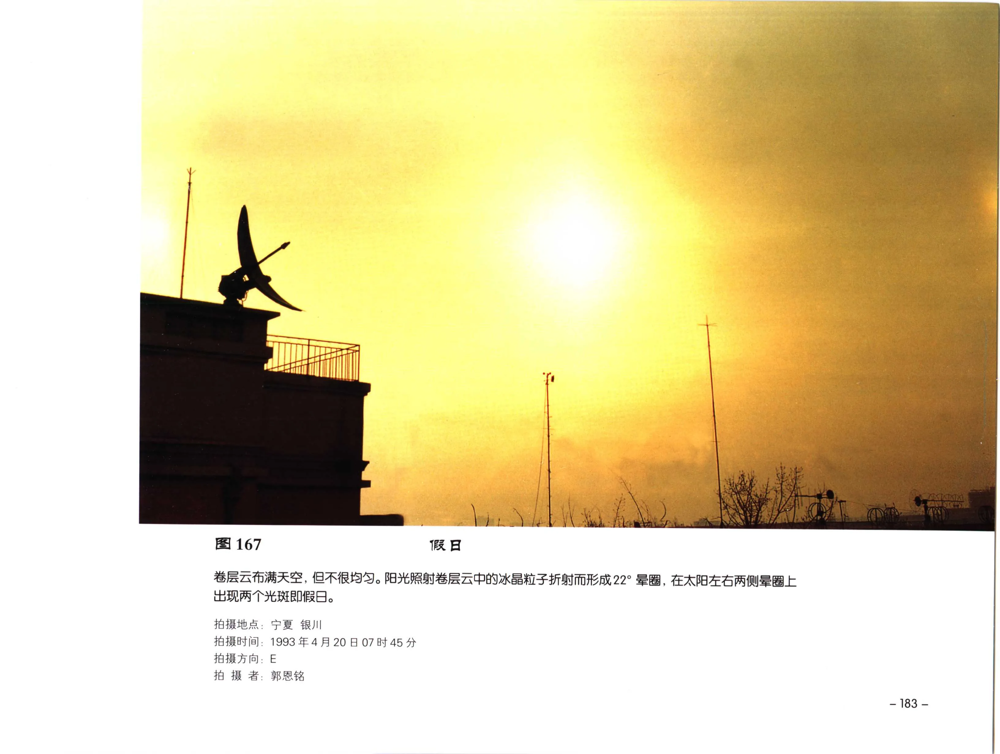

| 字段 | 内容 |
| --- | --- |
| 图号 | 图 167 |
| 拍摄地点 | 拍摄时间 . |
| 拍摄时间 | . |
| 拍摄方向 | ; |
| 拍摄者 | 宁夏 银川 |

### OCR 文本

```text
图 167

卷层云布满天空, 但不很均匀。阳光照射卷层云中的冰晶粒子折射而形成22。曼圈, 在太阳左右两侧晕圈上

出现两个光斑即假日。

拍摄地点:
拍摄时间 .
拍摄方向;
拍 摄 者:

宁夏 银川

1993 4 4 A 20 8
E
郭恩铭

07时45 分

- 183 -
```

## PDF 第 196 页

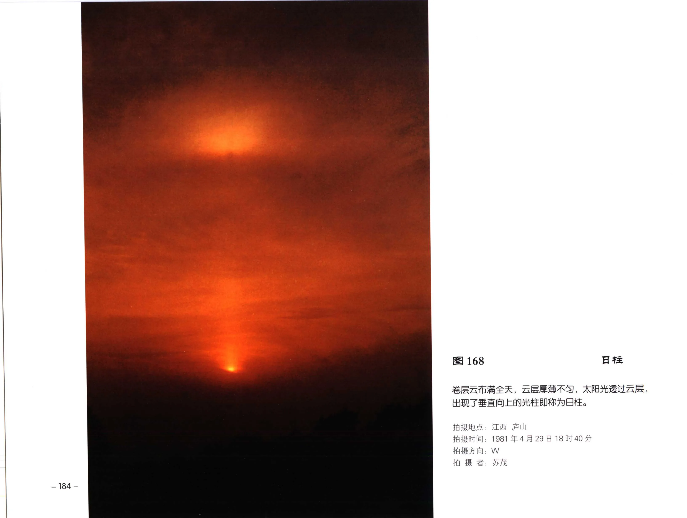

| 字段 | 内容 |
| --- | --- |
| 拍摄地点 | 江西 庐山 |
| 拍摄时间 | 1981年4月29日18时40分 |
| 拍摄方向 | W |
| 拍摄者 | ; 苏茂 |

### OCR 文本

```text
168 Bt

卷层云布满全天，云层厚薄不勾，太阳光透过云层，
出现了垂直向上的光柱即称为日柱。
拍摄地点: 江西 庐山

拍摄时间: 1981年4月29日18时40分

拍摄方向: W
拍 摄 者; 苏茂

-184-
```

## 图 169


| 字段 | 内容 |
| --- | --- |
| 图号 | 图 169 |
| 拍摄地点 | ; 北京 景山公园 |
| 拍摄时间 | 2002年5月6日12时15分 |
| 拍摄方向 | S |
| 拍摄者 | KBR |

### OCR 文本

```text
图 169 =z

薄幕卷层云布满全天，云层很薄，均久成
层。由于云中冰晶粒子对太阳光的折射和反
射作用, 出现了22” 早 圈，色带排列内红
外紫。

拍摄地点; 北京 景山公园

拍摄时间: 2002年5月6日12时15分
拍摄方向: S

拍 摄 者: KBR
```

## 图 170

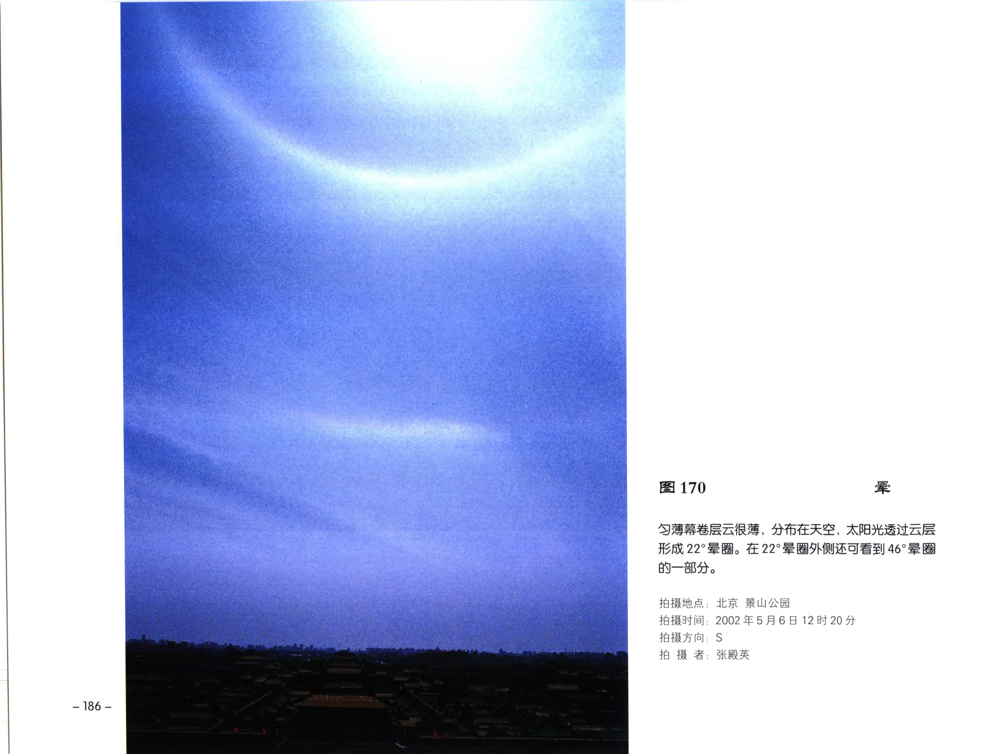

| 字段 | 内容 |
| --- | --- |
| 图号 | 图 170 |
| 拍摄地点 | 北京 景山公园 |
| 拍摄时间 | 2002年5月6 |
| 拍摄方向 | S |
| 拍摄者 | KERR |

### OCR 文本

```text
— 186 -

图 170

es

义薄幕卷层云很薄，分布在天空，太阳光透过云层
AZM 22°32. 16 22°S BI MUMIA Sl 46° =S

的一部分。

拍摄地点: 北京 景山公园

拍摄时间: 2002年5月6

拍摄方向: S
拍 摄 者: KERR

12 时 20 分
```

## 图 171

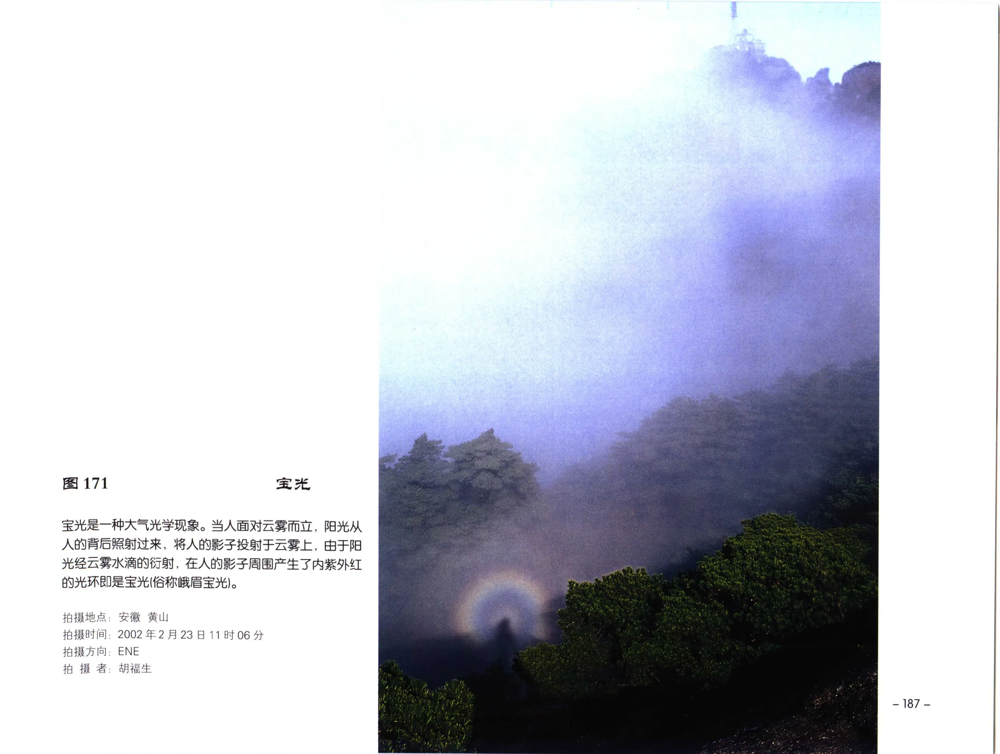

| 字段 | 内容 |
| --- | --- |
| 图号 | 图 171 |
| 拍摄地点 | 安徽 黄山 |
| 拍摄时间 | 2002年2月23日11时06分 |
| 拍摄方向 | ，ENE |
| 拍摄者 | 胡福生 |

### OCR 文本

```text
图171 宝光

宝光是一种大气光学现象。当人面对云雾而立，阳光从
人的背后照射过来，将人的影子投射于云雾上，由于阳
光经云雾水滴的衍射, 在人的影子周围产生了内紫外红
的光环即是宝光(俗称峨眉宝光)。

拍摄地点: 安徽 黄山

拍摄时间: 2002年2月23日11时06分
拍摄方向，ENE

拍 摄 者: 胡福生

- 187 -
```

## 图 172

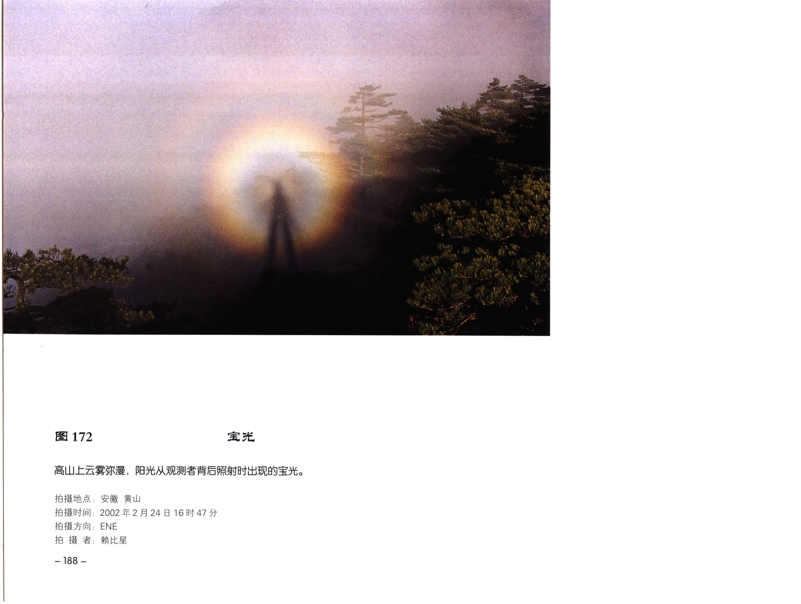

| 字段 | 内容 |
| --- | --- |
| 图号 | 图 172 |
| 拍摄地点 | ; 安徽 黄山 |
| 拍摄时间 | 2002年2月24日16时47分 |
| 拍摄方向 | ，ENE |
| 拍摄者 | 赖比星 |

### OCR 文本

```text
图 172 宝光

高山上云雳浆漫，阳光从观测者背后照射时出现的宝光。

拍摄地点; 安徽 黄山

拍摄时间: 2002年2月24日16时47分
拍摄方向，ENE

拍 摄 者: 赖比星

— 188 -
```
