# 《中国云图》PDF 第 201-220 页

本页由扫描版 PDF 自动提取生成。每个条目保留原页图像，并附 OCR 文本供检索和后续校订。

## 图 173

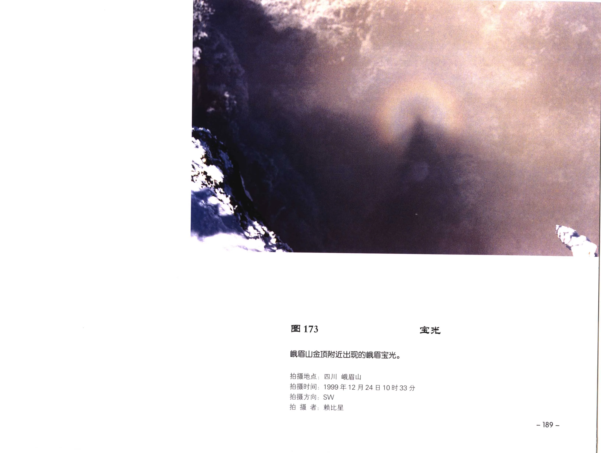

| 字段 | 内容 |
| --- | --- |
| 图号 | 图 173 |
| 拍摄地点 | 四川 峨眉山 |
| 拍摄时间 | 1999年12月24日10时33分 |
| 拍摄方向 | ，SW |

### OCR 文本

```text
图 173 宝光

峨届山金顶附近出现的峨眉宝光。

拍摄地点: 四川 峨眉山

拍摄时间: 1999年12月24日10时33分
拍摄方向，SW
拍 SPAS

- 189 -
```

## 图 174

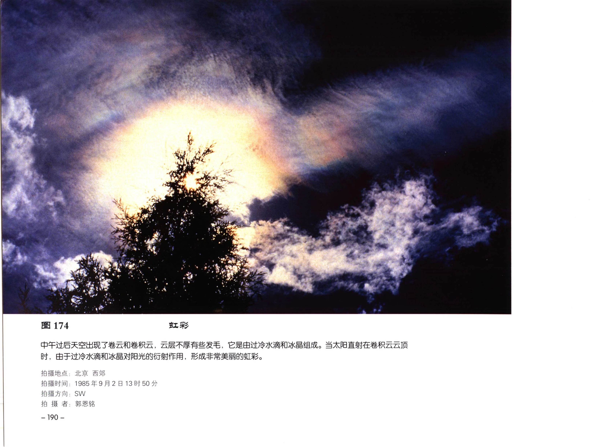

| 字段 | 内容 |
| --- | --- |
| 图号 | 图 174 |
| 拍摄地点 | 拍摄时间 : |
| 拍摄时间 | 拍摄方向: |
| 拍摄方向 | 拍 摄 者: |
| 拍摄者 | — 190 - |

### OCR 文本

```text
图174

中午过后天空出现了卷云和卷积云，云层不厚有些发毛，它是由过冷水滴和冰晶组成。当太阳直射在卷积云云顶
时，由于过冷水滴和冰晶对阳光的衍射作用，形成非常美丽的虹彩。

拍摄地点:
拍摄时间 :
拍摄方向:
拍 摄 者:

— 190 -

北京 西郊

1985年9月2
SW
郭恩铭

13 时 50 分
```

## 图 175

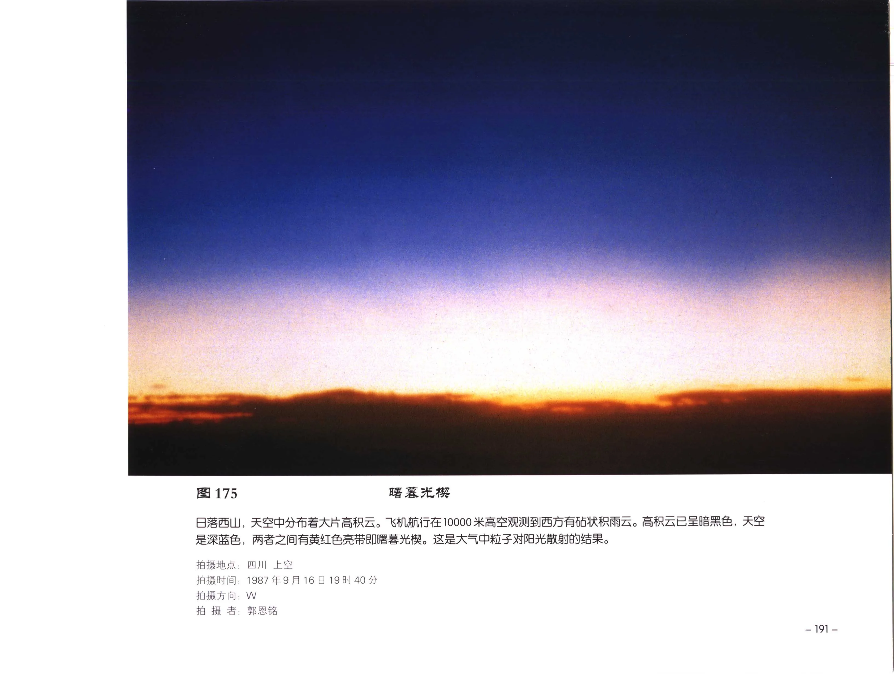

| 字段 | 内容 |
| --- | --- |
| 图号 | 图 175 |
| 拍摄地点 | 四川 |
| 拍摄时间 | 1987年9 月 |
| 拍摄方向 | ，W |

### OCR 文本

```text
图 175

目落西山,天空中分布着大片高积云。飞机航行在10000米高空观测到西方有砧状积雨云。高积云已呈暗黑色，天空
是深蓝色，两者之间有黄红色亮带即时暮光枫。这是大气中粒子对阳光散射的结果。

LPS
a es a

拍摄地点: 四川

拍摄时间: 1987年9 月

拍摄方向，W

fo 摄 者; FRB

19 时 40 分

BAR
```

## 图 176

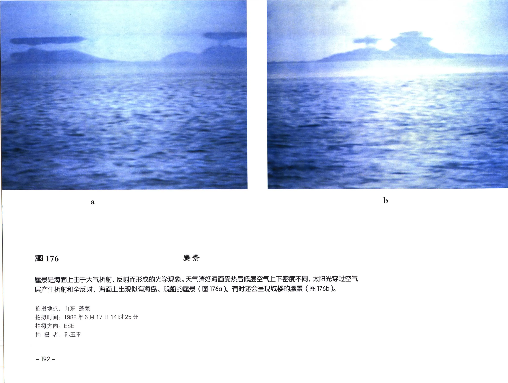

| 字段 | 内容 |
| --- | --- |
| 图号 | 图 176 |
| 拍摄地点 | 山东 ES |
| 拍摄时间 | 1988年6月17日14时25 分 |
| 拍摄方向 | ， ESE |
| 拍摄者 | ; 孙玉和平 |

### OCR 文本

```text
图 176 Re

感景是海面上由于大气折射、反射而形成的光学现象。天气睛好海面受热后低层空气上下密度不同, 太阳光穿过空气
层产生折射和全反射，海面上出现似有海岛、舰船的古景 ( 图 176a )。有时还会呈现城楼的古景 (图 176b )。

拍摄地点: 山东 ES

拍摄时间: 1988年6月17日14时25 分
拍摄方向， ESE

拍 摄 者; 孙玉和平

— 192 -
```

## 图 177

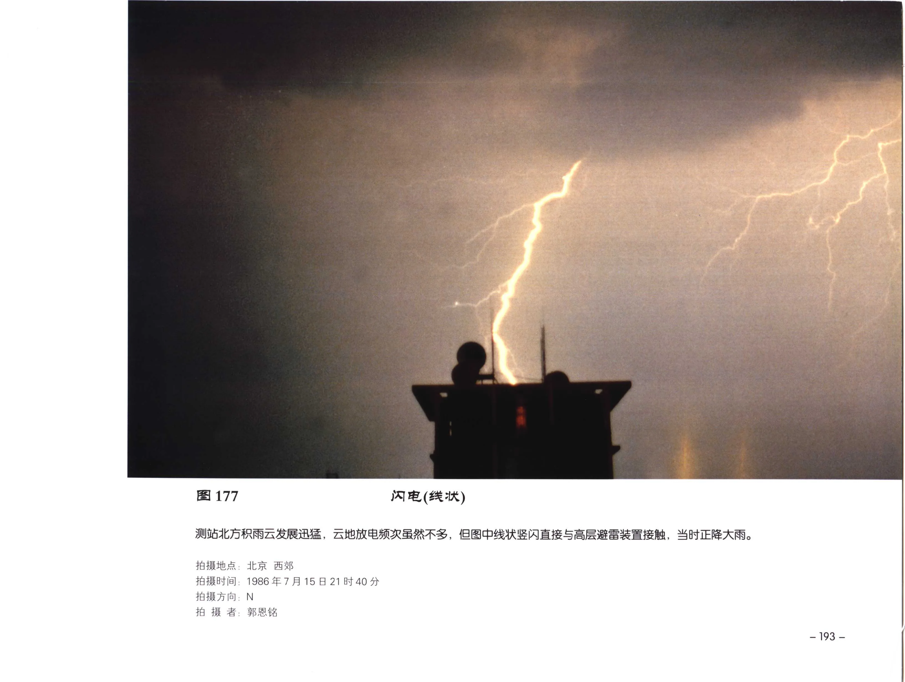

| 字段 | 内容 |
| --- | --- |
| 图号 | 图 177 |
| 拍摄地点 | ; 北京 西郊 |
| 拍摄时间 | 1986年7月15日21时40 分 |
| 拍摄方向 | ; N |

### OCR 文本

```text
图 177 闪电(线状)

测站北方积雨云发展迅邦，云地放电频次虽然不多，但图中线状竖闪直接与高层避雷装置接触，当时正降大雨。

拍摄地点; 北京 西郊

拍摄时间: 1986年7月15日21时40 分
拍摄方向; N

拍 HA. PAH
```

## 图 178

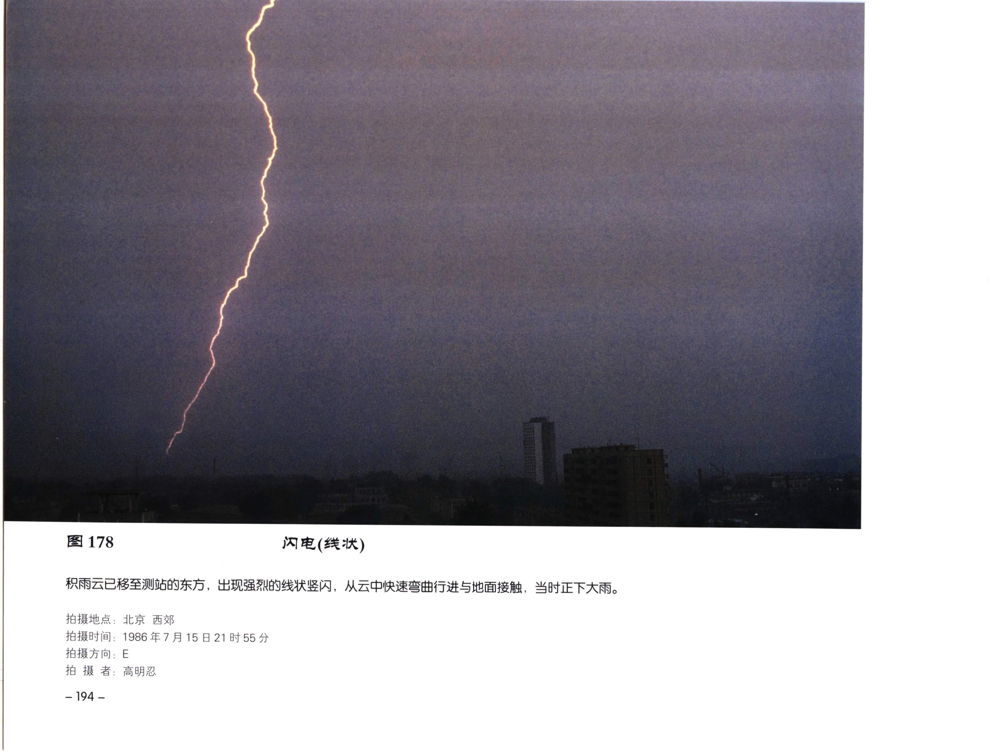

| 字段 | 内容 |
| --- | --- |
| 图号 | 图 178 |
| 拍摄地点 | ; 北京 西郊 |
| 拍摄时间 | 1986年7月15日21时55 分 |
| 拍摄方向 | E |
| 拍摄者 | ;高明忍 |

### OCR 文本

```text
图 178 闪电(线状)

只雨云已移至测站的东方，出现强烈的线状坚闪，从云中快速弯曲行进与地面接触，当时正下大雨。

拍摄地点; 北京 西郊

拍摄时间: 1986年7月15日21时55 分
拍摄方向 E

拍 摄 者;高明忍

~194-
```

## 图 179

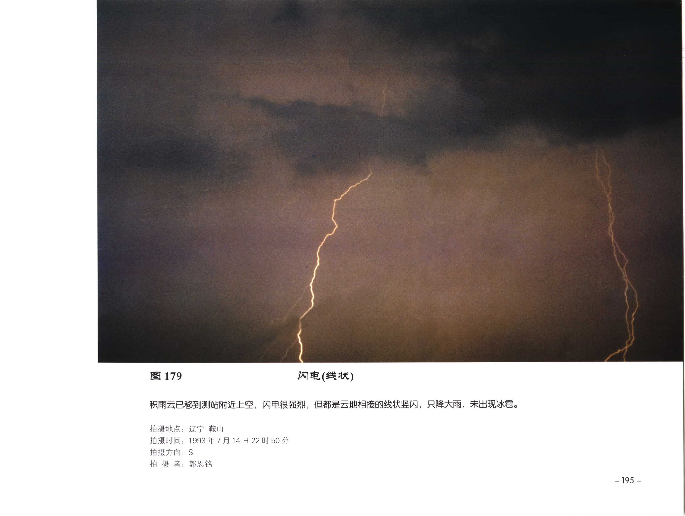

| 字段 | 内容 |
| --- | --- |
| 图号 | 图 179 |
| 拍摄地点 | ; 辽宁 鞍山 |
| 拍摄时间 | 1993年7月14日22时50 分 |
| 拍摄方向 | S |
| 拍摄者 | 郭思铭 |

### OCR 文本

```text
图 179 闪电(线状)

只雨云已移到测站附近上空，闪电很强烈，但都是云地相接的线状坚内，只降大雨，未出现冰雹。

拍摄地点; 辽宁 鞍山

拍摄时间: 1993年7月14日22时50 分
拍摄方向: S

拍 摄 者: 郭思铭
```

## 图 180

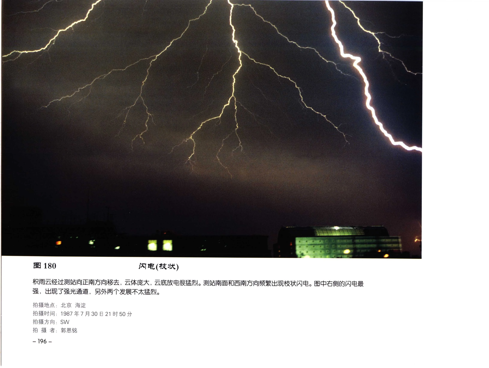

| 字段 | 内容 |
| --- | --- |
| 图号 | 图 180 |
| 拍摄地点 | ; 北京 海淀 |
| 拍摄时间 | 1987年7月30日21时50分 |
| 拍摄方向 | ，SW/ |

### OCR 文本

```text
图 180 IR) (AK AK)

积雨云经过测站向正南方向移去, 云体庞大, 云底放电很猛烈。测站南面和西南方向频繁出现枝状闪电。图中右侧的闪电最
强，出现了强光通道，另外两个发展不太猛烈。

拍摄地点; 北京 海淀

拍摄时间: 1987年7月30日21时50分
拍摄方向，SW/
拍 RS. PAS

-— 196 -
```

## 图 181

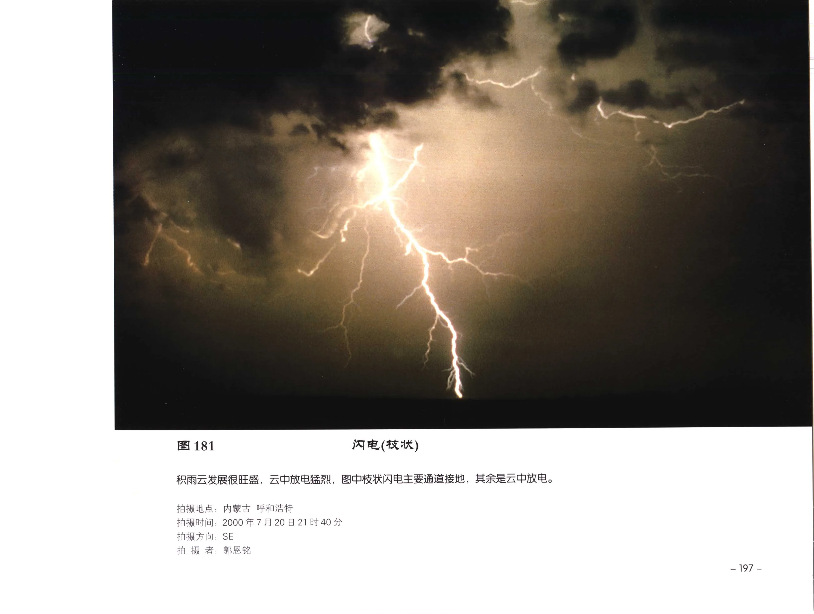

| 字段 | 内容 |
| --- | --- |
| 图号 | 图 181 |
| 拍摄地点 | 内蒙古 呼和浩特 |
| 拍摄时间 | 2000年7月20日21时40分 |
| 拍摄方向 | SE |

### OCR 文本

```text
图181 JX] BE (FAR AR)

积雨云发展很旺盛，云中放电猛烈，图中校状闪电主要通道接地 ，其余是云中放电。

拍摄地点: 内蒙古 呼和浩特

拍摄时间: 2000年7月20日21时40分
拍摄方向: SE

拍 摄 A: FOR
```

## 图 182

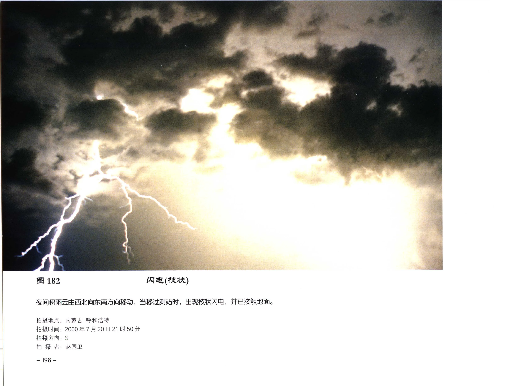

| 字段 | 内容 |
| --- | --- |
| 图号 | 图 182 |
| 拍摄地点 | 内蒙古 呼和浩特 |
| 拍摄时间 | 2000年7月20日21时50分 |
| 拍摄方向 | S |
| 拍摄者 | 赵 |

### OCR 文本

```text
图 182

夜间积雨云由西北向东南方向移动，当移过测站时，出现校状内电，并已接触地面。

拍摄地点: 内蒙古 呼和浩特
拍摄时间: 2000年7月20日21时50分

拍摄方向: S
拍 摄 者: 赵

— 198 -

国卫
```

## 图 183

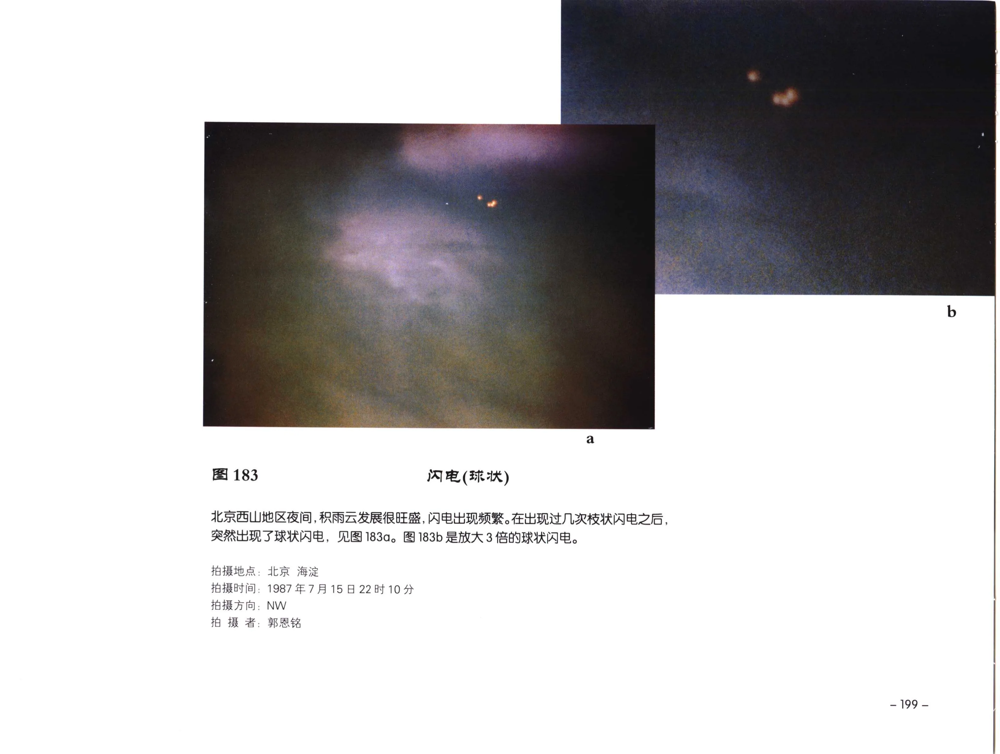

| 字段 | 内容 |
| --- | --- |
| 图号 | 图 183 |
| 拍摄地点 | 北京 海淀 |
| 拍摄时间 | 1987年7月15日22时10分 |
| 拍摄方向 | ，NW |
| 拍摄者 | 郭恩铭 |

### OCR 文本

```text
图183 闪电(球状)

北京西山地区夜间, 积雨云发展很旺盛, 闪电出现频繁。在出现过几次枝状闪电之后，
突然出现了球状内电，见图 1830。图 183b 是放大 3 倍的球状闪电。

拍摄地点: 北京 海淀

拍摄时间: 1987年7月15日22时10分
拍摄方向，NW

拍 摄 者: 郭恩铭

- 199 -
```

## PDF 第 212 页

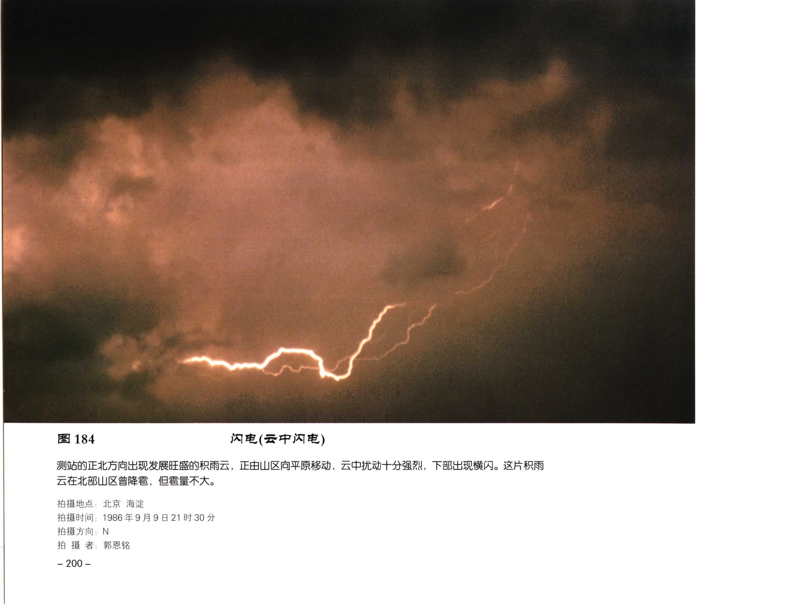

| 字段 | 内容 |
| --- | --- |
| 拍摄地点 | 北京 海淀 |
| 拍摄时间 | 1986年9月9日21时30分 |
| 拍摄方向 | ， N |

### OCR 文本

```text
184 闪电(云中闪电)

测站的正北方向出现发展旺盛的积雨云，正由山区向平原移动，云中扰动十分强烈，下部出现横闪。这片积十
云在北部山区曾降者，但填量不大。

拍摄地点: 北京 海淀

拍摄时间: 1986年9月9日21时30分

拍摄方向， N

拍 fk 者; 郭恩铭

— 200 -
```

## 图 185


| 字段 | 内容 |
| --- | --- |
| 图号 | 图 185 |
| 拍摄地点 | 江西 庐山 |
| 拍摄者 | FRR Bele |

### OCR 文本

```text
图185 ZA

云滴是指云中的众多不同尺度的水滴, 云滴的直径为几个微米至
100 微米，图中是不同尺度的云滴，大云滴直径为40微米, 小云

拍摄地点: 江西 庐山
拍 摄 者 FRR Bele

 186 FR

冻滴是从云中降落到地面的过程中冻结的雨滴, 也叫冰粒。它的
直径1 毫米至 3 毫米

拍摄地点: 江西 庐山
拍 摄 者;郭恩铭

— 201 -
```

## 图 187


| 字段 | 内容 |
| --- | --- |
| 图号 | 图 187 |
| 拍摄地点 | 江西 庐山 |
| 拍摄时间 | 1982年1月27日22时40分 拍摄地点: 江西 庐山 |
| 拍摄者 | ee 陈越华 |

### OCR 文本

```text
一202 -

C d e f

E 187 a 5a FoF 5A

ABNSRESMEK, CANVCKSE, NASSANEA, SPA LAKE (图187a ) 为针状和柱状，雪晶 (图187b )
为六角梳状，雪晶 (图 187c ) AREK, SE (H 187d) 为磁合的枝星状，雪晶 (图 187e ) ALK, BS (图187f) 为星状。

拍摄地点: 江西 庐山
fo 摄 者; 陈越华

图 189 BR
图188 KG
起是由不同形状的雪晶准附大量过冷水滴而逐渐形成的白色不透明团粒。 从
白色不透明的比较扁的或比较长的小颗粒固态降水，它的直径一般 $1890, baw, REKSRMWAST SOKA MR 139 是一
小于1毫米，着地时不反跳。 TRIBAL, 它是由柱状晶体准附大量过冷水滴而形成的。 图189d是由枝星
状雪晶闪附大量过冷水滴而形成。
拍摄地点: 江西 庐山
拍摄时间: 1982年1月27日22时40分 拍摄地点: 江西 庐山
fo fk 者: 陈越华 拍 摄 者: ee 陈越华
```

## PDF 第 215 页


| 字段 | 内容 |
| --- | --- |
| 拍摄地点 | 江西 庐山 |

### OCR 文本

```text
190 mA

雨滴是从云中下降的液态降水，直径= 0.5 毫米，由于雨滴落速较快，呈雨线，清晰可见。
落在水面上会激起波纹和水花，落在地面上可留下湿斑。图中的雨滴最大直径15 毫米，最
小直径 3 毫米。

拍摄地点: 江西 庐山
拍 Re. RRR Behe

— 203 -
```

## 图 191


| 字段 | 内容 |
| --- | --- |
| 图号 | 图 191 |
| 拍摄地点 | ; 江西 庐山 |
| 拍摄时间 | 1970年1月10日10时20分 |
| 拍摄方向 | N |
| 拍摄者 | ; SRA |

### OCR 文本

```text
图191 有 tS

冬季树木和电线温度在0以下, 当云中的过冷雨滴落在树木和电线表面时, 迅即冻结成
冰，呈透明或毛玻璃状即是雨准。图中电线上的雨准由于气温升高逐渐融化再冻结而形
成长串冰流。

拍摄地点; 江西 庐山

拍摄时间: 1970年1月10日10时20分
拍摄方向: N

拍 摄 者; SRA

-204-
```

## PDF 第 217 页


### OCR 文本

```text
冬季气温低于 OC,

北京 紫竹

降雨时大量的过冷雨滴降落在树校上冻结而成为雨准，透明而洁白。

a

2000 #F 2
N
郭恩铭

2)
```

## 图 193


| 字段 | 内容 |
| --- | --- |
| 图号 | 图 193 |
| 拍摄地点 | 拍摄时间 : |
| 拍摄时间 | 拍 摄 |

### OCR 文本

```text
图 193

图中是从积雨云中降落的冰雹。冰过形状各异，外层有透明的冰层，也有不透明的冰层。有以

ne

BASRVAKE, HANAN SAVKE.

拍摄地点

拍摄时间 :

拍 摄

— 206 -

: 北京 西郊
1982年6月22
: PAS

A 17 BY 50 分
```

## 图 194


| 字段 | 内容 |
| --- | --- |
| 图号 | 图 194 |
| 拍摄地点 | ， |
| 拍摄时间 | 拍 摄 者; |
| 拍摄者 | ; |

### OCR 文本

```text
图 194

图中左边的冰需是7

拍摄地点，
拍摄时间
拍 摄 者;

北京 西郊
1982 年7
郭因铭

SNS
[ax

ASRMEMAY, G24 TRASAMCMAVAE.

19 BY 50 分

- 207 -
```

## 图 195


| 字段 | 内容 |
| --- | --- |
| 图号 | 图 195 |
| 拍摄地点 | 拍摄时间 |
| 拍摄时间 | 拍摄方向: |
| 拍摄方向 | 拍 摄 者: F |
| 拍摄者 | F |

### OCR 文本

```text
图 195

REBAR,

拍摄地点:
拍摄时间
拍摄方向:
拍 摄 者: F

— 208 -

北京 西郊
1985年1月26日07时20分
NE

BRS

7 本

云层厚度比较均匀，并有降雪，地面积雪有 5 厘米。
```
