# 《中国云图》PDF 第 221-240 页

本页由扫描版 PDF 自动提取生成。每个条目保留原页图像，并附 OCR 文本供检索和后续校订。

## 图 196

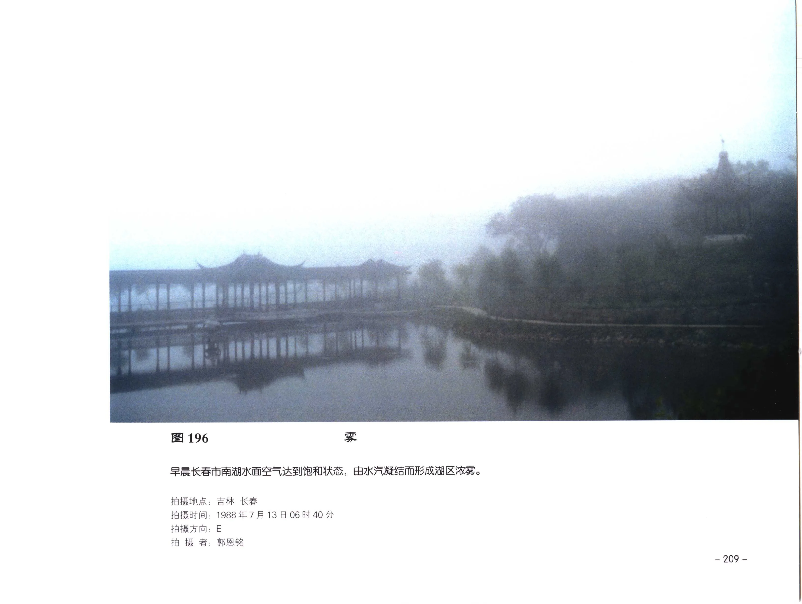

| 字段 | 内容 |
| --- | --- |
| 图号 | 图 196 |
| 拍摄地点 | 吉林 长春 |
| 拍摄时间 | 1988年7月13日06时40分 |
| 拍摄方向 | E |
| 拍摄者 | ; MA |

### OCR 文本

```text
图 196 ¥

早晨长春市南湖水面空气达到饱和状态，由水汽凝结而形成湖区浓雳。

拍摄地点: 吉林 长春

拍摄时间: 1988年7月13日06时40分
拍摄方向: E

拍 摄 者; MA

— 209 -
```

## PDF 第 222 页

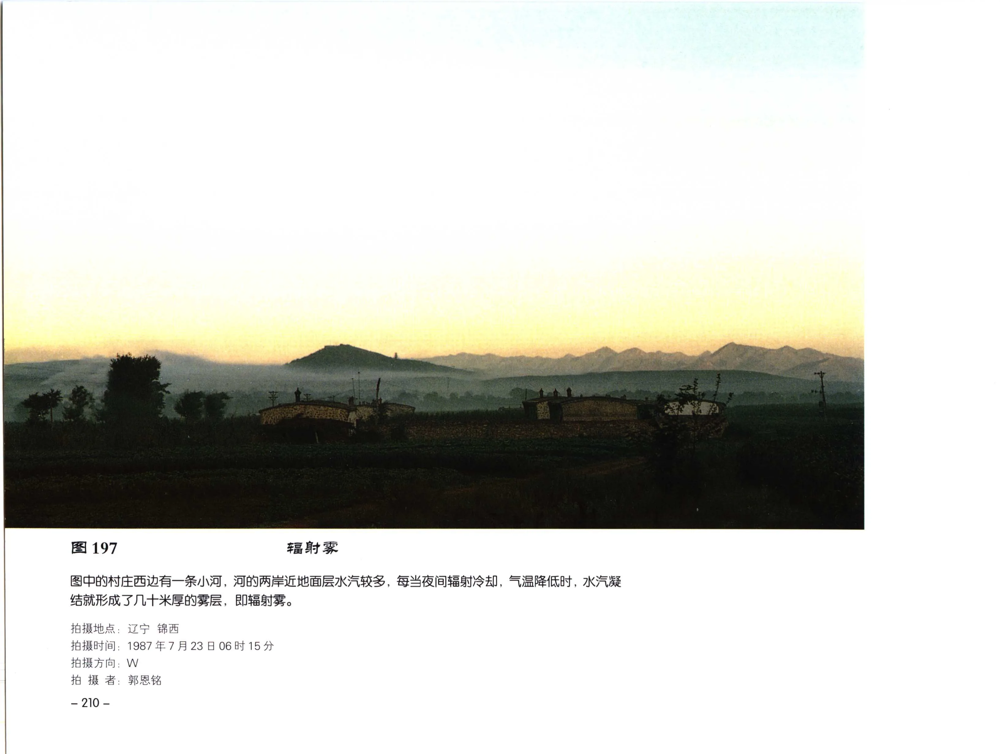

| 字段 | 内容 |
| --- | --- |
| 拍摄地点 | ;: 辽宁 锦西 |
| 拍摄时间 | 1987年7月23日06时15分 |
| 拍摄方向 | W |
| 拍摄者 | ; PAR |

### OCR 文本

```text
197 辐射雾

图中的村庄西边有一条小河，河的两岸近地面层水汽较多, 每当夜间辐射冷却, 气温降低时,水汽紧
结就形成了几十米厚的雾层，即辐射雾。

拍摄地点;: 辽宁 锦西

拍摄时间: 1987年7月23日06时15分

拍摄方向: W

拍 摄 者; PAR

一210 -
```

## PDF 第 223 页

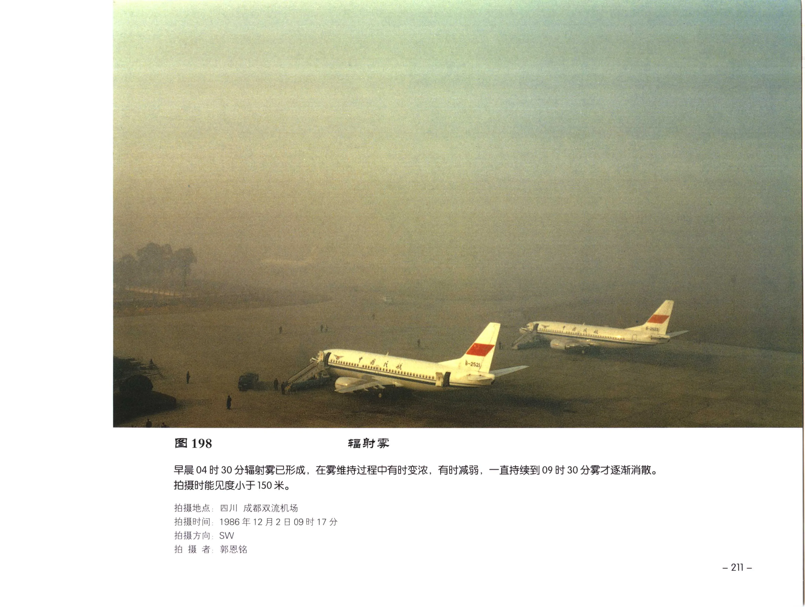

| 字段 | 内容 |
| --- | --- |
| 拍摄地点 | ;四川 成都双流机场 |
| 拍摄时间 | 1986年12月2日09时17分 |
| 拍摄方向 | ，SVV |
| 拍摄者 | ;，郭恩铭 |

### OCR 文本

```text
198 Fe Bt

早晨 04 时 30 分辐射雾已形成，在雾维持过程中有时变浓，有时减弱，一直持续到 09 时 30 DED
拍摄时能见度小于150米。

拍摄地点;四川 成都双流机场
拍摄时间: 1986年12月2日09时17分
拍摄方向，SVV

拍 摄 者;，郭恩铭
```

## 图 199

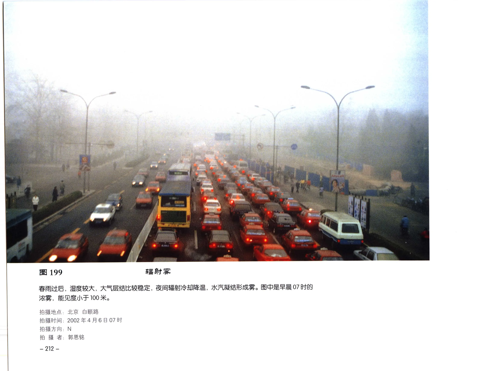

| 字段 | 内容 |
| --- | --- |
| 图号 | 图 199 |
| 拍摄地点 | ; 北京 AmB |
| 拍摄时间 | 2002年4月6日07时 |
| 拍摄方向 | N |

### OCR 文本

```text
图199 Bat 要

春雨过后，湿度较大，大气层结比较稳定,夜间辐射冷却降温，水汽凝结形成雳。图中是早晨07 时的
浓雾，能见度小于 100K.

拍摄地点; 北京 AmB

拍摄时间: 2002年4月6日07时

拍摄方向: N

jh 摄 者，郭思铭

=212 =
```

## 图 200

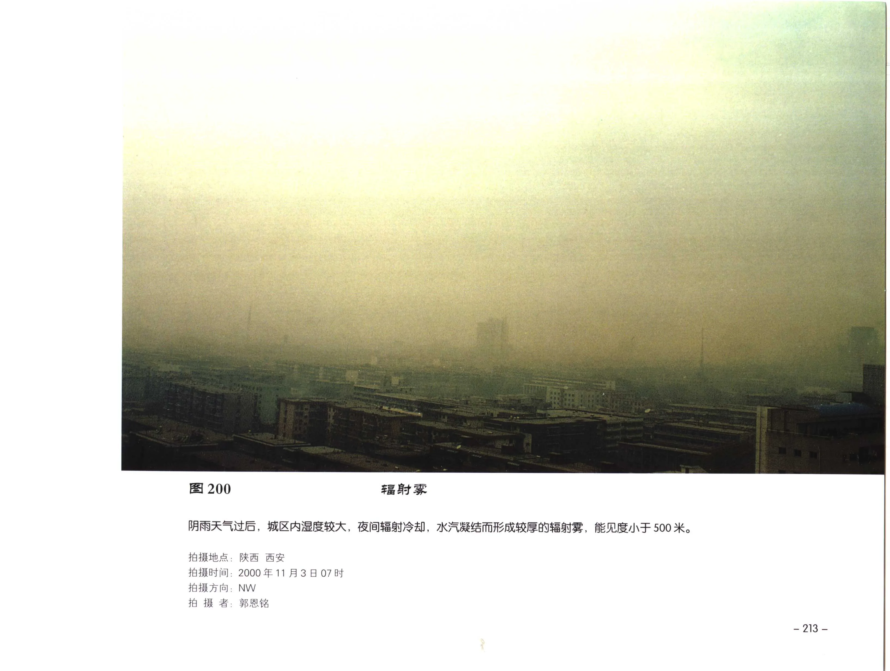

| 字段 | 内容 |
| --- | --- |
| 图号 | 图 200 |
| 拍摄地点 | ; 陕西 西安 |
| 拍摄时间 | 2000年11月3日07时 |
| 拍摄方向 | ，NW |

### OCR 文本

```text
图 200 Bat x

阴雨天气过后，城区内湿度较大，夜间辐射冷却，水汽颇结而形成较厚的辐射雾，能见度小于 500.

拍摄地点; 陕西 西安

拍摄时间: 2000年11月3日07时
拍摄方向，NW

拍 摄 A. PBK

-213 -
```

## 图 201

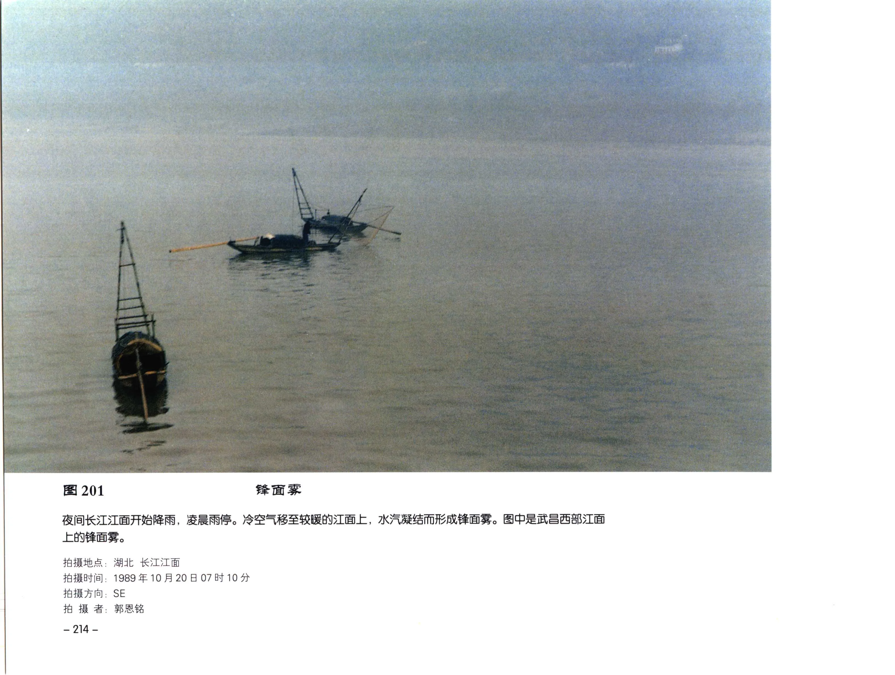

| 字段 | 内容 |
| --- | --- |
| 图号 | 图 201 |
| 拍摄地点 | 湖北 长江江面 |
| 拍摄时间 | 1989年10月20日07时10分 |
| 拍摄方向 | SE |
| 拍摄者 | BAB |

### OCR 文本

```text
图 201 Ae Fx

夜间长江江面开始降雨，惧晨雨停。冷空气移至较暖的江面上，水汽凝结而形成锋面雾。图中是武昌西部江面
上的锋面雳。

拍摄地点: 湖北 长江江面

拍摄时间: 1989年10月20日07时10分
拍摄方向: SE

拍 摄 者: BAB

- 214 -
```

## PDF 第 227 页

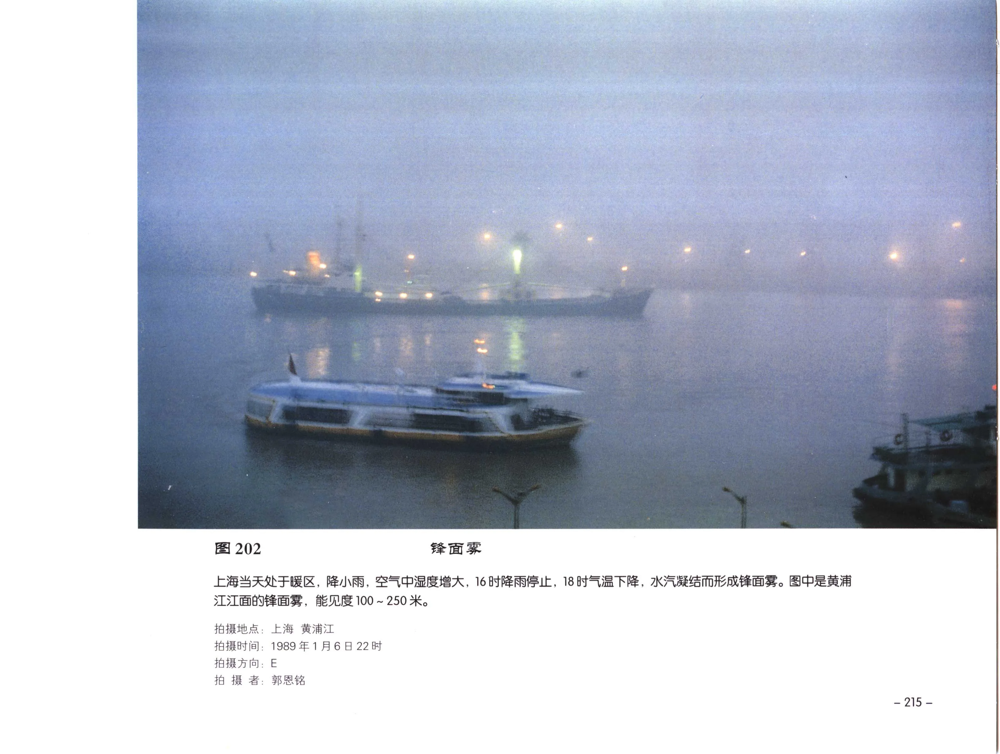

| 字段 | 内容 |
| --- | --- |
| 拍摄地点 | ， |
| 拍摄时间 | 拍摄方向: |
| 拍摄方向 | 拍 摄 者: |
| 拍摄者 | 上海 黄浦江 |

### OCR 文本

```text
202

上海当天处于暖区，降小雨, 空气中湿度增大，16 时降雨停止，18 时

江江面的锋面雾，能见度100 ~ 250米。

拍摄地点，
拍摄时间 :
拍摄方向:
拍 摄 者:

上海 黄浦江

1989年1月6日22时
E

郭恩铭

中|

baie

一二一]

器

Ba, KART RES. SPER A

- 215 -
```

## 图 203

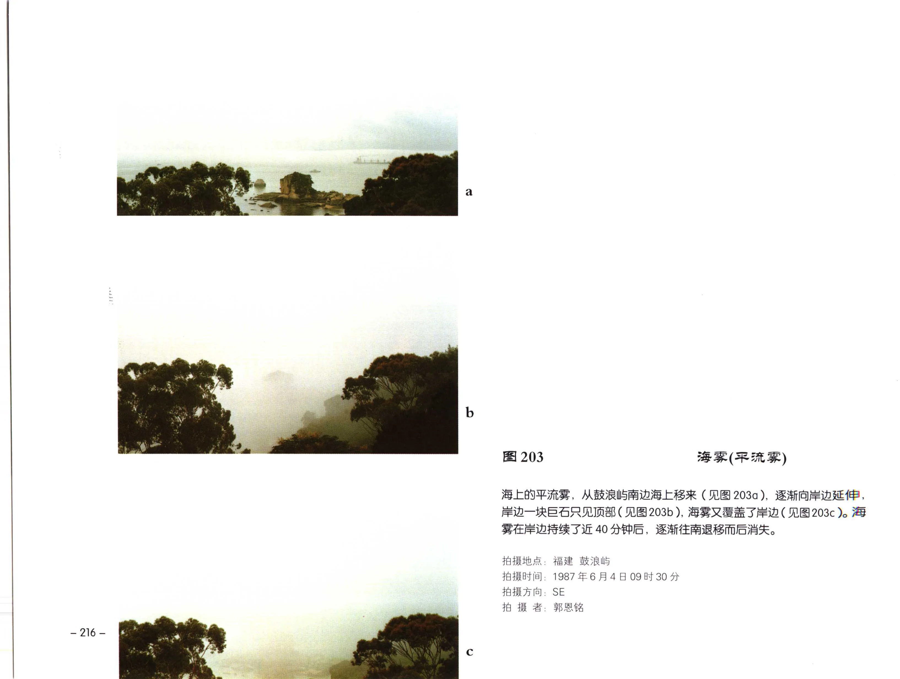

| 字段 | 内容 |
| --- | --- |
| 图号 | 图 203 |
| 拍摄地点 | ; 福建 DORIS |
| 拍摄时间 | 1987年6月4日09时30分 |
| 拍摄方向 | ， SE |
| 拍摄者 | ; 郭恩铭 |

### OCR 文本

```text
— 216 -

图 203 F(t F)

SCAYVERE, MBURISRWIS CR (见图 2030 )，逐渐向岸边延伟，
岸边一块巨石只见顶部( 见图203b ), 海雾又覆盖了岸边( 见图203c )。 海
雾在岸边持续了近 40 分钟后，逐渐往南退移而后消失。

拍摄地点; 福建 DORIS

拍摄时间: 1987年6月4日09时30分
拍摄方向， SE

拍 摄 者; 郭恩铭
```

## 图 204

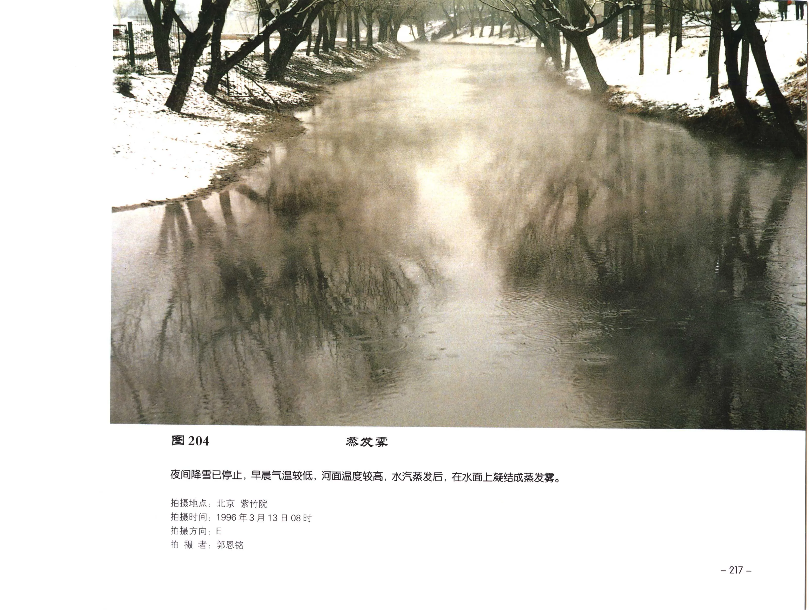

| 字段 | 内容 |
| --- | --- |
| 图号 | 图 204 |
| 拍摄地点 | 北京 AR |
| 拍摄时间 | 1996年3月13日08时 |
| 拍摄方向 | E |
| 拍摄者 | ; BBE |

### OCR 文本

```text
图204

夜间降雪已停止, 早

下一一]

Fm Vom

拍摄地点: 北京 AR
拍摄时间: 1996年3月13日08时

拍摄方向: E
拍 摄 者; BBE

较低，河面温度较高, 水汽蒸发后,在水面上凝结成蒸发雾。

- 217 -
```

## 图 205

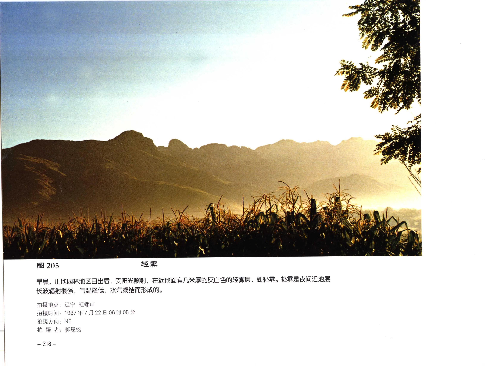

| 字段 | 内容 |
| --- | --- |
| 图号 | 图 205 |
| 拍摄地点 | 拍摄时间: |
| 拍摄时间 | 拍摄方向: |
| 拍摄方向 | 拍 摄 者: |
| 拍摄者 | 一218 - |

### OCR 文本

```text
图 205

早晨,山地园林地区日出后，受阳光照射，在近地面有几米厚的灰白色的轻雾层，即轻雾。轻雾

aE

长波辐射很强，气温降低，水汽凝结而形成的。

拍摄地点:
拍摄时间:

拍摄方向:
拍 摄 者:

一218 -

辽宁 虹螺山
1987年7月22日
NE

郭恩铭

06 时 05 分
```

## PDF 第 231 页

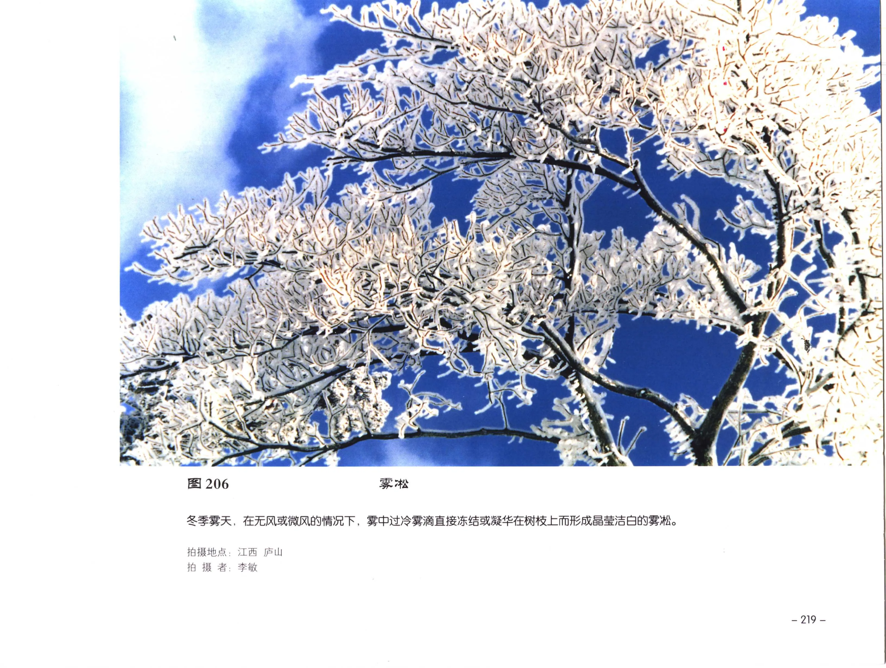

| 字段 | 内容 |
| --- | --- |
| 拍摄地点 | 江西 庐山 |
| 拍摄者 | SR |

### OCR 文本

```text
冬季雾天，在无风或微风的情况下，雾中过冷雾滴直接冻结或凝华在树枢上而形成晶莹洁白的雳准。

拍摄地点: 江西 庐山
拍 摄 者: SR
```

## 图 207

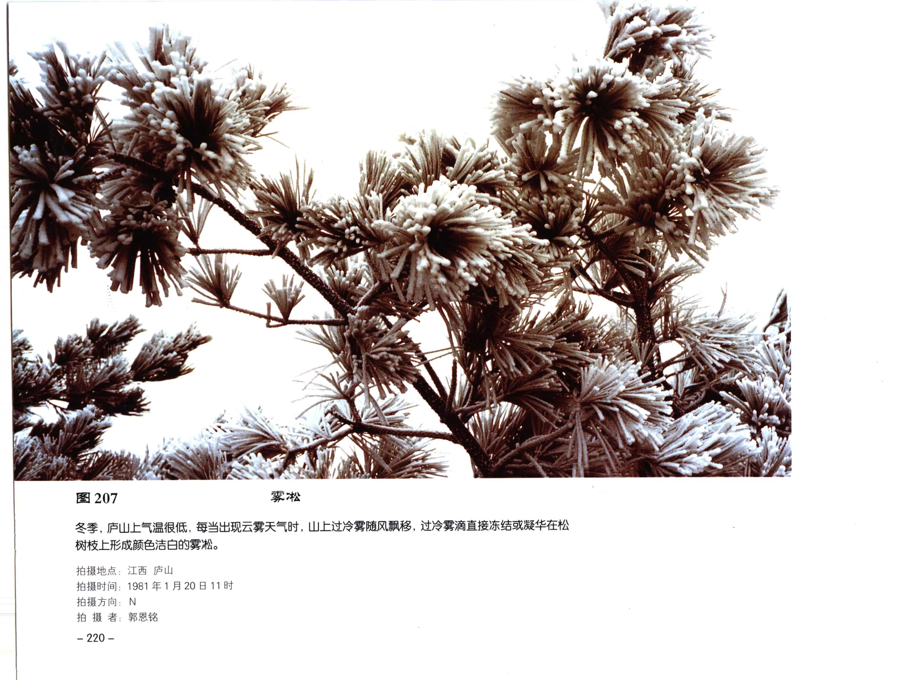

| 字段 | 内容 |
| --- | --- |
| 图号 | 图 207 |
| 拍摄地点 | ;江西 庐山 |
| 拍摄时间 | 1981年1月20日11时 |
| 拍摄方向 | ， N |
| 拍摄者 | ; PBK |

### OCR 文本

```text
图 207 Reith

冬季, 庐山上气温很低, 每当出现云雾天气时, ULWSEBMMe, WSPBRRRAM EE
树校上形成颜色洁白的雾准。

拍摄地点;江西 庐山

拍摄时间: 1981年1月20日11时

拍摄方向:， N

拍 摄 者; PBK

— 220:—
```

## 图 208

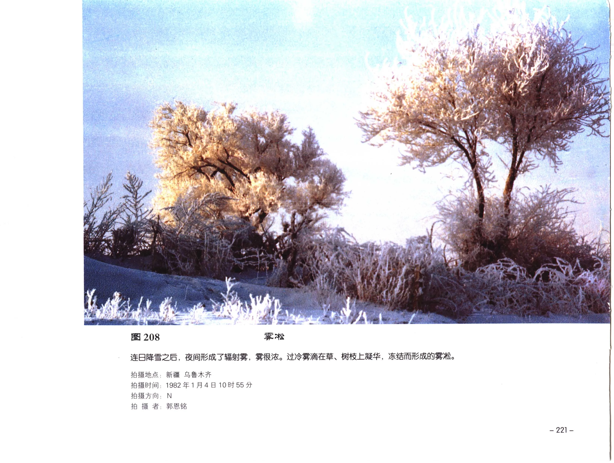

| 字段 | 内容 |
| --- | --- |
| 图号 | 图 208 |
| 拍摄地点 | 新疆 乌鲁木齐 |
| 拍摄时间 | 1982年1月4日10时55 分 |
| 拍摄方向 | ，N |
| 拍摄者 | ; PBB |

### OCR 文本

```text
图 208 Beth

EBREZS, RAM TENE, BRR. WHBBES, MRO, RAMANA.

拍摄地点: 新疆 乌鲁木齐

拍摄时间: 1982年1月4日10时55 分
拍摄方向，N

拍 摄 者; PBB

- 221-
```

## PDF 第 234 页

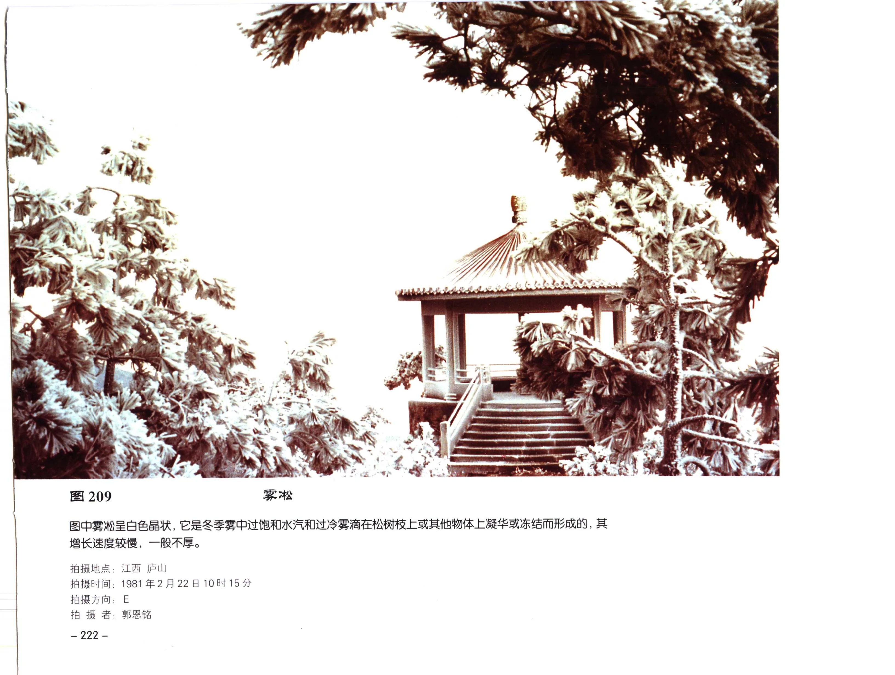

| 字段 | 内容 |
| --- | --- |
| 拍摄地点 | ;江西 庐山 |
| 拍摄时间 | 1981年2月22日10时15 分 |
| 拍摄方向 | E |
| 拍摄者 | ; BB |

### OCR 文本

```text
7

ay Aa 汪

BOP MEHERK, BCSPRSEOTPNKANWSEBEMMRERA HALEN RMAC, 其
增长速度较慢，一般不厚。

拍摄地点;江西 庐山

拍摄时间: 1981年2月22日10时15 分

拍摄方向: E
拍 摄 者; BB

一222 -
```

## PDF 第 235 页

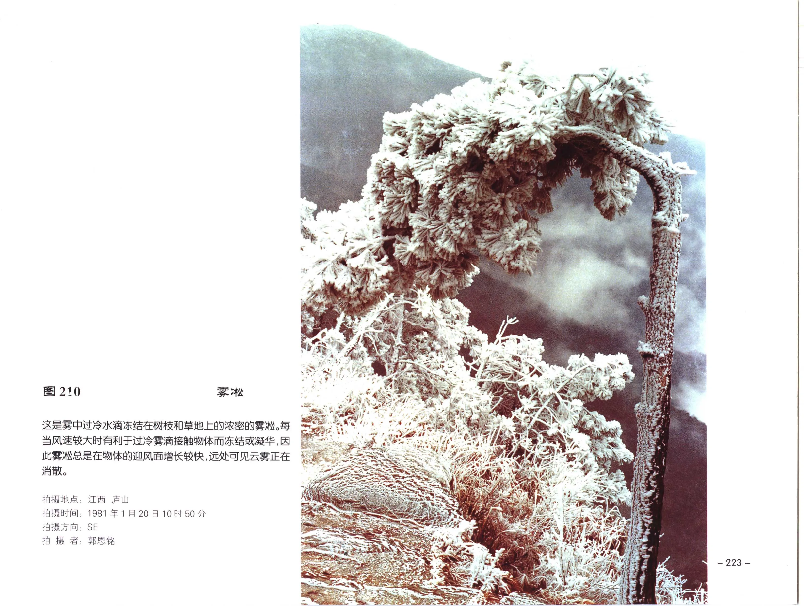

| 字段 | 内容 |
| --- | --- |
| 拍摄地点 | 1981年1月20日10时50分 |
| 拍摄时间 | 拍摄方向: SE |
| 拍摄方向 | SE |
| 拍摄者 | FB ER |

### OCR 文本

```text
Pa

=] 210

ua

RAIS th CARB

REF SK

TAMARA A

当风速较大时有利于过冷
此雾准总是在物体的迎

消散。

风面增

站

长较快,远处可见云雾正在“下

江西 庐山

拍摄地点:

1981年1月20日10时50分

拍摄时间 :

拍摄方向: SE
拍 摄 者:

FB ER

|
CD
N
N

|
```

## 图 211

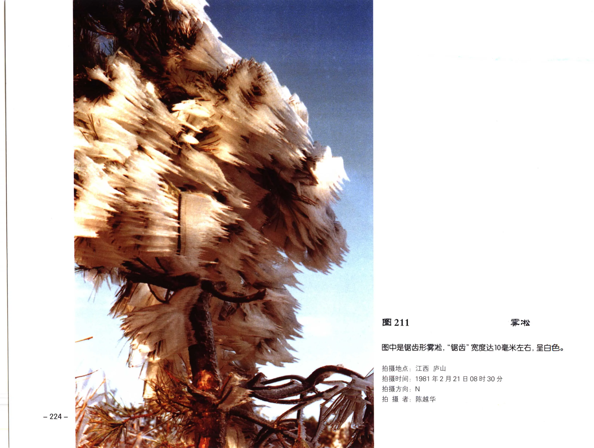

| 字段 | 内容 |
| --- | --- |
| 图号 | 图 211 |
| 拍摄地点 | ; 江西 庐山 |
| 拍摄时间 | 1981年2月21日08时30分 |
| 拍摄方向 | ， N |
| 拍摄者 | ; 陈越华 |

### OCR 文本

```text
图211 RR

BPSBAVEM, SS" 宽度达10毫米左右, 呈白色。

拍摄地点; 江西 庐山

拍摄时间: 1981年2月21日08时30分
拍摄方向， N

拍 摄 者; 陈越华
```

## 图 212

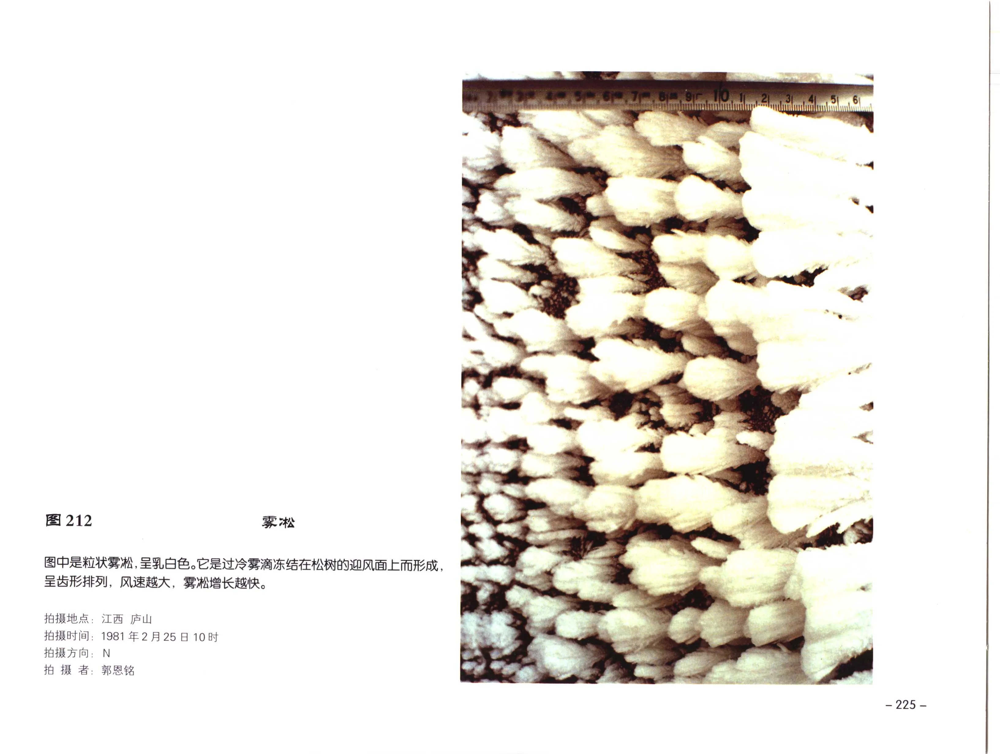

| 字段 | 内容 |
| --- | --- |
| 图号 | 图 212 |
| 拍摄地点 | 江西 庐山 |
| 拍摄时间 | 1981年2月25 日10时 |
| 拍摄方向 | ，N |

### OCR 文本

```text
图 212 Fray

图中是粒状雾状,呈乳白色。它是过冷雾滴冻结在松树的迎风面上而形成，
呈齿形排列，风速越大，雾准增长越快。

拍摄地点: 江西 庐山

拍摄时间: 1981年2月25 日10时
拍摄方向，N

拍 Se. PBR

— 225 -
```

## 图 213

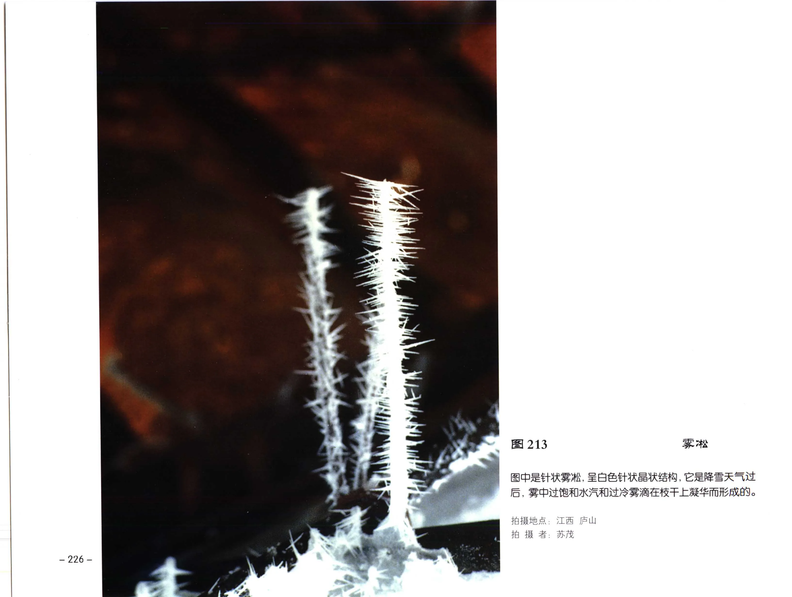

| 字段 | 内容 |
| --- | --- |
| 图号 | 图 213 |
| 拍摄地点 | 江西 庐山 |
| 拍摄者 | AIK |

### OCR 文本

```text
图 213 ee

BPSHKEM, 呈白色针状晶状结构 , 它是降雪天和气过
后，雾中过饱和水汽和过冷雾滴在校二上凝华而形成的。

 拍摄地点: 江西 庐山
拍 摄 者: AIK

一226 -

每
oa
大
= eee,
和 — 4
= =
Shee
&

.
```

## PDF 第 239 页

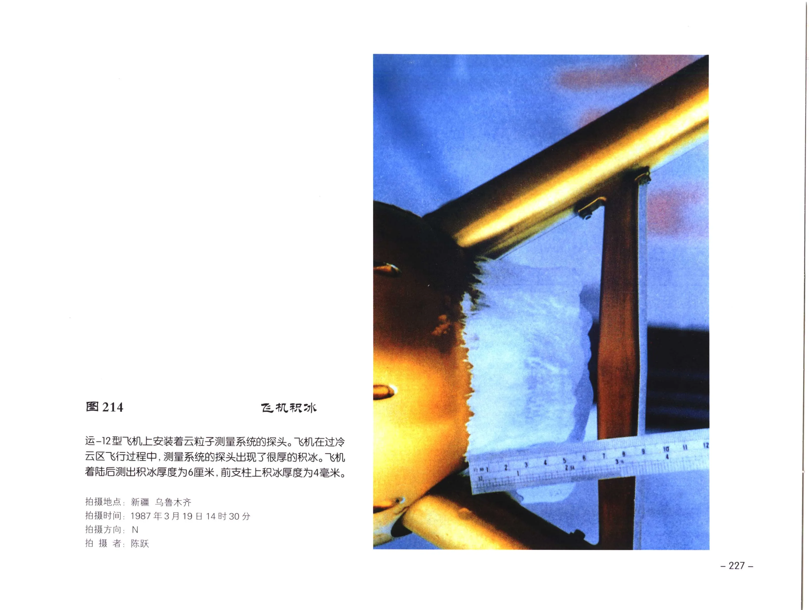

| 字段 | 内容 |
| --- | --- |
| 拍摄地点 | 新疆 乌鲁木齐 |
| 拍摄时间 | 1987年3月19日14时30分 |
| 拍摄方向 | N |

### OCR 文本

```text
214 EMA ae

运-12型飞机上安装着云粒子测量系统的探头。 飞机在过冷
云区飞行过程中, 测量系统的探头出现了很厚的积冰。 飞机
着陆后测出积冰厚度为6厘米, 前支柱上积冰厚度为4毫米。

拍摄地点: 新疆 乌鲁木齐

拍摄时间: 1987年3月19日14时30分
拍摄方向: N

拍 HO. GREK

- 227 -
```

## 图 215

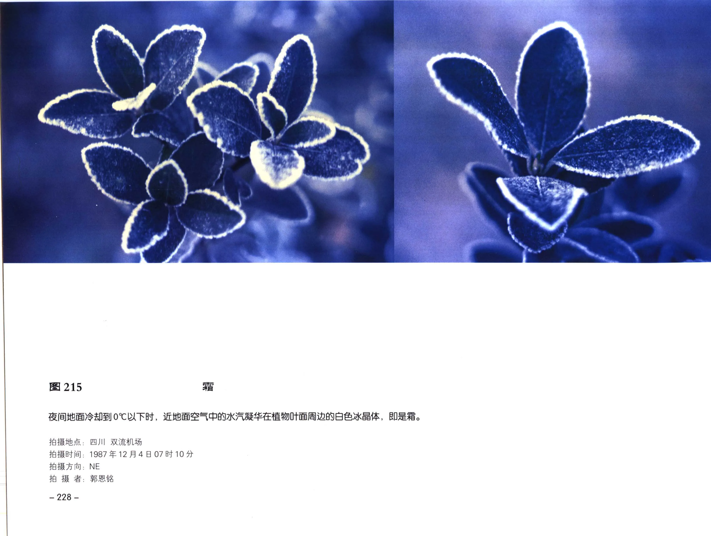

| 字段 | 内容 |
| --- | --- |
| 图号 | 图 215 |
| 拍摄地点 | ;四川 双流机场 |
| 拍摄时间 | 1987年12月4日07时10分 |
| 拍摄方向 | ，NE |

### OCR 文本

```text
图215 5a

夜间地面冷却到0以下时，近地面空气中的水汽凝华在植物叶面周边的白色冰晶体，即是霜。

拍摄地点;四川 双流机场

拍摄时间: 1987年12月4日07时10分
拍摄方向，NE

jh 摄 者; PAR

一228 -
```
