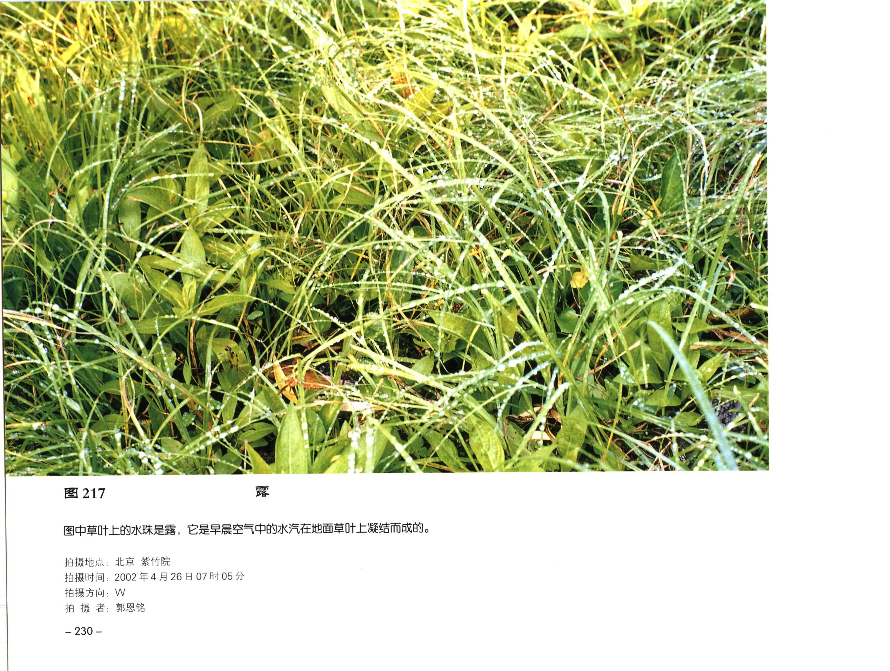

# 《中国云图》PDF 第 241-260 页

本页由扫描版 PDF 自动提取生成。每个条目保留原页图像，并附 OCR 文本供检索和后续校订。

## PDF 第 241 页


| 字段 | 内容 |
| --- | --- |
| 拍摄地点 | 四川 |

### OCR 文本

```text
早晨近地面气温很低，空气中的水汽凝华在植物叶面周围出现白色针状霜。

拍摄地点: 四川
```

## PDF 第 242 页



| 字段 | 内容 |
| --- | --- |
| 拍摄地点 | 北京 紫竹院 |
| 拍摄时间 | 2002年4月26日07时05分 |
| 拍摄方向 | W |

### OCR 文本

```text
nS POI

+ ee, BN te RS
全 SA War, $2 >. * A) 4
A oe. ie hen Te AE!
Ww. ,*

*

Sy
ie 2
noe Me. = ren

Vin POS.
VT
Ki »

- SR

图中草叶上的水珠是露，它是早晨空气中的水汽在地面草叶上凝结而成的。

拍摄地点: 北京 紫竹院

拍摄时间: 2002年4月26日07时05分
拍摄方向: W

th 摄 者: 郭恩铭

一230 -
```

## 图 218


| 字段 | 内容 |
| --- | --- |
| 图号 | 图 218 |
| 拍摄地点 | 海南 海口 |
| 拍摄时间 | 1970年9月18日15时56 分 |
| 拍摄方向 | SSW |
| 拍摄者 | 韩森 |

### OCR 文本

```text
图218 Le

积雨云底部阴暗混乱，在它的中心部位下垂一条直径不大的龙卷，开始由粗变
细，后又由短变长，但未及地，总共持续7 分钟。

拍摄地点: 海南 海口
拍摄时间: 1970年9月18日15时56 分
拍摄方向: SSW
拍 摄 者: 韩森

- 231-

EL
```

## 图 219


| 字段 | 内容 |
| --- | --- |
| 图号 | 图 219 |
| 拍摄地点 | 甘肃 IRB |
| 拍摄时间 | 1987年6月23 |
| 拍摄方向 | ，N |
| 拍摄者 | ; 刘佛珍 |

### OCR 文本

```text
图219

积雨云降者，云底部阴暗混乱，在中偏右部位下垂一条直径不大的龙卷，还未接地。

拍摄地点: 甘肃 IRB
拍摄时间: 1987年6月23
拍摄方向，N

拍 摄 者; 刘佛珍

一232 -

日15 时
```

## 图 220


| 字段 | 内容 |
| --- | --- |
| 图号 | 图 220 |
| 拍摄地点 | ; 海南 海 |
| 拍摄时间 | 1970年9月18日15时57 分 |
| 拍摄方向 | ，SSW |

### OCR 文本

```text
图 220 LR

积雨云的底部阴暗混乱, 在其中心部位下垂一条龙卷, 逐渐由粗变细, 后
由长变短，逐渐消失。

拍摄地点; 海南 海
拍摄时间: 1970年9月18日15时57 分
拍摄方向，SSW
jo 摄 A. HR

— 233 -
```

## 图 221


| 字段 | 内容 |
| --- | --- |
| 图号 | 图 221 |
| 拍摄地点 | 新疆 |

### OCR 文本

```text
一234 -

图221 尘麦风

图中是新疆公格尔九别山区的尘卷风。它往往是由于中午前后太阳辐射增强，
局地急剧增热, 小股空气对流上升, 周围空气迅速补充, 形成局地旋涡, KE
着尘沙旋转向上而形成的。

拍摄地点: 新疆
```

## 图 222


| 字段 | 内容 |
| --- | --- |
| 图号 | 图 222 |
| 拍摄地点 | ;江西 庐山 |
| 拍摄时间 | 2001 年 10 |
| 拍摄方向 | ，NW |
| 拍摄者 | 郭恩铭 |

### OCR 文本

```text
图 222

图中是在高山上观测到的需层。大量肉眼无法分辨的极细微尘粒均勺浮游在空中,由于逆温作用，使尘粒

HEAR DIE

拍摄地点;江西 庐山
拍摄时间: 2001 年 10
拍摄方向，NW

拍 摄 者: 郭恩铭

月 22

日08 时 10 分

- 235 -
```

## 图 223


| 字段 | 内容 |
| --- | --- |
| 图号 | 图 223 |
| 拍摄地点 | 甘肃 兰州机场 |
| 拍摄时间 | 1983年12月29日06时10分 |
| 拍摄方向 | E |
| 拍摄者 | ; 郭恩铭 |

### OCR 文本

```text
图 223

兰州机场向东观测到的才层。才项显得很平整，上部呈红色，这是由于悬浮尘粒散射而成的。

拍摄地点: 甘肃 兰州机场

拍摄时间: 1983年12月29日06时10分
拍摄方向: E

拍 摄 者; 郭恩铭

— 236 -
```

## PDF 第 249 页


| 字段 | 内容 |
| --- | --- |
| 拍摄地点 | ; 北京 Ames |
| 拍摄时间 | 1990 £4 A 24 8 16 BY 25 分 |
| 拍摄方向 | ，N |

### OCR 文本

```text
224 PR

受强冷空气的影响,沙尘暴从西北方向移至测站上空，天空弥漫着十黄色沙尘，能见度低于1000米,严重
影响市内交通。

拍摄地点; 北京 Ames

拍摄时间: 1990 £4 A 24 8 16 BY 25 分
拍摄方向，N

jh 摄 者: PAB

一237 -
```

## 图 225


| 字段 | 内容 |
| --- | --- |
| 图号 | 图 225 |
| 拍摄地点 | ， |
| 拍摄时间 | 拍摄方向: |
| 拍摄方向 | 拍 摄 者: |
| 拍摄者 | — 238 - |

### OCR 文本

```text
图 225

受西北气流的影响，沙尘暴逐渐移至测站上空。风速逐渐增大，沙尘更浓，严重影响交通。

拍摄地点，
拍摄时间 :
拍摄方向:
拍 摄 者:

— 238 -

北京 白颐路
2002年3月24日11时
S

BAK

oy a FR
```

## 图 226


| 字段 | 内容 |
| --- | --- |
| 图号 | 图 226 |
| 拍摄地点 | ; 北京 Ames |
| 拍摄时间 | 2002年3月24日14时20分 |
| 拍摄方向 | ，SW |

### OCR 文本

```text
hikes

Ames Set a ak

图 226 Ey a RR

上午沙尘暴逐渐移至北京西郊, 能见度逐渐转坏。14 时 20 分风速增大,沙尘更浓, 严重影响路上行人正常行进，
能见度仅有 60 米。图中可见行人骑车呼吸都感到困难。

拍摄地点; 北京 Ames

拍摄时间: 2002年3月24日14时20分
拍摄方向，SW

拍 ROA. 郭恩铭

— 239 -
```

## 图 227


| 字段 | 内容 |
| --- | --- |
| 图号 | 图 227 |
| 拍摄地点 | 拍摄时间 : |
| 拍摄时间 | 拍摄方向: |
| 拍摄方向 | 拍 摄 者: |
| 拍摄者 | = 940 |

### OCR 文本

```text
图 227

当天下午西北风风速加大, 沙尘更浓，

Ya

大楼看得很清楚，图 227b 沙尘暴最浓密时大楼已看不清楚。

拍摄地点:
拍摄时间 :
拍摄方向:
拍 摄 者:

= 940

北京市气象局

2002年3月24日15时10分
NE

Ke

能见度只有 500米左右。图 227a是晴天测站对面的
```

## PDF 第 253 页


!!! note "OCR 状态"
    本页暂未识别出可靠文本，保留原页图像。

## PDF 第 254 页


!!! note "OCR 状态"
    本页暂未识别出可靠文本，保留原页图像。

## 图 228


| 字段 | 内容 |
| --- | --- |
| 图号 | 图 228 |
| 拍摄时间 | 拍 摄 者 |

### OCR 文本

```text
图 228

度在 9000 ~ 10000米时拍摄到的景象: 东方太阳即将升起,机可下方的卷层云呈

图中是清晨习
暗黑色，远方还有条状卷云。

拍摄时间
拍 摄 者
```

## PDF 第 256 页


| 字段 | 内容 |
| --- | --- |
| 拍摄时间 | 1983年6月5日 |

### OCR 文本

```text
飞行高度10000米，拍摄到机翼左下方的卷层云呈暗灰色，机可左下方两个白色云体是
积雨云的顶部。

拍摄时间: 1983年6月5日
HS. WER

- 244 -
```

## PDF 第 257 页


| 字段 | 内容 |
| --- | --- |
| 拍摄时间 | 1983 年6月5日 |
| 拍摄者 | ; 郭恩铭 |

### OCR 文本

```text
在高空10000米从飞机上拍摄到的云块很小的卷积云，呈白色鱼鳞片状，成群排列，有的很像微风吹
拂水面而成的小波纹。

拍摄时间: 1983 年6月5日
拍 摄 者; 郭恩铭

-245-
```

## 图 231


| 字段 | 内容 |
| --- | --- |
| 图号 | 图 231 |
| 拍摄时间 | 1982年6月13日 |

### OCR 文本

```text
图231

在河南上空飞行高度为 10000 米时拍摄到的卷层云。从飞机上看卷层云顶部也呈波浪形状，起伏不

平，云层不厚，呈有灰白色。

拍摄时间: 1982年6月13日
拍 RS. PBK

— 246 -

TR

二
```

## 图 232


| 字段 | 内容 |
| --- | --- |
| 图号 | 图 232 |
| 拍摄时间 | 2002年5月13日 |
| 拍摄者 | ; hE |

### OCR 文本

```text
图 232

飞机在东海上空航行，飞行高度约在7000米左右。图中上部是毛卷云和密卷云,接近海面上空是浓积
云和淡积云。

拍摄时间: 2002年5月13日
拍 摄 者; hE

— 247 -
```

## 图 233


| 字段 | 内容 |
| --- | --- |
| 图号 | 图 233 |
| 拍摄时间 | 1985年8月8日 |

### OCR 文本

```text
图233 积雨云顶部

飞机在河南上空飞行高度为 9000 米时拍摄到的积雨云，其顶部穿过稳定层，并继续向上发展，云顶周转

是高积云。

拍摄时间: 1985年8月8日
拍 摄 Se. 郭恩铭

-248-
```
