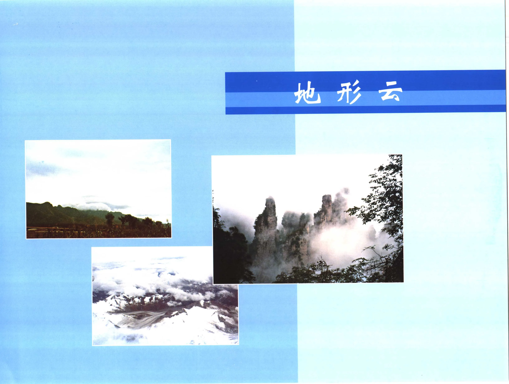
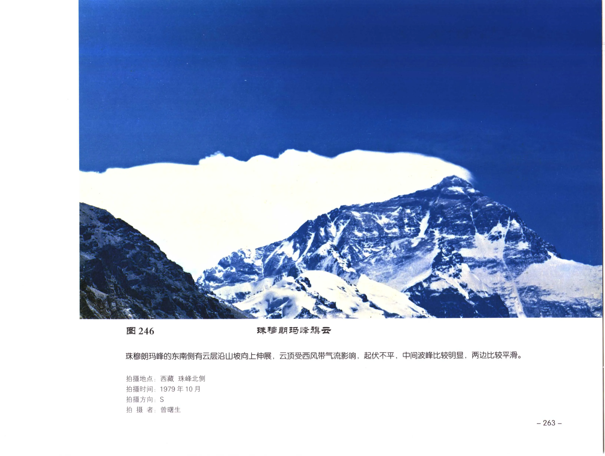
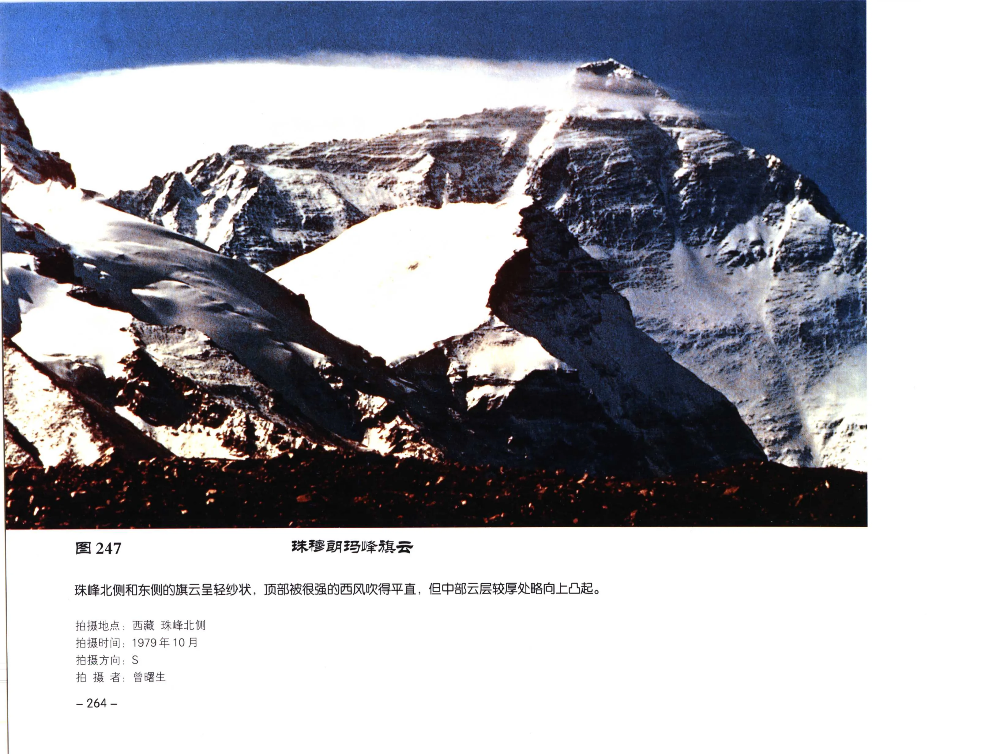
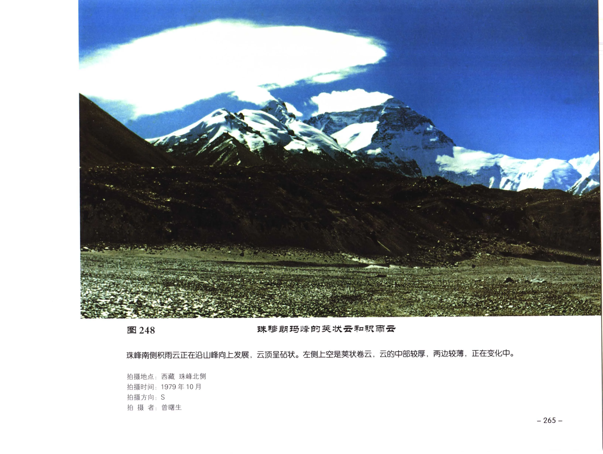
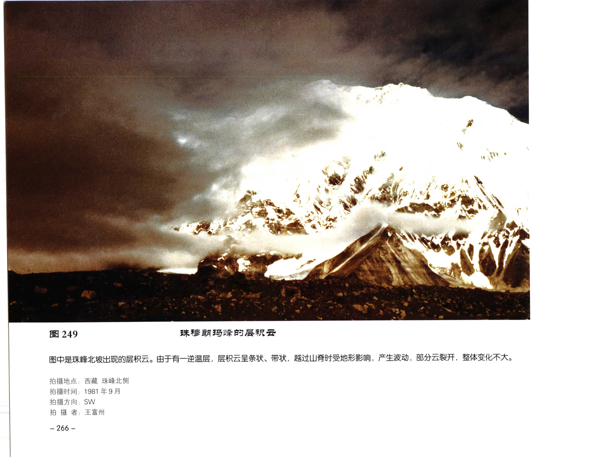
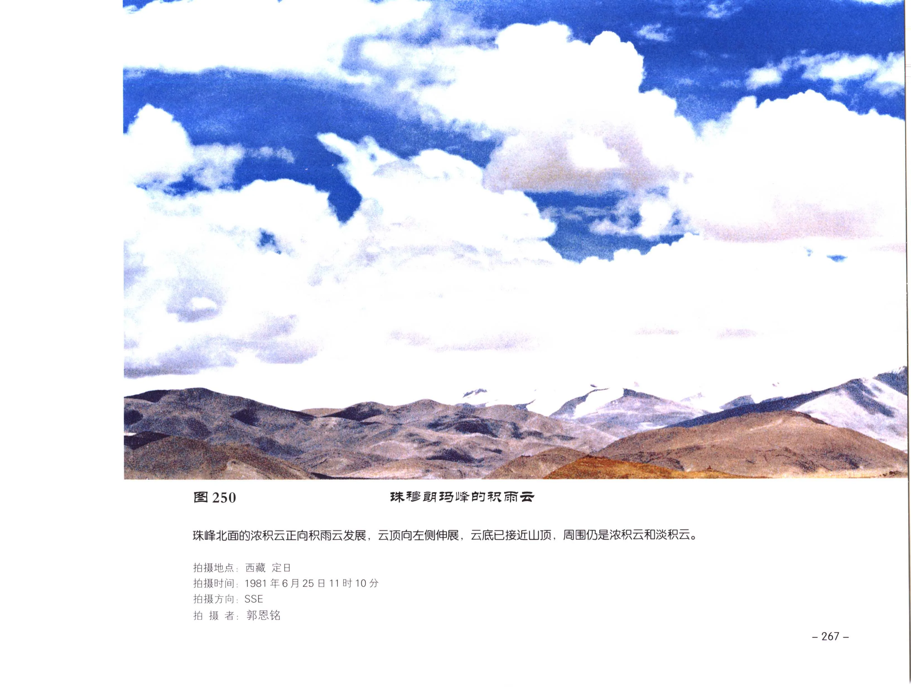
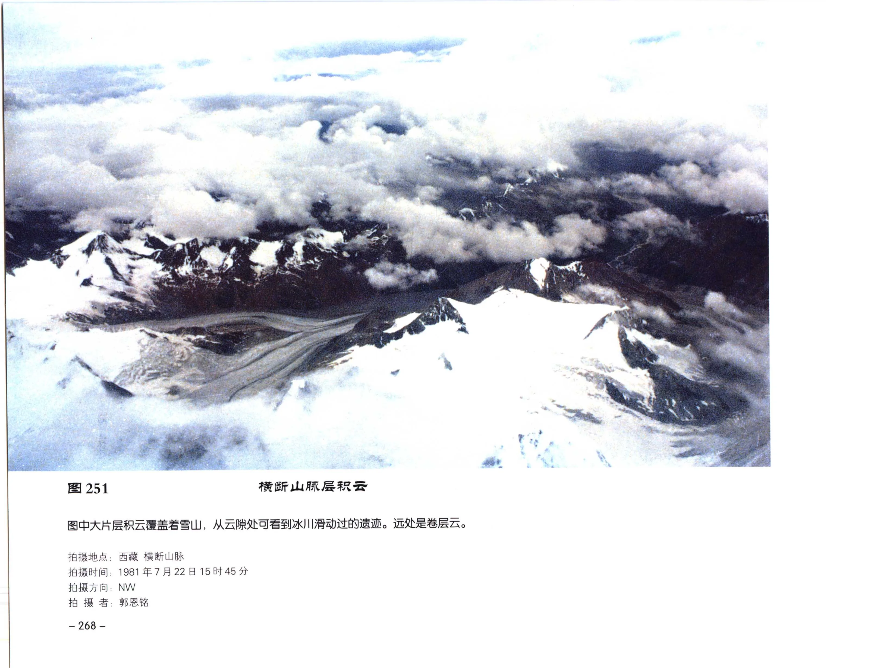

# 《中国云图》PDF 第 261-280 页

本页由扫描版 PDF 自动提取生成。每个条目保留原页图像，并附 OCR 文本供检索和后续校订。

## PDF 第 261 页


| 字段 | 内容 |
| --- | --- |
| 拍摄时间 | 1985年8月8日 |

### OCR 文本

```text
234 BR A Be BE AK FOLK AR BIR EB

TAL KTS 9000, SPLASARBAMKAM, MBOLRe, ABMAIEAAMBRE. 左下
方向上突起的云顶是浓积云。在浓积云顶部周围分布着高积云。

拍摄时间: 1985年8月8日
拍 摄 A: PAH

-249 -
```

## 图 235


| 字段 | 内容 |
| --- | --- |
| 图号 | 图 235 |
| 拍摄者 | ，郭恩铭 |

### OCR 文本

```text
图 235

在 9000米高空，从飞机上观测到左前方有一大块砧状积雨云，
上发展。积雨云周围分布着高积云。

FORAY |S]: 1985年8
拍 摄 者，郭恩铭

— 250 -

月 8 日

BEAR AR ER

发展很旺盛，已突破稳定层继续向
```

## 图 236


| 字段 | 内容 |
| --- | --- |
| 图号 | 图 236 |
| 拍摄时间 | 1988年7月16日 |
| 拍摄者 | ; WES |

### OCR 文本

```text
图 236 BEAK AR

SHCBATAWK, WMMMTSE 9000K, MA MERMAIEEMEAS MOKA. TARR
云的周围分布着浓积云。

拍摄时间: 1988年7月16日
拍 摄 者; WES

一251--
```

## 图 237


| 字段 | 内容 |
| --- | --- |
| 图号 | 图 237 |
| 拍摄时间 | 1983 7 A228 |
| 拍摄者 | ; REM |

### OCR 文本

```text
一252 -

图 237 BEARAR

华北冷锋天气系统已移到山西省境内 , 沿着冷锋分布着
砧状积雨云。 由于是早晨飞越山西上空, 行高度9000
米, 从飞机上可观测到云体不大的砧状积雨云全貌, 它
的周围分布着浓积云和淡积云。

拍摄时间: 1983 7 A228
拍 摄 者; REM
```

## 图 238


| 字段 | 内容 |
| --- | --- |
| 图号 | 图 238 |
| 拍摄时间 | 1981年7月22 日 |

### OCR 文本

```text
cs

4 Gr UL AR FR A

or lee fax

图 238

飞机飞越横断山脉上空，飞行高度 8000米，观测到三个积雨云中的一个单体，云顶已发展成砧状，全部冰晶化，云砧下
部呈暗灰色，它的周围分布着淡积云和浓积云。

拍摄时间: 1981年7月22 日
拍 fk 者，郭恩铭

-253 -
```

## 图 239


| 字段 | 内容 |
| --- | --- |
| 图号 | 图 239 |
| 拍摄时间 | 拍 摄 者: |
| 拍摄者 | -254 - |

### OCR 文本

```text
图 239

飞机从广东机场起飞，习
在它顶部有白色的习状云。

拍摄时间:
拍 摄 者:

-254 -

1982年6月13日

郭恩铭

度9000米, 当越过湖南上空时, 观测到发展旺盛的浓积云, 云顶向上伸展，
```

## 图 240


| 字段 | 内容 |
| --- | --- |
| 图号 | 图 240 |
| 拍摄时间 | 1985年8月10日 |
| 拍摄者 | WBS |

### OCR 文本

```text
图 240 活积云

飞机飞越浙江上空时观测到低空的淡积云和浓积云。图中成条状的是高积云。

拍摄时间: 1985年8月10日
拍 摄 者: WBS

- 255 -
```

## 图 241


| 字段 | 内容 |
| --- | --- |
| 图号 | 图 241 |
| 拍摄时间 | 1986年8月12 日 |

### OCR 文本

```text
图241 RRBRE

飞机飞越河南与山西上空时，飞行高度 8000米，观测到多块荧状高积云，云体呈白色，中间厚，边缘薄。

拍摄时间: 1986年8月12 日
拍 RS. 郭恩铭

— 256 -
```

## PDF 第 269 页


| 字段 | 内容 |
| --- | --- |
| 拍摄时间 | 1983年11月2日18时20分 |

### OCR 文本

```text
242 襄层云云机

从地面观测高层云布满全天, 云底高度约3000米, 从飞机上看云顶高度为6000米。高
层云云顶起伏不平呈波状。

拍摄时间: 1983年11月2日18时20分
拍 HS. 郭恩铭
```

## 图 243


| 字段 | 内容 |
| --- | --- |
| 图号 | 图 243 |
| 拍摄时间 | 1982年11月19日 |
| 拍摄者 | ，郭因铭 |

### OCR 文本

```text
图 243 层积云和高层云

冷锋天气系统移到乌鲁木齐。飞机在层积云上航行，
层云。飞机往东飞行时可看到博格达峰。

拍摄时间: 1982年11月19日
拍 摄 者，郭因铭

一258 -

[一

同

度2000米,观测到层积云云顶比较平整,上层是高
```

## 图 244


| 字段 | 内容 |
| --- | --- |
| 图号 | 图 244 |
| 拍摄地点 | 山东 泰山 |
| 拍摄时间 | 1997年6月21日11时 |

### OCR 文本

```text
图244 CA im
TALES KN, FNAME, 有时会拖出一条“和白烟”叫飞机尾迹。图中是在泰山
气象站观测到的飞机尾迹。

拍摄地点: 山东 泰山
拍摄时间: 1997年6月21日11时
拍 HR. SRR

- 259 -
```

## 图 245


| 字段 | 内容 |
| --- | --- |
| 图号 | 图 245 |
| 拍摄时间 | 郭恩铭 |
| 拍摄者 | — 260 - |

### OCR 文本

```text
图 245

成的尾迹, 经过10 ~ 15 分钟忆后尾迹扩展成

形

空进行特技飞行时

1—¥
fq)

中是飞机在
条

粗

°

、

点: 北京 西

拍摄地

1999年12月18日14时10分

拍摄时间

郭恩铭

拍 摄 者:

— 260 -
```

## PDF 第 273 页



!!! note "OCR 状态"
    本页暂未识别出可靠文本，保留原页图像。

## PDF 第 274 页


!!! note "OCR 状态"
    本页暂未识别出可靠文本，保留原页图像。

## 图 246



| 字段 | 内容 |
| --- | --- |
| 图号 | 图 246 |
| 拍摄地点 | 西藏 珠峰北侧 |
| 拍摄时间 | 1979 年 10 月 |
| 拍摄方向 | S |
| 拍摄者 | 曾曙生 |

### OCR 文本

```text
Mex

图 246

TK IZ BABE FIRS

珠穆朗玛峰的东南侧有云层沿山坡向上伸展，云顶受西风带气流影响，起伏不平，中间波峰比较明显，两边比较平滑。

拍摄地点: 西藏 珠峰北侧
拍摄时间: 1979 年 10 月
拍摄方向: S

拍 摄 者: 曾曙生

— 263 -
```

## 图 247



| 字段 | 内容 |
| --- | --- |
| 图号 | 图 247 |
| 拍摄地点 | 西藏 珠峰北侧 |
| 拍摄时间 | 1979年 10 月 |
| 拍摄方向 | ; S |
| 拍摄者 | SRE |

### OCR 文本

```text
图 247 RFE RAIS IEIRE

珠峰北人出和东侧的旗云呈轻纱状，顶部被很强的西风吹得平直，但中部云层较厚处略向上巴起。

拍摄地点: 西藏 珠峰北侧
拍摄时间: 1979年 10 月
拍摄方向; S

拍 摄 者: SRE

-264-
```

## 图 248



| 字段 | 内容 |
| --- | --- |
| 图号 | 图 248 |
| 拍摄地点 | 西藏 珠峰北侧 |
| 拍摄时间 | 1979 年 10 |
| 拍摄方向 | S |

### OCR 文本

```text
图 248

珠峰南侧积雨云正在沿山峰向上发展，云顶呈丰状。左侧上空是贡状卷云，云的中部较厚 ，两边较薄，正在变化中。

拍摄地点: 西藏 珠峰北侧
拍摄时间: 1979 年 10
拍摄方向: S

拍 Hh 者; 曾曙生

一265 -
```

## 图 249



| 字段 | 内容 |
| --- | --- |
| 图号 | 图 249 |
| 拍摄地点 | 拍摄时间] |
| 拍摄时间 | ] |
| 拍摄方向 | 拍 摄 者: |
| 拍摄者 | — 266 - |

### OCR 文本

```text
图 249

图中是珠峰北坡出现的层积云。由于有一逆温层，层积云呈条状、带状，越过山硝时受地形影响，产生波动，部分云裂开，整体变化不大。

拍摄地点:
拍摄时间]
拍摄方向
拍 摄 者:

— 266 -

西藏 珠峰北全
1981 年9月
SW

王富州

tRIE BA ISISRI RARE
```

## 图 250



| 字段 | 内容 |
| --- | --- |
| 图号 | 图 250 |
| 拍摄地点 | ， |
| 拍摄时间 | 拍摄方向; |
| 拍摄方向 | ; |
| 拍摄者 | 西藏 定日 |

### OCR 文本

```text
图 250

珠峰北面的浓积云正向积雨云发展，云顶向左侧伸展，云底已接近山顶，周围仍是浓积云和淡积云。

拍摄地点，
拍摄时间 :
拍摄方向;
拍 摄 者:

西藏 定日
1981年6月25日11时10分
SSE

郭恩铭

— 267 -
```

## 图 251



| 字段 | 内容 |
| --- | --- |
| 图号 | 图 251 |
| 拍摄地点 | 拍摄时间 : |
| 拍摄时间 | 拍摄方向: |
| 拍摄方向 | 拍 摄 者: |
| 拍摄者 | — 268 - |

### OCR 文本

```text
图251

图中大片层积云覆盖着雪山，从云孙处可看到冰川滑动过的遗迹。远处是卷层云。

拍摄地点:
拍摄时间 :
拍摄方向:
拍 摄 者:

— 268 -

西藏 横断山脉

1981年7月22日15时45 分
NW

郭恩铭

横断山肪层积云
```
