# 《中国云图》PDF 第 281-300 页

本页由扫描版 PDF 自动提取生成。每个条目保留原页图像，并附 OCR 文本供检索和后续校订。

## PDF 第 281 页

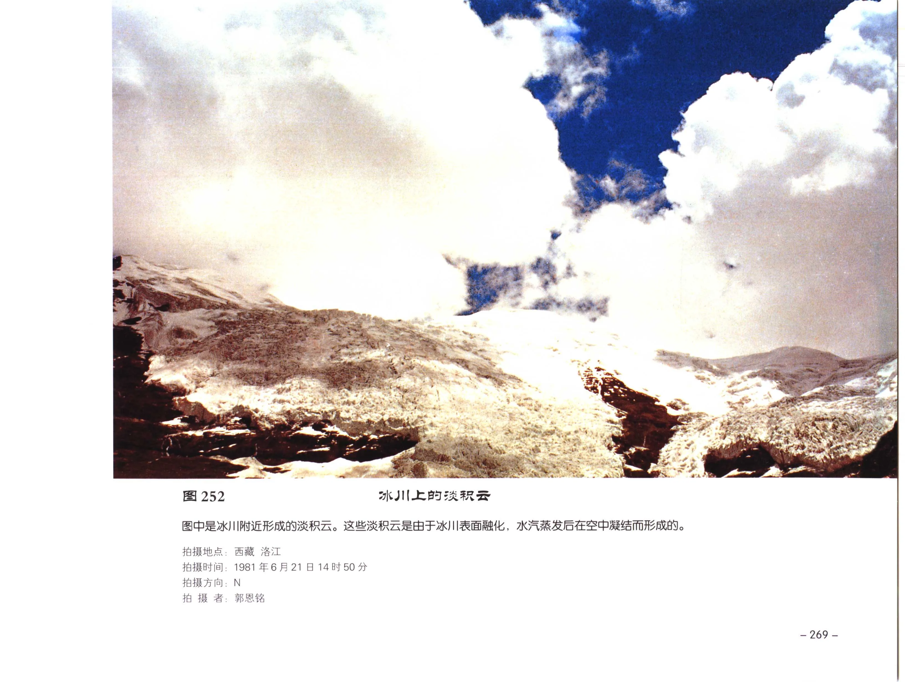

| 字段 | 内容 |
| --- | --- |
| 拍摄地点 | 西藏 洛江 |
| 拍摄时间 | 1981年6月21日14时50 分 |
| 拍摄方向 | N |
| 拍摄者 | 郭 |

### OCR 文本

```text
252 MIU BIRR

图中是冰川附近形成的淡积云。这些淡积云是由于冰川表面融化，水汽蒸发后在空中凝结而形成的。

拍摄地点: 西藏 洛江

拍摄时间: 1981年6月21日14时50 分
拍摄方向: N

拍 摄 者: 郭

ona

铭

由中

— 269 -
```

## 图 253

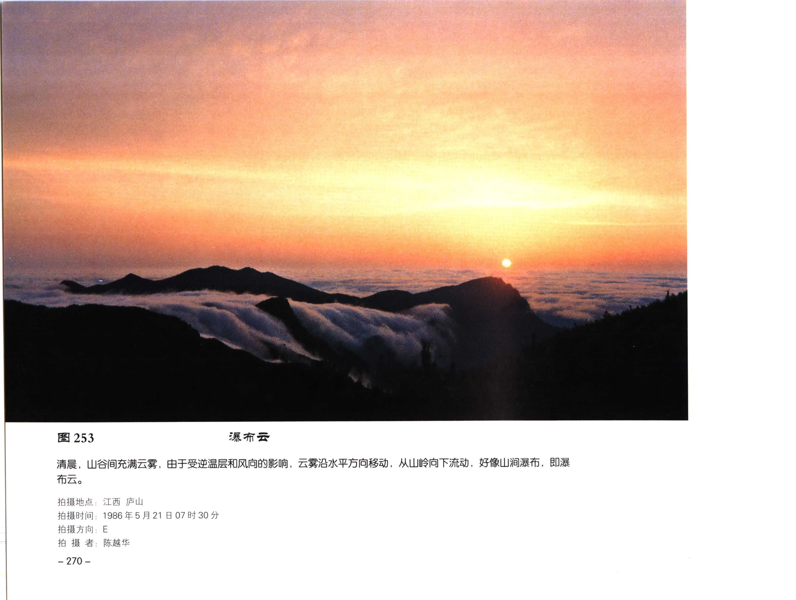

| 字段 | 内容 |
| --- | --- |
| 图号 | 图 253 |
| 拍摄地点 | 拍摄时间 : |
| 拍摄时间 | 拍摄方向: |
| 拍摄方向 | 拍 摄 者: |
| 拍摄者 | - 270- |

### OCR 文本

```text
图 253

清晨，山谷间充满云雾，

布云。
拍摄地点

拍摄时间 :
拍摄方向:
拍 摄 者:

- 270-

江西 庐山

1986 4
E
陈越华

5

21

由于受逆温层和风向的影响，

07 时 30 分

水平方向移动，从山岭向下流动，好像山润瀑布，即瀑
```

## 图 254

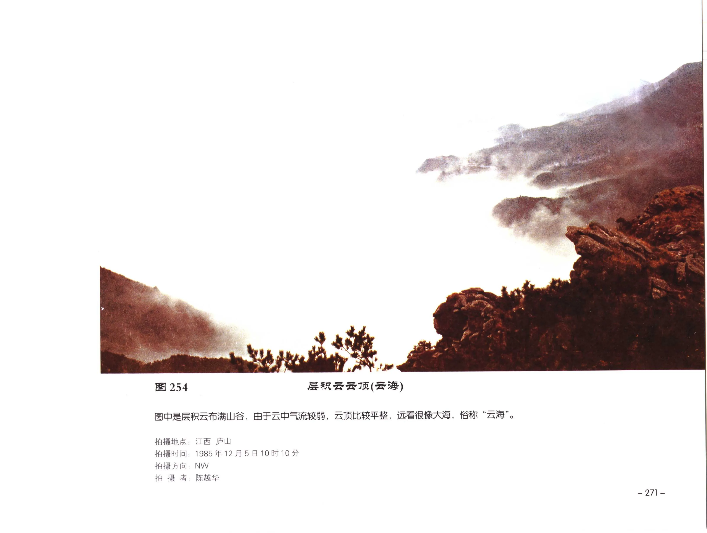

| 字段 | 内容 |
| --- | --- |
| 图号 | 图 254 |
| 拍摄地点 | 拍摄时间 |
| 拍摄时间 | 拍摄方向: |
| 拍摄方向 | 拍 摄 者: |
| 拍摄者 | 江西 庐山 |

### OCR 文本

```text
图254

图中是层积云布满山谷，由于云中气流较弱，云顶比较平整，远看很像大海，俗称“云海"。

拍摄地点:
拍摄时间
拍摄方向:
拍 摄 者:

江西 庐山
1985年12月5
NW

RIRE

A 10 8Y 10 7

-27\-
```

## 图 255

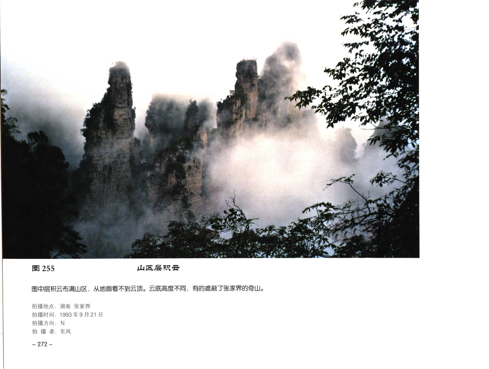

| 字段 | 内容 |
| --- | --- |
| 图号 | 图 255 |
| 拍摄地点 | 湖南 张家界 |
| 拍摄时间 | ; |
| 拍摄方向 | 拍 摄 者; |
| 拍摄者 | ; |

### OCR 文本

```text
图 255

图中层积云布满山区，从地面看不到云顶。云底高度不同，有的遮蔽了张家界的奇山。

拍摄地点: 湖南 张家界

拍摄时间 ;
拍摄方向:
拍 摄 者;

一272 -

1993 年9
N
东风

月21 日

WR RRS
```

## 图 256

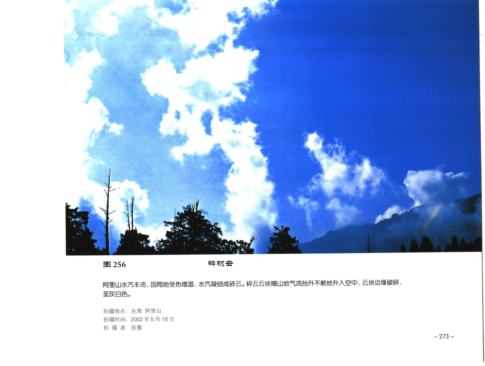

| 字段 | 内容 |
| --- | --- |
| 图号 | 图 256 |
| 拍摄地点 | 台湾 阿里山 |
| 拍摄时间 | 2002年5月18日 |

### OCR 文本

```text
图 256 碎积云

阿里山水汽丰沛, 因局地受热增温, 水汽凝结成碎云。碎云云块随山地气流抬升不断地升入空中, 云块边缘破碎，
呈灰白色。

拍摄地点: 台湾 阿里山
拍摄时间: 2002年5月18日
拍 摄 SB: kG

一273 -
```

## 图 257

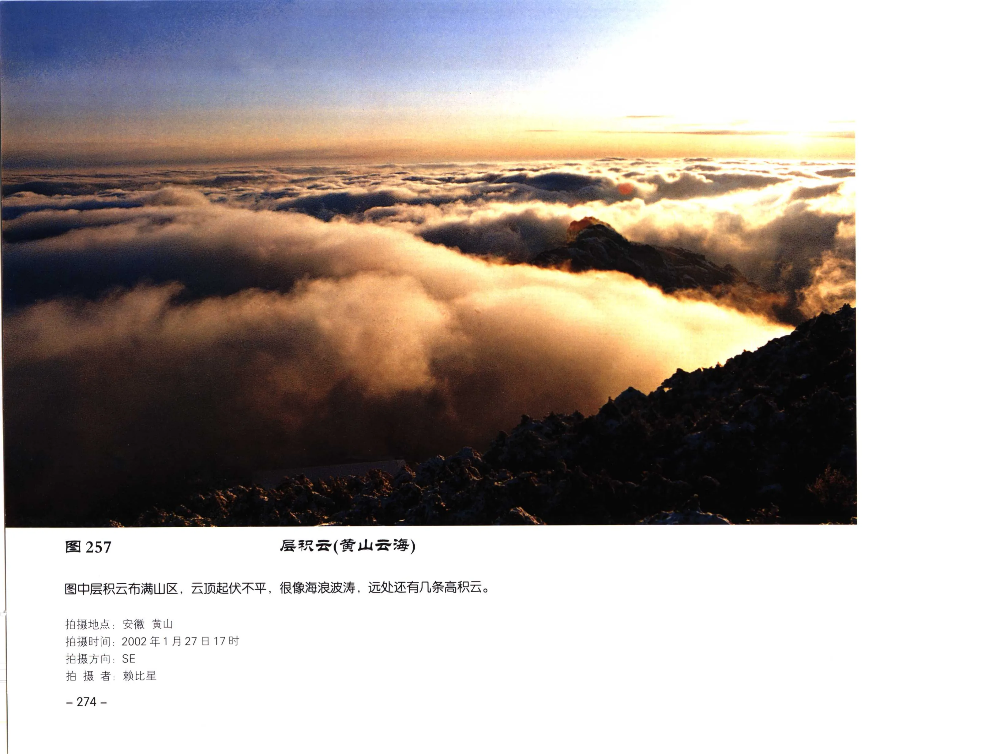

| 字段 | 内容 |
| --- | --- |
| 图号 | 图 257 |
| 拍摄地点 | 安徽 黄山 |
| 拍摄时间 | 2002年1月27日17时 |
| 拍摄方向 | SE |
| 拍摄者 | ，赖比星 |

### OCR 文本

```text
图257 层积云(黄山云海)

图中层积云布满山区，云顶起伏不平，很像海浪波涛，远处还有几条高积云。

拍摄地点: 安徽 黄山

拍摄时间: 2002年1月27日17时
拍摄方向 SE

拍 摄 者，赖比星

=274=
```

## 图 258

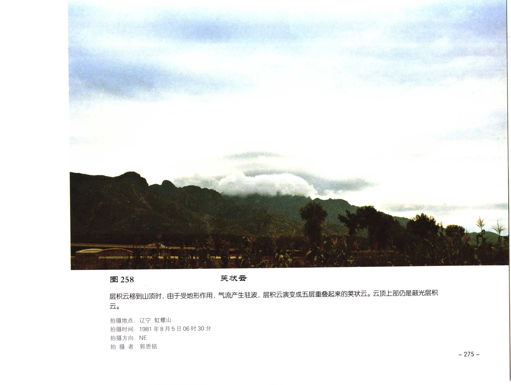

| 字段 | 内容 |
| --- | --- |
| 图号 | 图 258 |
| 拍摄地点 | ;: 辽宁 虹螺山 |
| 拍摄时间 | 1981年8月5日06时30分 |
| 拍摄方向 | ，NE |

### OCR 文本

```text
图258 RKB

层积云移到山顶时, 由于受地形作用, 气流产生驻波， 层积云演变成五层重登起来的荧状云。 云顶上部仍是蔽光层积
as

拍摄地点;: 辽宁 虹螺山
拍摄时间: 1981年8月5日06时30分
拍摄方向，NE

拍 摄 A. SRR

-— 275 -
```

## 图 259

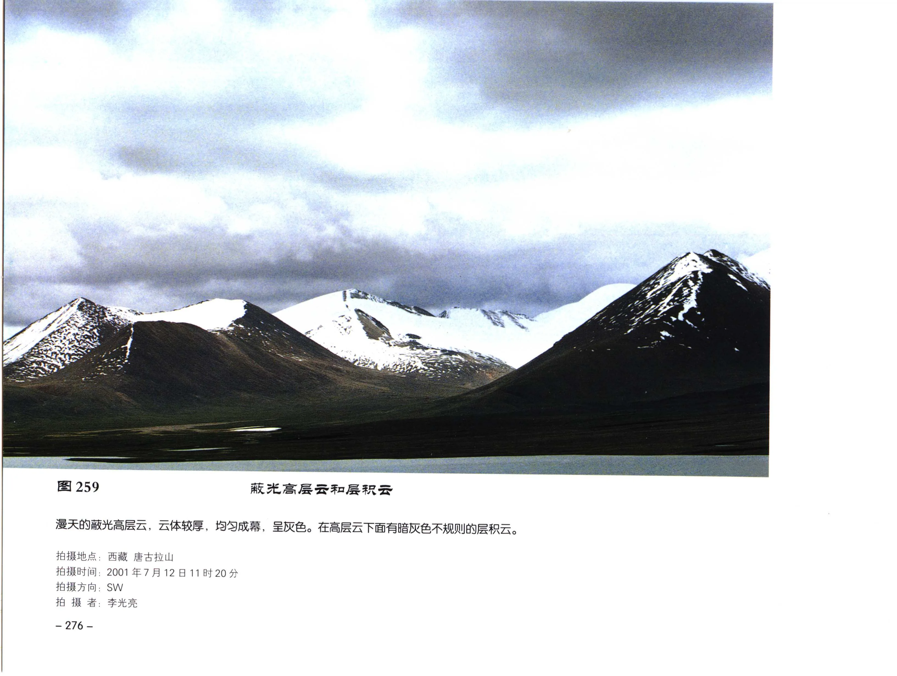

| 字段 | 内容 |
| --- | --- |
| 图号 | 图 259 |
| 拍摄地点 | 拍摄时间 ; |
| 拍摄时间 | ; |
| 拍摄方向 | 拍 摄 者: |
| 拍摄者 | 一276 - |

### OCR 文本

```text
图 259

漫天的蔽光高层云，云体较厚，均匀成幕，呈灰色。在高层云下面有瞳灰色不规则的层积云。

拍摄地点:
拍摄时间 ;
拍摄方向:
拍 摄 者:

一276 -

西藏 唐古拉山

2001年7月12日11时20分
SW

SHR

ARTE eS i FOR IR

云
```

## PDF 第 289 页

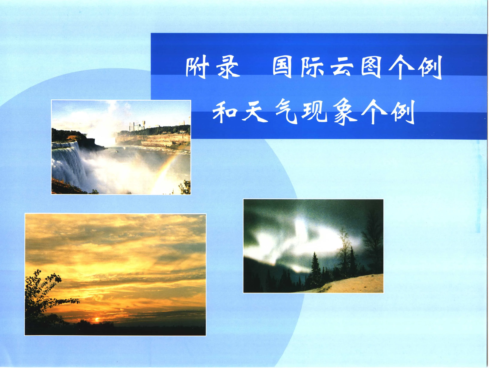

!!! note "OCR 状态"
    本页暂未识别出可靠文本，保留原页图像。

## PDF 第 290 页


!!! note "OCR 状态"
    本页暂未识别出可靠文本，保留原页图像。

## 图 260

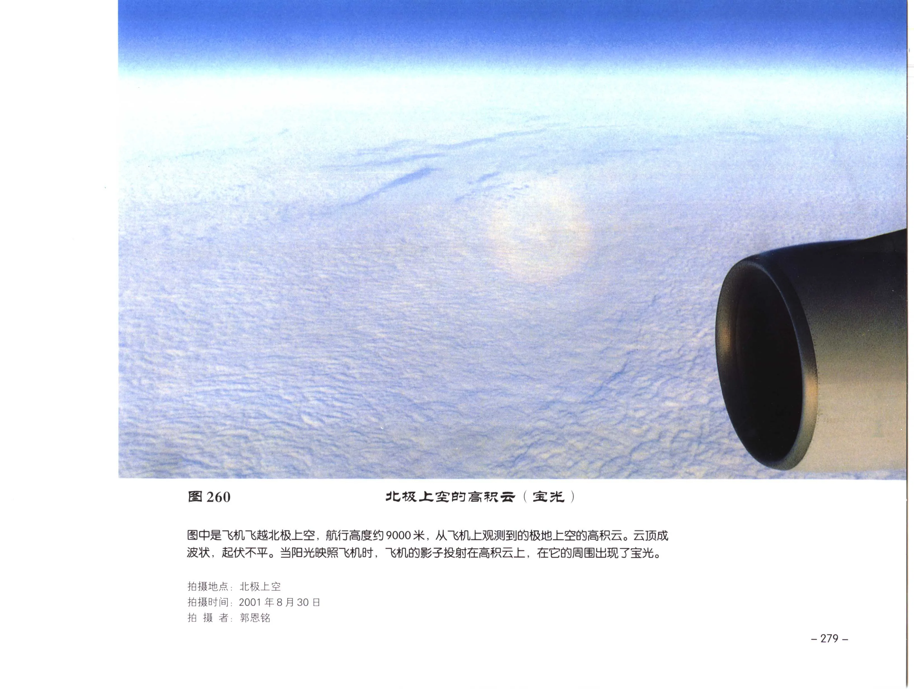

| 字段 | 内容 |
| --- | --- |
| 图号 | 图 260 |
| 拍摄地点 | 北极上空 |
| 拍摄时间 | 2001年8月30日 |

### OCR 文本

```text
Ss ee

He 3

图 260 北极上空的高积云 ( RH )

图中是飞机飞越北极上空，航行高度约 9000米，从飞机上观测到的极地上空的高积云。云项成
波状，起伏不平。当阳光映照飞机时，飞机的影子投射在高积云上，在它的周围出现了宝光。

拍摄地点: 北极上空
拍摄时间: 2001年8月30日
fo 摄 者: PRB

一279 -
```

## 图 261

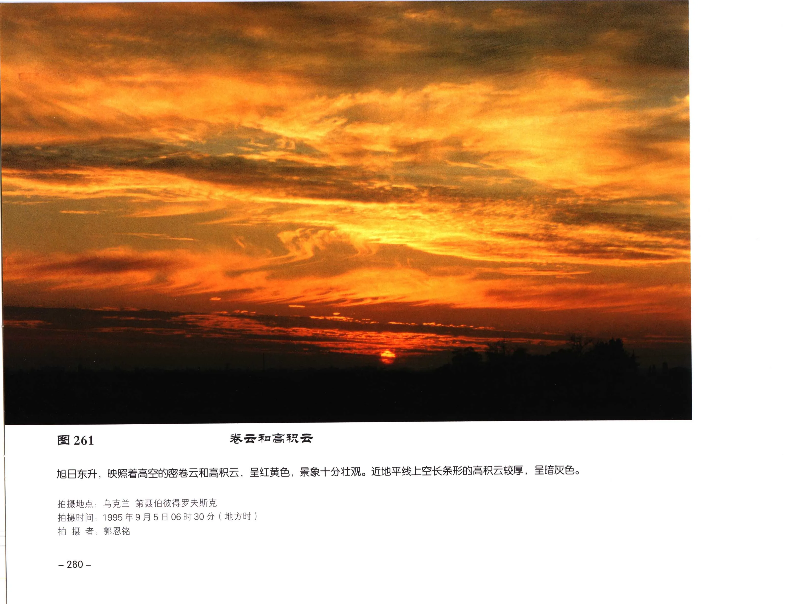

| 字段 | 内容 |
| --- | --- |
| 图号 | 图 261 |
| 拍摄地点 | 乌克兰 BRAKES AMR |
| 拍摄时间 | 1995年9月5日06时30分 (地方时 ) |

### OCR 文本

```text
RE

证

图 261 FRE Fa

旭日东升，映照着高空的密卷云和高积云，呈红黄色，景象十分壮观。近地平线上空长条形的高积云较厚，呈瞳屎色。

拍摄地点: 乌克兰 BRAKES AMR
拍摄时间: 1995年9月5日06时30分 (地方时 )
jh 摄 者; PR

— 280 -
```

## PDF 第 293 页

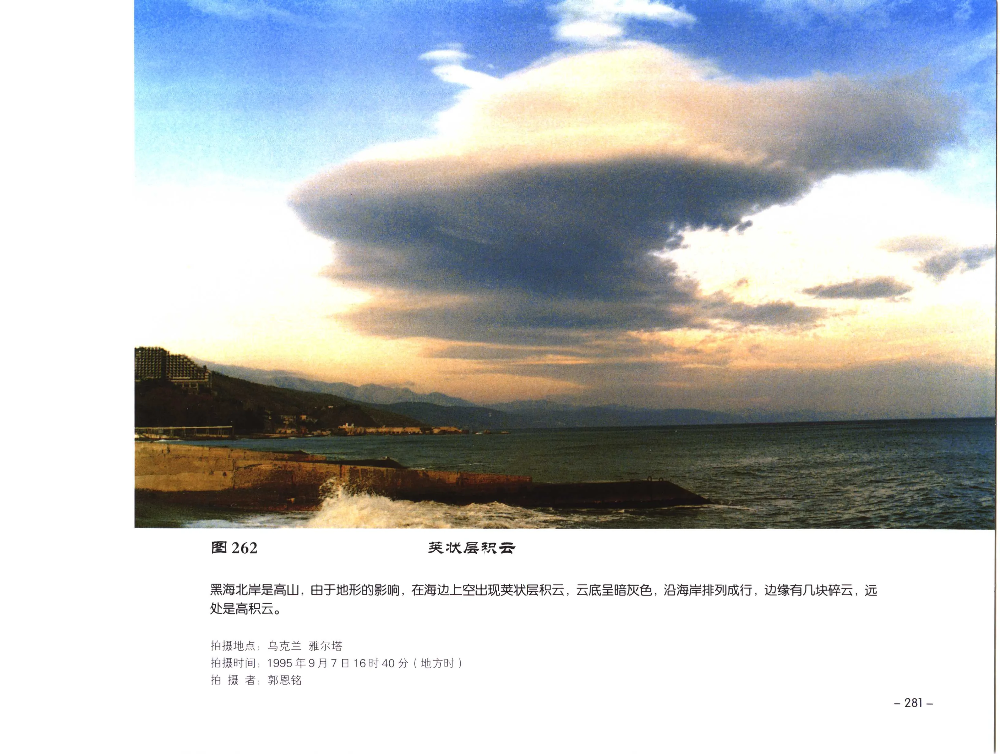

| 字段 | 内容 |
| --- | --- |
| 拍摄地点 | 拍摄时间 : |
| 拍摄时间 | 拍 摄 者: |
| 拍摄者 | 乌克兰 雅尔塔 |

### OCR 文本

```text
202

黑海北岸是高

处是高积云。

拍摄地点:
拍摄时间 :
拍 摄 者:

乌克兰 雅尔塔
1995年9月7

英状层积云

山, 由于地形的影响，在海边上空出现荧状层积云，云底呈暗灰色，沿海岸排列成行，边缘有几块碎云，远

日16时40分 (地方时 )

FB RES

— 281 -
```

## 图 263

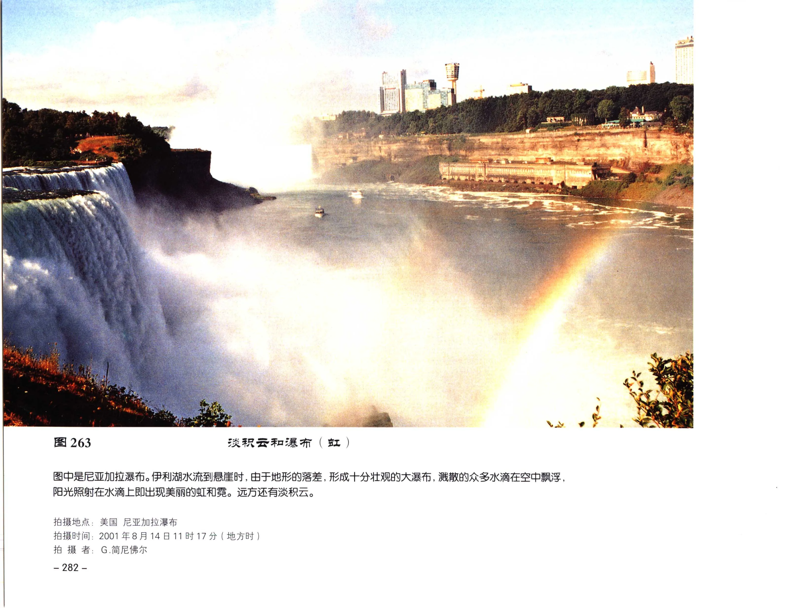

| 字段 | 内容 |
| --- | --- |
| 图号 | 图 263 |
| 拍摄地点 | ; 美国 尼亚加拉瀑布 |
| 拍摄时间 | 2001年8月14日11时17分 (地方时 ) |

### OCR 文本

```text
ure

图 263 FRIR FORA ( BL )

图中是尼亚加拉瀑布。 伊利湖水流到悬岩时, 由于地形的落差, 形成十分壮观的大瀑布, RMAHORSKBESOM
阳光照射在水滴上即出现美丽的虹和需。远方还有淡积云。

拍摄地点; 美国 尼亚加拉瀑布
拍摄时间: 2001年8月14日11时17分 (地方时 )
jh 摄 者，G .简尼佛尔

一282 -
```

## 图 264

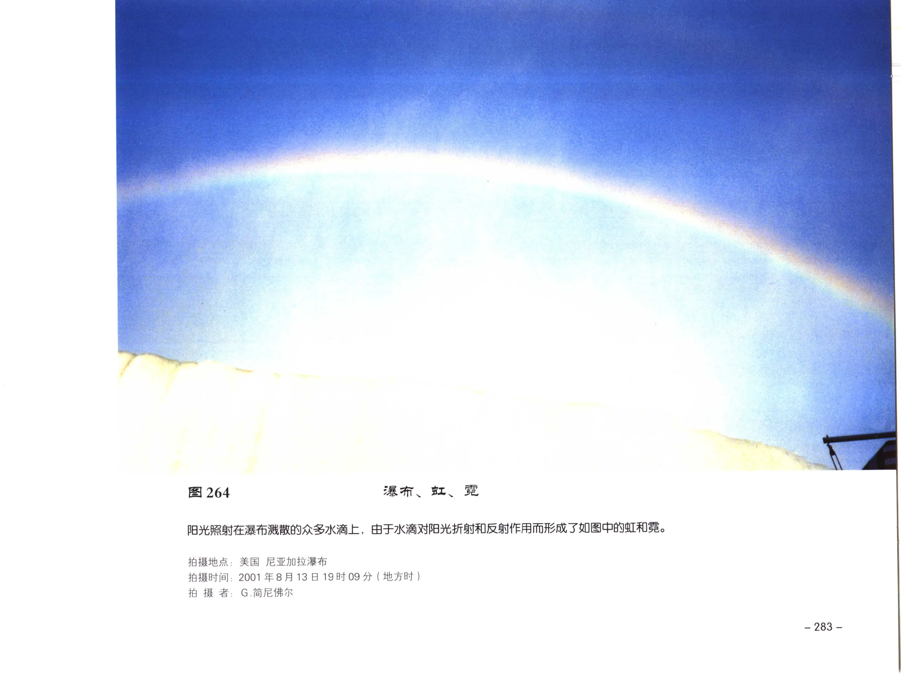

| 字段 | 内容 |
| --- | --- |
| 图号 | 图 264 |
| 拍摄地点 | ;美国 尼亚加拉瀑布 |
| 拍摄时间 | 2001年8月13日19时09分 (地方时 ) |
| 拍摄者 | ， G .简尼佛尔 |

### OCR 文本

```text
图 264 RA BLL FE

ERNE RT MAMO AS ACL, BFA ETSI ERMA SOS Paya AsS

拍摄地点;美国 尼亚加拉瀑布
拍摄时间: 2001年8月13日19时09分 (地方时 )
拍 摄 者， G .简尼佛尔

— 283 -
```

## 图 265

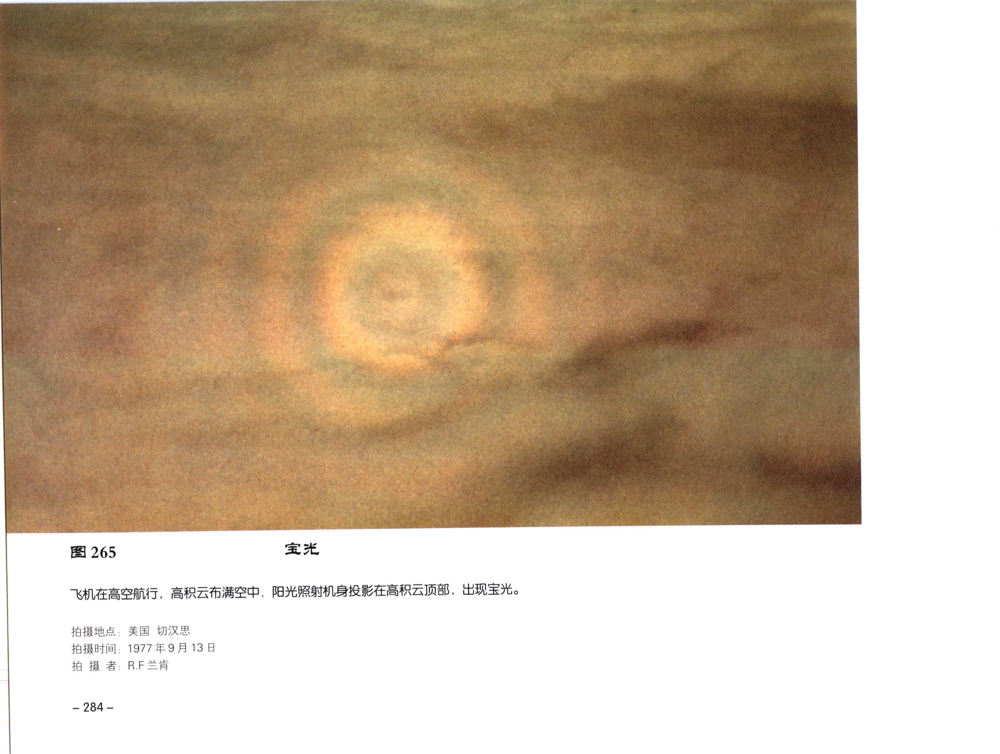

| 字段 | 内容 |
| --- | --- |
| 图号 | 图 265 |
| 拍摄地点 | ; 美国 WMA |
| 拍摄时间 | 1977年9月13日 |

### OCR 文本

```text
图 265

飞机在高空航行，高积云布满空中，阳光照射机身投影在高积云顶部，出现宝光。

拍摄地点; 美国 WMA
拍摄时间: 1977年9月13日
拍 RS. R.F兰肯

-284-
```

## 图 266

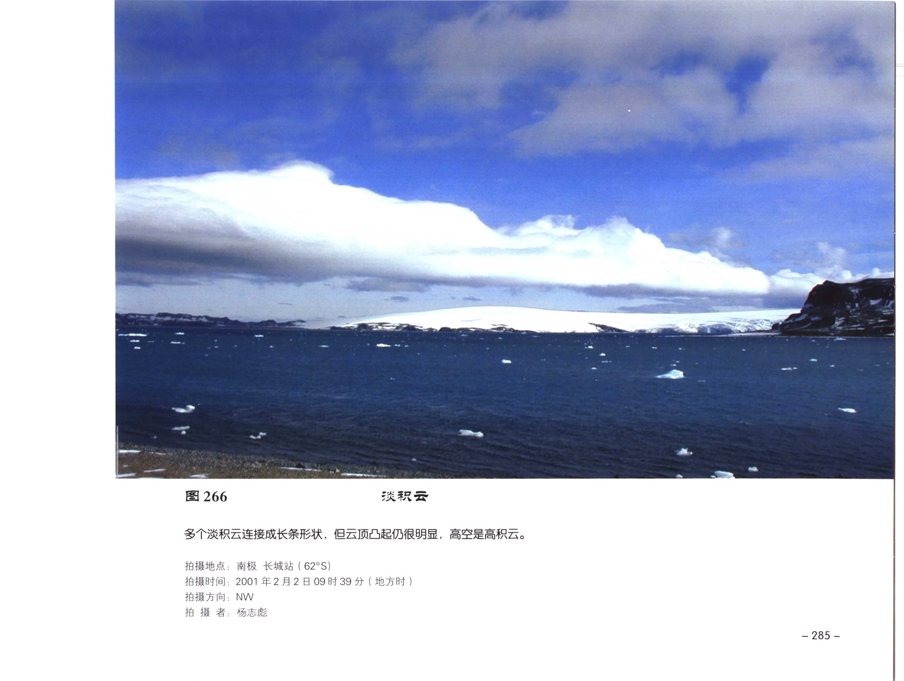

| 字段 | 内容 |
| --- | --- |
| 图号 | 图 266 |
| 拍摄地点 | 拍摄时间 : |
| 拍摄时间 | 拍摄方向: |
| 拍摄方向 | 拍 摄 者: |
| 拍摄者 | 南极 长城站 | |

### OCR 文本

```text
图 266

多个淡积云连接成长条形状，但云顶凸起仍很明显，

拍摄地点:
拍摄时间 :
拍摄方向:
拍 摄 者:

南极 长城站 |

2001年2月2
NW

62°S)
A 09 BY 39 分 ( 地方时 )

Dot

各

Dot

FRB o

— 285 -
```

## 图 267

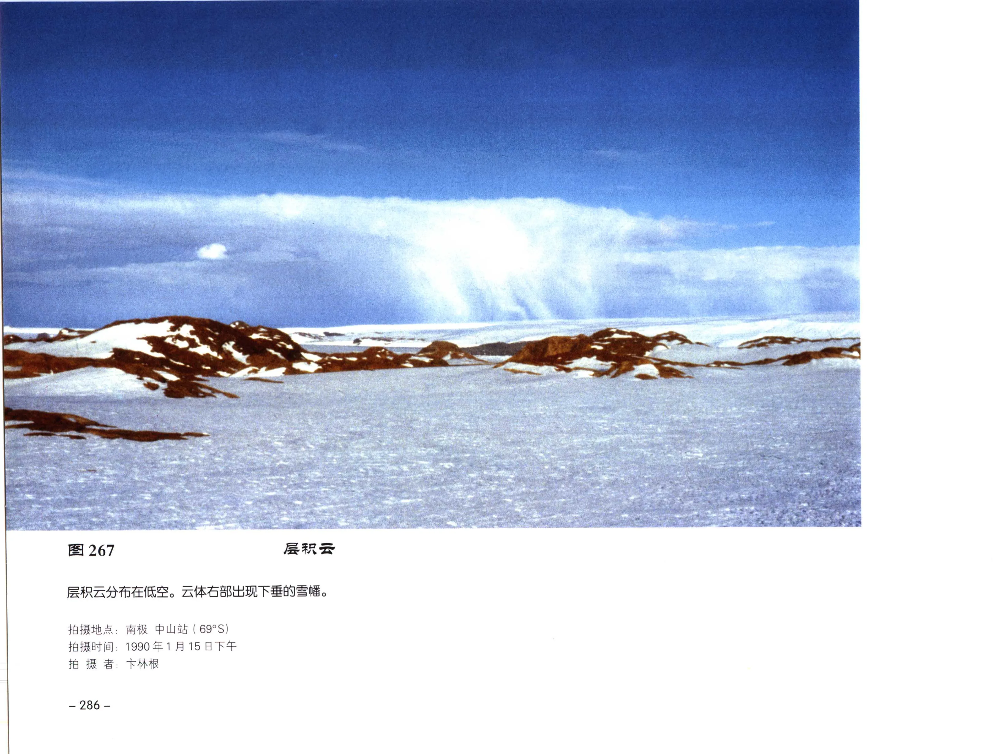

| 字段 | 内容 |
| --- | --- |
| 图号 | 图 267 |
| 拍摄地点 | ;南极 中山站 ( 69°S) |
| 拍摄时间 | 1990年1月15日下午 |
| 拍摄者 | 卞林根 |

### OCR 文本

```text
图 267 层积云

层积云分布在低空。云体右部出现下垂的雪幅。

拍摄地点;南极 中山站 ( 69°S)
拍摄时间: 1990年1月15日下午
拍 摄 者: 卞林根

— 286 -
```

## PDF 第 299 页

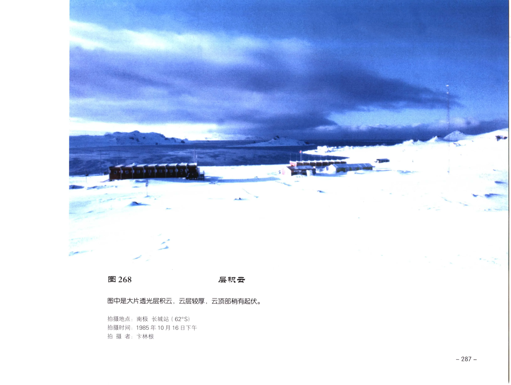

| 字段 | 内容 |
| --- | --- |
| 拍摄地点 | 南极 长城站 ( 62°S) |
| 拍摄时间 | 1985年10月16 日下午 |
| 拍摄者 | 卞林根 |

### OCR 文本

```text
208 层积云

图中是大片透光层积云，云层较厚，云顶部稍有起伏。

拍摄地点: 南极 长城站 ( 62°S)
拍摄时间: 1985年10月16 日下午
拍 摄 者: 卞林根

— 287 -
```

## 图 269

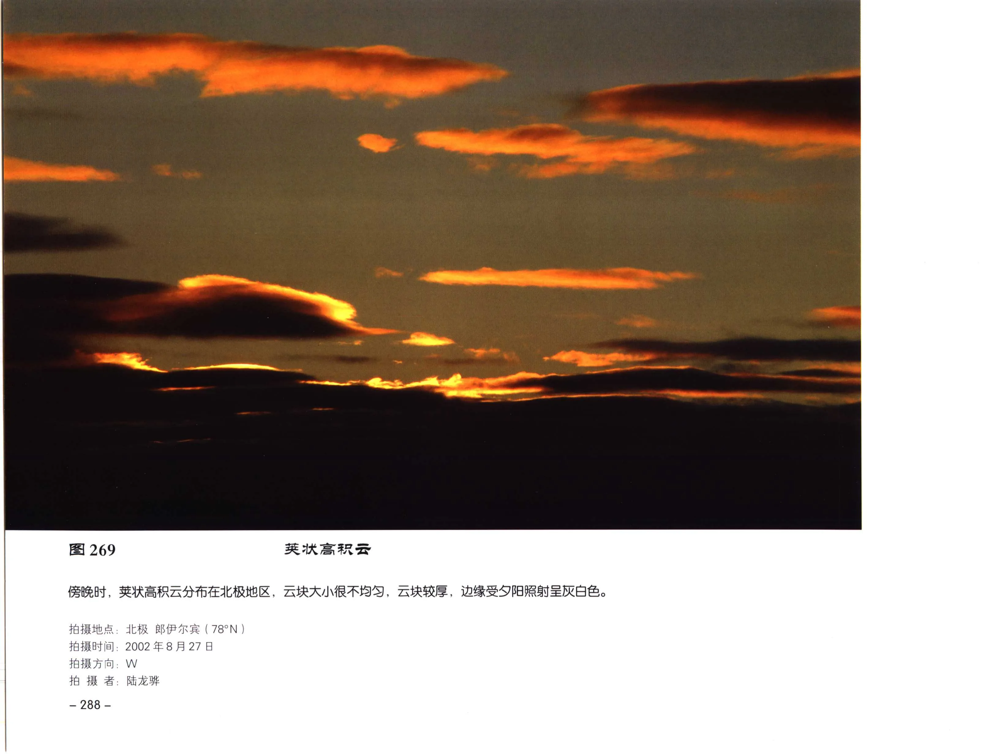

| 字段 | 内容 |
| --- | --- |
| 图号 | 图 269 |
| 拍摄地点 | ; 北极 郎伊尔宾 ( 78°N ) |
| 拍摄时间 | 2002 8A 2748 |
| 拍摄方向 | ，W |
| 拍摄者 | BACB |

### OCR 文本

```text
图 269 RIK BRE

傍晚时，莹状高积云分布在北极地区 ，云块大小很不均匀，云块较厚，边缘受夕阳照射呈灰白色。

拍摄地点; 北极 郎伊尔宾 ( 78°N )
拍摄时间: 2002 8A 2748
拍摄方向，W

拍 摄 者: BACB

— 288 -
```
