# 飞机上观测云图

本页整理《中国云图》中“飞机上观测云图”部分的图版，范围覆盖 PDF 第 253-272 页中的章节页和图 228-245。PDF 第 253 页为章节标题页，第 254 页为空白页或过渡页。

!!! note "校订状态"
    本页以 OCR 文本和原页图像共同整理。图 230 在原分页 OCR 中未识别出图号，但据连续页码和图版清单可确定对应 PDF 第 257 页；图 228-245 的标题、拍摄字段和说明文字已按可辨原页图像校订。已复核 PDF 第 255-272 页字段区，原页未列出的拍摄地点或拍摄方向统一标注为“原页未列出”。

## 图版列表

| 图号 | 云类或主题 | PDF 页 | 主要内容 |
| --- | --- | --- | --- |
| 图 228 | 卷层云 | 255 | 清晨 9000-10000 米高度，飞机下方卷层云呈暗黑色。 |
| 图 229 | 卷层云和积雨云 | 256 | 飞行高度 10000 米，卷层云与积雨云顶部同现。 |
| 图 230 | 卷积云 | 257 | 10000 米高空拍摄到鱼鳞片状、成群排列的卷积云。 |
| 图 231 | 卷层云 | 258 | 河南上空 10000 米高度观测到顶部呈波浪形的卷层云。 |
| 图 232 | 卷云和浓积云 | 259 | 东海上空约 7000 米高度，毛卷云、密卷云、浓积云和淡积云同现。 |
| 图 233 | 积雨云顶部 | 260 | 河南上空 9000 米高度观测到穿过稳定层继续发展的积雨云顶部。 |
| 图 234 | 积雨云砧状和浓积云顶部 | 261 | 飞机 9000 米高度观测积雨云砧状云顶和浓积云顶部。 |
| 图 235 | 砧状积雨云 | 262 | 9000 米高空观测旺盛发展的砧状积雨云。 |
| 图 236 | 砧状积雨云 | 263 | 冷锋移到辽西地区后，锋面附近有多个砧状积雨云，周围分布浓积云。 |
| 图 237 | 砧状积雨云 | 264 | 山西上空冷锋沿线的砧状积雨云及周围浓积云、淡积云。 |
| 图 238 | 横断山脉积雨云 | 265 | 横断山脉上空积雨云单体，云顶已成砧状并冰晶化。 |
| 图 239 | 浓积云 | 266 | 湖南上空发展旺盛的浓积云，云顶有白色嶙状云。 |
| 图 240 | 淡积云 | 267 | 浙江上空低空淡积云和浓积云，条状云为高积云。 |
| 图 241 | 荚状高积云 | 268 | 河南与山西上空多块荚状高积云。 |
| 图 242 | 高层云云顶 | 269 | 飞机上观测高层云云顶高度和波状起伏。 |
| 图 243 | 层积云和高层云 | 270 | 乌鲁木齐冷锋天气中，层积云上方为高层云。 |
| 图 244 | 飞机尾迹 | 271 | 山东泰山气象站观测到的飞机尾迹。 |
| 图 245 | 飞机尾迹 | 272 | 飞机特技飞行后，尾迹扩展成粗条状。 |

## 章节页

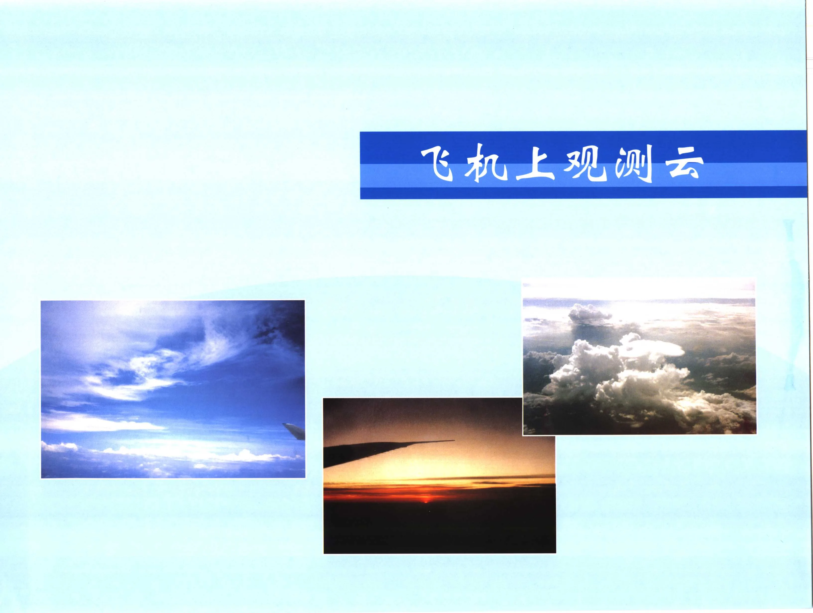

PDF 第 253 页为“飞机上观测云图”章节标题页。

PDF 第 254 页为无可靠正文的空白或过渡页，保留原页图像以便回查。

## 高空卷层云、卷积云和积雨云

### 图 228：卷层云

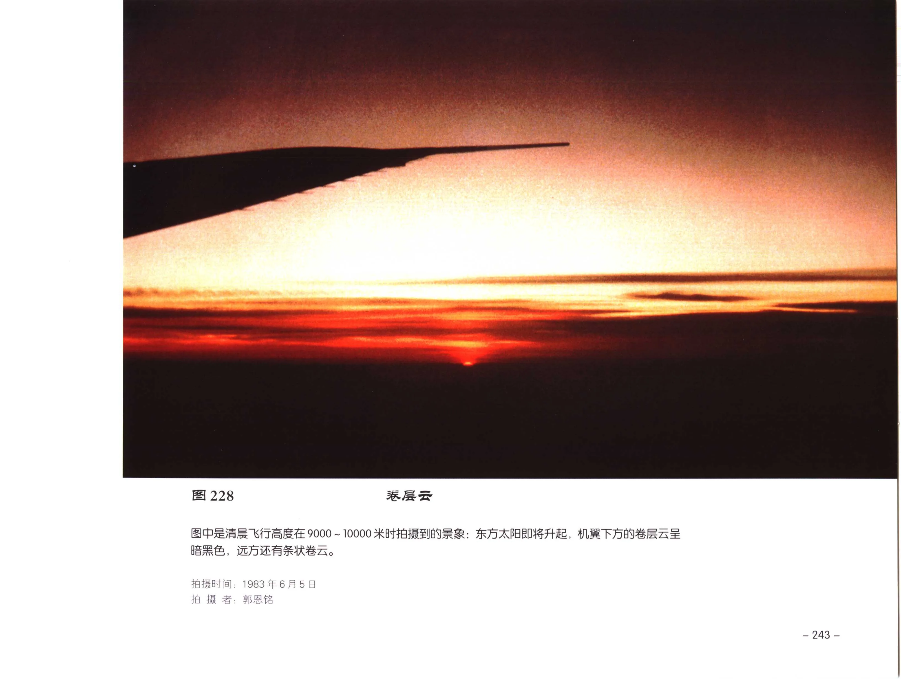

| 字段 | 内容 |
| --- | --- |
| 拍摄地点 | 原页未列出 |
| 飞行高度 | 9000-10000 米 |
| 拍摄时间 | 1983年6月5日 |
| 拍摄方向 | 原页未列出 |
| 拍摄者 | 郭恩铭 |
| 原分页 | [PDF 第 255 页](../pages-241-260.md) |

图中是清晨飞机高度在 9000-10000 米时拍摄到的景象：东方太阳即将升起，机翼下方的卷层云呈暗黑色，远方还有条状卷云。

### 图 229：卷层云和积雨云

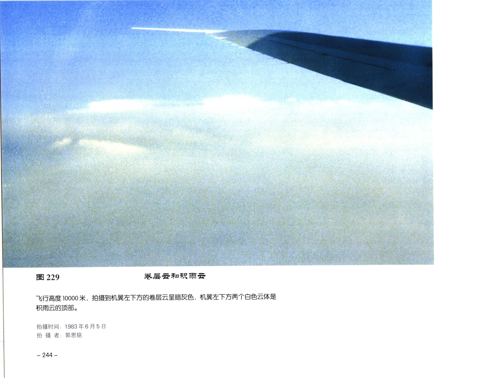

| 字段 | 内容 |
| --- | --- |
| 拍摄地点 | 原页未列出 |
| 飞行高度 | 10000 米 |
| 拍摄时间 | 1983年6月5日 |
| 拍摄方向 | 原页未列出 |
| 拍摄者 | 郭恩铭 |
| 原分页 | [PDF 第 256 页](../pages-241-260.md) |

飞行高度 10000 米，拍摄到机翼左下方的卷层云呈暗灰色，机翼左下方两个白色云体是积雨云的顶部。

### 图 230：卷积云

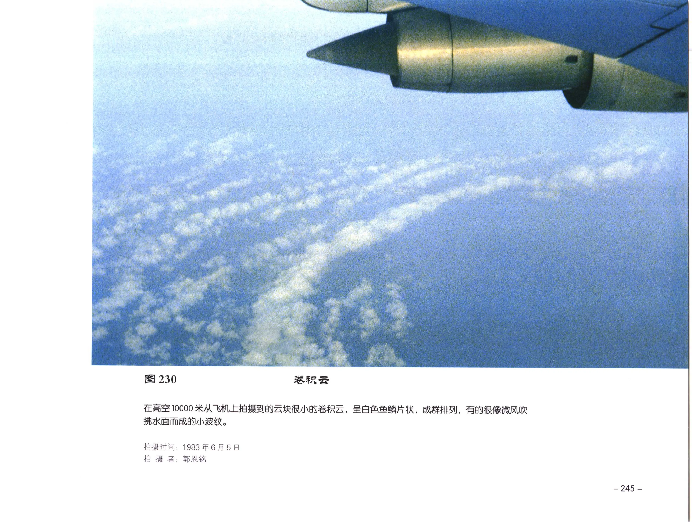

| 字段 | 内容 |
| --- | --- |
| 拍摄地点 | 原页未列出 |
| 飞行高度 | 10000 米 |
| 拍摄时间 | 1983年6月5日 |
| 拍摄方向 | 原页未列出 |
| 拍摄者 | 郭恩铭 |
| 原分页 | [PDF 第 257 页](../pages-241-260.md) |

在高空 10000 米从飞机上拍摄到的云块很小的卷积云，呈白色鱼鳞片状，成群排列，有的很像微风吹拂水面而成的小波纹。

### 图 231：卷层云

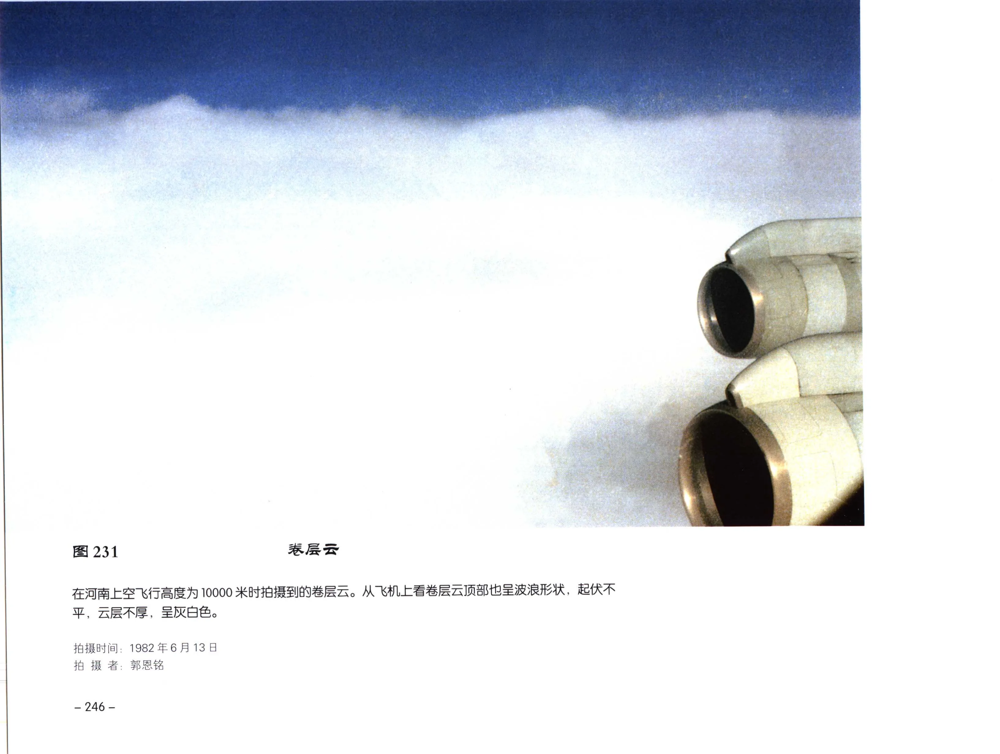

| 字段 | 内容 |
| --- | --- |
| 拍摄地点 | 河南上空 |
| 飞行高度 | 10000 米 |
| 拍摄时间 | 1982年6月13日 |
| 拍摄方向 | 原页未列出 |
| 拍摄者 | 郭恩铭 |
| 原分页 | [PDF 第 258 页](../pages-241-260.md) |

在河南上空飞行高度为 10000 米时拍摄到的卷层云。从飞机上看卷层云顶部也呈波浪形状，起伏不平，云层不厚，呈灰白色。

### 图 232：卷云和浓积云

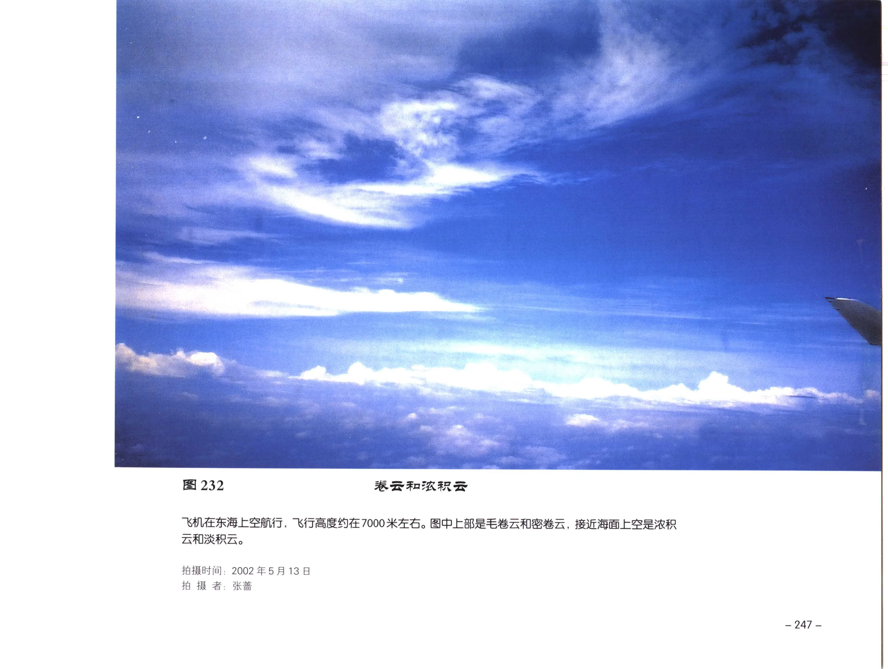

| 字段 | 内容 |
| --- | --- |
| 拍摄地点 | 东海上空 |
| 飞行高度 | 约 7000 米 |
| 拍摄时间 | 2002年5月13日 |
| 拍摄方向 | 原页未列出 |
| 拍摄者 | 张善 |
| 原分页 | [PDF 第 259 页](../pages-241-260.md) |

飞机在东海上空航行，飞行高度约在 7000 米左右。图中上部是毛卷云和密卷云，接近海面上空是浓积云和淡积云。

### 图 233：积雨云顶部

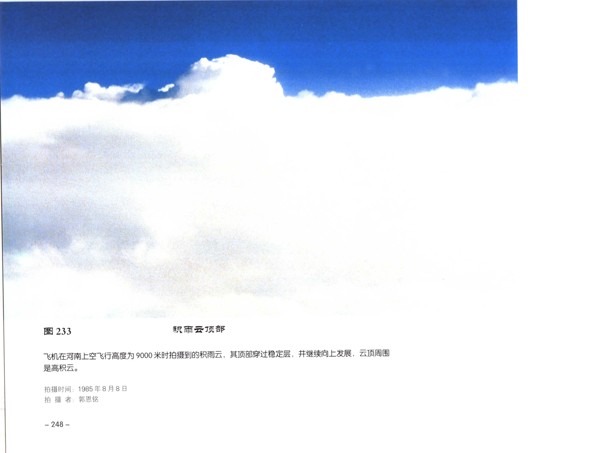

| 字段 | 内容 |
| --- | --- |
| 拍摄地点 | 河南上空 |
| 飞行高度 | 9000 米 |
| 拍摄时间 | 1985年8月8日 |
| 拍摄方向 | 原页未列出 |
| 拍摄者 | 郭恩铭 |
| 原分页 | [PDF 第 260 页](../pages-241-260.md) |

飞机在河南上空飞行高度为 9000 米时拍摄到的积雨云，其顶部穿过稳定层，并继续向上发展，云顶周围是高积云。

## 积雨云、浓积云和高积云

### 图 234：积雨云砧状和浓积云顶部

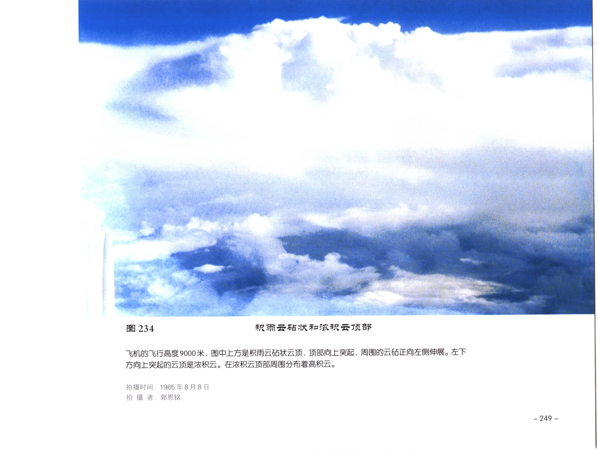

| 字段 | 内容 |
| --- | --- |
| 拍摄地点 | 原页未列出 |
| 飞行高度 | 9000 米 |
| 拍摄时间 | 1985年8月8日 |
| 拍摄方向 | 原页未列出 |
| 拍摄者 | 郭恩铭 |
| 原分页 | [PDF 第 261 页](../pages-261-280.md) |

飞机的飞行高度 9000 米，图中上方是积雨云砧状云顶，顶部向上突起，周围的云砧正向左侧伸展。左下方向上突起的云顶是浓积云，在浓积云顶部周围分布着高积云。

### 图 235：砧状积雨云

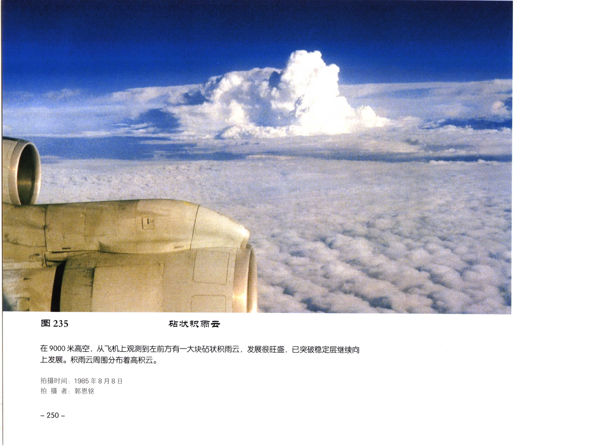

| 字段 | 内容 |
| --- | --- |
| 拍摄地点 | 原页未列出 |
| 飞行高度 | 9000 米 |
| 拍摄时间 | 1985年8月8日 |
| 拍摄方向 | 原页未列出 |
| 拍摄者 | 郭恩铭 |
| 原分页 | [PDF 第 262 页](../pages-261-280.md) |

在 9000 米高空，从飞机上观测到左前方有一大块砧状积雨云，发展很旺盛，已突破稳定层继续向上发展。积雨云周围分布着高积云。

### 图 236：砧状积雨云

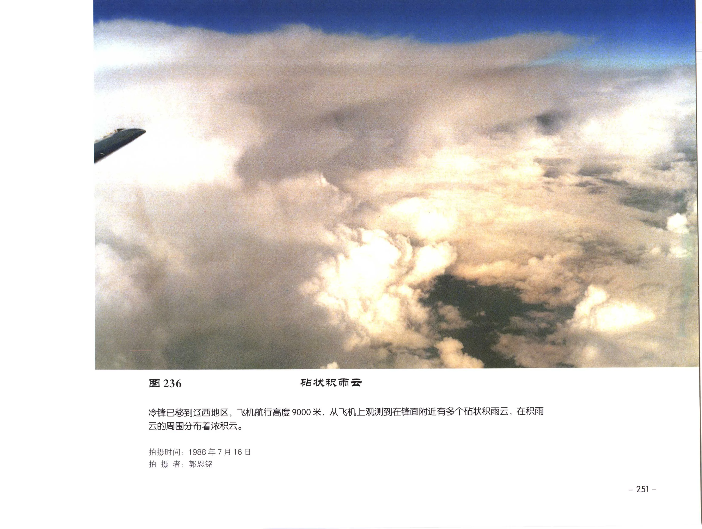

| 字段 | 内容 |
| --- | --- |
| 拍摄地点 | 原页未列出 |
| 飞行高度 | 9000 米 |
| 拍摄时间 | 1988年7月16日 |
| 拍摄方向 | 原页未列出 |
| 拍摄者 | 郭恩铭 |
| 原分页 | [PDF 第 263 页](../pages-261-280.md) |

冷锋已移到辽西地区，飞机航行高度 9000 米，从飞机上观测到在锋面附近有多个砧状积雨云，在积雨云的周围分布着浓积云。

### 图 237：砧状积雨云

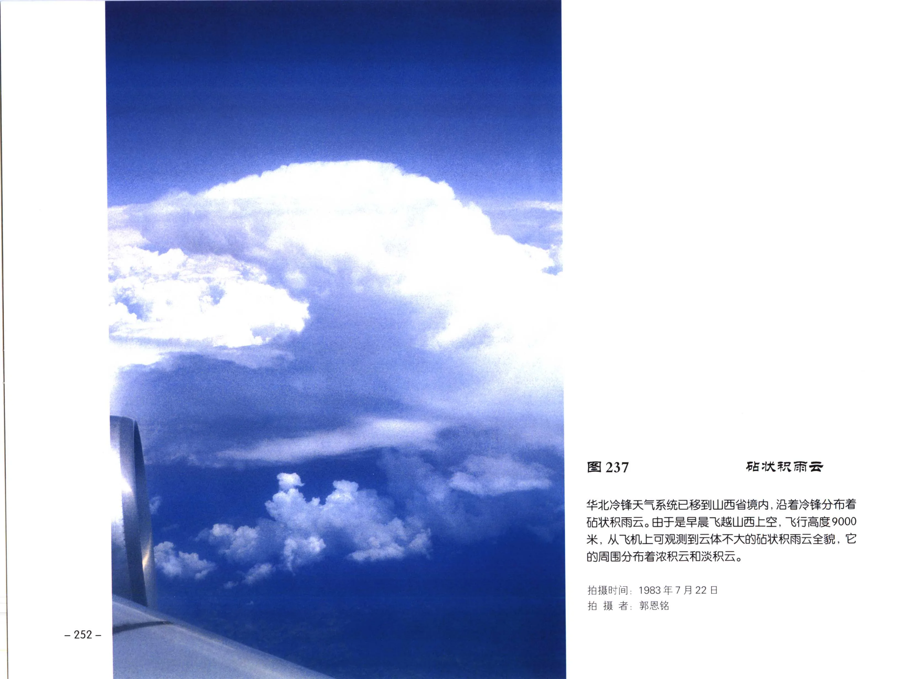

| 字段 | 内容 |
| --- | --- |
| 拍摄地点 | 山西上空 |
| 飞行高度 | 9000 米 |
| 拍摄时间 | 1983年7月22日 |
| 拍摄方向 | 原页未列出 |
| 拍摄者 | 郭恩铭 |
| 原分页 | [PDF 第 264 页](../pages-261-280.md) |

华北冷锋天气系统已移到山西省境内，沿着冷锋分布着砧状积雨云。由于是早晨飞越山西上空，飞行高度 9000 米，从飞机上可观测到云体不大的砧状积雨云全貌，它的周围分布着浓积云和淡积云。

### 图 238：横断山脉积雨云

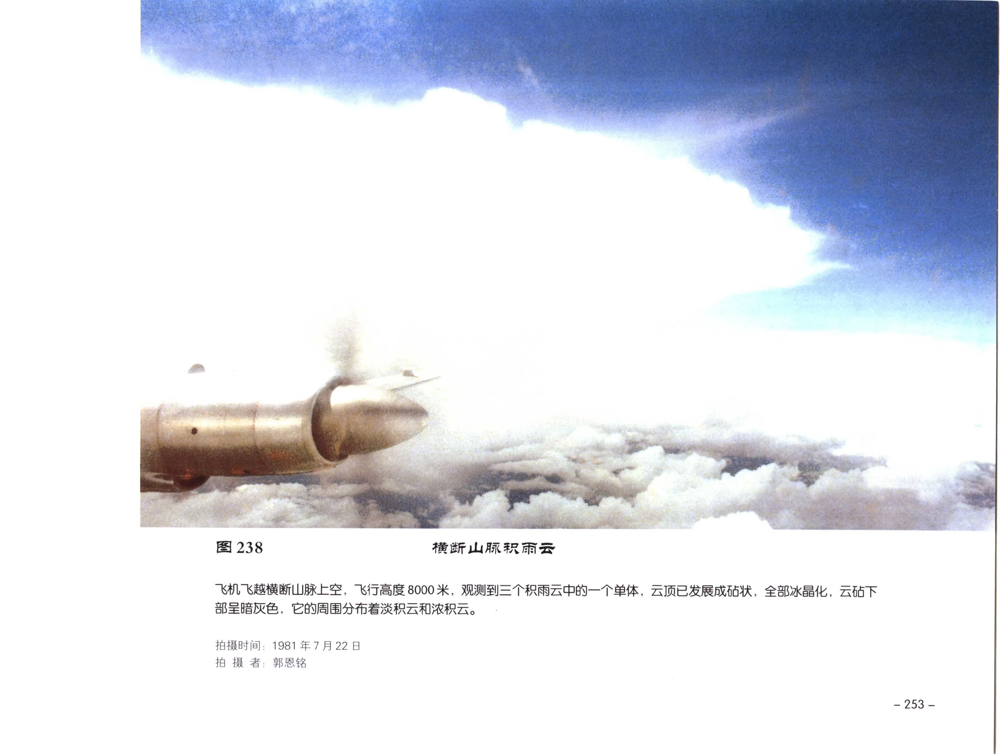

| 字段 | 内容 |
| --- | --- |
| 拍摄地点 | 横断山脉上空 |
| 飞行高度 | 8000 米 |
| 拍摄时间 | 1981年7月22日 |
| 拍摄方向 | 原页未列出 |
| 拍摄者 | 郭恩铭 |
| 原分页 | [PDF 第 265 页](../pages-261-280.md) |

飞机飞越横断山脉上空，飞行高度 8000 米，观测到三个积雨云中的一个单体。云顶已发展成砧状，全部冰晶化，云砧下部呈暗灰色，它的周围分布着淡积云和浓积云。

### 图 239：浓积云

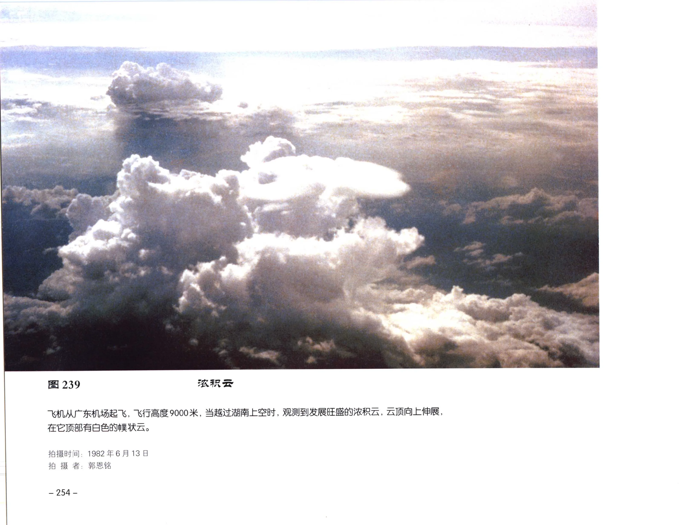

| 字段 | 内容 |
| --- | --- |
| 拍摄地点 | 湖南上空 |
| 飞行高度 | 9000 米 |
| 拍摄时间 | 1982年6月13日 |
| 拍摄方向 | 原页未列出 |
| 拍摄者 | 郭恩铭 |
| 原分页 | [PDF 第 266 页](../pages-261-280.md) |

飞机从广东机场起飞，当越过湖南上空时，观测到发展旺盛的浓积云，云顶向上伸展，在它顶部有白色的嶙状云。

### 图 240：淡积云

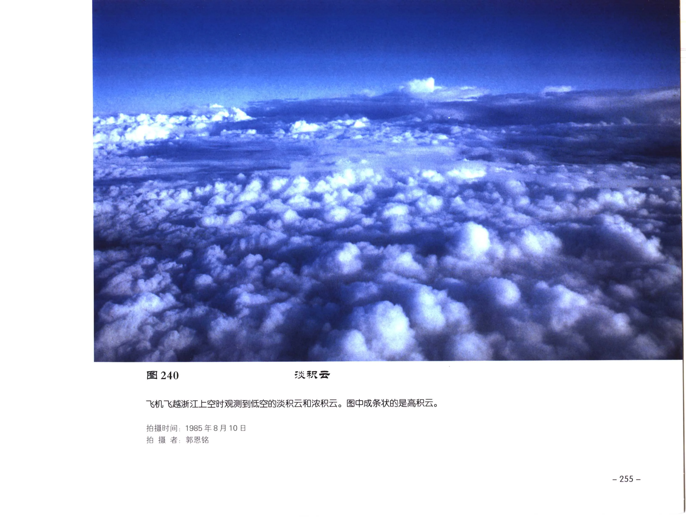

| 字段 | 内容 |
| --- | --- |
| 拍摄地点 | 浙江上空 |
| 拍摄时间 | 1985年8月10日 |
| 拍摄方向 | 原页未列出 |
| 拍摄者 | 郭恩铭 |
| 原分页 | [PDF 第 267 页](../pages-261-280.md) |

飞机飞越浙江上空时观测到低空的淡积云和浓积云。图中成条状的是高积云。

### 图 241：荚状高积云

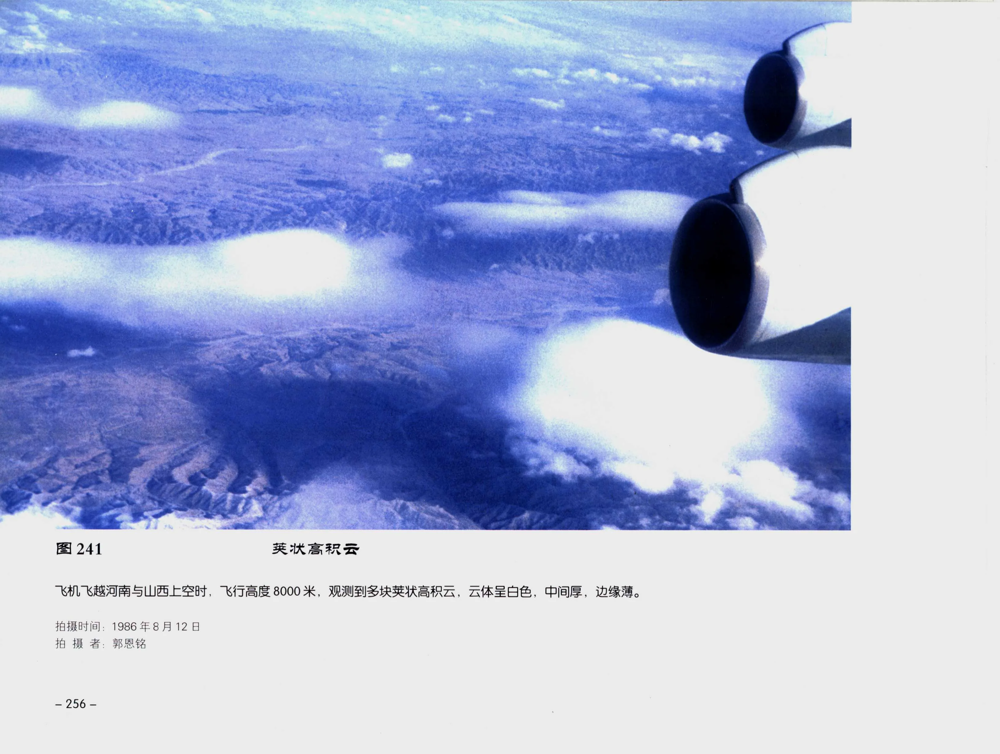

| 字段 | 内容 |
| --- | --- |
| 拍摄地点 | 河南与山西上空 |
| 飞行高度 | 8000 米 |
| 拍摄时间 | 1986年8月12日 |
| 拍摄方向 | 原页未列出 |
| 拍摄者 | 郭恩铭 |
| 原分页 | [PDF 第 268 页](../pages-261-280.md) |

飞机飞越河南与山西上空时，飞行高度 8000 米，观测到多块荚状高积云，云体呈白色，中间厚，边缘薄。

### 图 242：高层云云顶

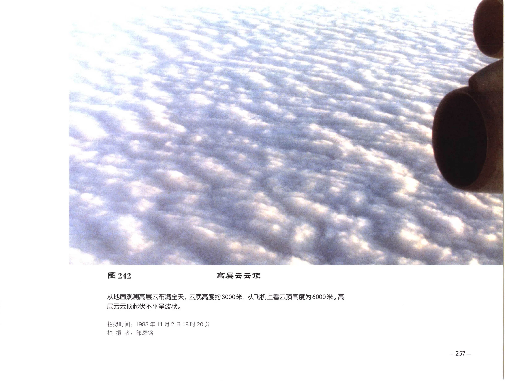

| 字段 | 内容 |
| --- | --- |
| 拍摄地点 | 原页未列出 |
| 云底高度 | 约 3000 米 |
| 云顶高度 | 约 6000 米 |
| 拍摄时间 | 1983年11月2日18时20分 |
| 拍摄方向 | 原页未列出 |
| 拍摄者 | 郭恩铭 |
| 原分页 | [PDF 第 269 页](../pages-261-280.md) |

从地面观测高层云布满全天，云底高度约 3000 米；从飞机上看云顶高度为 6000 米。高层云云顶起伏不平，呈波状。

### 图 243：层积云和高层云

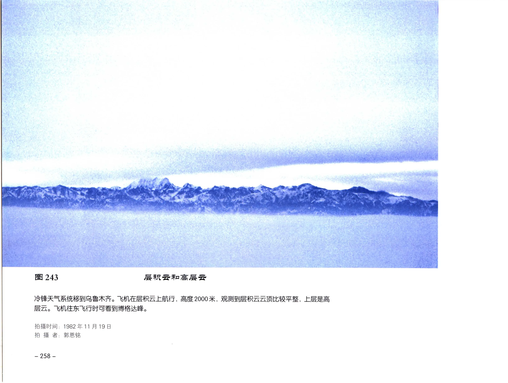

| 字段 | 内容 |
| --- | --- |
| 拍摄地点 | 乌鲁木齐上空 |
| 飞行高度 | 2000 米 |
| 拍摄时间 | 1982年11月19日 |
| 拍摄方向 | 原页未列出 |
| 拍摄者 | 郭恩铭 |
| 原分页 | [PDF 第 270 页](../pages-261-280.md) |

冷锋天气系统移到乌鲁木齐。飞机在层积云上航行，高度 2000 米，观测到层积云云顶比较平整，上层是高层云。飞机往东飞行时可看到博格达峰。

## 飞机尾迹

### 图 244：飞机尾迹

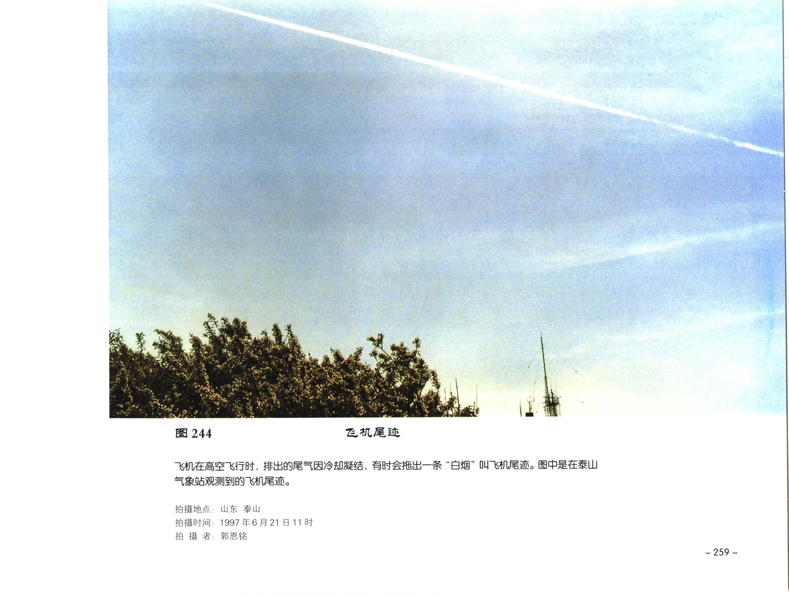

| 字段 | 内容 |
| --- | --- |
| 拍摄地点 | 山东 泰山 |
| 拍摄时间 | 1997年6月21日11时 |
| 拍摄方向 | 原页未列出 |
| 拍摄者 | 郭恩铭 |
| 原分页 | [PDF 第 271 页](../pages-261-280.md) |

飞机发动机排出的废气中含有水汽和杂质，有时会拖出一条“白烟”，叫飞机尾迹。图中是在泰山气象站观测到的飞机尾迹。

### 图 245：飞机尾迹

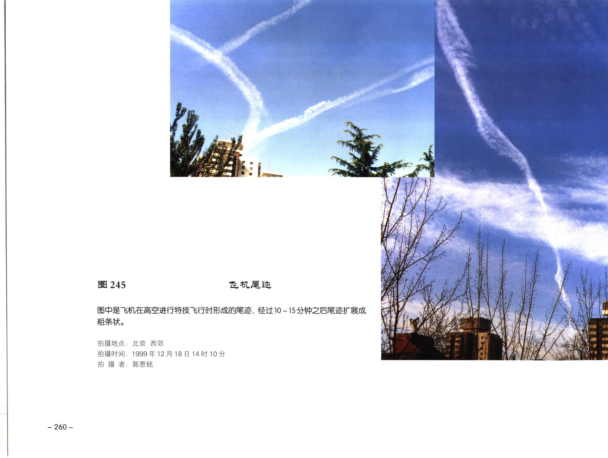

| 字段 | 内容 |
| --- | --- |
| 拍摄地点 | 北京 西部 |
| 拍摄时间 | 1999年12月18日14时10分 |
| 拍摄方向 | 原页未列出 |
| 拍摄者 | 郭恩铭 |
| 原分页 | [PDF 第 272 页](../pages-261-280.md) |

图中是飞机在高空进行特技飞行时形成的尾迹，经过 10-15 分钟之后尾迹扩展成粗条状。
