# 高云图版：卷层云与卷积云

本页整理《中国云图》高云部分中卷层云和卷积云相关图版，范围覆盖 PDF 第 169-184 页中的图 143-158。

!!! note "校订状态"
    本页以 OCR 文本和原页图像共同整理。`CH6`、`CH7`、`CH8`、`CH9` 等代码、拍摄字段和说明文字已按可辨原页图像校订。

## 图版列表

| 图号 | 云类 | 代码 | PDF 页 | 主要内容 |
| --- | --- | --- | --- | --- |
| 图 143 | 毛卷层云 | CH6 | 169 | 云层薄处可见太阳，厚处呈灰色。 |
| 图 144 | 毛卷层云 | CH6 | 170 | 毛卷层云移入测站东部高空，阳光透过云层映照海面。 |
| 图 145 | 毛卷层云 | CH6 | 171 | 云层较厚且不均匀，透过薄处可见太阳。 |
| 图 146 | 毛卷层云 | CH7 | 172 | 云层布满全天，厚度很不均匀，并伴有高积云、淡积云和碎积云。 |
| 图 147 | 薄幕卷层云 | CH7 | 173 | 薄幕卷层云布满全天，出现完整明显的 22 度晕圈。 |
| 图 148 | 毛卷层云 | CH8 | 174 | 灰白色毛卷层云，云层厚度较均匀但未布满全天。 |
| 图 149 | 卷积云 | CH9 | 175 | 白色波状卷积云排列成行。 |
| 图 150 | 卷积云 | CH9 | 176 | 卷积云系统移至测站上空，白色云体呈波纹状排列。 |
| 图 151 | 卷积云 | CH9 | 177 | 卷积云由西北向东南移动，部分呈鱼鳞片状。 |
| 图 152 | 卷积云 | CH9 | 178 | 卷积云由密卷云逐渐演变而成。 |
| 图 153 | 卷积云 | CH9 | 179 | 卷积云个体大小不均，密集成群。 |
| 图 154 | 卷积云 | CH9 | 180 | 上部卷积云呈波状排列，下部密卷云遮蔽太阳。 |
| 图 155 | 卷积云 | CH9 | 181 | 波状卷积云由密卷云演变而成，伴有片状和波浪状密卷云。 |
| 图 156 | 卷积云 | CH9 | 182 | 密卷云扩展演变而成卷积云，白色、波状排列。 |
| 图 157 | 卷积云 | CH9 | 183 | 卷积云由密卷云演变而成，云块较小，密集成群。 |
| 图 158 | 卷积云 | CH9 | 184 | 卷积云呈鱼鳞片状，由密卷云演变而成。 |

## 卷层云

### 图 143：毛卷层云

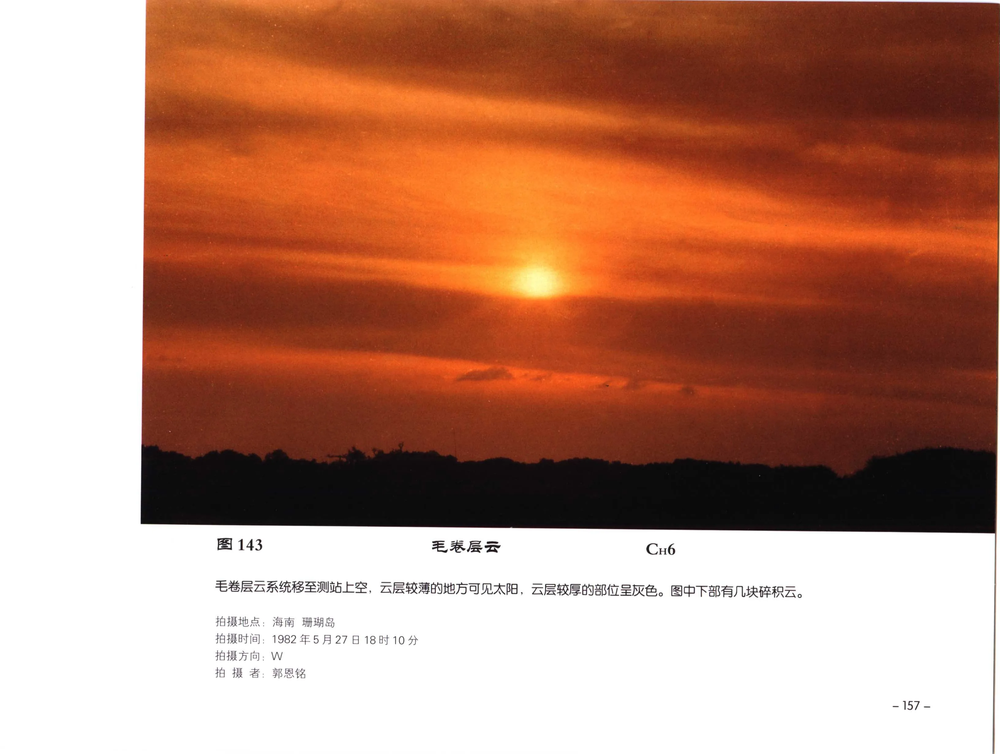

| 字段 | 内容 |
| --- | --- |
| 云类代码 | CH6 |
| 拍摄地点 | 海南 珊瑚岛 |
| 拍摄时间 | 1982年5月27日18时10分 |
| 拍摄方向 | W |
| 拍摄者 | 郭恩铭 |
| 原分页 | [PDF 第 169 页](../pages-161-180.md) |

毛卷层云系统移至测站上空，云层较薄的地方可见太阳，云层较厚的部位呈灰色。图中下部有几块碎积云。

### 图 144：毛卷层云

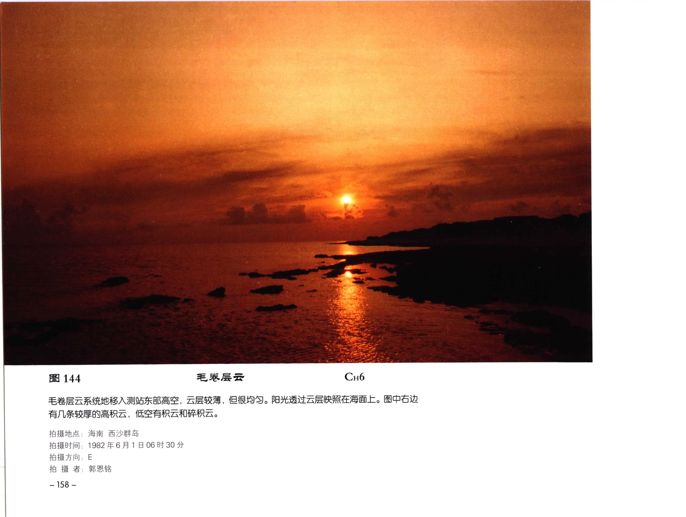

| 字段 | 内容 |
| --- | --- |
| 云类代码 | CH6 |
| 拍摄地点 | 海南 西沙群岛 |
| 拍摄时间 | 1982年6月1日06时30分 |
| 拍摄方向 | E |
| 拍摄者 | 郭恩铭 |
| 原分页 | [PDF 第 170 页](../pages-161-180.md) |

毛卷层云系统地移入测站东部高空，云层较薄，但很均匀。阳光透过云层映照在海面上。图中右边有几条较厚的高积云，低空有积云和碎积云。

### 图 145：毛卷层云

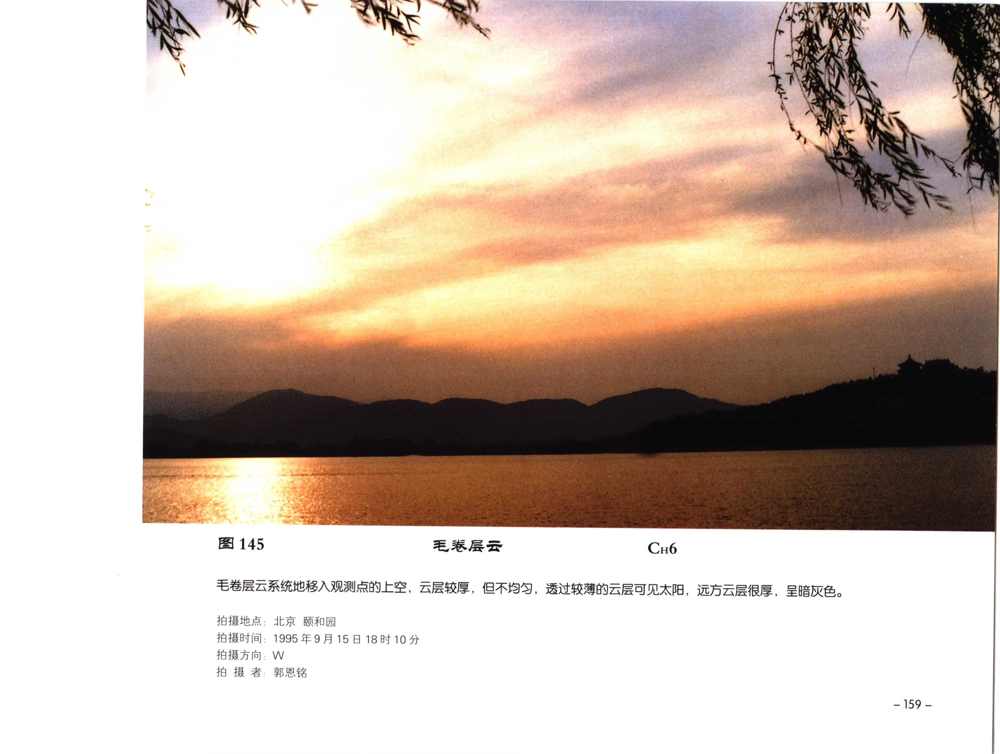

| 字段 | 内容 |
| --- | --- |
| 云类代码 | CH6 |
| 拍摄地点 | 北京 颐和园 |
| 拍摄时间 | 1995年9月15日18时10分 |
| 拍摄方向 | W |
| 拍摄者 | 郭恩铭 |
| 原分页 | [PDF 第 171 页](../pages-161-180.md) |

毛卷层云系统地移入观测点的上空，云层较厚，但不均匀，透过较薄的云层可见太阳，远方云层很厚，呈暗灰色。

### 图 146：毛卷层云

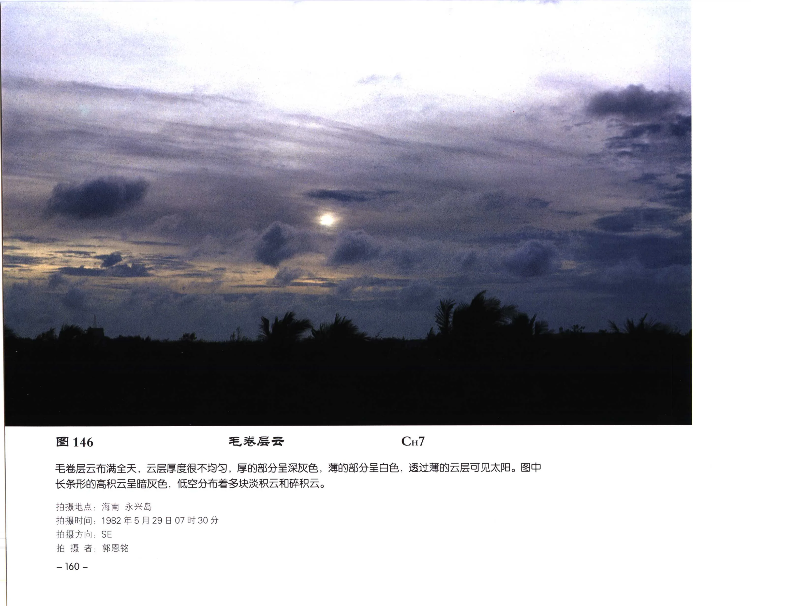

| 字段 | 内容 |
| --- | --- |
| 云类代码 | CH7 |
| 拍摄地点 | 海南 永兴岛 |
| 拍摄时间 | 1982年5月29日07时30分 |
| 拍摄方向 | SE |
| 拍摄者 | 郭恩铭 |
| 原分页 | [PDF 第 172 页](../pages-161-180.md) |

毛卷层云布满全天，云层厚度很不均匀，厚的部分呈深灰色，薄的部分呈白色，透过薄的云层可见太阳。图中长条形的高积云呈暗灰色，低空分布着多块淡积云和碎积云。

### 图 147：薄幕卷层云

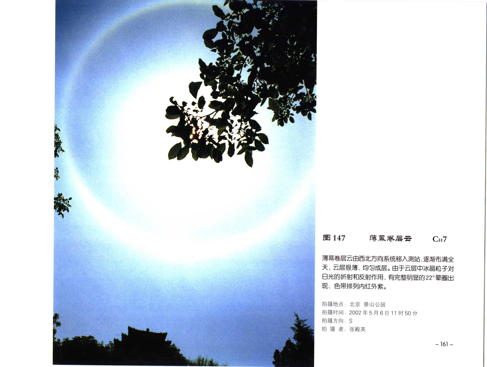

| 字段 | 内容 |
| --- | --- |
| 云类代码 | CH7 |
| 拍摄地点 | 北京 景山公园 |
| 拍摄时间 | 2002年5月6日11时50分 |
| 拍摄方向 | S |
| 拍摄者 | 张蕾 |
| 原分页 | [PDF 第 173 页](../pages-161-180.md) |

薄幕卷层云由西北方向系统移入测站，逐渐布满全天，云层很薄，均匀成层。由于云层中冰晶粒子对日光的折射和反射作用，有完整明显的 22 度晕圈出现，色带排列内红外紫。

### 图 148：毛卷层云

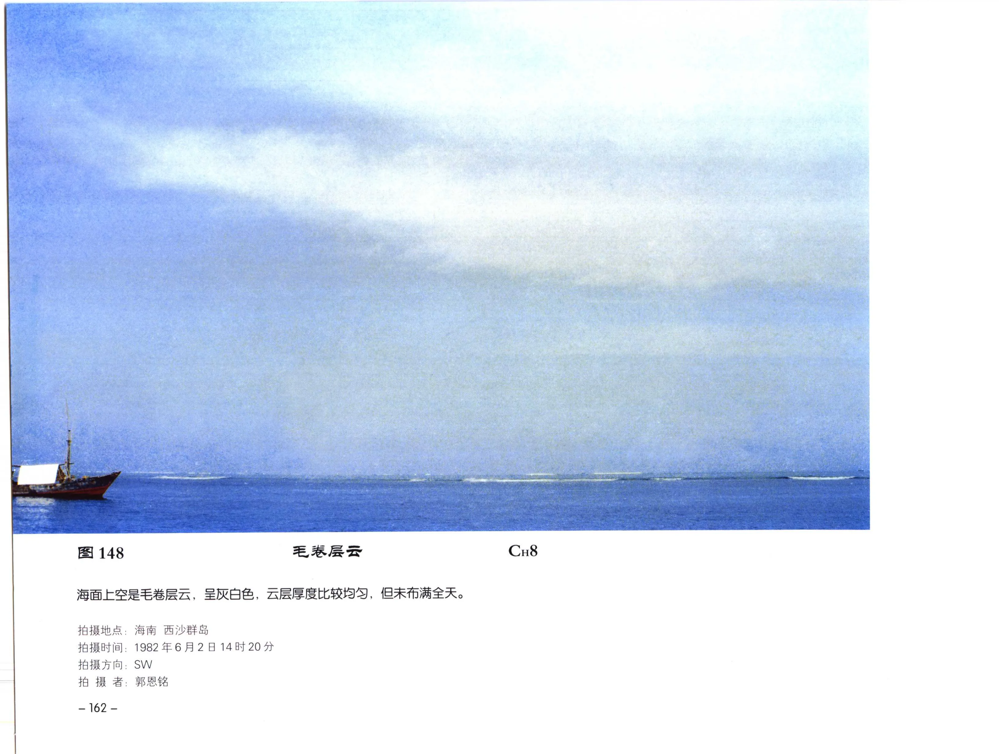

| 字段 | 内容 |
| --- | --- |
| 云类代码 | CH8 |
| 拍摄地点 | 海南 西沙群岛 |
| 拍摄时间 | 1982年6月2日14时20分 |
| 拍摄方向 | SW |
| 拍摄者 | 郭恩铭 |
| 原分页 | [PDF 第 174 页](../pages-161-180.md) |

海面上空是毛卷层云，呈灰白色，云层厚度比较均匀，但未布满全天。

## 卷积云

### 图 149：卷积云

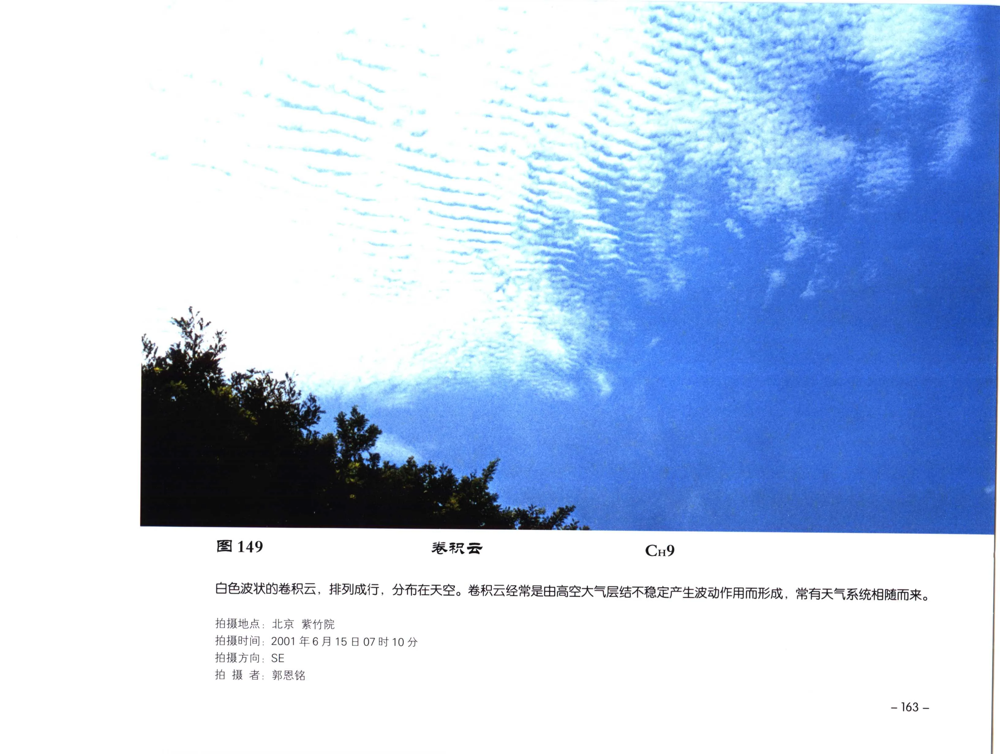

| 字段 | 内容 |
| --- | --- |
| 云类代码 | CH9 |
| 拍摄地点 | 北京 紫竹院 |
| 拍摄时间 | 2001年6月15日07时10分 |
| 拍摄方向 | SE |
| 拍摄者 | 郭恩铭 |
| 原分页 | [PDF 第 175 页](../pages-161-180.md) |

白色波状的卷积云，排列成行，分布在天空。卷积云经常是由不稳定产生波动作用而形成，常有天气系统相随而来。

### 图 150：卷积云

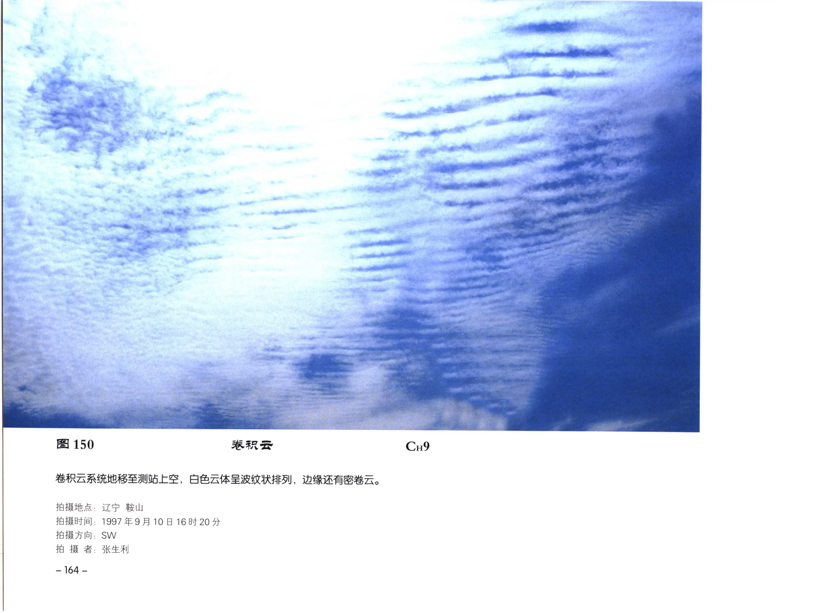

| 字段 | 内容 |
| --- | --- |
| 云类代码 | CH9 |
| 拍摄地点 | 辽宁 鞍山 |
| 拍摄时间 | 1997年9月10日16时20分 |
| 拍摄方向 | SW |
| 拍摄者 | 张生利 |
| 原分页 | [PDF 第 176 页](../pages-161-180.md) |

卷积云系统地移至测站上空，白色云体呈波纹状排列，边缘还有密卷云。

### 图 151：卷积云

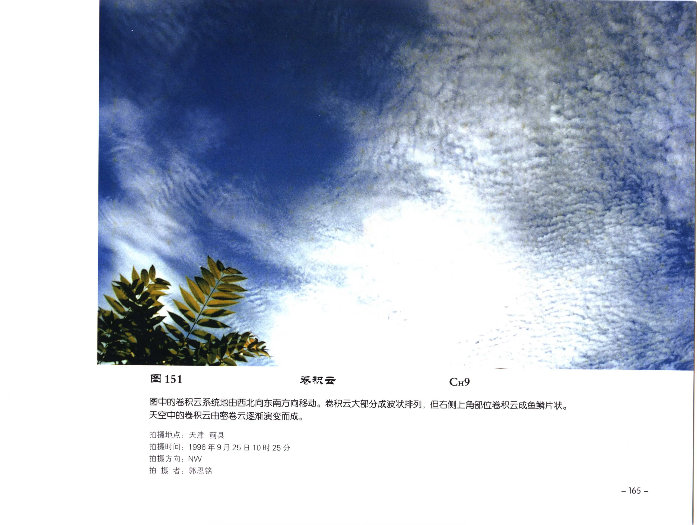

| 字段 | 内容 |
| --- | --- |
| 云类代码 | CH9 |
| 拍摄地点 | 天津 蓟县 |
| 拍摄时间 | 1996年9月25日10时25分 |
| 拍摄方向 | NW |
| 拍摄者 | 郭恩铭 |
| 原分页 | [PDF 第 177 页](../pages-161-180.md) |

图中的卷积云系统地由西北向东南方向移动。卷积云大部分成波状排列，但右侧上角部位卷积云成鱼鳞片状。天空中的卷积云由密卷云逐渐演变而成。

### 图 152：卷积云

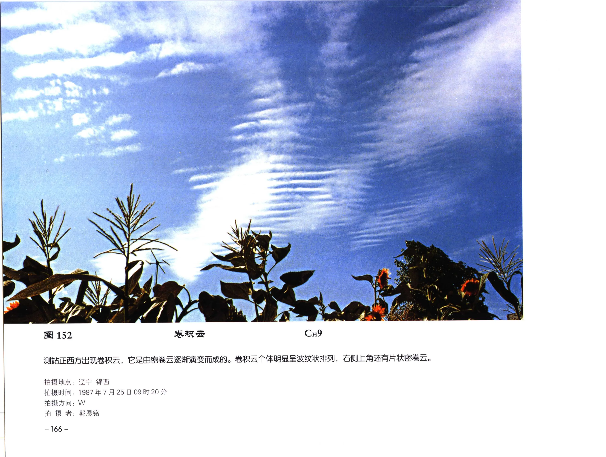

| 字段 | 内容 |
| --- | --- |
| 云类代码 | CH9 |
| 拍摄地点 | 辽宁 锦西 |
| 拍摄时间 | 1987年7月25日09时20分 |
| 拍摄方向 | W |
| 拍摄者 | 郭恩铭 |
| 原分页 | [PDF 第 178 页](../pages-161-180.md) |

测站正西方出现卷积云，它是由密卷云逐渐演变而成的。卷积云个体明显呈波纹状排列，右侧上角还有片状密卷云。

### 图 153：卷积云

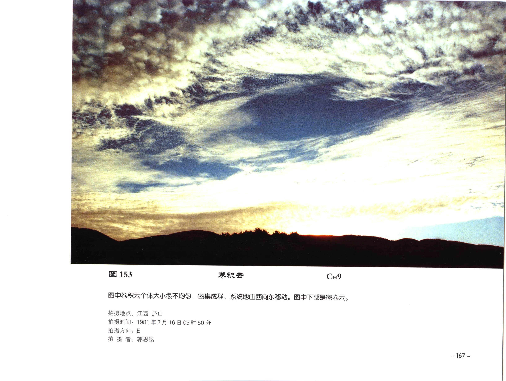

| 字段 | 内容 |
| --- | --- |
| 云类代码 | CH9 |
| 拍摄地点 | 江西 庐山 |
| 拍摄时间 | 1981年7月16日05时50分 |
| 拍摄方向 | E |
| 拍摄者 | 郭恩铭 |
| 原分页 | [PDF 第 179 页](../pages-161-180.md) |

图中卷积云个体大小很不均匀，密集成群，系统地由西向东移动。图中下部是密卷云。

### 图 154：卷积云

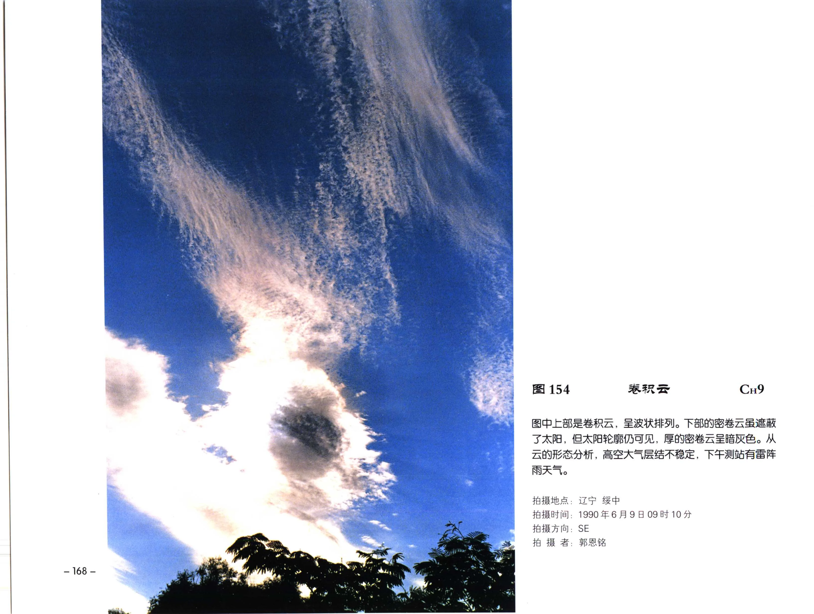

| 字段 | 内容 |
| --- | --- |
| 云类代码 | CH9 |
| 拍摄地点 | 辽宁 绥中 |
| 拍摄时间 | 1990年6月9日09时10分 |
| 拍摄方向 | SE |
| 拍摄者 | 郭恩铭 |
| 原分页 | [PDF 第 180 页](../pages-161-180.md) |

图中上部是卷积云，呈波状排列。下部的密卷云虽遮蔽了太阳，但太阳轮廓仍可见，厚的密卷云呈暗灰色。从云的形态分析，高空大气层结不稳定，下午测站有雷阵雨天气。

### 图 155：卷积云

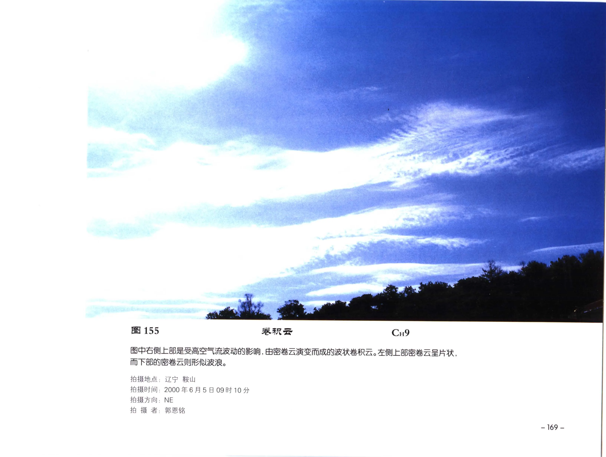

| 字段 | 内容 |
| --- | --- |
| 云类代码 | CH9 |
| 拍摄地点 | 辽宁 鞍山 |
| 拍摄时间 | 2000年6月5日09时10分 |
| 拍摄方向 | NE |
| 拍摄者 | 郭恩铭 |
| 原分页 | [PDF 第 181 页](../pages-181-200.md) |

图中右侧上部是受高空气流波动的影响，由密卷云演变而成的波状卷积云。左侧上部密卷云呈片状，而下部的密卷云则形似波浪。

### 图 156：卷积云

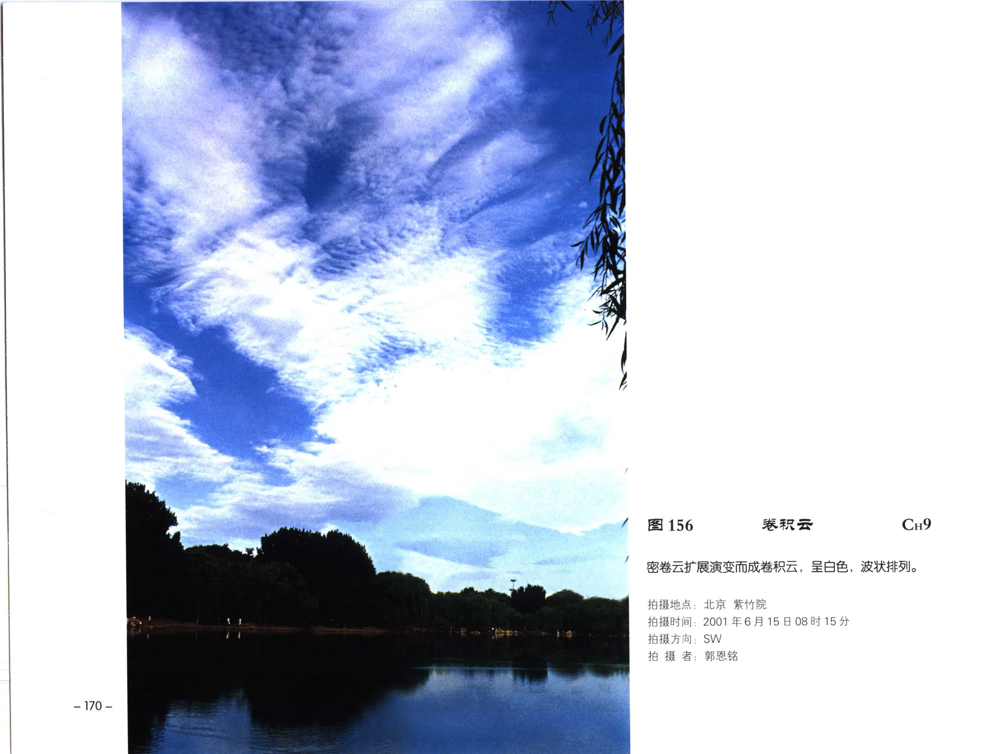

| 字段 | 内容 |
| --- | --- |
| 云类代码 | CH9 |
| 拍摄地点 | 北京 紫竹院 |
| 拍摄时间 | 2001年6月15日08时15分 |
| 拍摄方向 | SW |
| 拍摄者 | 郭恩铭 |
| 原分页 | [PDF 第 182 页](../pages-181-200.md) |

密卷云扩展演变而成卷积云，呈白色，波状排列。

### 图 157：卷积云

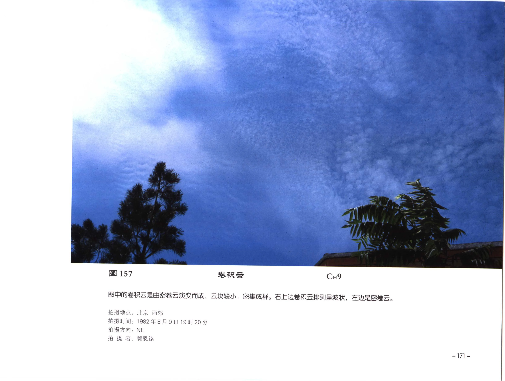

| 字段 | 内容 |
| --- | --- |
| 云类代码 | CH9 |
| 拍摄地点 | 北京 西郊 |
| 拍摄时间 | 1982年8月19日09时20分 |
| 拍摄方向 | NE |
| 拍摄者 | 郭恩铭 |
| 原分页 | [PDF 第 183 页](../pages-181-200.md) |

图中的卷积云是由密卷云演变而成，云块较小，密集成群。右上边卷积云排列呈波状，左边是密卷云。

### 图 158：卷积云

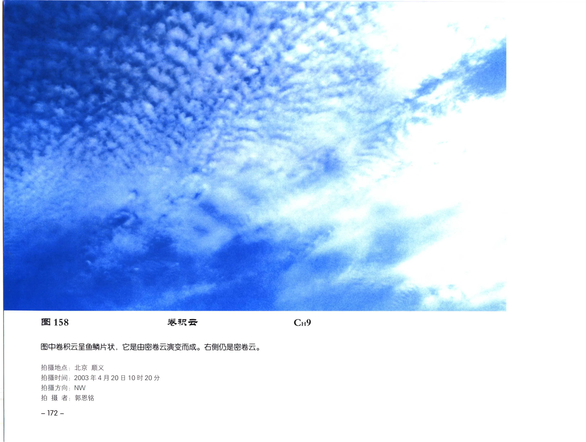

| 字段 | 内容 |
| --- | --- |
| 云类代码 | CH9 |
| 拍摄地点 | 北京 顺义 |
| 拍摄时间 | 2003年4月20日10时20分 |
| 拍摄方向 | NW |
| 拍摄者 | 郭恩铭 |
| 原分页 | [PDF 第 184 页](../pages-181-200.md) |

图中卷积云呈鱼鳞片状，它是由密卷云演变而成。右侧仍是密卷云。
