# 高云图版：卷云

本页整理《中国云图》高云部分中毛卷云、密卷云、伪卷云、钩卷云和辐辏状卷云相关图版，范围覆盖 PDF 第 143-168 页中的图 117-142。PDF 第 141-142 页为高云部分起始页，暂未识别出可靠文字，仍保留在原始分页中。

!!! note "校订状态"
    本页以分页文本和原页图像共同整理。图 117-142 的标题、代码、拍摄字段和说明文字已按可辨原页图像校订；图 136 原页未列出拍摄方向。

## 图版列表

| 图号 | 云类 | 代码 | PDF 页 | 主要内容 |
| --- | --- | --- | --- | --- |
| 图 117 | 毛卷云 | CH1 | 143 | 白色、明亮，带卷曲和平直丝缕结构。 |
| 图 118 | 毛卷云 | CH1 | 144 | 毛丝般纤维结构明显，呈马尾状分布。 |
| 图 119 | 毛卷云 | CH1 | 145 | 洁白丝条状，好似羽毛，中部稍厚。 |
| 图 120 | 毛卷云 | CH1 | 146 | 云丝近似平行排列，边缘纤维结构清晰。 |
| 图 121 | 毛卷云、密卷云、高积云 | CH1 | 147 | 上部毛卷云，中部密卷云，山峰背面有高积云。 |
| 图 122 | 毛卷云 | CH1 | 148 | 毛卷云排列成行，形如羽毛，低空有淡积云。 |
| 图 123 | 毛卷云 | CH1 | 149 | 毛卷云分散在高空，丝缕结构明显。 |
| 图 124 | 毛卷云 | CH1 | 150 | 云丝洁白，纤维结构清晰，下部边缘受气流影响变形。 |
| 图 125 | 密卷云 | CH2 | 151 | 厚密团状、片状云块，边缘纤维结构清晰。 |
| 图 126 | 密卷云 | CH2 | 152 | 云块厚密不均，有逐渐融合趋势。 |
| 图 127 | 密卷云 | CH2 | 153 | 早晨密卷云分散在东方，日出时被染色。 |
| 图 128 | 密卷云 | CH2 | 154 | 密卷云正在降雪幡，母体云块随即消散。 |
| 图 129 | 密卷云 | CH2 | 155 | 云块中部较厚，边缘纤维结构清晰。 |
| 图 130 | 密卷云 | CH2 | 156 | 白色密卷云长条形平行排列。 |
| 图 131 | 密卷云 | CH2 | 157 | 片状密卷云有雪幡条状下垂，形似卷发。 |
| 图 132 | 密卷云 | CH2 | 158 | 辐辏状密卷云移入测站上空。 |
| 图 133 | 伪卷云 | CH3 | 159 | 逐渐脱离积雨云主体的砧状伪卷云。 |
| 图 134 | 伪卷云 | CH3 | 160 | 积雨云砧状部分脱离母体并演变为伪卷云。 |
| 图 135 | 伪卷云 | CH3 | 161 | 刚脱离积雨云主体的伪卷云向东北方向伸展。 |
| 图 136 | 伪卷云 | CH3 | 162 | 积雨云砧状云顶脱离主体演变成伪卷云。 |
| 图 137 | 钩卷云 | CH4 | 163 | 云体很薄，云丝平行排列，一端呈钩状。 |
| 图 138 | 钩卷云 | CH4 | 164 | 夕阳映照钩卷云，呈金黄色。 |
| 图 139 | 钩卷云 | CH4 | 165 | 钩卷云丝缕结构明显，下部有密卷云。 |
| 图 140 | 钩卷云 | CH4 | 166 | 云丝纤细洁白，平行排列，形如钩状。 |
| 图 141 | 钩卷云 | CH4 | 167 | 钩卷云排列成行，较密一端卷曲成钩状。 |
| 图 142 | 辐辏状卷云和卷层云 | CH5 | 168 | 辐辏状卷云呈长条形，卷层云布满全天。 |

## 毛卷云

### 图 117：毛卷云

| 字段 | 内容 |
| --- | --- |
| 云类代码 | CH1 |
| 拍摄地点 | 辽宁 绥中 |
| 拍摄时间 | 1991年9月1日10时10分 |
| 拍摄方向 | SW |
| 拍摄者 | 郭恩铭 |
| 原分页 | [PDF 第 143 页](../pages-141-160.md) |

白色、明亮带有卷曲和平直丝缕结构的云片是毛卷云，分布在蓝蓝的天空。

### 图 118：毛卷云

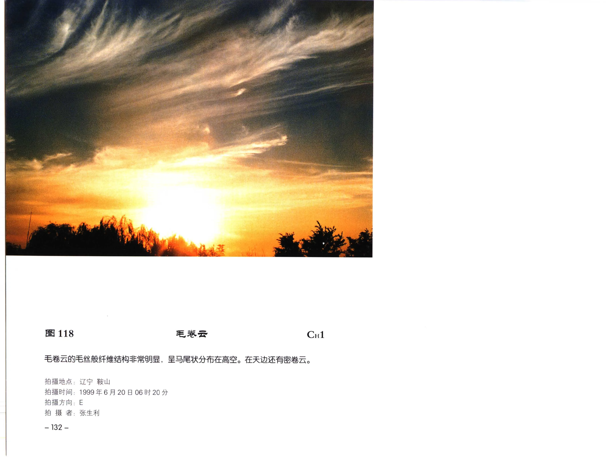

| 字段 | 内容 |
| --- | --- |
| 云类代码 | CH1 |
| 拍摄地点 | 辽宁 鞍山 |
| 拍摄时间 | 1999年6月20日06时20分 |
| 拍摄方向 | E |
| 拍摄者 | 张生利 |
| 原分页 | [PDF 第 144 页](../pages-141-160.md) |

毛卷云的毛丝般纤维结构非常明显，呈马尾状分布在高空。在天边还有密卷云。

### 图 119：毛卷云

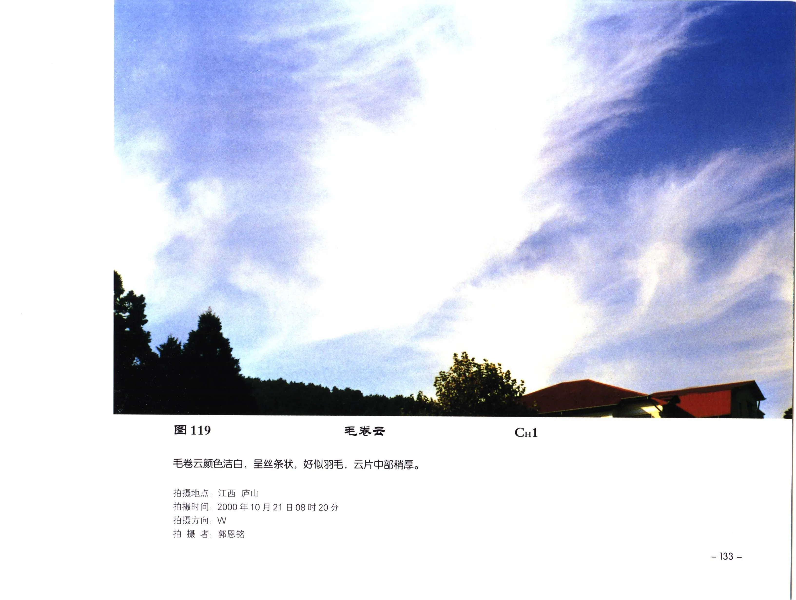

| 字段 | 内容 |
| --- | --- |
| 云类代码 | CH1 |
| 拍摄地点 | 江西 庐山 |
| 拍摄时间 | 2000年10月21日08时20分 |
| 拍摄方向 | W |
| 拍摄者 | 郭恩铭 |
| 原分页 | [PDF 第 145 页](../pages-141-160.md) |

毛卷云颜色洁白，呈丝条状，好似羽毛，云片中部稍厚。

### 图 120：毛卷云

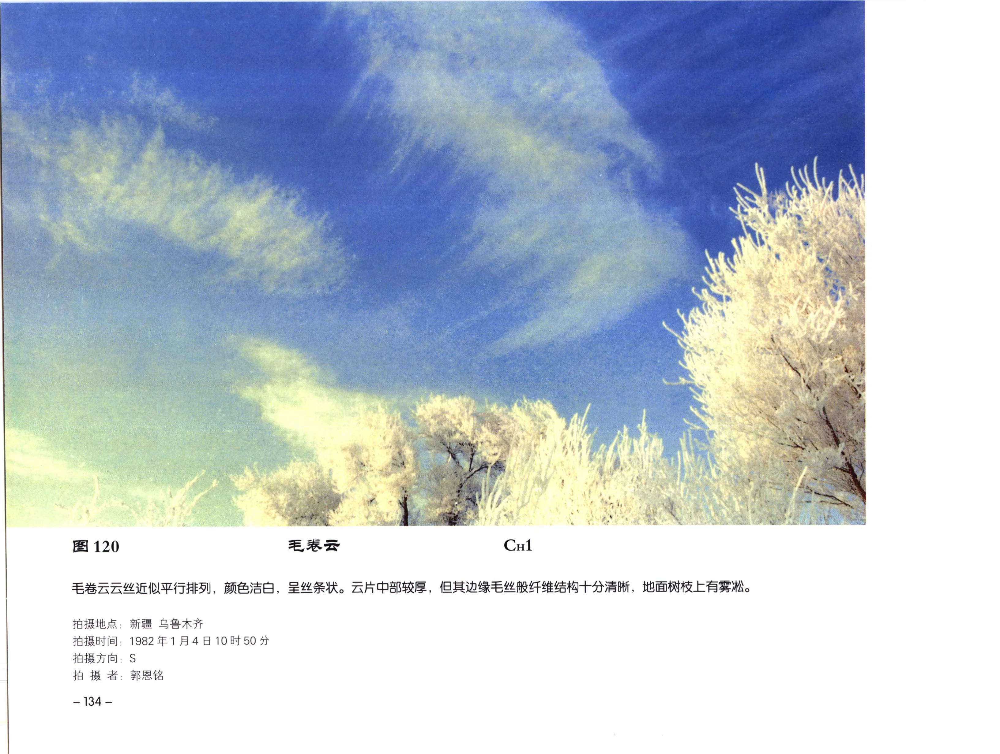

| 字段 | 内容 |
| --- | --- |
| 云类代码 | CH1 |
| 拍摄地点 | 新疆 乌鲁木齐 |
| 拍摄时间 | 1982年1月4日10时50分 |
| 拍摄方向 | S |
| 拍摄者 | 郭恩铭 |
| 原分页 | [PDF 第 146 页](../pages-141-160.md) |

毛卷云云丝近似平行排列，颜色洁白，呈丝条状。云片中部较厚，但其边缘毛丝般纤维结构十分清晰，地面树枝上有雾凇。

### 图 121：毛卷云、密卷云和高积云

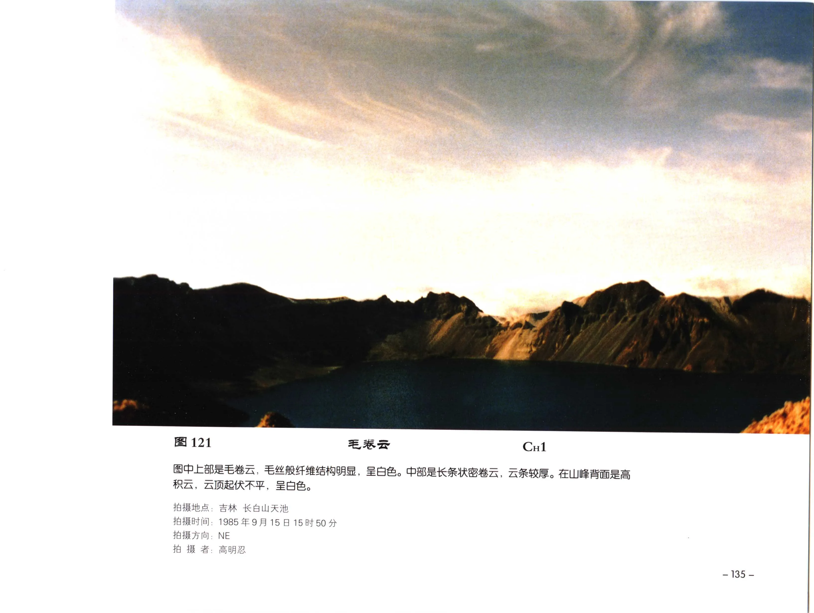

| 字段 | 内容 |
| --- | --- |
| 云类代码 | CH1 |
| 拍摄地点 | 吉林 长白山天池 |
| 拍摄时间 | 1985年9月15日15时50分 |
| 拍摄方向 | NE |
| 拍摄者 | 高明强 |
| 原分页 | [PDF 第 147 页](../pages-141-160.md) |

图中上部是毛卷云，毛丝般纤维结构明显，呈白色。中部是长条状密卷云，云条较厚。在山峰背面是高积云，云顶起伏不平，呈白色。

### 图 122：毛卷云

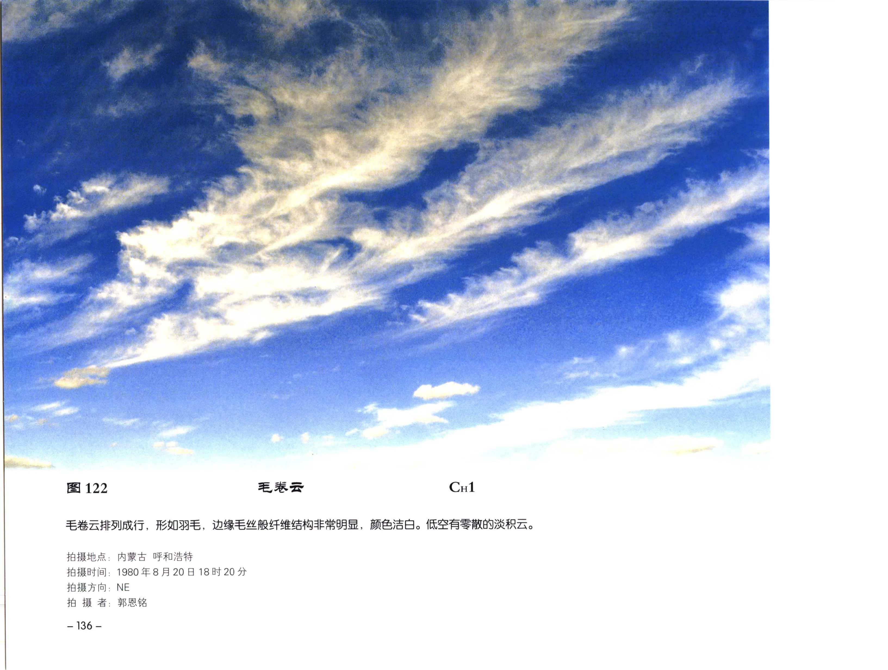

| 字段 | 内容 |
| --- | --- |
| 云类代码 | CH1 |
| 拍摄地点 | 内蒙古 呼和浩特 |
| 拍摄时间 | 1980年8月20日18时20分 |
| 拍摄方向 | NE |
| 拍摄者 | 郭恩铭 |
| 原分页 | [PDF 第 148 页](../pages-141-160.md) |

毛卷云排列成行，形如羽毛，边缘毛丝般纤维结构非常明显，颜色洁白。低空有零散的淡积云。

### 图 123：毛卷云

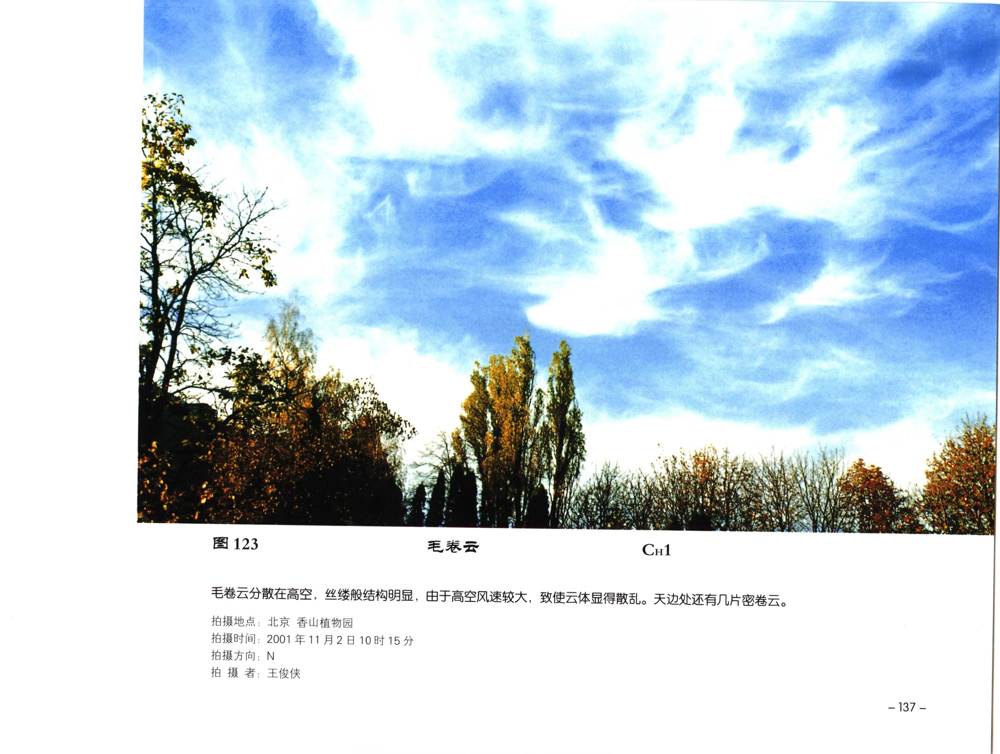

| 字段 | 内容 |
| --- | --- |
| 云类代码 | CH1 |
| 拍摄地点 | 北京 香山植物园 |
| 拍摄时间 | 2001年11月2日10时15分 |
| 拍摄方向 | N |
| 拍摄者 | 王俊侠 |
| 原分页 | [PDF 第 149 页](../pages-141-160.md) |

毛卷云分散在高空，丝缕般结构明显，由于高空风速较大，致使云体显得散乱。天边处还有几片密卷云。

### 图 124：毛卷云

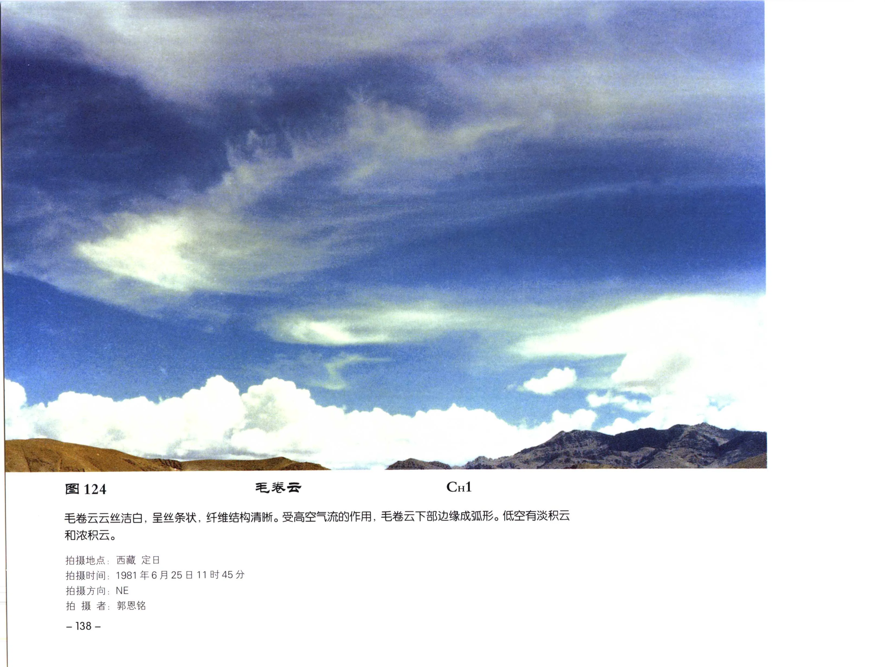

| 字段 | 内容 |
| --- | --- |
| 云类代码 | CH1 |
| 拍摄地点 | 西藏 定日 |
| 拍摄时间 | 1981年6月25日11时45分 |
| 拍摄方向 | NE |
| 拍摄者 | 郭恩铭 |
| 原分页 | [PDF 第 150 页](../pages-141-160.md) |

毛卷云云丝洁白，纤维结构清晰。受高空气流的作用，毛卷云下部边缘成钩形。低空有淡积云和浓积云。

## 密卷云

### 图 125：密卷云

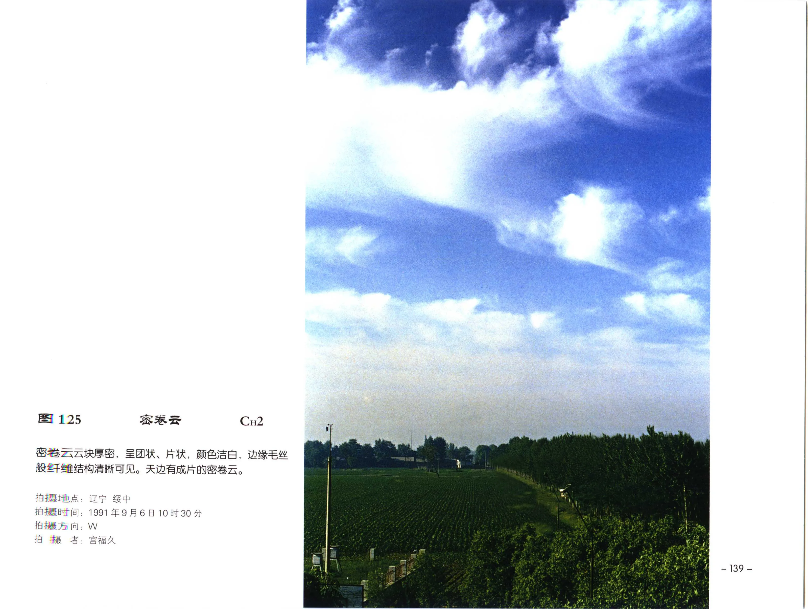

| 字段 | 内容 |
| --- | --- |
| 云类代码 | CH2 |
| 拍摄地点 | 辽宁 绥中 |
| 拍摄时间 | 1991年9月6日10时30分 |
| 拍摄方向 | W |
| 拍摄者 | 宫福久 |
| 原分页 | [PDF 第 151 页](../pages-141-160.md) |

密卷云云块厚密，呈团状、片状，颜色洁白，边缘毛丝般纤维结构清晰可见。天边有成片的密卷云。

### 图 126：密卷云

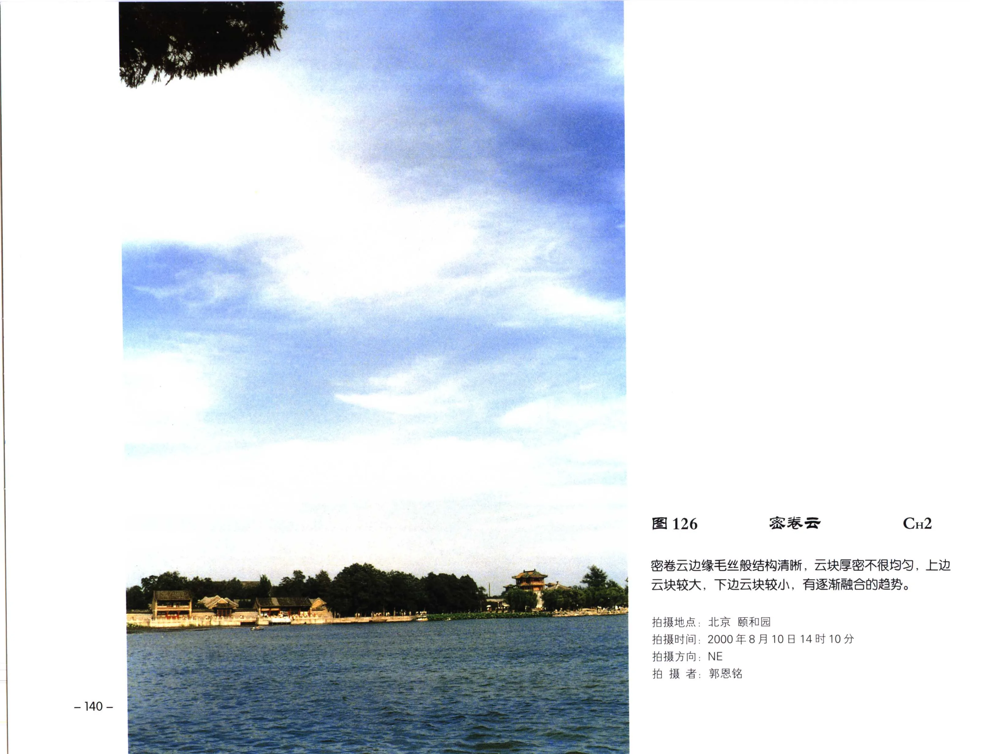

| 字段 | 内容 |
| --- | --- |
| 云类代码 | CH2 |
| 拍摄地点 | 北京 颐和园 |
| 拍摄时间 | 2000年8月10日14时10分 |
| 拍摄方向 | NE |
| 拍摄者 | 郭恩铭 |
| 原分页 | [PDF 第 152 页](../pages-141-160.md) |

密卷云边缘毛丝般结构清晰，云块厚密不很均匀，上边云块较大，下边云块较小，有逐渐融合的趋势。

### 图 127：密卷云

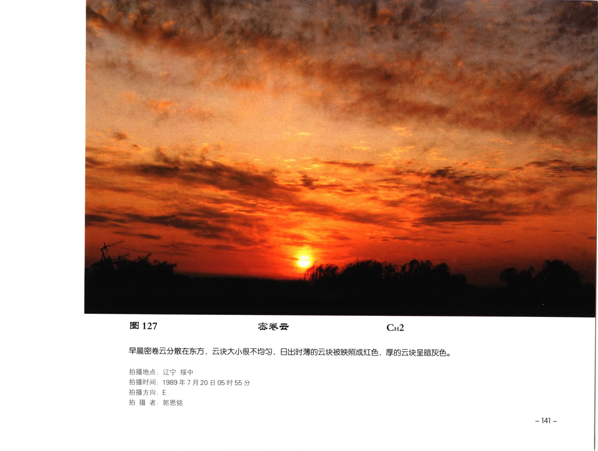

| 字段 | 内容 |
| --- | --- |
| 云类代码 | CH2 |
| 拍摄地点 | 辽宁 绥中 |
| 拍摄时间 | 1989年7月20日05时55分 |
| 拍摄方向 | E |
| 拍摄者 | 郭恩铭 |
| 原分页 | [PDF 第 153 页](../pages-141-160.md) |

早晨密卷云分散在东方，云块大小很不均匀，日出时薄的云块被映照成红色，厚的云块呈暗灰色。

### 图 128：密卷云

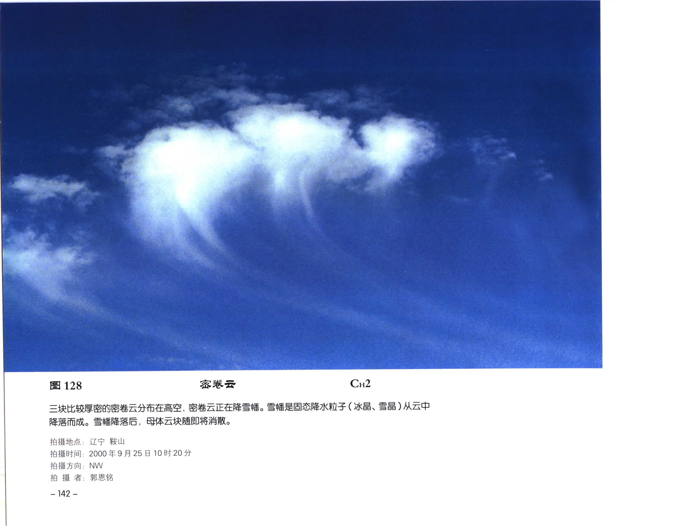

| 字段 | 内容 |
| --- | --- |
| 云类代码 | CH2 |
| 拍摄地点 | 辽宁 鞍山 |
| 拍摄时间 | 2000年9月25日10时20分 |
| 拍摄方向 | NW |
| 拍摄者 | 郭恩铭 |
| 原分页 | [PDF 第 154 页](../pages-141-160.md) |

三块比较厚密的密卷云分布在高空，密卷云正在降雪幡。雪幡是固态降水粒子从云中降落而成。雪幡降落后，母体云块随即将消散。

### 图 129：密卷云

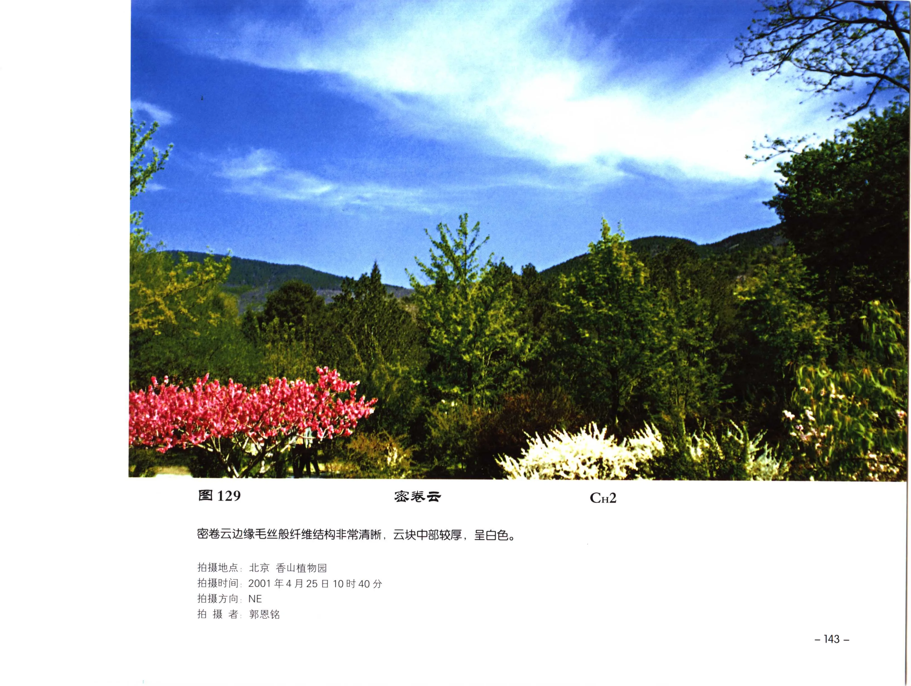

| 字段 | 内容 |
| --- | --- |
| 云类代码 | CH2 |
| 拍摄地点 | 北京 香山植物园 |
| 拍摄时间 | 2001年4月25日10时40分 |
| 拍摄方向 | NE |
| 拍摄者 | 郭恩铭 |
| 原分页 | [PDF 第 155 页](../pages-141-160.md) |

密卷云边缘毛丝般纤维结构非常清晰，云块中部较厚，呈白色。

### 图 130：密卷云

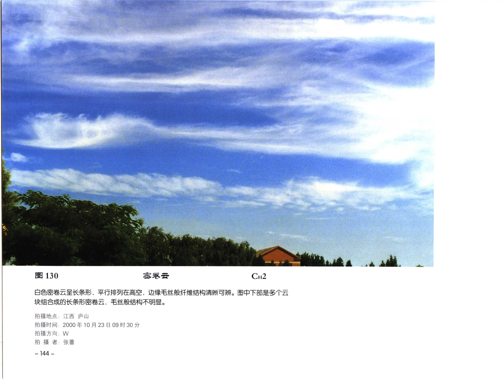

| 字段 | 内容 |
| --- | --- |
| 云类代码 | CH2 |
| 拍摄地点 | 江西 庐山 |
| 拍摄时间 | 2000年4月23日09时30分 |
| 拍摄方向 | W |
| 拍摄者 | 张蕾 |
| 原分页 | [PDF 第 156 页](../pages-141-160.md) |

白色密卷云呈长条形，平行排列在高空，边缘毛丝般纤维结构清晰可辨。图中下部是多个云块组合成的长条形密卷云，毛丝般结构不明显。

### 图 131：密卷云

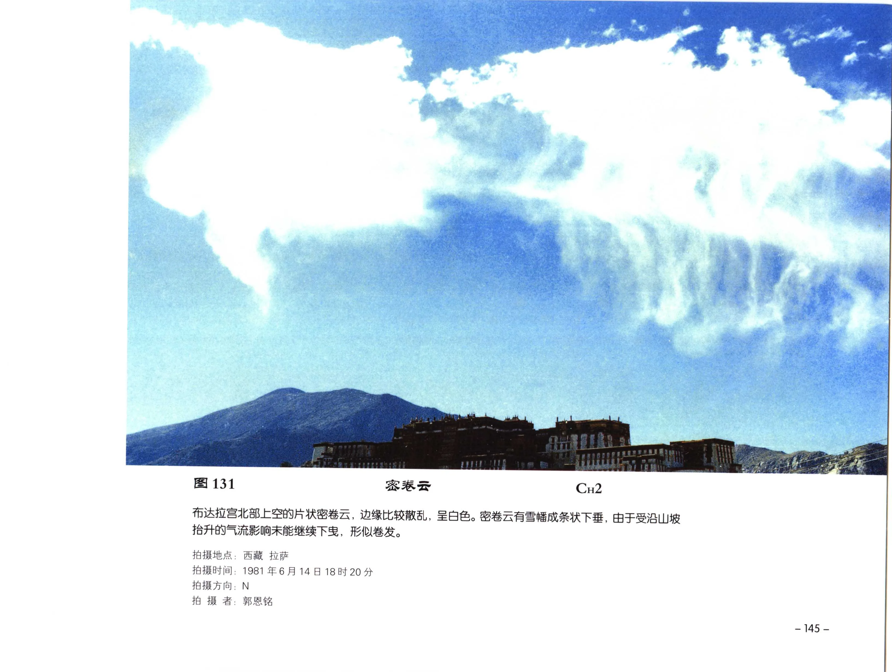

| 字段 | 内容 |
| --- | --- |
| 云类代码 | CH2 |
| 拍摄地点 | 西藏 拉萨 |
| 拍摄时间 | 1981年6月14日18时20分 |
| 拍摄方向 | N |
| 拍摄者 | 郭恩铭 |
| 原分页 | [PDF 第 157 页](../pages-141-160.md) |

布达拉宫北部上空的片状密卷云，边缘比较散乱，呈白色。密卷云有雪幡成条状下垂，由于受沿山坡抬升的气流影响未能继续下降，形似卷发。

### 图 132：密卷云

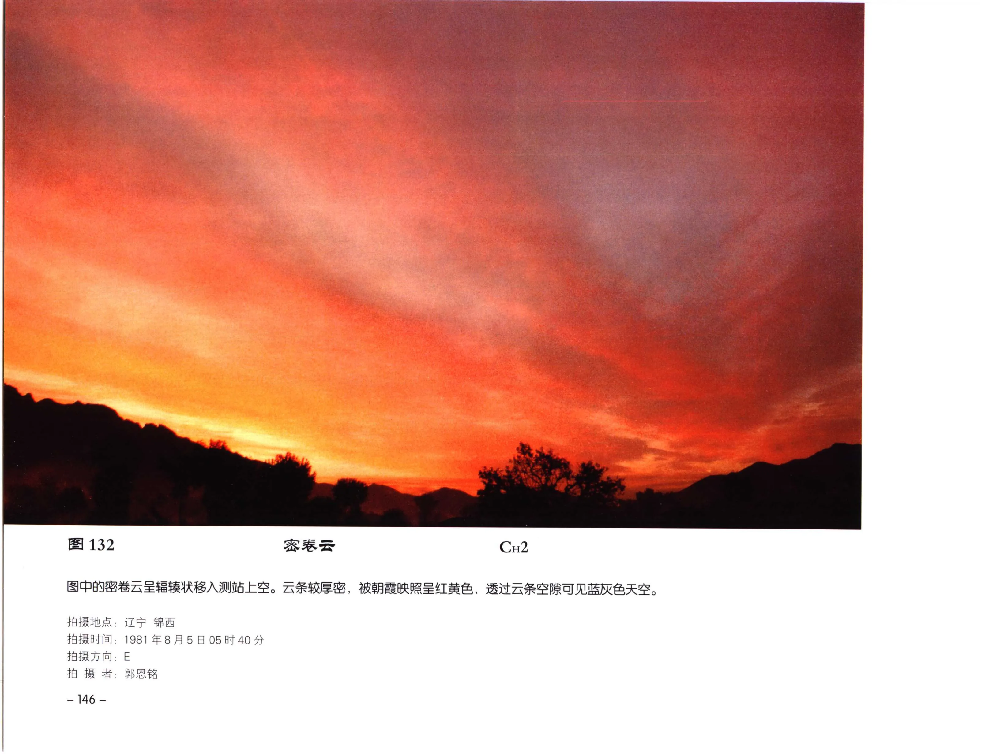

| 字段 | 内容 |
| --- | --- |
| 云类代码 | CH2 |
| 拍摄地点 | 辽宁 锦西 |
| 拍摄时间 | 1981年8月5日05时40分 |
| 拍摄方向 | E |
| 拍摄者 | 郭恩铭 |
| 原分页 | [PDF 第 158 页](../pages-141-160.md) |

图中的密卷云呈辐辏状移入测站上空。云条较厚密，被朝霞映照呈红黄色，透过云条空隙可见蓝灰色天空。

## 伪卷云

### 图 133：伪卷云

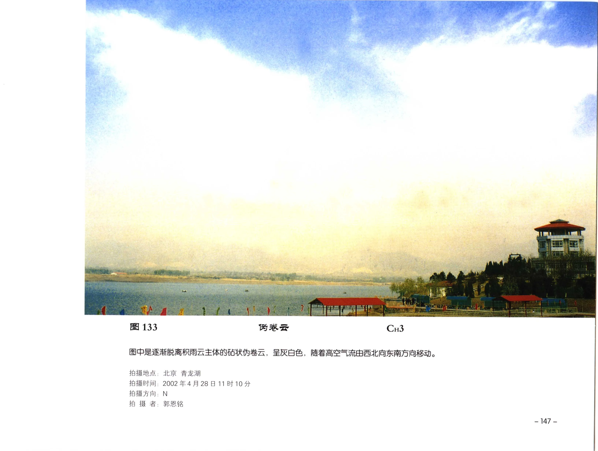

| 字段 | 内容 |
| --- | --- |
| 云类代码 | CH3 |
| 拍摄地点 | 北京 青龙湖 |
| 拍摄时间 | 2002年4月28日11时10分 |
| 拍摄方向 | N |
| 拍摄者 | 郭恩铭 |
| 原分页 | [PDF 第 159 页](../pages-141-160.md) |

图中是逐渐脱离积雨云主体的砧状伪卷云，呈灰白色，随着高空气流由西北向东南方向移动。

### 图 134：伪卷云

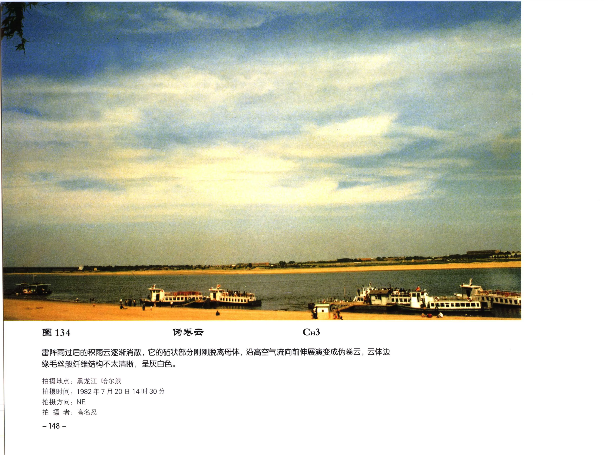

| 字段 | 内容 |
| --- | --- |
| 云类代码 | CH3 |
| 拍摄地点 | 黑龙江 哈尔滨 |
| 拍摄时间 | 1982年7月20日14时30分 |
| 拍摄方向 | NE |
| 拍摄者 | 高名忍 |
| 原分页 | [PDF 第 160 页](../pages-141-160.md) |

雷阵雨过后的积雨云逐渐消散，它的砧状部分刚刚脱离母体，沿高空气流向前伸展演变成为卷云，云体边缘毛丝般纤维结构不太清晰，呈灰白色。

### 图 135：伪卷云

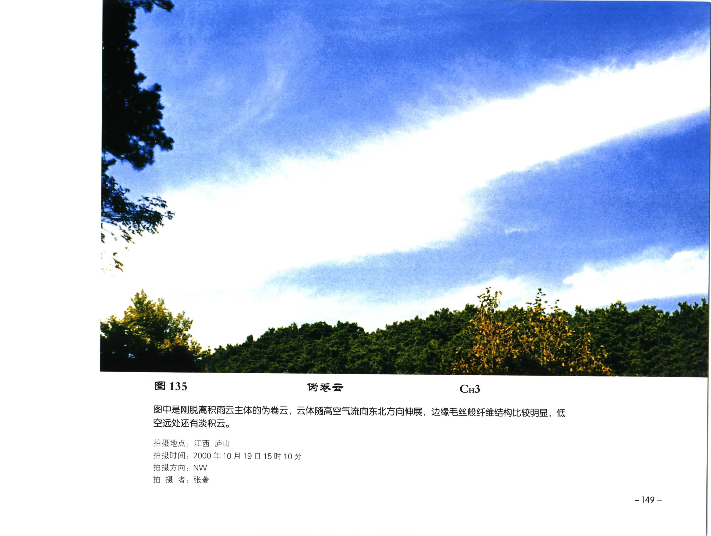

| 字段 | 内容 |
| --- | --- |
| 云类代码 | CH3 |
| 拍摄地点 | 江西 庐山 |
| 拍摄时间 | 2000年10月19日15时10分 |
| 拍摄方向 | NW |
| 拍摄者 | 张蕾 |
| 原分页 | [PDF 第 161 页](../pages-161-180.md) |

图中是刚脱离积雨云主体的伪卷云，云体随高空气流向东北方向伸展，边缘毛丝般纤维结构比较明显，低空远处还有淡积云。

### 图 136：伪卷云

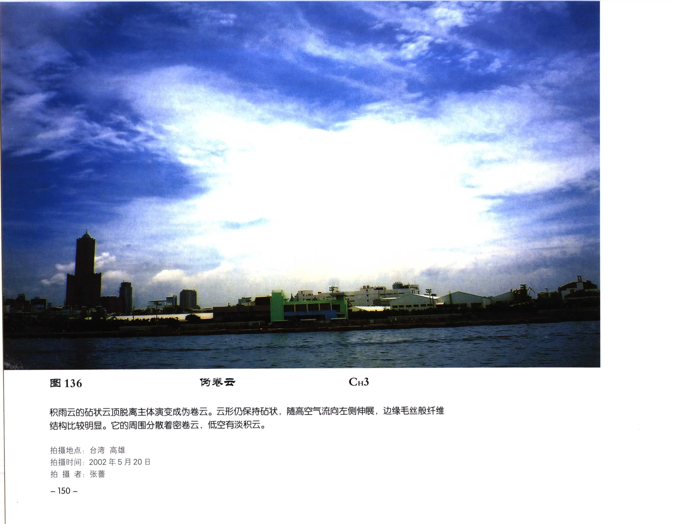

| 字段 | 内容 |
| --- | --- |
| 云类代码 | CH3 |
| 拍摄地点 | 台湾 高雄 |
| 拍摄时间 | 2002年5月20日 |
| 拍摄方向 | 原页未列出 |
| 拍摄者 | 张蕾 |
| 原分页 | [PDF 第 162 页](../pages-161-180.md) |

积雨云的砧状云顶脱离主体演变成伪卷云。云形仍保持砧状，随高空气流向左侧伸展，边缘毛丝般纤维结构比较明显。它的周围分散着密卷云，低空有淡积云。

## 钩卷云

### 图 137：钩卷云

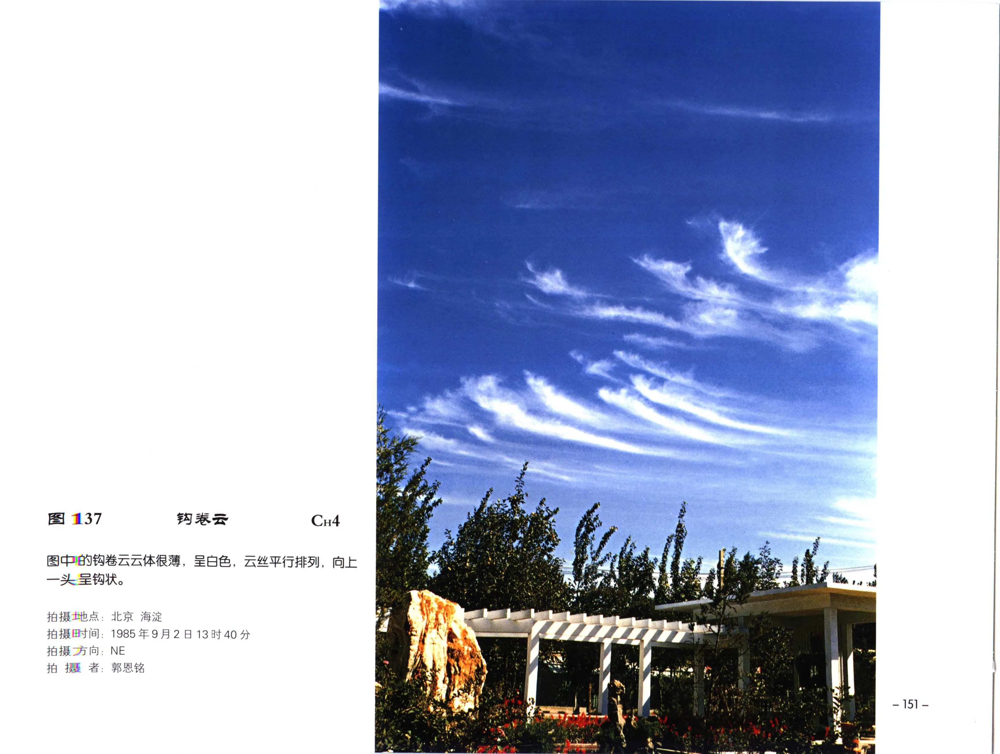

| 字段 | 内容 |
| --- | --- |
| 云类代码 | CH4 |
| 拍摄地点 | 北京 海淀 |
| 拍摄时间 | 1985年9月2日13时40分 |
| 拍摄方向 | NE |
| 拍摄者 | 郭恩铭 |
| 原分页 | [PDF 第 163 页](../pages-161-180.md) |

图中的钩卷云云体很薄，呈白色，云丝平行排列，向上一头呈钩状。

### 图 138：钩卷云

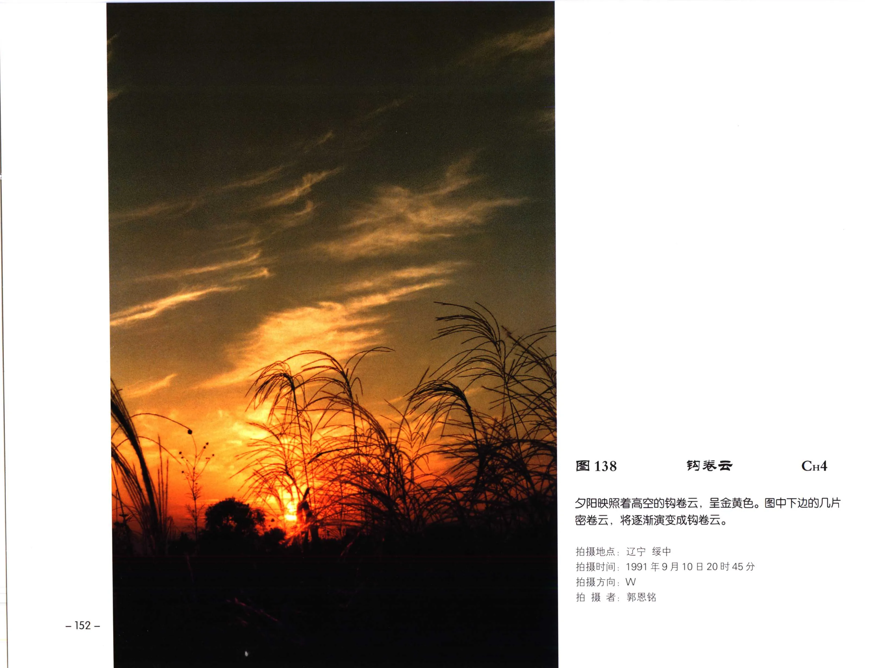

| 字段 | 内容 |
| --- | --- |
| 云类代码 | CH4 |
| 拍摄地点 | 辽宁 绥中 |
| 拍摄时间 | 1991年9月10日20时45分 |
| 拍摄方向 | W |
| 拍摄者 | 郭恩铭 |
| 原分页 | [PDF 第 164 页](../pages-161-180.md) |

夕阳映照着高空的钩卷云，呈金黄色。图中下边的几片密卷云，将逐渐演变成钩卷云。

### 图 139：钩卷云

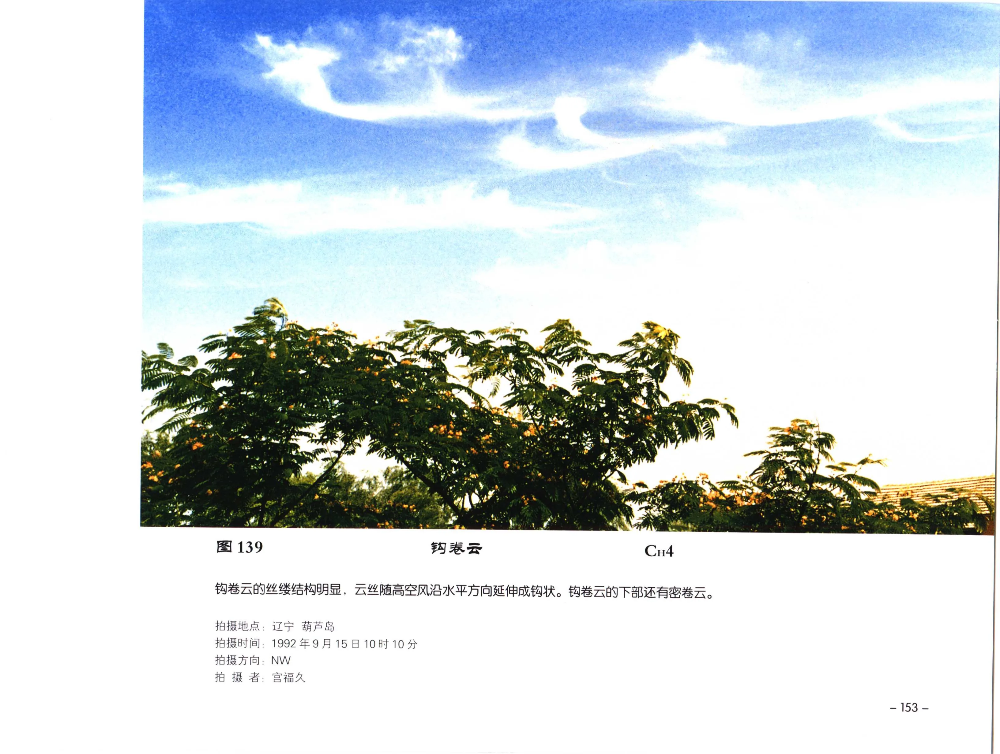

| 字段 | 内容 |
| --- | --- |
| 云类代码 | CH4 |
| 拍摄地点 | 辽宁 葫芦岛 |
| 拍摄时间 | 1992年9月15日10时10分 |
| 拍摄方向 | NW |
| 拍摄者 | 宫福久 |
| 原分页 | [PDF 第 165 页](../pages-161-180.md) |

钩卷云的丝缕结构明显，云丝随高空风沿水平方向延伸成钩状。钩卷云的下部还有密卷云。

### 图 140：钩卷云

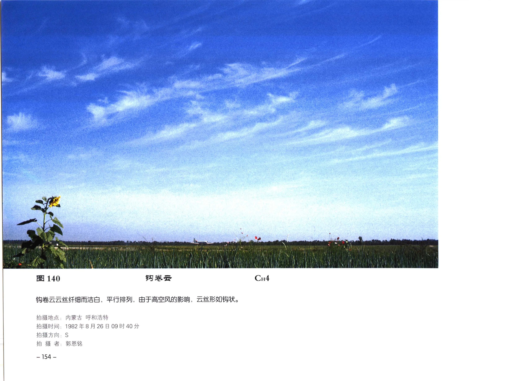

| 字段 | 内容 |
| --- | --- |
| 云类代码 | CH4 |
| 拍摄地点 | 内蒙古 呼和浩特 |
| 拍摄时间 | 1982年8月26日09时40分 |
| 拍摄方向 | S |
| 拍摄者 | 郭恩铭 |
| 原分页 | [PDF 第 166 页](../pages-161-180.md) |

钩卷云云丝纤细而洁白，呈平行排列。由于高空风的影响，云丝形如钩状。

### 图 141：钩卷云

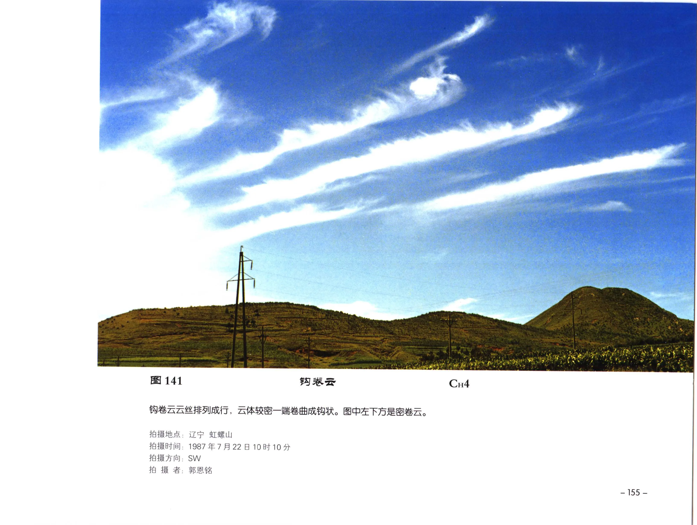

| 字段 | 内容 |
| --- | --- |
| 云类代码 | CH4 |
| 拍摄地点 | 辽宁 虹螺山 |
| 拍摄时间 | 1987年7月22日10时10分 |
| 拍摄方向 | SW |
| 拍摄者 | 郭恩铭 |
| 原分页 | [PDF 第 167 页](../pages-161-180.md) |

钩卷云云丝排列成行，云体较密一端卷曲成钩状。图中左下方是密卷云。

## 辐辏状卷云

### 图 142：辐辏状卷云和卷层云

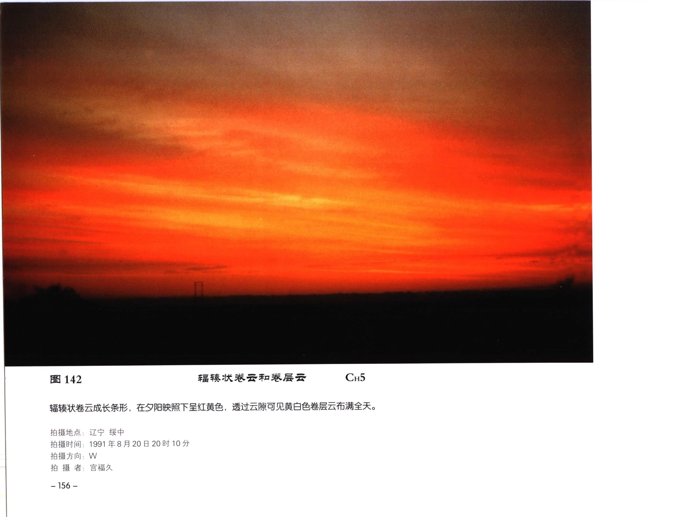

| 字段 | 内容 |
| --- | --- |
| 云类代码 | CH5 |
| 拍摄地点 | 辽宁 绥中 |
| 拍摄时间 | 1991年8月20日20时10分 |
| 拍摄方向 | W |
| 拍摄者 | 宫福久 |
| 原分页 | [PDF 第 168 页](../pages-161-180.md) |

辐辏状卷云成长条形，在夕阳映照下呈红黄色，透过云隙可见黄白色卷层云布满全天。
