# 低云图版：积云

本页整理《中国云图》低云部分中“积云”相关图版，范围覆盖 PDF 第 24-40 页中的图 2-18。原书中这些图版主要涉及淡积云、碎积云、淡积云与碎积云、浓积云。

!!! note "校订状态"
    本页已对照原页图像校订图 2-18 的主要字段。图 2-16 的云类代码以原页图像中的 `CL1` 为准，图 17-18 为 `CL2`。

## 图版列表

| 图号 | 云类 | 代码 | PDF 页 | 主要内容 |
| --- | --- | --- | --- | --- |
| 图 2 | 淡积云 | CL1 | 24 | 蓝天中漂浮较小的白色淡积云，边缘破碎，云底较平并有阴影。 |
| 图 3 | 淡积云 | CL1 | 25 | 淡积云个体大小不同、排列不齐，部分云体松散并伴有碎积云。 |
| 图 4 | 淡积云 | CL1 | 26 | 低压系统影响下处于发展阶段的积云，云体较厚，底部较平并有阴影。 |
| 图 5 | 淡积云 | CL1 | 27 | 秋季淡积云，对流不强，个体略扁平，云顶凸起不明显，并有零散碎积云。 |
| 图 6 | 碎积云 | CL1 | 28 | 八达岭山地抬升作用下，大小不匀的碎积云不断由南向北飘移。 |
| 图 7 | 碎积云和淡积云 | CL1 | 29 | 碎积云边缘破碎、零散分布，正在逐渐发展成淡积云。 |
| 图 8 | 淡积云 | CL1 | 30 | 地形抬升和较强对流条件下，淡积云处于发展阶段，远处有碎积云。 |
| 图 9 | 淡积云 | CL1 | 31 | 淡积云个体较大并处于发展阶段，远处还有正在发展的碎积云和淡积云。 |
| 图 10 | 碎积云 | CL1 | 32 | 冬季碎积云，形状多变，边缘破碎，轮廓不完整。 |
| 图 11 | 淡积云和碎积云 | CL1 | 33 | 海面上形成的淡积云和碎积云，逆光下云体呈暗灰色，高空有卷层云。 |
| 图 12 | 淡积云 | CL1 | 34 | 处于发展阶段的淡积云，顶部圆弧形凸起，云体水平宽度大于垂直厚度。 |
| 图 13 | 淡积云 | CL1 | 35 | 逆光下云体呈暗黑色，太阳西下，云层之间出现霞光。 |
| 图 14 | 淡积云 | CL1 | 36 | 淡积云个体不大，底部平整，受陆风影响由岸上向海面移动。 |
| 图 15 | 碎积云和淡积云 | CL1 | 37 | 早晨海面上对流不强，淡积云和碎积云云体很小、边缘破碎。 |
| 图 16 | 淡积云 | CL1 | 38 | 飞机上空拍摄，不同距离的淡积云因视角关系大小不同，上方有密卷云。 |
| 图 17 | 浓积云 | CL2 | 39 | 三块浓积云垂直高度大于水平宽度，云底较平并有暗影。 |
| 图 18 | 浓积云 | CL2 | 40 | 发展旺盛的浓积云，顶部对流泡体上凸，形似花椰菜，云底暗灰。 |

## 淡积云与碎积云

### 图 2：淡积云

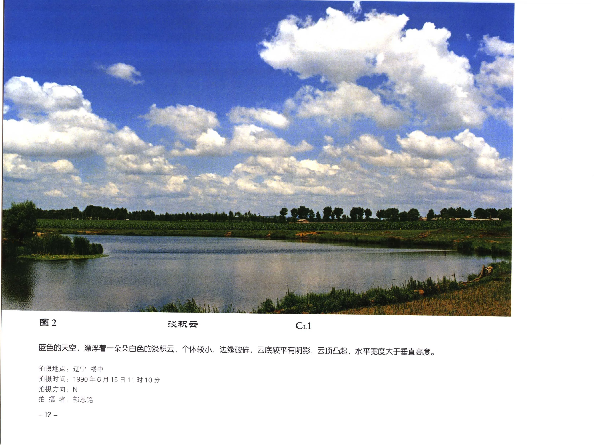

| 字段 | 内容 |
| --- | --- |
| 云类代码 | CL1 |
| 拍摄地点 | 辽宁 绥中 |
| 拍摄时间 | 1990年6月15日11时10分 |
| 拍摄方向 | N |
| 拍摄者 | 郭恩铭 |
| 原分页 | [PDF 第 24 页](../pages-021-040.md) |

蓝色天空中漂浮着一朵朵白色淡积云，个体较小，边缘破碎，云底较平并有阴影，云顶凸起，水平宽度大于垂直高度。

### 图 3：淡积云

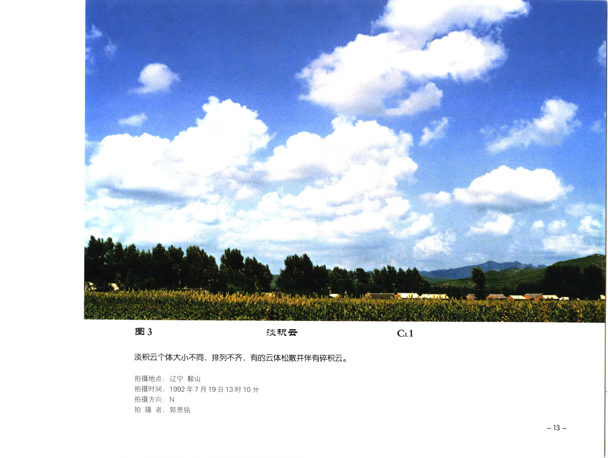

| 字段 | 内容 |
| --- | --- |
| 云类代码 | CL1 |
| 拍摄地点 | 辽宁 鞍山 |
| 拍摄时间 | 1992年7月19日13时10分 |
| 拍摄方向 | N |
| 拍摄者 | 郭恩铭 |
| 原分页 | [PDF 第 25 页](../pages-021-040.md) |

淡积云个体大小不同，排列不齐，有的云体松散并伴有碎积云。

### 图 4：淡积云

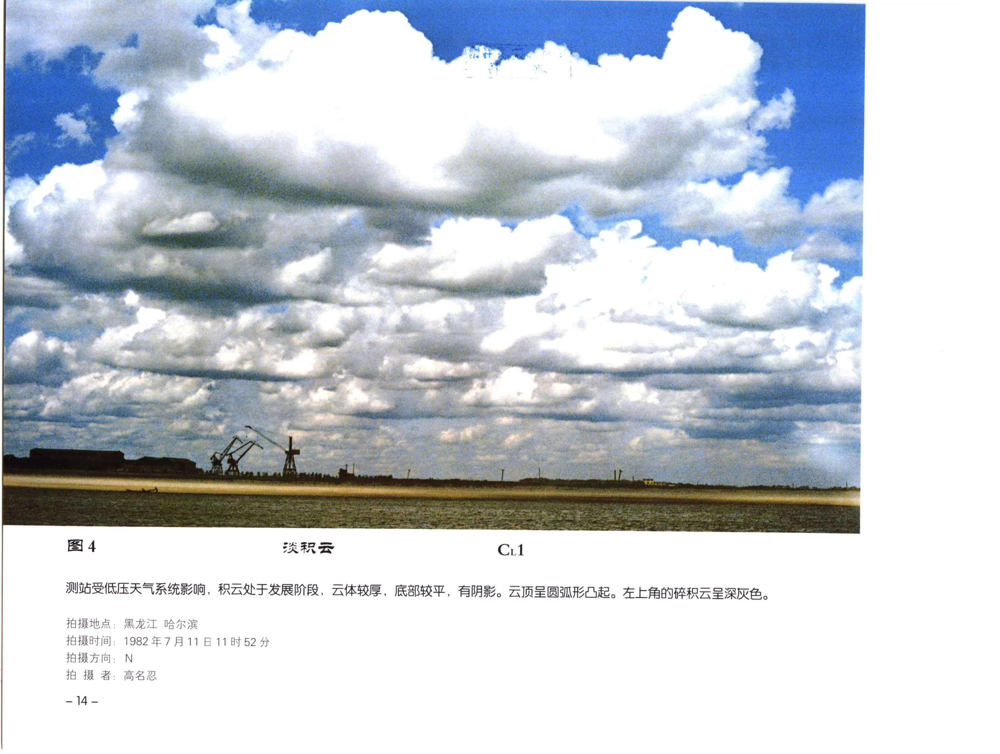

| 字段 | 内容 |
| --- | --- |
| 云类代码 | CL1 |
| 拍摄地点 | 黑龙江 哈尔滨 |
| 拍摄时间 | 1982年7月11日11时52分 |
| 拍摄方向 | N |
| 拍摄者 | 高名忍 |
| 原分页 | [PDF 第 26 页](../pages-021-040.md) |

测站受低压天气系统影响，积云处于发展阶段。云体较厚，底部较平并有阴影，云顶呈圆弧形凸起。左上角的碎积云呈深灰色。

### 图 5：淡积云

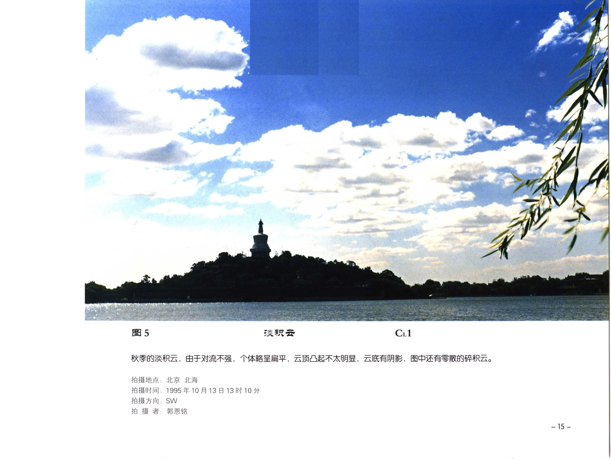

| 字段 | 内容 |
| --- | --- |
| 云类代码 | CL1 |
| 拍摄地点 | 北京 北海 |
| 拍摄时间 | 1995年10月13日13时10分 |
| 拍摄方向 | SW |
| 拍摄者 | 郭恩铭 |
| 原分页 | [PDF 第 27 页](../pages-021-040.md) |

秋季的淡积云，由于对流不强，个体略呈扁平，云顶凸起不太明显，云底有阴影。图中还有零散的碎积云。

### 图 6：碎积云

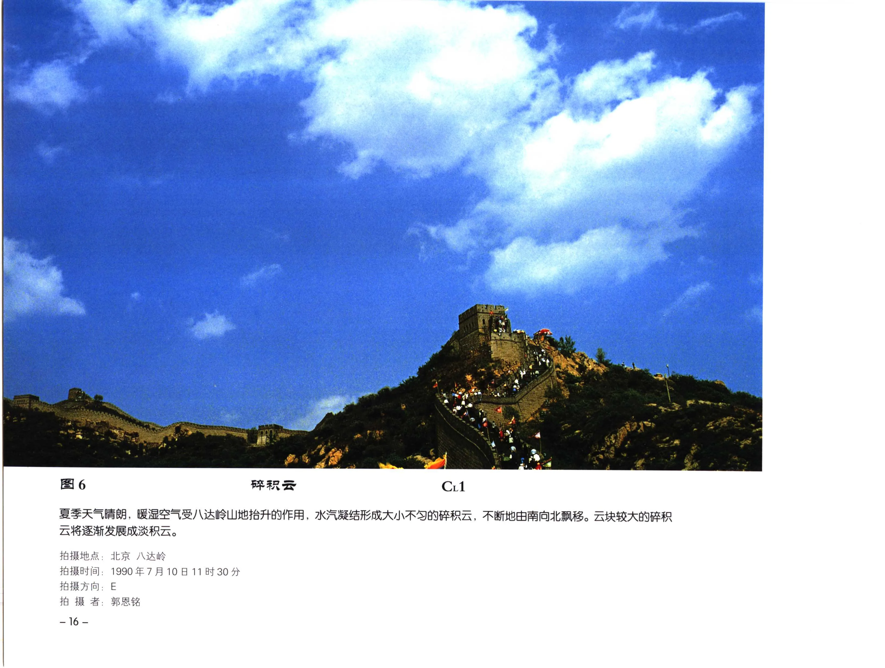

| 字段 | 内容 |
| --- | --- |
| 云类代码 | CL1 |
| 拍摄地点 | 北京 八达岭 |
| 拍摄时间 | 1990年7月10日11时30分 |
| 拍摄方向 | E |
| 拍摄者 | 郭恩铭 |
| 原分页 | [PDF 第 28 页](../pages-021-040.md) |

夏季天气晴朗，暖湿空气受八达岭山地抬升的作用，水汽凝结形成大小不匀的碎积云，不断地由南向北飘移。云块较大的碎积云将逐渐发展成淡积云。

### 图 7：碎积云和淡积云

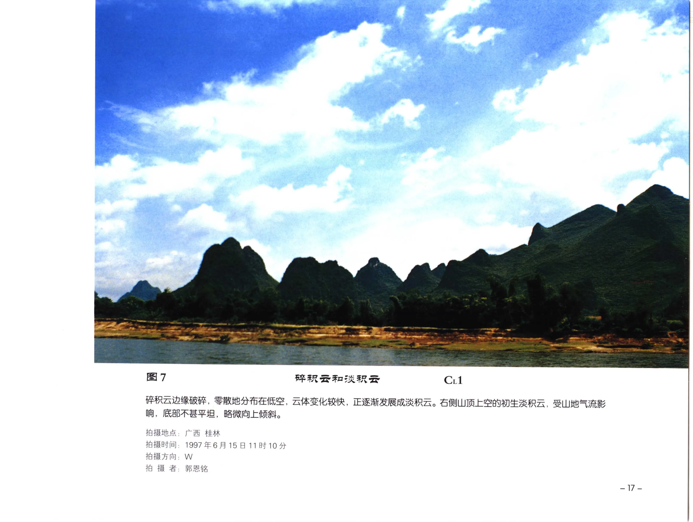

| 字段 | 内容 |
| --- | --- |
| 云类代码 | CL1 |
| 拍摄地点 | 广西 桂林 |
| 拍摄时间 | 1997年6月15日11时10分 |
| 拍摄方向 | W |
| 拍摄者 | 郭恩铭 |
| 原分页 | [PDF 第 29 页](../pages-021-040.md) |

碎积云边缘破碎，零散地分布在低空，云体变化较快，正逐渐发展成淡积云。右侧山顶上空的初生淡积云受山地气流影响，底部不甚平坦，略微向上倾斜。

### 图 8：淡积云

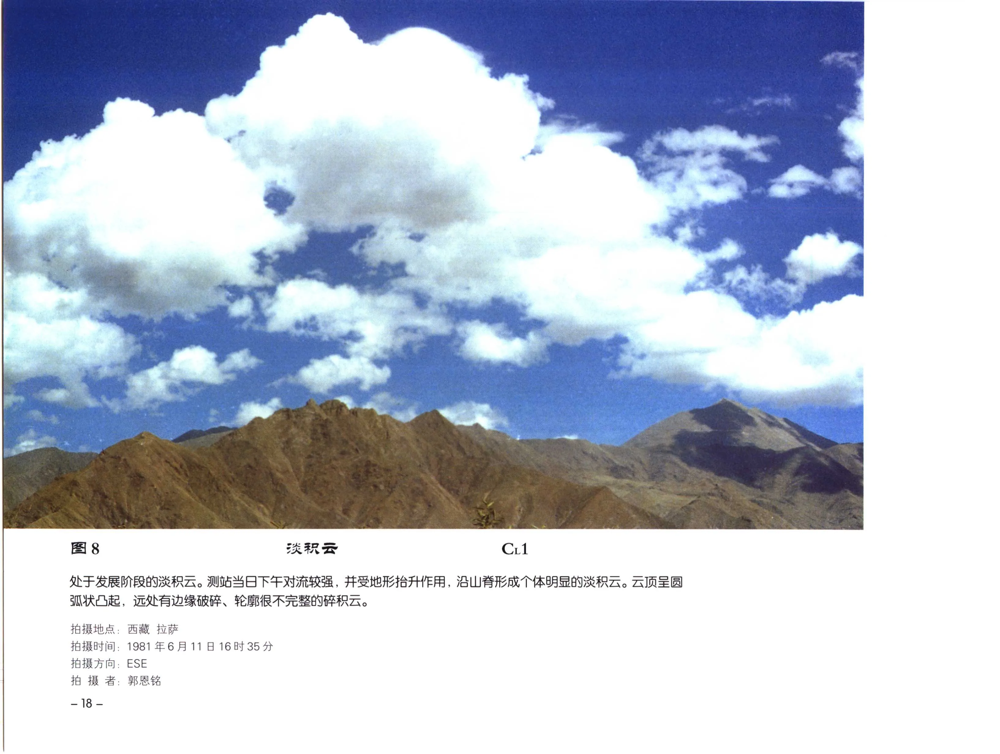

| 字段 | 内容 |
| --- | --- |
| 云类代码 | CL1 |
| 拍摄地点 | 西藏 拉萨 |
| 拍摄时间 | 1981年6月11日16时35分 |
| 拍摄方向 | ESE |
| 拍摄者 | 郭恩铭 |
| 原分页 | [PDF 第 30 页](../pages-021-040.md) |

处于发展阶段的淡积云。测站当日下午对流较强，并受地形抬升作用影响，远处有边缘破碎、轮廓不完整的碎积云。

### 图 9：淡积云

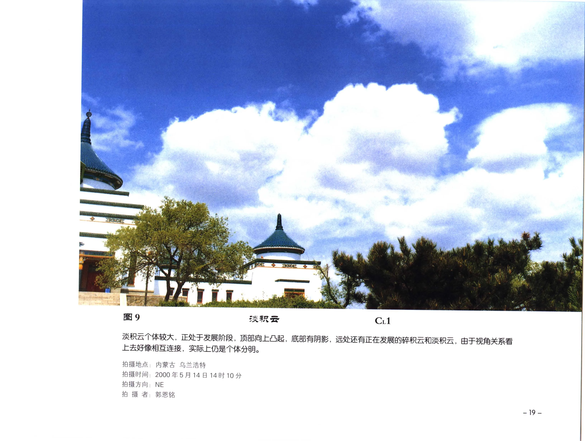

| 字段 | 内容 |
| --- | --- |
| 云类代码 | CL1 |
| 拍摄地点 | 内蒙古 呼和浩特 |
| 拍摄时间 | 2000年5月14日14时10分 |
| 拍摄方向 | NE |
| 拍摄者 | 郭恩铭 |
| 原分页 | [PDF 第 31 页](../pages-021-040.md) |

淡积云个体较大，正处于发展阶段，顶部向上凸起，底部有阴影。远处还有正在发展的碎积云和淡积云，由于视角关系看上去好像相互连接，实际上仍是个体分明。

### 图 10：碎积云

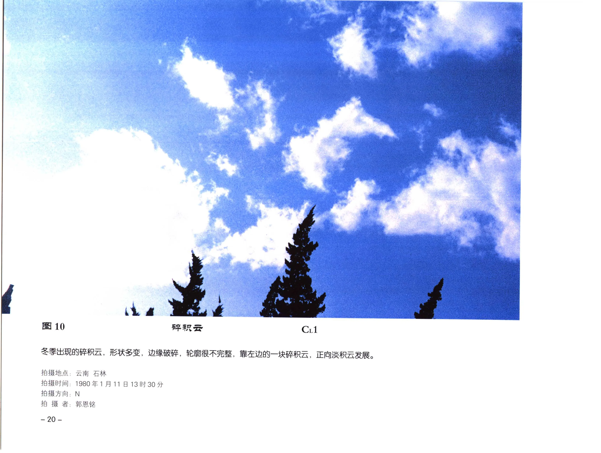

| 字段 | 内容 |
| --- | --- |
| 云类代码 | CL1 |
| 拍摄地点 | 云南 石林 |
| 拍摄时间 | 1980年1月11日13时30分 |
| 拍摄方向 | N |
| 拍摄者 | 郭恩铭 |
| 原分页 | [PDF 第 32 页](../pages-021-040.md) |

冬季出现的碎积云，形状多变，边缘破碎，轮廓很不完整。靠左边的一块碎积云正向淡积云发展。

### 图 11：淡积云和碎积云

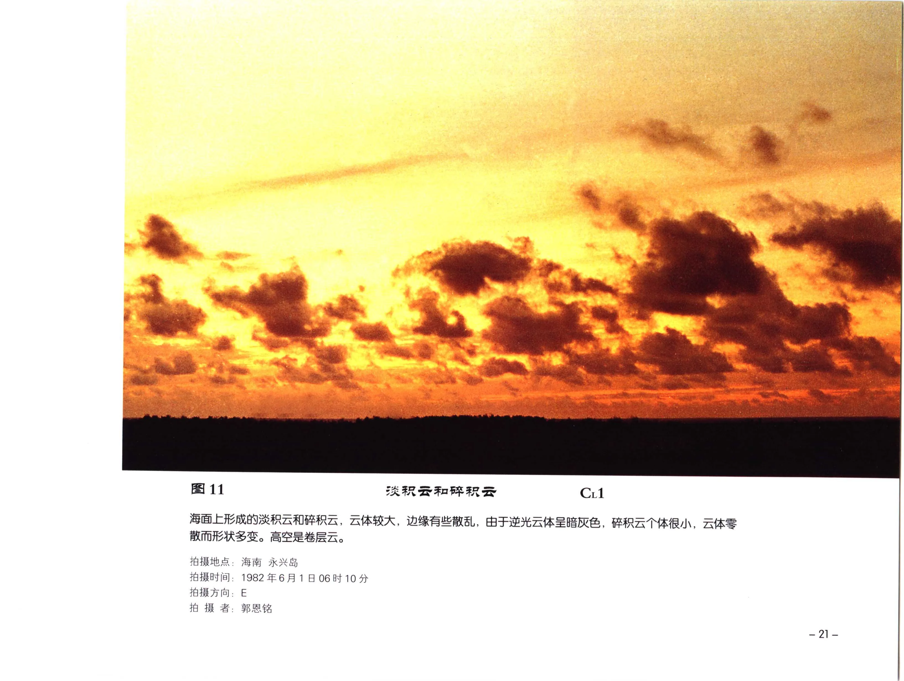

| 字段 | 内容 |
| --- | --- |
| 云类代码 | CL1 |
| 拍摄地点 | 海南 永兴岛 |
| 拍摄时间 | 1982年6月1日06时10分 |
| 拍摄方向 | E |
| 拍摄者 | 郭恩铭 |
| 原分页 | [PDF 第 33 页](../pages-021-040.md) |

海面上形成的淡积云和碎积云，云体较大，边缘有些散乱。由于逆光，云体呈暗灰色；碎积云个体很小，云体松散而形状多变。高空为卷层云。

### 图 12：淡积云

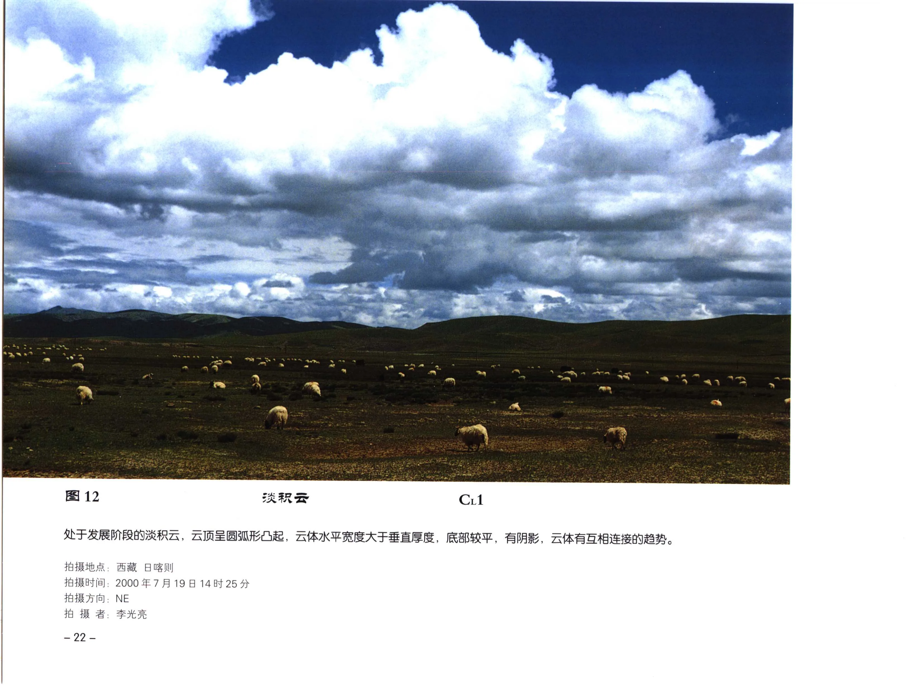

| 字段 | 内容 |
| --- | --- |
| 云类代码 | CL1 |
| 拍摄地点 | 西藏 日喀则 |
| 拍摄时间 | 2000年7月19日14时25分 |
| 拍摄方向 | NE |
| 拍摄者 | 李光亮 |
| 原分页 | [PDF 第 34 页](../pages-021-040.md) |

处于发展阶段的淡积云，云顶呈圆弧形凸起，云体水平宽度大于垂直厚度，底部较平，有阴影，云体有互相连接的趋势。

### 图 13：淡积云

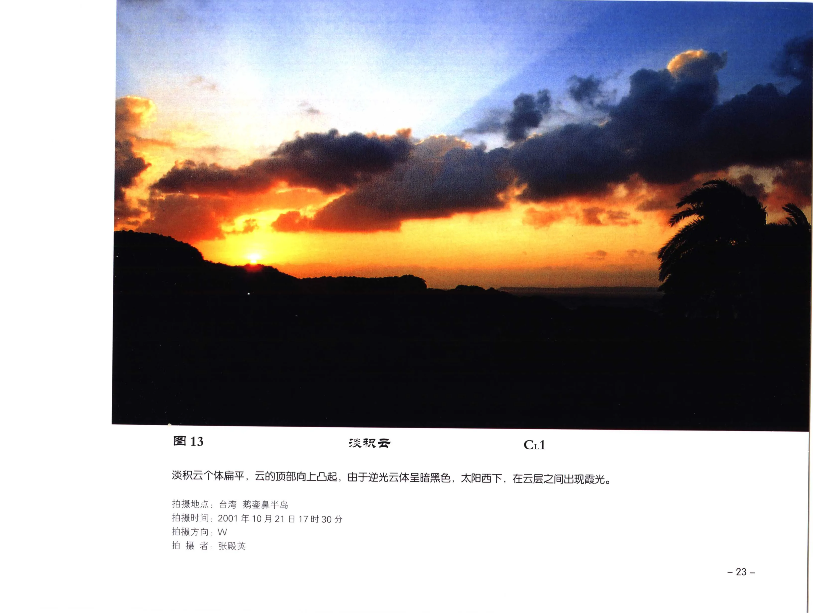

| 字段 | 内容 |
| --- | --- |
| 云类代码 | CL1 |
| 拍摄地点 | 台湾 鹅銮鼻半岛 |
| 拍摄时间 | 2001年10月21日17时30分 |
| 拍摄方向 | W |
| 拍摄者 | 张殿英 |
| 原分页 | [PDF 第 35 页](../pages-021-040.md) |

淡积云个体扁平，云的顶部向上凸起。由于逆光，云体呈暗黑色；太阳西下，在云层之间出现霞光。

### 图 14：淡积云

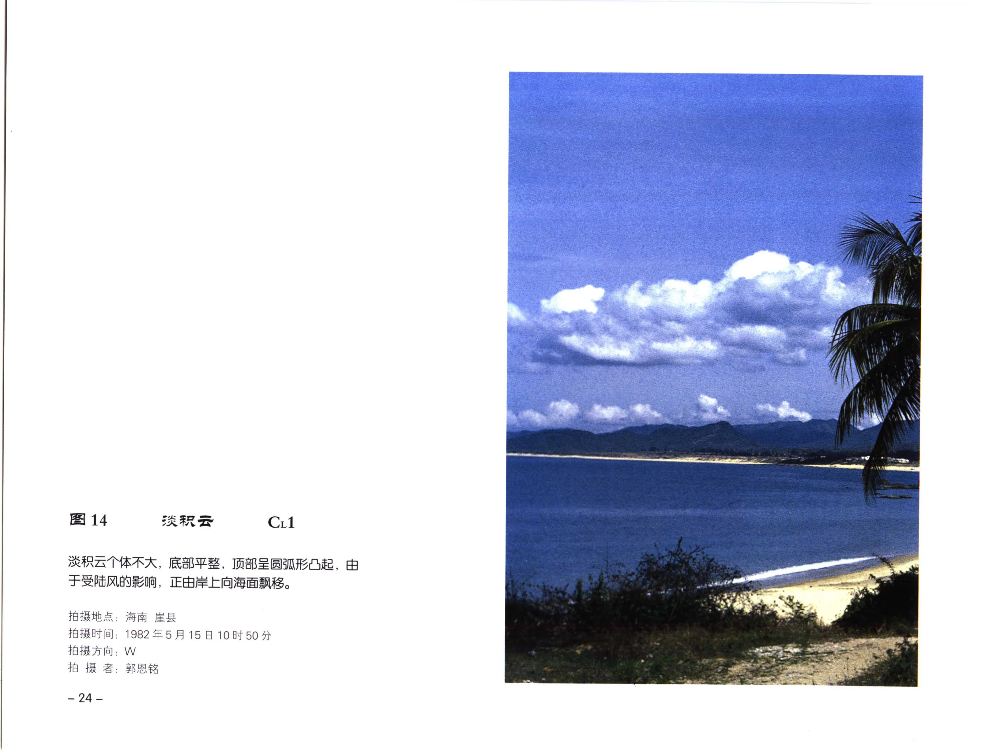

| 字段 | 内容 |
| --- | --- |
| 云类代码 | CL1 |
| 拍摄地点 | 海南 崖县 |
| 拍摄时间 | 1982年5月15日10时50分 |
| 拍摄方向 | W |
| 拍摄者 | 郭恩铭 |
| 原分页 | [PDF 第 36 页](../pages-021-040.md) |

淡积云个体不大，底部平整，顶部呈圆弧形凸起。由于受陆风影响，正由岸上向海面移动。

### 图 15：碎积云和淡积云

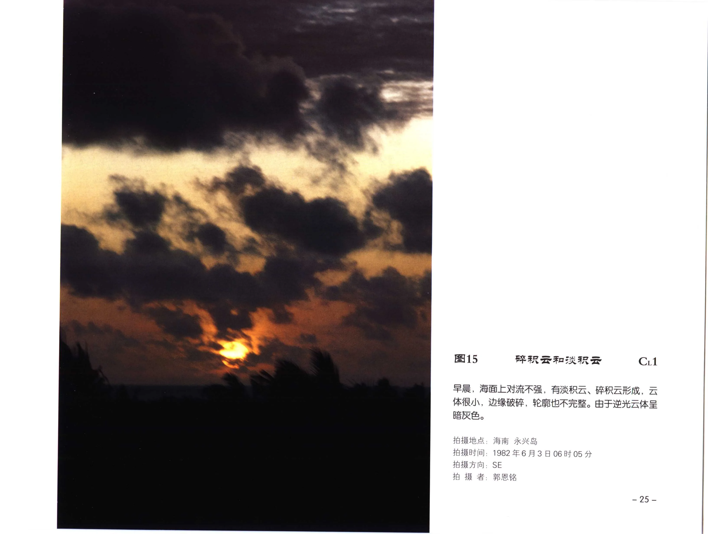

| 字段 | 内容 |
| --- | --- |
| 云类代码 | CL1 |
| 拍摄地点 | 海南 永兴岛 |
| 拍摄时间 | 1982年6月3日06时05分 |
| 拍摄方向 | SE |
| 拍摄者 | 郭恩铭 |
| 原分页 | [PDF 第 37 页](../pages-021-040.md) |

早晨，海面上对流不强，有淡积云、碎积云形成。云体很小，边缘破碎，轮廓也不完整；由于逆光，云体呈暗灰色。

### 图 16：飞机上观测的淡积云

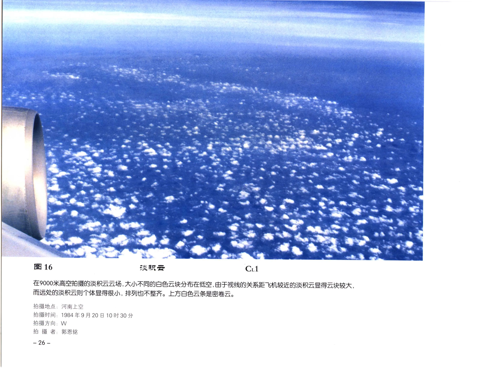

| 字段 | 内容 |
| --- | --- |
| 云类代码 | CL1 |
| 拍摄地点 | 河南上空 |
| 拍摄时间 | 1984年9月20日10时30分 |
| 拍摄方向 | W |
| 拍摄者 | 郭恩铭 |
| 原分页 | [PDF 第 38 页](../pages-021-040.md) |

在 9000 米高空拍摄。不同白色云块分布在低空，由于视线关系，距离飞机较近的淡积云显得云块较大，远处的淡积云显得很小，排列也不整齐。上方白色云条是密卷云。

## 浓积云

### 图 17：浓积云

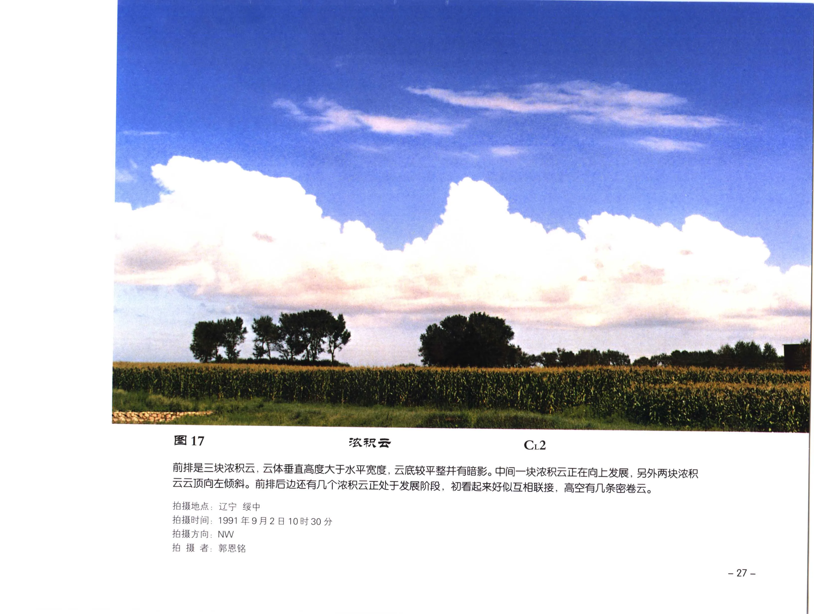

| 字段 | 内容 |
| --- | --- |
| 云类代码 | CL2 |
| 拍摄地点 | 辽宁 绥中 |
| 拍摄时间 | 1991年9月2日10时30分 |
| 拍摄方向 | NW |
| 拍摄者 | 郭恩铭 |
| 原分页 | [PDF 第 39 页](../pages-021-040.md) |

前排是三块浓积云，云体垂直高度大于水平宽度，云底较平整并有暗影。中间一块浓积云正在向上发展，另外两块浓积云云顶向左倾斜。前排后边还有几个浓积云正处于发展阶段，初看起来好像互相连接，高空有几条密卷云。

### 图 18：浓积云

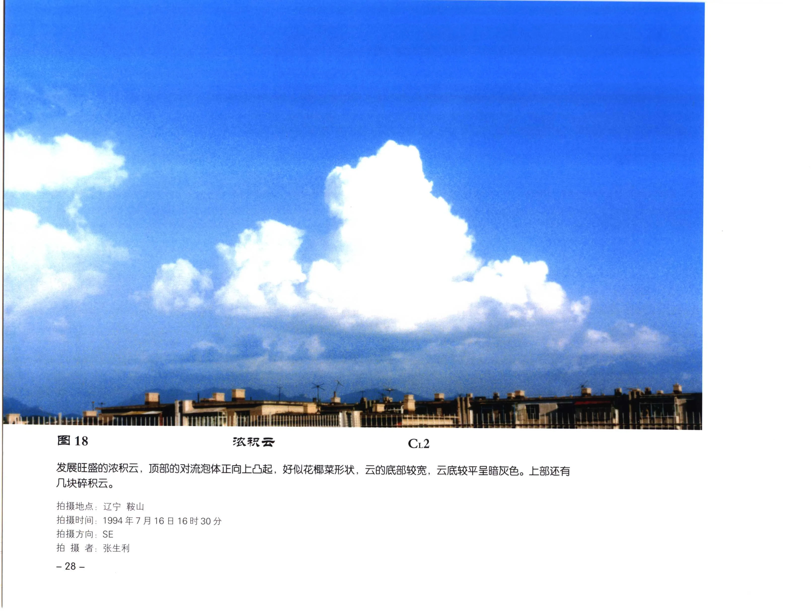

| 字段 | 内容 |
| --- | --- |
| 云类代码 | CL2 |
| 拍摄地点 | 辽宁 鞍山 |
| 拍摄时间 | 1994年7月16日16时30分 |
| 拍摄方向 | SE |
| 拍摄者 | 张生利 |
| 原分页 | [PDF 第 40 页](../pages-021-040.md) |

发展旺盛的浓积云，顶部的对流泡体正向上凸起，好似花椰菜形状；云的底部较宽，云底较平，呈暗灰色。上部还有几块碎积云。

