# 低云图版：层积云

本页整理《中国云图》低云部分中层积云相关图版的初步条目，覆盖 PDF 第 75-85 页中的图 53-63，以及 PDF 第 98 页中的图 76。主要包括积云性层积云、透光层积云、蔽光层积云、层积云以及积云和层积云。

!!! note "校订状态"
    本页以 OCR 文字为底稿，并对照原页图像校订标题、代码、拍摄字段和说明文字。图 53-55 的代码以原页图像可见的 `CL4` 为准；图 56-63 的代码以 `CL5` 为准。

## 图版列表

| 图号 | 云类 | 代码 | PDF 页 | 主要内容 |
| --- | --- | --- | --- | --- |
| 图 53 | 积云性层积云 | CL4 | 75 | 由积云平衍扩展形成，云体多呈长条形，仍保持积云特征。 |
| 图 54 | 积云性层积云 | CL4 | 76 | 早晨分散积云减弱扩展形成，形状不规则，多为长条形。 |
| 图 55 | 积云性层积云 | CL4 | 77 | 夕阳下层积云和高积云呈黄红色。 |
| 图 56 | 透光层积云 | CL5 | 78 | 云块灰色、形状不规则，云隙明显，阳光透过云隙照射草原。 |
| 图 57 | 透光层积云 | CL5 | 79 | 云块排列平整，被夕阳映照呈金黄色，云块间可见蓝天。 |
| 图 58 | 透光层积云 | CL5 | 80 | 长条形透光层积云平行排列，云条间有缝隙。 |
| 图 59 | 透光层积云 | CL5 | 81 | 透光层积云成波状排列，厚处深灰、云隙处明亮。 |
| 图 60 | 蔽光层积云 | CL5 | 82 | 蔽光层积云布满全天，厚度不均，有深灰浅白之分。 |
| 图 61 | 蔽光层积云 | CL5 | 83 | 蔽光层积云布满全天，云块大小不均，曾降零星小雨。 |
| 图 62 | 蔽光层积云 | CL5 | 84 | 蔽光层积云布满全天，云层较厚、很低，远处山顶被云底遮盖。 |
| 图 63 | 层积云 | CL5 | 85 | 雨后转晴，潮湿空气抬升形成层积云，太阳升高后逐渐消散。 |
| 图 76 | 积云和层积云 | CL8 | 98 | 层积云散乱未布满全天，山峰附近层积云抬高发展为淡积云。 |

## 积云性层积云

### 图 53：积云性层积云

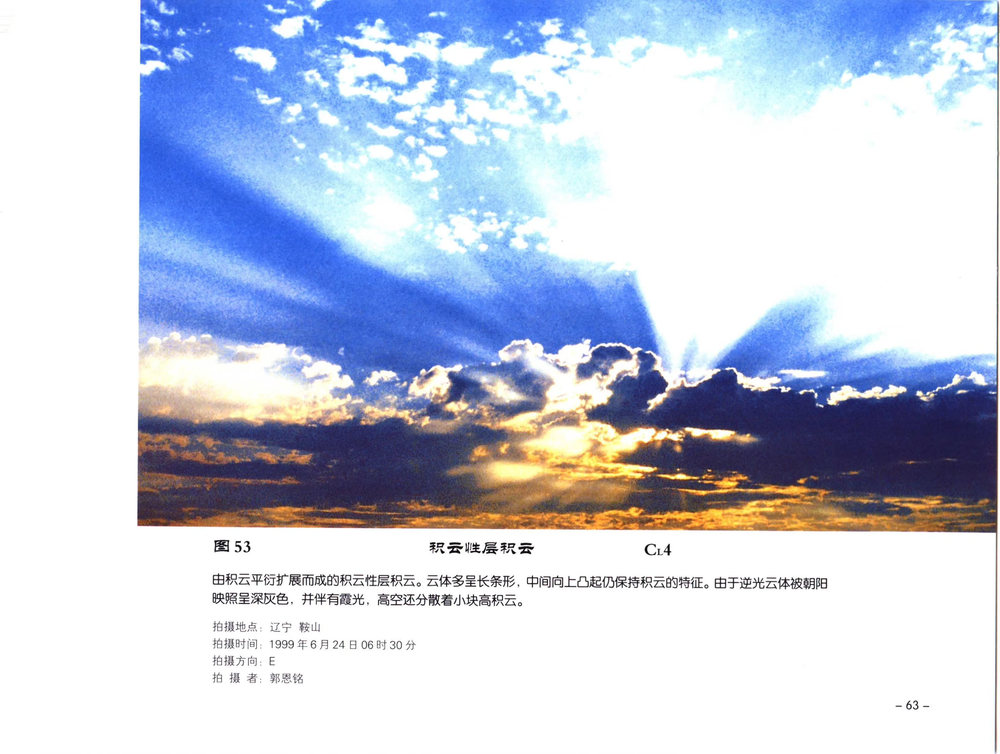

| 字段 | 内容 |
| --- | --- |
| 云类代码 | CL4 |
| 拍摄地点 | 辽宁 鞍山 |
| 拍摄时间 | 1999年6月24日06时30分 |
| 拍摄方向 | E |
| 拍摄者 | 郭恩铭 |
| 原分页 | [PDF 第 75 页](../pages-061-080.md) |

由积云平衍扩展而成的积云性层积云。云体多呈长条形，中间向上凸起，仍保持积云的特征。由于逆光，云体被朝阳映照呈深灰色，并伴有霞光；高空还分散着小块高积云。

### 图 54：积云性层积云

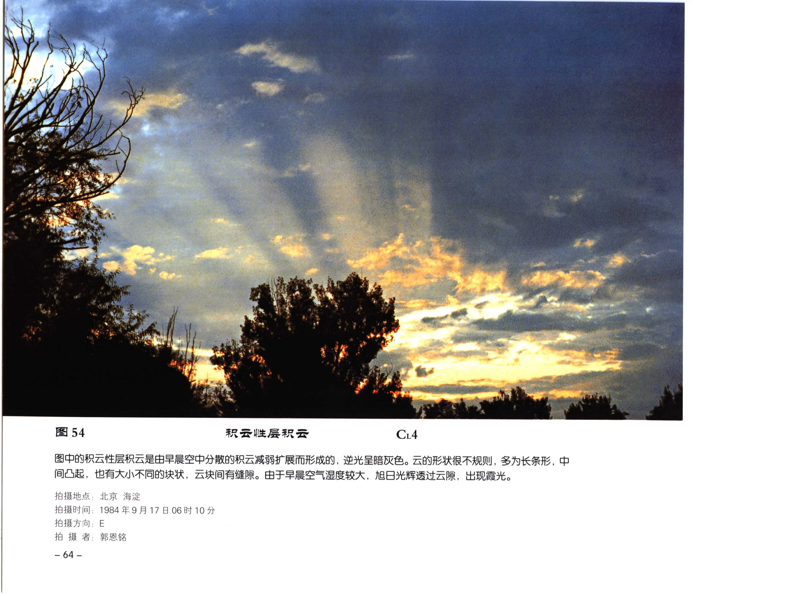

| 字段 | 内容 |
| --- | --- |
| 云类代码 | CL4 |
| 拍摄地点 | 北京 海淀 |
| 拍摄时间 | 1984年9月17日06时10分 |
| 拍摄方向 | E |
| 拍摄者 | 郭恩铭 |
| 原分页 | [PDF 第 76 页](../pages-061-080.md) |

图中的积云性层积云由早晨空中分散的积云减弱扩展而形成，逆光下呈暗灰色。云的形状很不规则，多为长条形，中间凸起，也有大小不同的块状，云块间有缝隙。由于早晨空气湿度较大，旭日光辉透过云隙，出现霞光。

### 图 55：积云性层积云

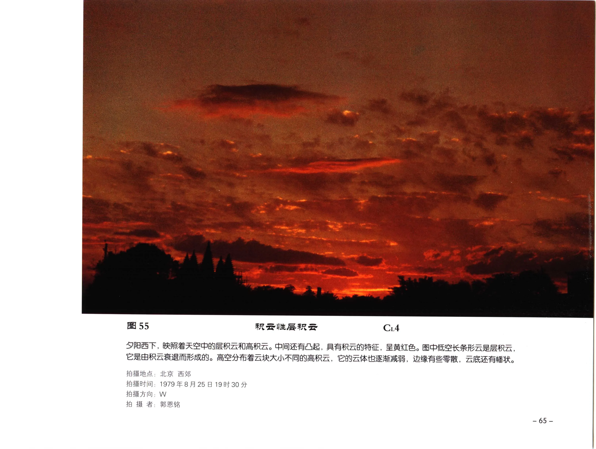

| 字段 | 内容 |
| --- | --- |
| 云类代码 | CL4 |
| 拍摄地点 | 北京 西郊 |
| 拍摄时间 | 1979年8月25日19时30分 |
| 拍摄方向 | W |
| 拍摄者 | 郭恩铭 |
| 原分页 | [PDF 第 77 页](../pages-061-080.md) |

夕阳西下，映照着天空中的层积云和高积云。中间还有凸起，具有积云的特征，呈黄红色。图中低空长条形云是层积云，它是由积云衰退而形成的。高空分布着云块大小不同的高积云，它的云体也逐渐减弱，边缘有些零散，云底还有幡状。

## 透光层积云

### 图 56：透光层积云

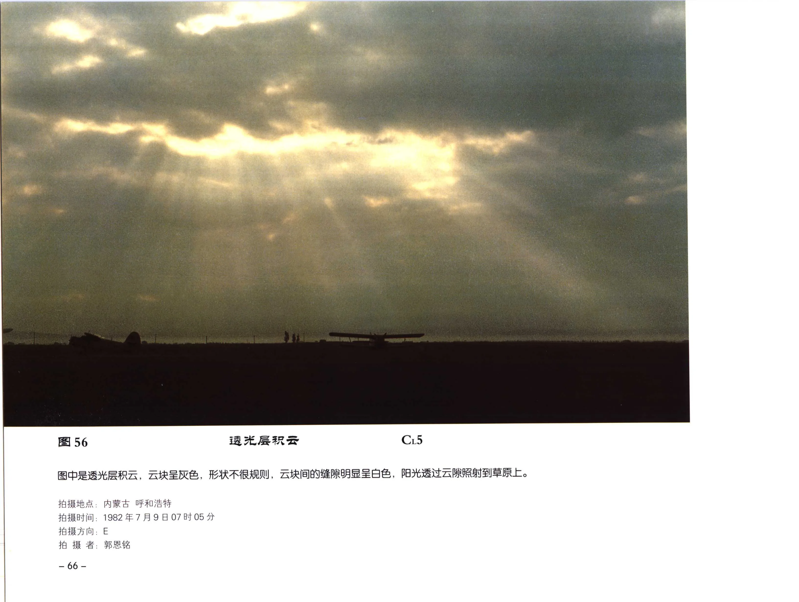

| 字段 | 内容 |
| --- | --- |
| 云类代码 | CL5 |
| 拍摄地点 | 内蒙古 呼和浩特 |
| 拍摄时间 | 1982年7月9日07时05分 |
| 拍摄方向 | E |
| 拍摄者 | 郭恩铭 |
| 原分页 | [PDF 第 78 页](../pages-061-080.md) |

图中是透光层积云，云块呈灰色，形状不很规则，云块间的缝隙明显呈白色，阳光透过云隙照射到草原上。

### 图 57：透光层积云

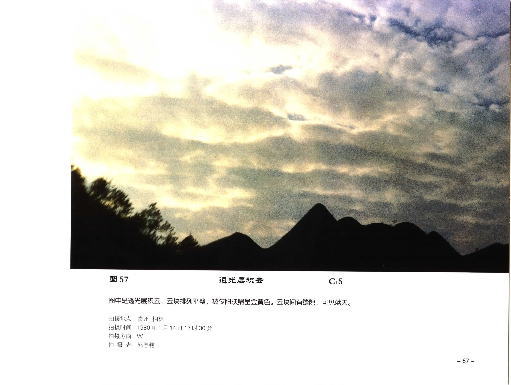

| 字段 | 内容 |
| --- | --- |
| 云类代码 | CL5 |
| 拍摄地点 | 贵州 桐梓 |
| 拍摄时间 | 1980年1月14日17时30分 |
| 拍摄方向 | W |
| 拍摄者 | 郭恩铭 |
| 原分页 | [PDF 第 79 页](../pages-061-080.md) |

图中是透光层积云，云块排列平整，被夕阳映照呈金黄色。云块间有缝隙，可见蓝天。

### 图 58：透光层积云

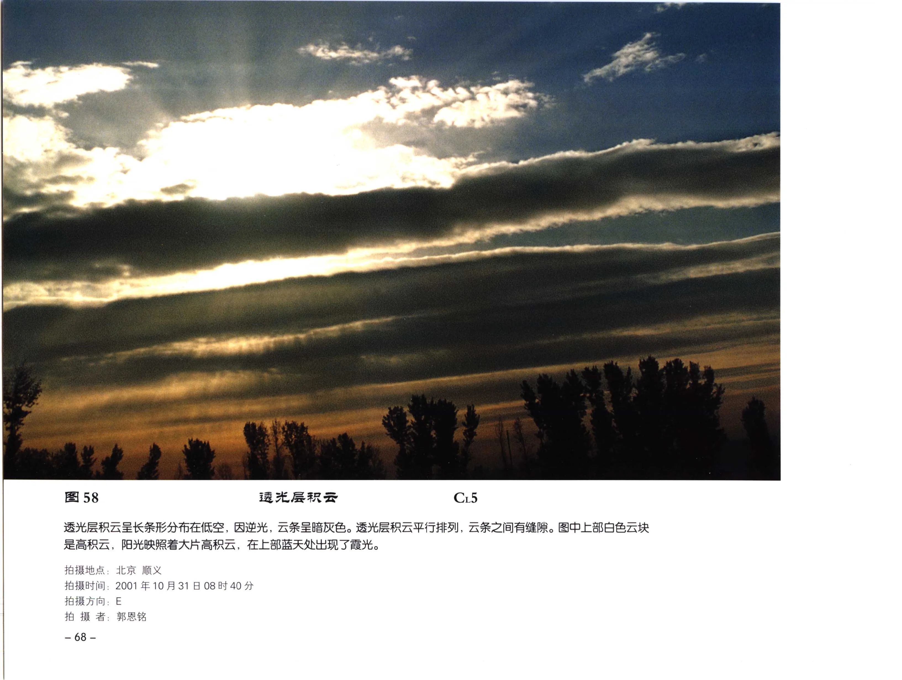

| 字段 | 内容 |
| --- | --- |
| 云类代码 | CL5 |
| 拍摄地点 | 北京 顺义 |
| 拍摄时间 | 2001年10月31日08时40分 |
| 拍摄方向 | E |
| 拍摄者 | 郭恩铭 |
| 原分页 | [PDF 第 80 页](../pages-061-080.md) |

透光层积云呈长条形分布在低空。因逆光，云条呈暗灰色。透光层积云平行排列，云条之间有缝隙。图中上部白色云块是高积云，阳光映照着大片高积云，在上部蓝天处出现了霞光。

### 图 59：透光层积云

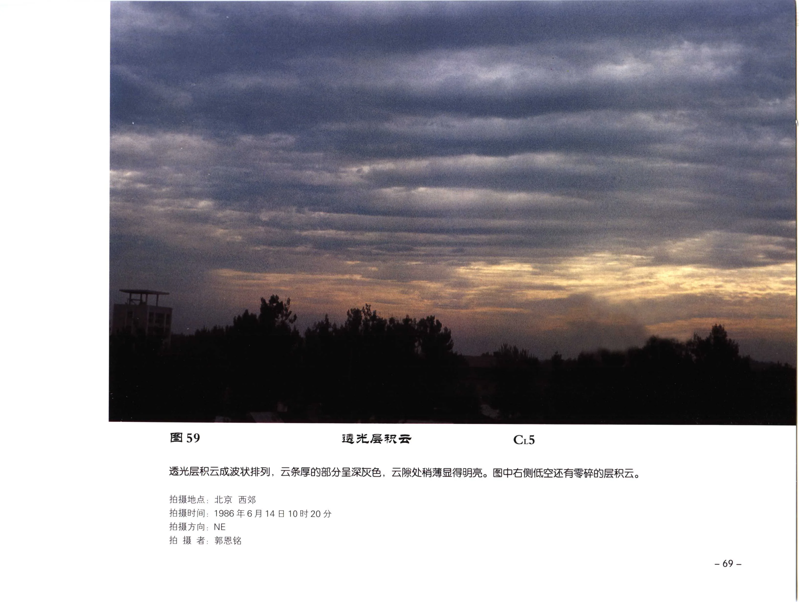

| 字段 | 内容 |
| --- | --- |
| 云类代码 | CL5 |
| 拍摄地点 | 北京 西郊 |
| 拍摄时间 | 1986年6月14日10时20分 |
| 拍摄方向 | NE |
| 拍摄者 | 郭恩铭 |
| 原分页 | [PDF 第 81 页](../pages-081-100.md) |

透光层积云成波状排列，云条厚的部分呈深灰色，云隙处稍薄显得明亮。图中右侧低空还有零碎的层积云。

## 蔽光层积云

### 图 60：蔽光层积云

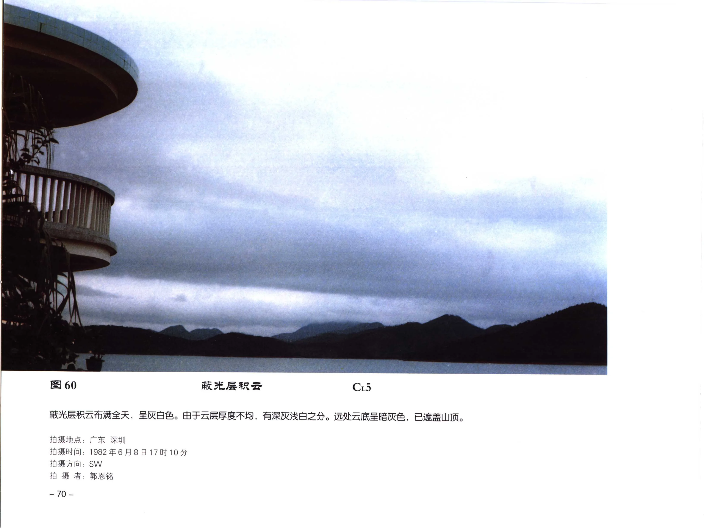

| 字段 | 内容 |
| --- | --- |
| 云类代码 | CL5 |
| 拍摄地点 | 广东 深圳 |
| 拍摄时间 | 1982年6月8日17时10分 |
| 拍摄方向 | SW |
| 拍摄者 | 郭恩铭 |
| 原分页 | [PDF 第 82 页](../pages-081-100.md) |

蔽光层积云布满全天，呈灰白色。由于云层厚度不均，有深灰浅白之分。远处云底呈暗灰色，已遮盖山顶。

### 图 61：蔽光层积云

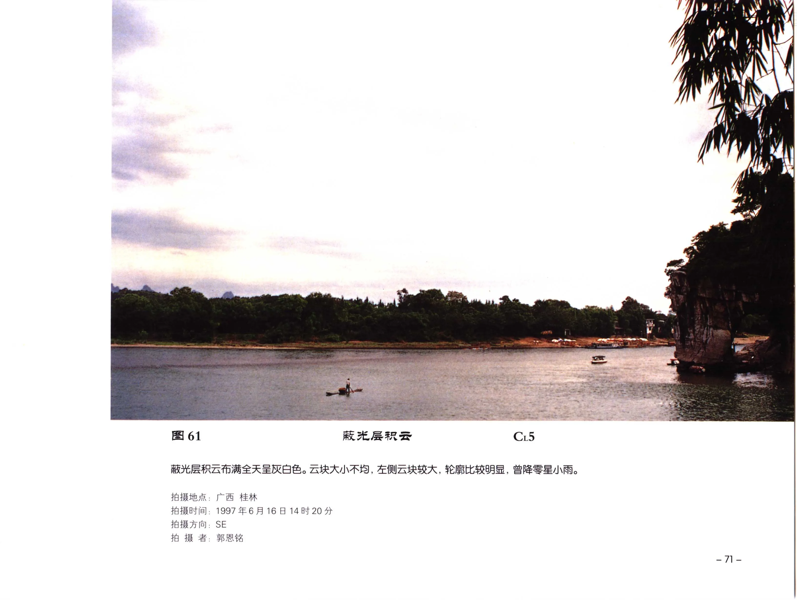

| 字段 | 内容 |
| --- | --- |
| 云类代码 | CL5 |
| 拍摄地点 | 广西 桂林 |
| 拍摄时间 | 1997年6月16日14时20分 |
| 拍摄方向 | SE |
| 拍摄者 | 郭恩铭 |
| 原分页 | [PDF 第 83 页](../pages-081-100.md) |

蔽光层积云布满全天，呈灰白色。云块大小不均，左侧云块较大，轮廓比较明显，曾降零星小雨。

### 图 62：蔽光层积云

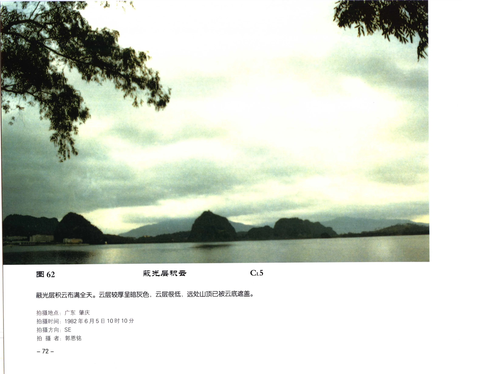

| 字段 | 内容 |
| --- | --- |
| 云类代码 | CL5 |
| 拍摄地点 | 广东 肇庆 |
| 拍摄时间 | 1982年6月5日10时10分 |
| 拍摄方向 | SE |
| 拍摄者 | 郭恩铭 |
| 原分页 | [PDF 第 84 页](../pages-081-100.md) |

蔽光层积云布满全天。云层较厚，呈暗灰色；云层很低，远处山顶已被云底遮盖。

## 层积云

### 图 63：层积云

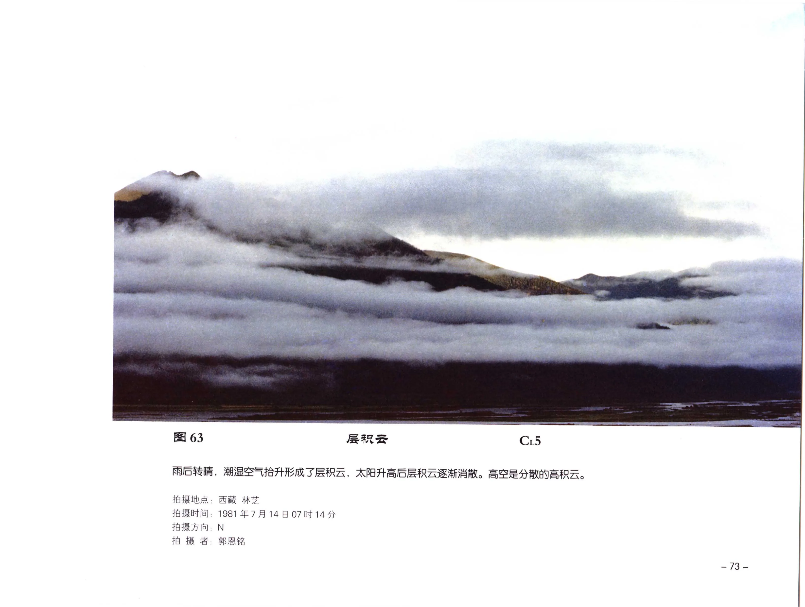

| 字段 | 内容 |
| --- | --- |
| 云类代码 | CL5 |
| 拍摄地点 | 西藏 林芝 |
| 拍摄时间 | 1981年7月14日07时14分 |
| 拍摄方向 | N |
| 拍摄者 | 郭恩铭 |
| 原分页 | [PDF 第 85 页](../pages-081-100.md) |

雨后转晴，潮湿空气抬升形成了层积云，太阳升高后层积云逐渐消散。高空是分散的高积云。

### 图 76：积云和层积云

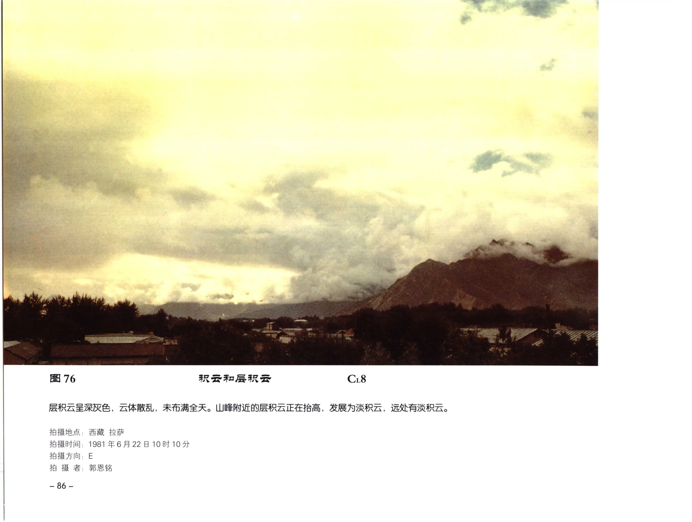

| 字段 | 内容 |
| --- | --- |
| 云类代码 | CL8 |
| 拍摄地点 | 西藏 拉萨 |
| 拍摄时间 | 1981年6月22日10时10分 |
| 拍摄方向 | E |
| 拍摄者 | 郭恩铭 |
| 原分页 | [PDF 第 98 页](../pages-081-100.md) |

层积云呈深灰色，云体散乱，未布满全天。山峰附近的层积云正在抬高，发展为淡积云，远处有淡积云。
