# 低云图版：层云与雨层云

本页整理《中国云图》低云部分中层云、碎层云、雨层云和碎雨云相关图版，范围覆盖 PDF 第 86-97 页中的图 64-75。

!!! note "校订状态"
    本页以 OCR 文本和原页图像共同整理。图 64-75 的标题、代码、拍摄字段和说明文字已按可辨原页图像校订。

## 图版列表

| 图号 | 云类 | 代码 | PDF 页 | 主要内容 |
| --- | --- | --- | --- | --- |
| 图 64 | 层云 | CL6 | 86 | 海面浓雾抬升形成层云，云底很低，山顶被遮盖。 |
| 图 65 | 层云 | CL6 | 87 | 海雾移到陆地时抬升形成层云，云体均匀成层。 |
| 图 66 | 层云 | CL6 | 88 | 较厚层云由海上移来，山顶被层云遮住。 |
| 图 67 | 层云 | CL6 | 89 | 夜雨后浓雾抬升形成层云，层云由南向北移动并遮住山顶。 |
| 图 68 | 碎层云 | CL6 | 90 | 层云受太阳辐射增强影响，沿山坡抬升演变成碎层云。 |
| 图 69 | 雨层云和碎雨云 | CL7 CM2 | 91 | 正在下雨，山体被雨层云遮蔽，山坡右侧有碎雨云。 |
| 图 70 | 雨层云和碎雨云 | CL7 CM2 | 92 | 雨层云布满全天，底层为漫无定形的碎雨云，正在下雨。 |
| 图 71 | 雨层云 | CM2 | 93 | 雨层云很厚、深灰、布满全天，接近山峰处正在降雨。 |
| 图 72 | 雨层云 | CL7 CM2 | 94 | 雨层云正在降雪，公路上气温略高，雪花落地后融化。 |
| 图 73 | 雨层云 | CL7 CM2 | 95 | 暗灰色雨层云布满全天，云底很低，山上出现降雨。 |
| 图 74 | 雨层云 | CL7 CM2 | 96 | 雨层云云底很低、云层很厚，山峰被碎雨云遮蔽。 |
| 图 75 | 雨层云 | CL7 CM2 | 97 | 雨层云布满全天，云底很低呈波状起伏，远方正在下雨。 |

## 层云与碎层云

### 图 64：层云

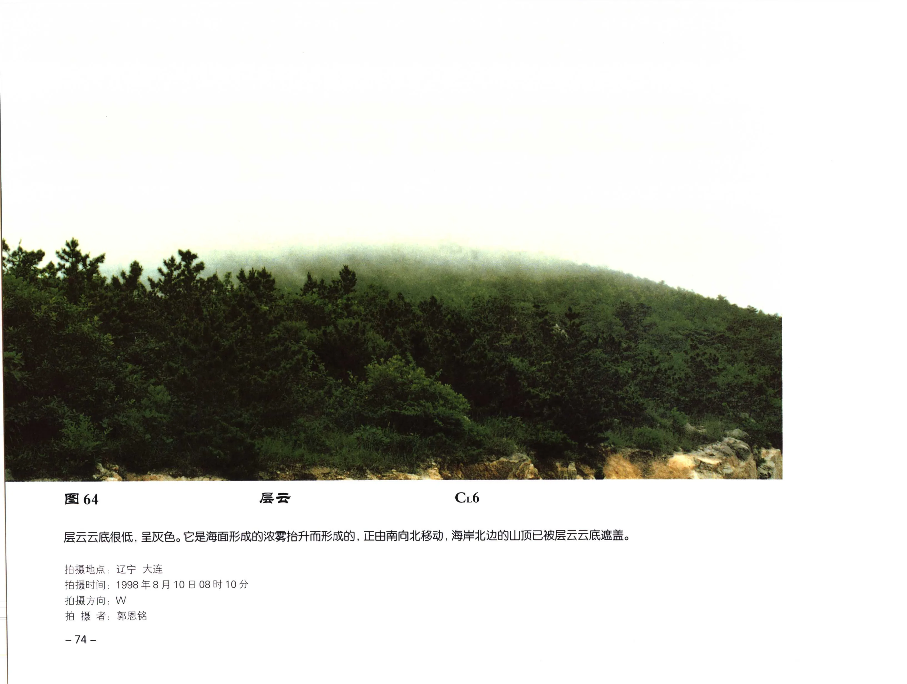

| 字段 | 内容 |
| --- | --- |
| 云类代码 | CL6 |
| 拍摄地点 | 辽宁 大连 |
| 拍摄时间 | 1998年8月10日08时10分 |
| 拍摄方向 | W |
| 拍摄者 | 郭恩铭 |
| 原分页 | [PDF 第 86 页](../pages-081-100.md) |

层云云底很低，呈灰色。它是海面形成的浓雾抬升而形成的，正由南向北移动，海岸北边的山顶已被层云云底遮盖。

### 图 65：层云

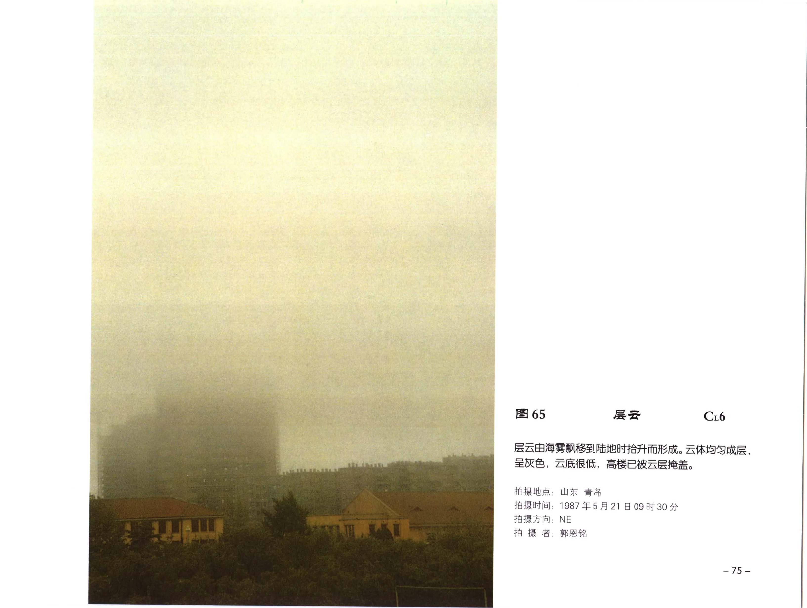

| 字段 | 内容 |
| --- | --- |
| 云类代码 | CL6 |
| 拍摄地点 | 山东 青岛 |
| 拍摄时间 | 1987年5月21日09时30分 |
| 拍摄方向 | NE |
| 拍摄者 | 郭恩铭 |
| 原分页 | [PDF 第 87 页](../pages-081-100.md) |

层云由海雾移到陆地时抬升而形成。云体均匀成层，呈灰色，云底很低，高楼已被云层掩盖。

### 图 66：层云

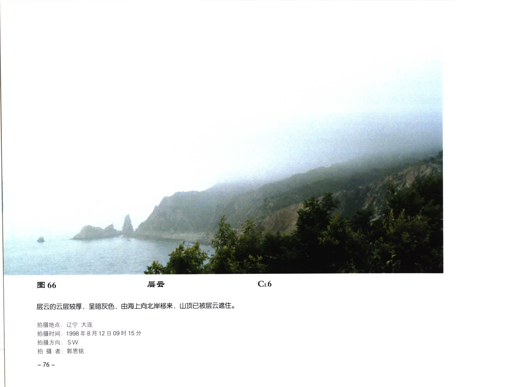

| 字段 | 内容 |
| --- | --- |
| 云类代码 | CL6 |
| 拍摄地点 | 辽宁 大连 |
| 拍摄时间 | 1998年8月12日09时15分 |
| 拍摄方向 | SW |
| 拍摄者 | 郭恩铭 |
| 原分页 | [PDF 第 88 页](../pages-081-100.md) |

层云的云层较厚，呈暗灰色，由海上向北岸移来，山顶已被层云遮住。

### 图 67：层云

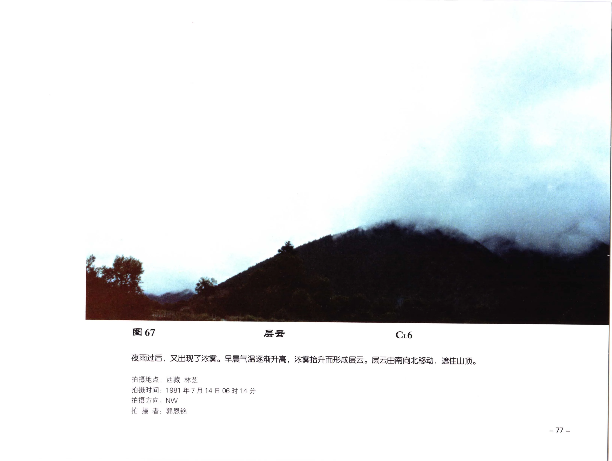

| 字段 | 内容 |
| --- | --- |
| 云类代码 | CL6 |
| 拍摄地点 | 西藏 林芝 |
| 拍摄时间 | 1981年7月14日06时14分 |
| 拍摄方向 | NW |
| 拍摄者 | 郭恩铭 |
| 原分页 | [PDF 第 89 页](../pages-081-100.md) |

夜雨过后，又出现了浓雾。早晨气温逐渐升高，浓雾抬升而形成层云。层云由南向北移动，遮住山顶。

### 图 68：碎层云

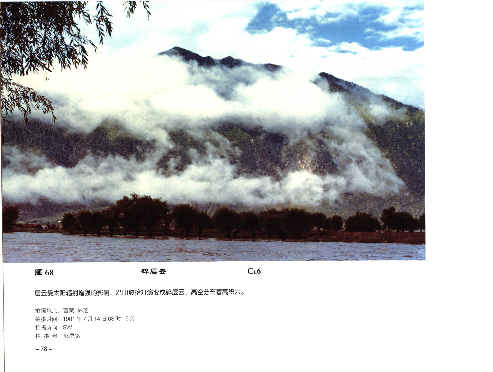

| 字段 | 内容 |
| --- | --- |
| 云类代码 | CL6 |
| 拍摄地点 | 西藏 林芝 |
| 拍摄时间 | 1981年7月14日08时15分 |
| 拍摄方向 | SW |
| 拍摄者 | 郭恩铭 |
| 原分页 | [PDF 第 90 页](../pages-081-100.md) |

层云受太阳辐射增强影响，沿山坡抬升演变成碎层云，高空分布着高积云。

## 雨层云与碎雨云

### 图 69：雨层云和碎雨云

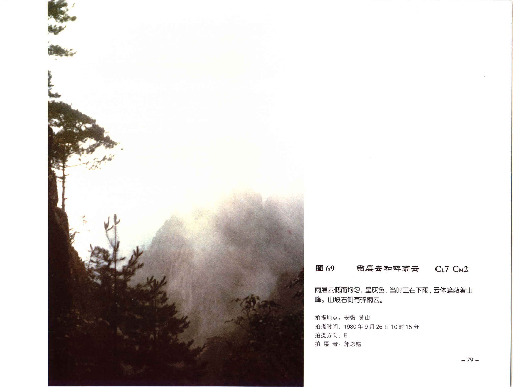

| 字段 | 内容 |
| --- | --- |
| 云类代码 | CL7 CM2 |
| 拍摄地点 | 安徽 黄山 |
| 拍摄时间 | 1980年9月26日10时15分 |
| 拍摄方向 | E |
| 拍摄者 | 郭恩铭 |
| 原分页 | [PDF 第 91 页](../pages-081-100.md) |

雨层云低而均匀，呈灰色。当时正在下雨，云体遮蔽着山峰。山坡右侧有碎雨云。

### 图 70：雨层云和碎雨云

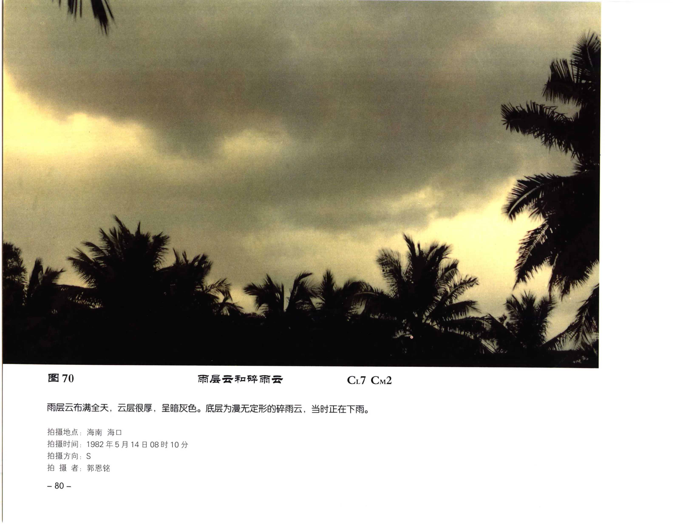

| 字段 | 内容 |
| --- | --- |
| 云类代码 | CL7 CM2 |
| 拍摄地点 | 海南 海口 |
| 拍摄时间 | 1982年5月14日08时10分 |
| 拍摄方向 | S |
| 拍摄者 | 郭恩铭 |
| 原分页 | [PDF 第 92 页](../pages-081-100.md) |

雨层云布满全天，云层很厚，呈暗灰色。底层为漫无定形的碎雨云，当时正在下雨。

### 图 71：雨层云

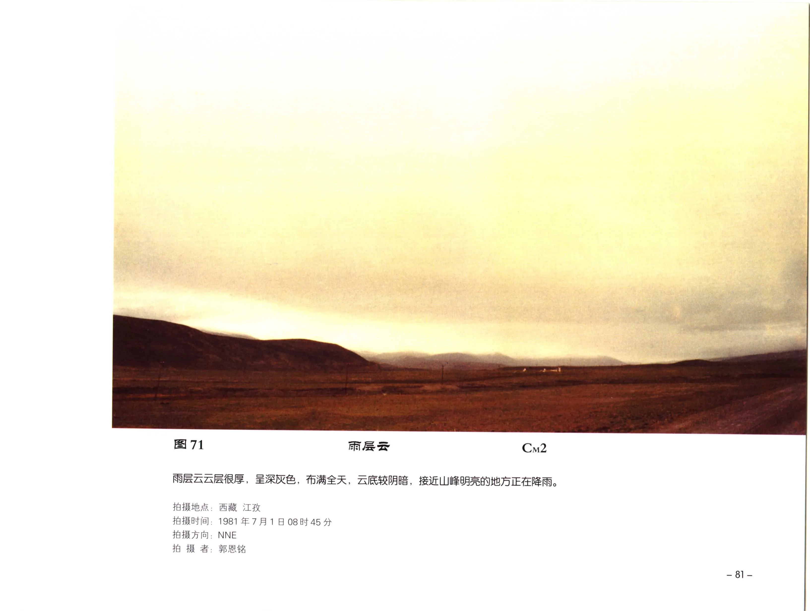

| 字段 | 内容 |
| --- | --- |
| 云类代码 | CM2 |
| 拍摄地点 | 西藏 江孜 |
| 拍摄时间 | 1981年7月1日08时45分 |
| 拍摄方向 | NNE |
| 拍摄者 | 郭恩铭 |
| 原分页 | [PDF 第 93 页](../pages-081-100.md) |

雨层云云层很厚，呈深灰色，布满全天，云底较阴暗。接近山峰明亮的地方正在降雨。

### 图 72：雨层云

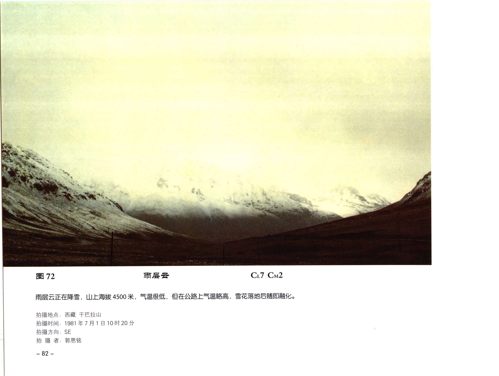

| 字段 | 内容 |
| --- | --- |
| 云类代码 | CL7 CM2 |
| 拍摄地点 | 西藏 干巴拉山 |
| 拍摄时间 | 1981年7月1日10时20分 |
| 拍摄方向 | SE |
| 拍摄者 | 郭恩铭 |
| 原分页 | [PDF 第 94 页](../pages-081-100.md) |

雨层云正在降雪。山上海拔 4500 米，气温很低，但公路上气温略高，雪花落地后随即融化。

### 图 73：雨层云

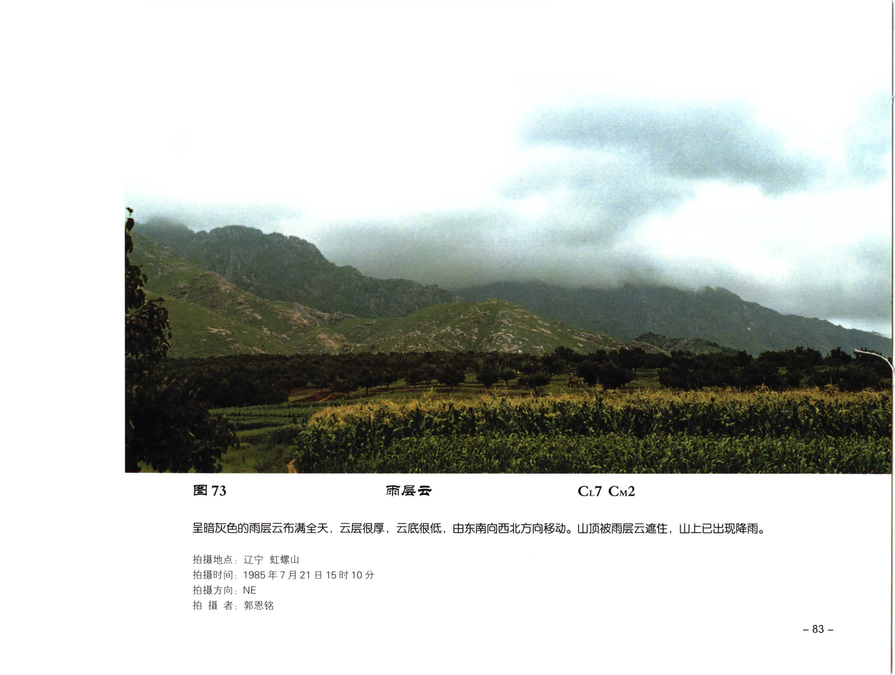

| 字段 | 内容 |
| --- | --- |
| 云类代码 | CL7 CM2 |
| 拍摄地点 | 辽宁 虹螺山 |
| 拍摄时间 | 1985年7月21日15时10分 |
| 拍摄方向 | NE |
| 拍摄者 | 郭恩铭 |
| 原分页 | [PDF 第 95 页](../pages-081-100.md) |

呈暗灰色的雨层云布满全天，云层很厚，云底很低，由东南向西北方向移动。山顶被雨层云遮住，山上已出现降雨。

### 图 74：雨层云

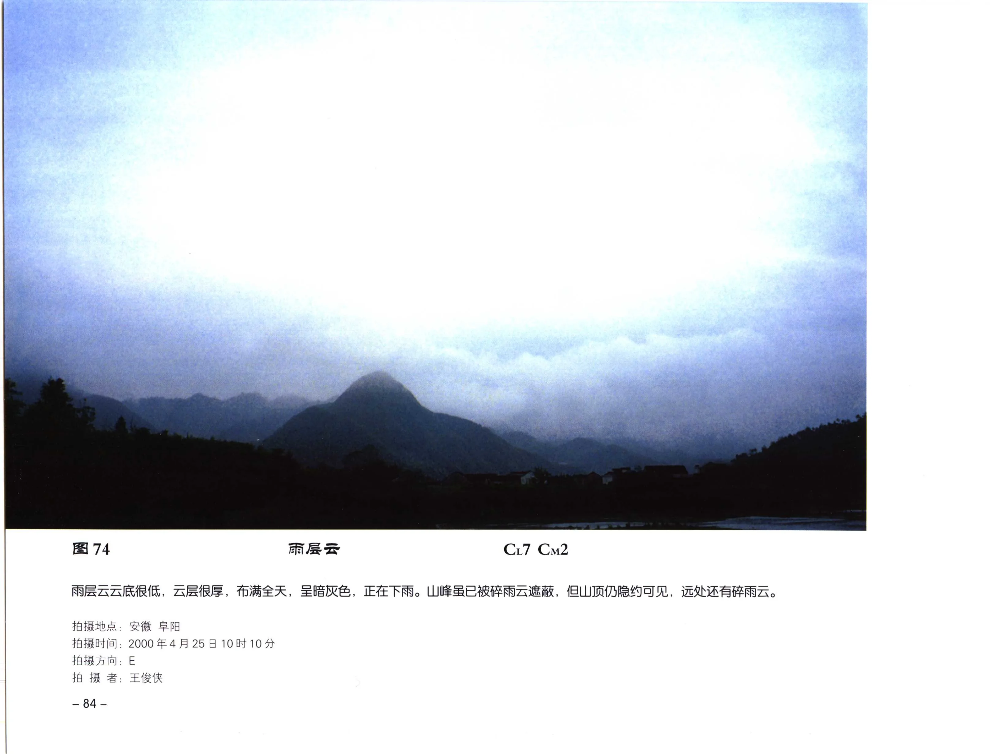

| 字段 | 内容 |
| --- | --- |
| 云类代码 | CL7 CM2 |
| 拍摄地点 | 安徽 阜阳 |
| 拍摄时间 | 2000年4月25日10时10分 |
| 拍摄方向 | E |
| 拍摄者 | 王俊侠 |
| 原分页 | [PDF 第 96 页](../pages-081-100.md) |

雨层云云底很低，云层很厚，布满全天，呈暗灰色，正在下雨。山峰虽已被碎雨云遮蔽，但山顶仍隐约可见，远处还有碎雨云。

### 图 75：雨层云

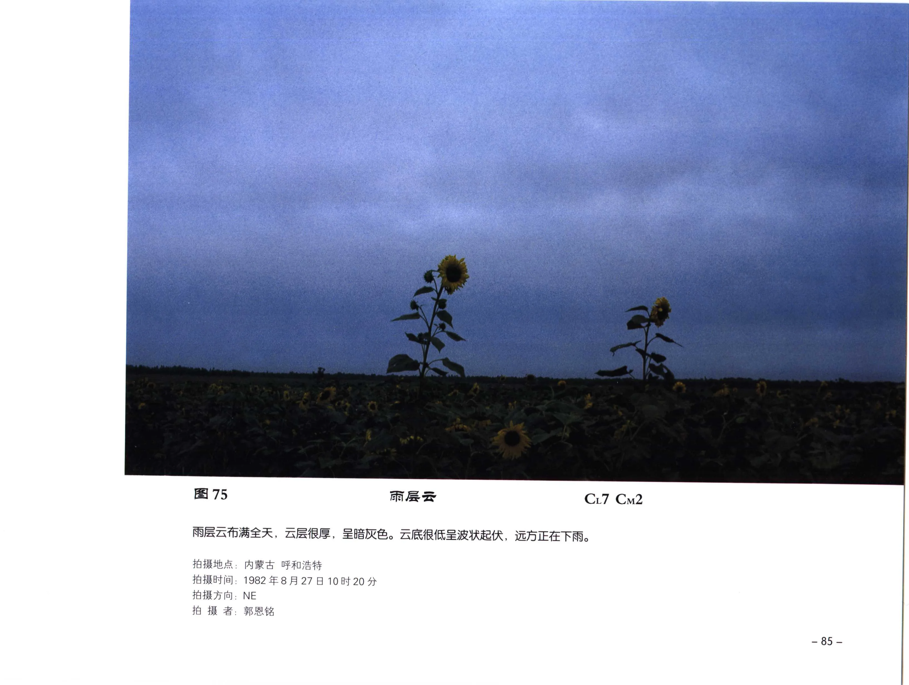

| 字段 | 内容 |
| --- | --- |
| 云类代码 | CL7 CM2 |
| 拍摄地点 | 内蒙古 呼和浩特 |
| 拍摄时间 | 1982年8月27日10时20分 |
| 拍摄方向 | NE |
| 拍摄者 | 郭恩铭 |
| 原分页 | [PDF 第 97 页](../pages-081-100.md) |

雨层云布满全天，云层很厚，呈暗灰色。云底很低，呈波状起伏，远方正在下雨。
