# 中云图版：高积云

本页整理《中国云图》中云部分的高积云图版，范围覆盖 PDF 第 105-140 页中的图 81-116。

!!! note "校订状态"
    本页以 OCR 文本和原页图像共同整理。图 81-116 的标题、代码、拍摄字段和说明文字已按可辨原页图像校订。

## 图版列表

| 图号 | 云类 | 代码 | PDF 页 | 主要内容 |
| --- | --- | --- | --- | --- |
| 图 81 | 透光高积云 | CM3 | 105 | 云块不大，呈波状排列，云隙之间可见蓝天。 |
| 图 82 | 透光高积云 | CM3 | 106 | 波状高积云，太阳将升起处较明亮。 |
| 图 83 | 透光高积云 | CM3 | 107 | 傍晚夕阳映照高积云，厚薄不同导致颜色变化。 |
| 图 84 | 荚状高积云 | CM4 | 108 | 长条豆荚状高积云零散分布，部分处于消散阶段。 |
| 图 85 | 荚状高积云 | CM4 | 109 | 荚状高积云垂直排列，云底较暗。 |
| 图 86 | 荚状高积云 | CM4 | 110 | 白色荚状高积云，中间较厚、边缘较薄。 |
| 图 87 | 荚状高积云 | CM4 | 111 | 荚状高积云分布在空中，下部有零散高积云。 |
| 图 88 | 透光高积云 | CM5 | 112 | 东方天空中的透光高积云被朝霞映照。 |
| 图 89 | 透光高积云 | CM5 | 113 | 高积云系统侵入天空，云体呈波状排列。 |
| 图 90 | 透光高积云 | CM5 | 114 | 辐辏状高积云从东北向西南方向伸展。 |
| 图 91 | 透光高积云 | CM5 | 115 | 高积云移至测站上空，云层正在逐渐增厚。 |
| 图 92 | 透光高积云、密卷云 | CM5 CH2 | 116 | 波状高积云，远方天边有密卷云。 |
| 图 93 | 透光高积云 | CM5 | 117 | 条形高积云逐渐向测站伸展，云隙明显。 |
| 图 94 | 透光高积云 | CM5 | 118 | 上部云块大小不均，下部云层较厚。 |
| 图 95 | 高积云 | CM5 | 119 | 多条高积云带呈辐辏状分布。 |
| 图 96 | 透光高积云 | CM5 | 120 | 高积云系统移入测站上空，厚薄不均，成波状排列。 |
| 图 97 | 透光高积云 | CM5 | 121 | 大片高积云由测站西边向东移动，边界清楚。 |
| 图 98 | 积云性高积云 | CM6 | 122 | 云体好似积云，云底较平，顶部仍向上凸起。 |
| 图 99 | 积云性高积云 | CM6 | 123 | 云块大小不均、排列不齐，云体边缘散乱。 |
| 图 100 | 蔽光高积云 | CM7 | 124 | 云条密集，排列起伏不平，呈灰色和深灰色。 |
| 图 101 | 蔽光高积云 | CM7 | 125 | 蔽光高积云布满全天，呈波状排列。 |
| 图 102 | 蔽光高积云 | CM7 | 126 | 蔽光高积云布满全天，低空有层积云。 |
| 图 103 | 高积云和高层云 | CM7 | 127 | 上层为透光高层云，下层为高积云。 |
| 图 104 | 高积云和蔽光高层云 | CM7 | 128 | 蔽光高层云下边分布着高积云。 |
| 图 105 | 高积云（双层） | CM7 | 129 | 上层透光高积云，下层蔽光高积云。 |
| 图 106 | 堡状层积云 | CM8 CH1 | 130 | 层积云成条状，中部较厚，顶部凸起云泡。 |
| 图 107 | 堡状高积云、密卷云 | CM8 CH2 | 131 | 堡状高积云伴有密卷云。 |
| 图 108 | 堡状层积云 | CM8 CH2 | 132 | 海面上空的细长云条顶部呈堡状凸起。 |
| 图 109 | 堡状高积云 | CM8 | 133 | 两层高积云，下层为堡状高积云。 |
| 图 110 | 堡状高积云 | CM8 | 134 | 西北方向出现一长条堡状高积云。 |
| 图 111 | 堡状高积云 | CM8 | 135 | 高积云云底灰暗，云顶有多个堡状凸起。 |
| 图 112 | 絮状高积云 | CM8 | 136 | 云块大小不一，边缘破碎，变化较快，并出现雪幡。 |
| 图 113 | 絮状高积云 | CM8 | 137 | 云块大小不均，边缘破碎，排列不齐。 |
| 图 114 | 絮状高积云 | CM8 | 138 | 絮状高积云分散排列，云体边缘破碎。 |
| 图 115 | 混乱天空高积云 | CM9 | 139 | 不同形状的高积云出现在不同高度。 |
| 图 116 | 混乱天空高积云 | CM9 | 140 | 高积云向卷积云演变，高空有密卷云，低空有浓积云。 |

## 透光高积云

### 图 81：透光高积云

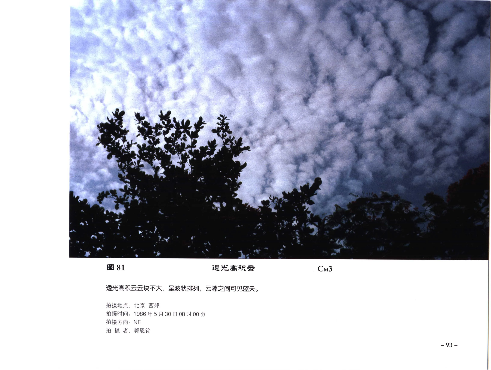

| 字段 | 内容 |
| --- | --- |
| 云类代码 | CM3 |
| 拍摄地点 | 北京 西郊 |
| 拍摄时间 | 1986年5月30日08时00分 |
| 拍摄方向 | NE |
| 拍摄者 | 郭恩铭 |
| 原分页 | [PDF 第 105 页](../pages-101-120.md) |

透光高积云云块不大，呈波状排列，云隙之间可见蓝天。

### 图 82：透光高积云

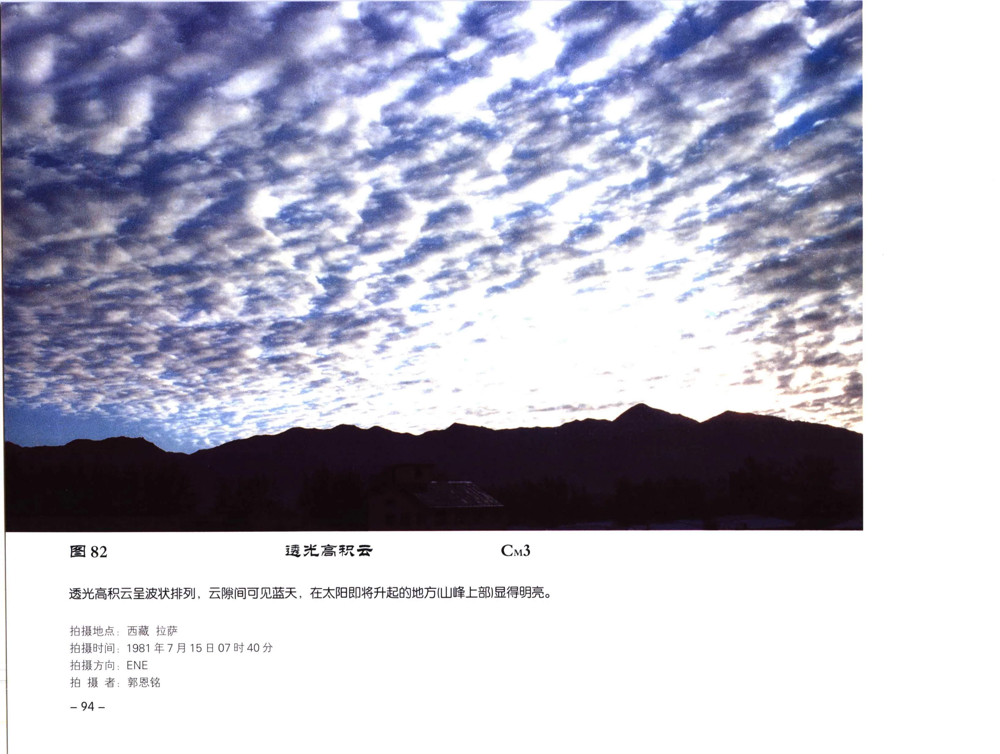

| 字段 | 内容 |
| --- | --- |
| 云类代码 | CM3 |
| 拍摄地点 | 西藏 拉萨 |
| 拍摄时间 | 1981年7月15日07时40分 |
| 拍摄方向 | ENE |
| 拍摄者 | 郭恩铭 |
| 原分页 | [PDF 第 106 页](../pages-101-120.md) |

透光高积云呈波状排列，云隙间可见蓝天，在太阳即将升起的地方显得明亮。

### 图 83：透光高积云

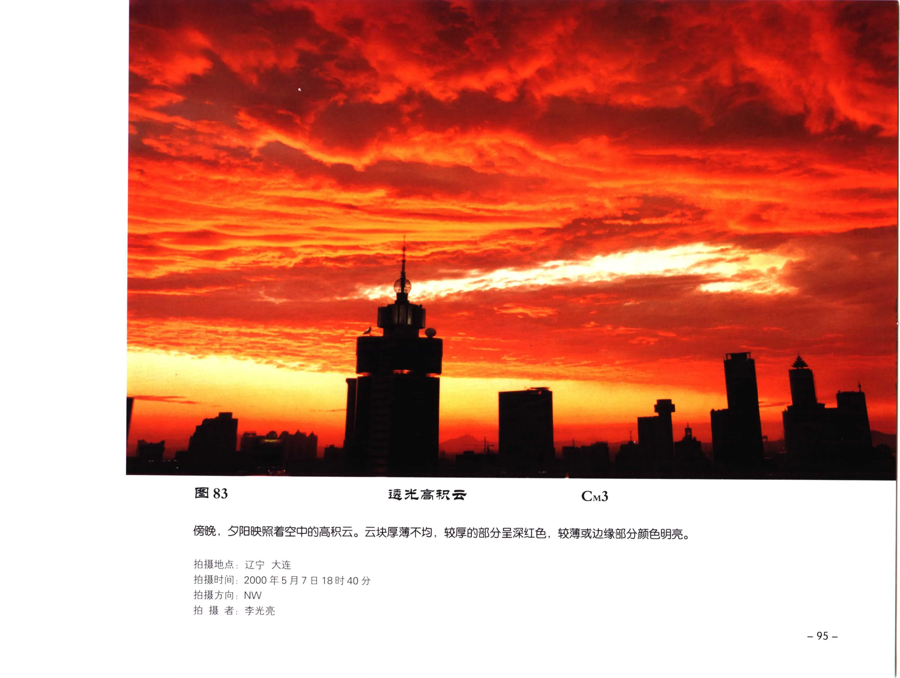

| 字段 | 内容 |
| --- | --- |
| 云类代码 | CM3 |
| 拍摄地点 | 辽宁 大连 |
| 拍摄时间 | 2000年5月7日18时40分 |
| 拍摄方向 | NW |
| 拍摄者 | 李光茂 |
| 原分页 | [PDF 第 107 页](../pages-101-120.md) |

傍晚，夕阳映照着空中的高积云。云块厚薄不均，较厚的部分呈深红色，较薄或边缘部分颜色明亮。

## 荚状高积云

### 图 84：荚状高积云

| 字段 | 内容 |
| --- | --- |
| 云类代码 | CM4 |
| 拍摄地点 | 北京 西郊 |
| 拍摄时间 | 1982年8月19日09时 |
| 拍摄方向 | SSE |
| 拍摄者 | 郭恩铭 |
| 原分页 | [PDF 第 108 页](../pages-101-120.md) |

形如长条豆荚的高积云，零散地分布在天空。图中上部的荚状云处于消散阶段，云体已散乱发毛，左上角的一块正逐渐消失。

### 图 85：荚状高积云

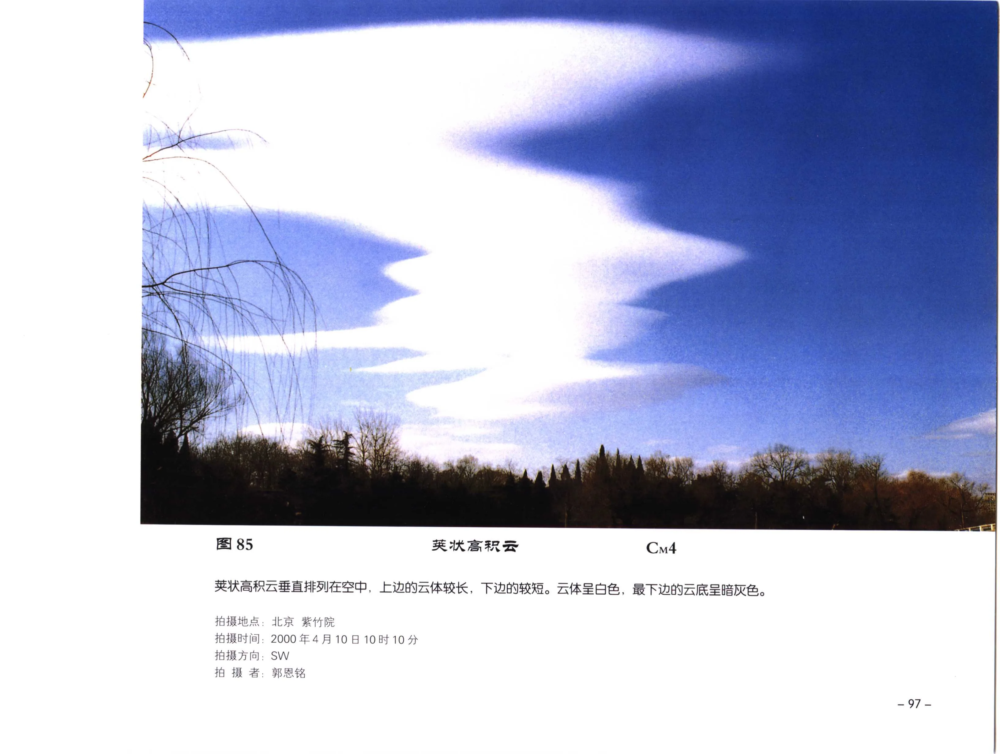

| 字段 | 内容 |
| --- | --- |
| 云类代码 | CM4 |
| 拍摄地点 | 北京 紫竹院 |
| 拍摄时间 | 2000年4月10日10时10分 |
| 拍摄方向 | SW |
| 拍摄者 | 郭恩铭 |
| 原分页 | [PDF 第 109 页](../pages-101-120.md) |

荚状高积云垂直排列在空中，上边的云体较长，下边的较短。云体呈白色，最下边的云底呈暗灰色。

### 图 86：荚状高积云

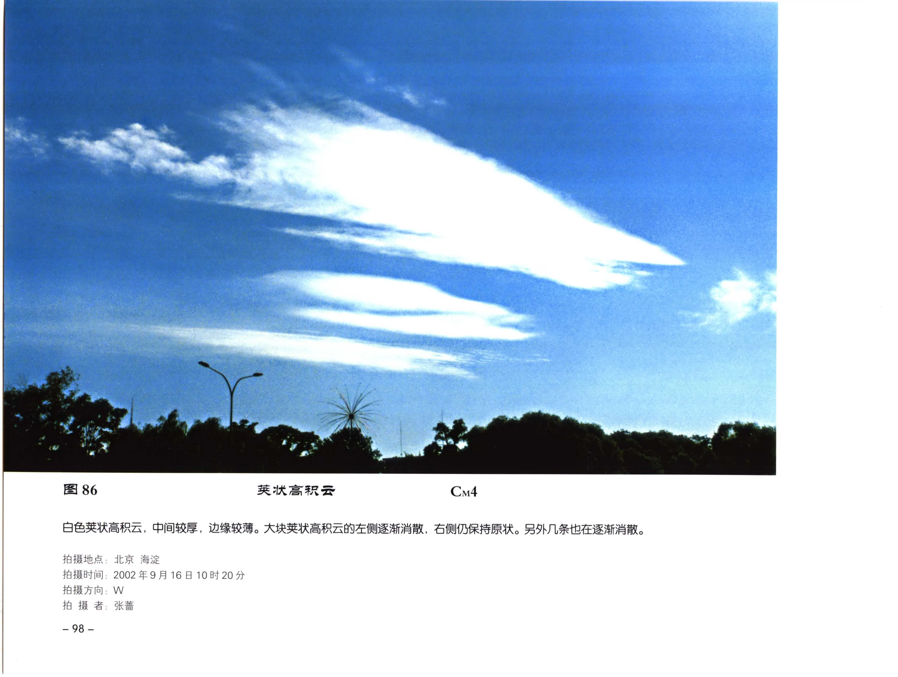

| 字段 | 内容 |
| --- | --- |
| 云类代码 | CM4 |
| 拍摄地点 | 北京 海淀 |
| 拍摄时间 | 2002年9月16日10时20分 |
| 拍摄方向 | W |
| 拍摄者 | 郭恩铭 |
| 原分页 | [PDF 第 110 页](../pages-101-120.md) |

白色荚状高积云，中间较厚，边缘较薄。大块荚状高积云的左侧逐渐消散，右侧仍保持原状。另外几条也在逐渐消散。

### 图 87：荚状高积云

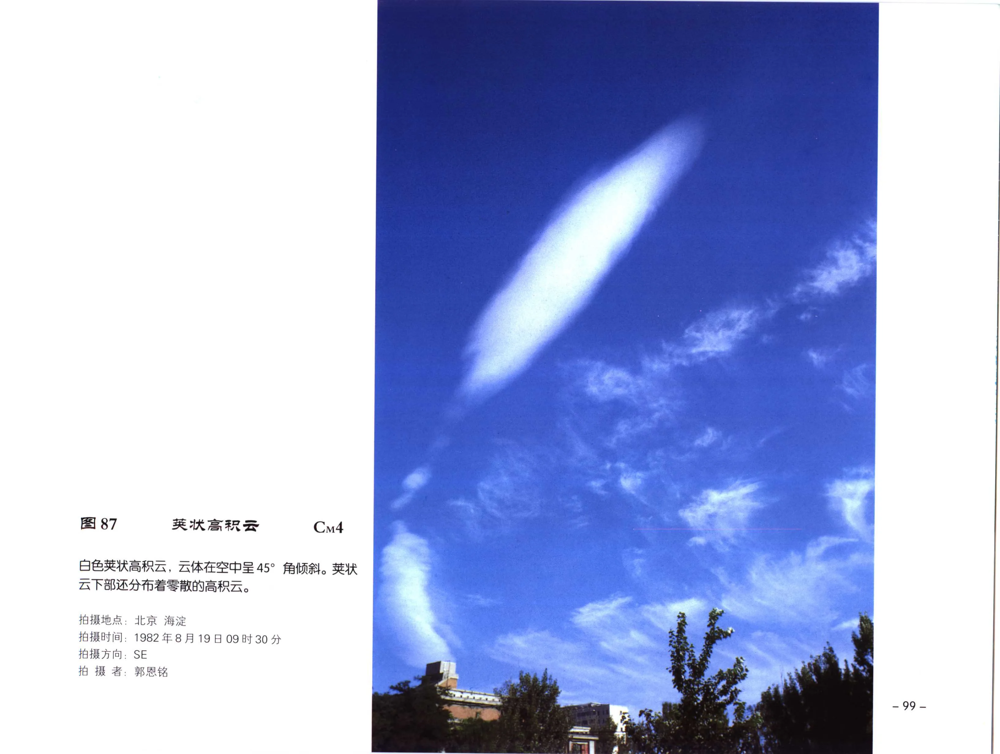

| 字段 | 内容 |
| --- | --- |
| 云类代码 | CM4 |
| 拍摄地点 | 北京 海淀 |
| 拍摄时间 | 1982年8月19日09时30分 |
| 拍摄方向 | SE |
| 拍摄者 | 郭恩铭 |
| 原分页 | [PDF 第 111 页](../pages-101-120.md) |

白色荚状高积云，云体在空中呈 45° 角倾斜。荚状云下部还分布着零散的高积云。

## CM5 高积云

### 图 88：透光高积云

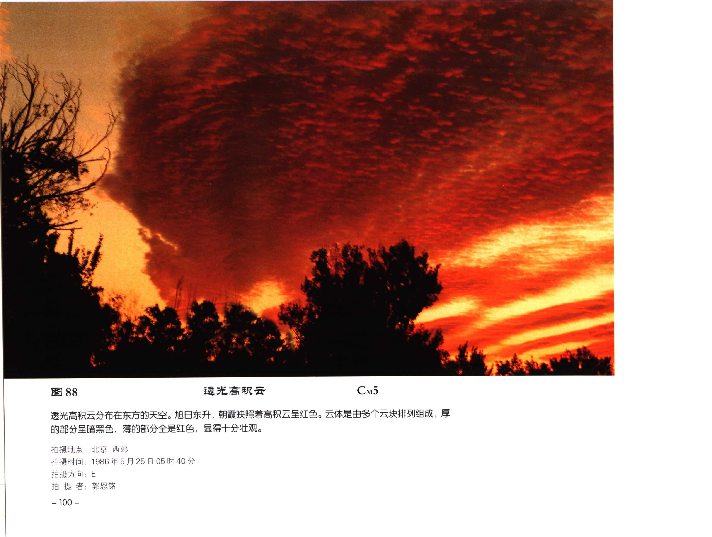

| 字段 | 内容 |
| --- | --- |
| 云类代码 | CM5 |
| 拍摄地点 | 北京 西郊 |
| 拍摄时间 | 1986年5月25日05时40分 |
| 拍摄方向 | E |
| 拍摄者 | 郭恩铭 |
| 原分页 | [PDF 第 112 页](../pages-101-120.md) |

透光高积云分布在东方的天空。旭日东升，朝霞映照着高积云呈红色。云体由多个云块排列组成，厚的部分呈暗黑色，薄的部分呈红色，显得十分壮观。

### 图 89：透光高积云

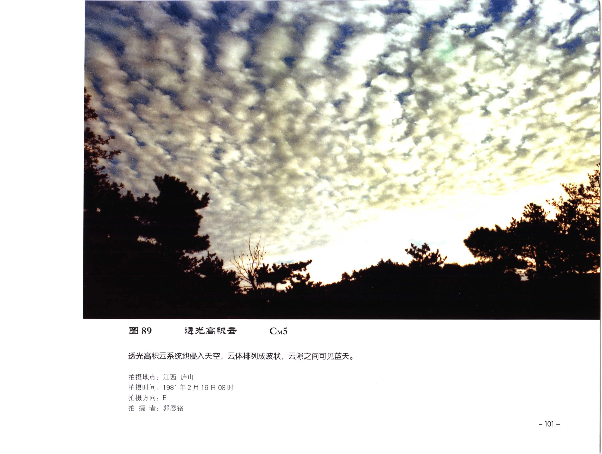

| 字段 | 内容 |
| --- | --- |
| 云类代码 | CM5 |
| 拍摄地点 | 江西 庐山 |
| 拍摄时间 | 1981年2月16日08时 |
| 拍摄方向 | E |
| 拍摄者 | 郭恩铭 |
| 原分页 | [PDF 第 113 页](../pages-101-120.md) |

透光高积云系统地侵入天空，云体排列成波状，云隙之间可见蓝天。

### 图 90：透光高积云

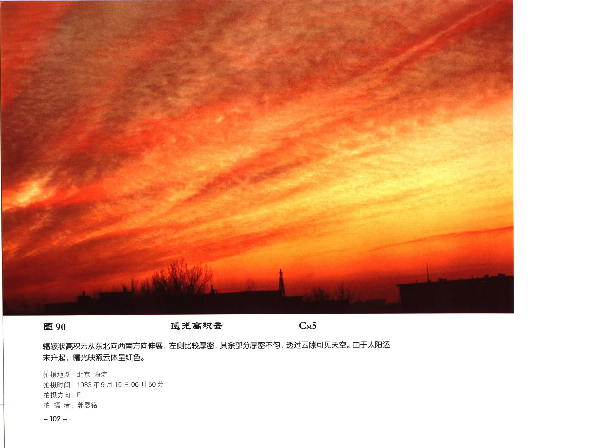

| 字段 | 内容 |
| --- | --- |
| 云类代码 | CM5 |
| 拍摄地点 | 北京 海淀 |
| 拍摄时间 | 1983年9月15日06时50分 |
| 拍摄方向 | E |
| 拍摄者 | 郭恩铭 |
| 原分页 | [PDF 第 114 页](../pages-101-120.md) |

辐辏状高积云从东北向西南方向伸展，左侧比较厚密，其余部分厚薄不均，透过云隙可见天空。由于太阳还未升起，曙光映照云体呈红色。

### 图 91：透光高积云

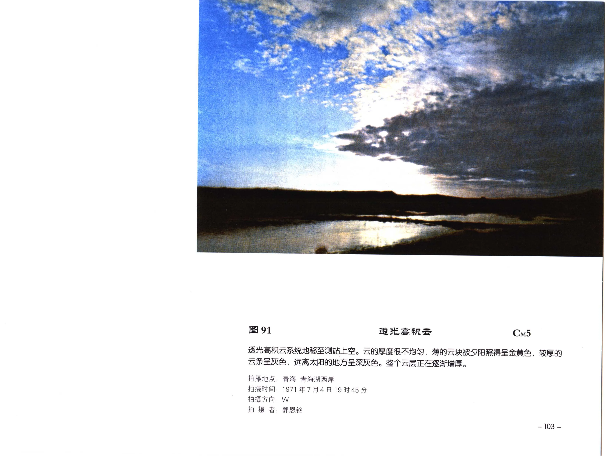

| 字段 | 内容 |
| --- | --- |
| 云类代码 | CM5 |
| 拍摄地点 | 青海 青海湖西岸 |
| 拍摄时间 | 1971年7月4日19时45分 |
| 拍摄方向 | W |
| 拍摄者 | 郭恩铭 |
| 原分页 | [PDF 第 115 页](../pages-101-120.md) |

透光高积云系统地移至测站上空。云的厚度很不均匀，薄的云块被夕阳照得呈金黄色，较厚的云条呈暗灰色，远离太阳的地方呈深灰色。整个云层正在逐渐增厚。

### 图 92：透光高积云

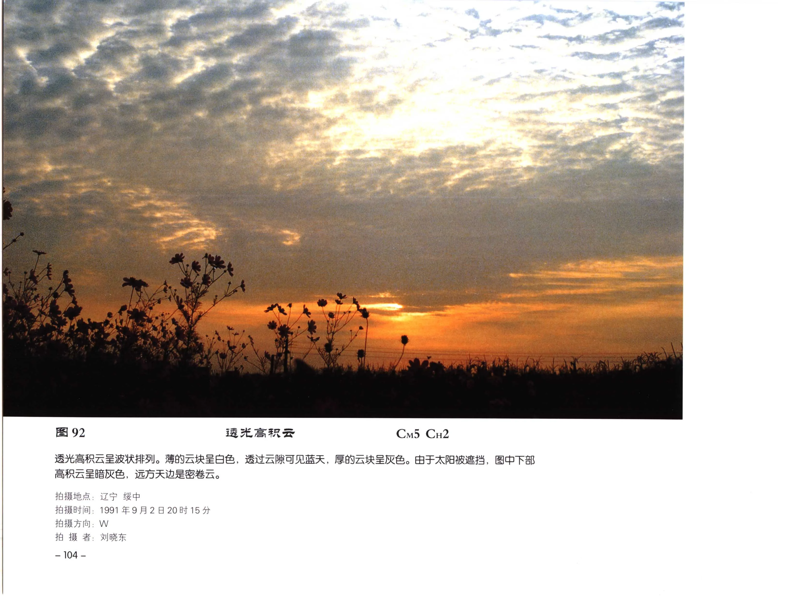

| 字段 | 内容 |
| --- | --- |
| 云类代码 | CM5 CH2 |
| 拍摄地点 | 辽宁 绥中 |
| 拍摄时间 | 1991年9月2日20时15分 |
| 拍摄方向 | W |
| 拍摄者 | 刘晓东 |
| 原分页 | [PDF 第 116 页](../pages-101-120.md) |

透光高积云呈波状排列。薄的云块呈白色，透过云隙可见蓝天，厚的云块呈灰色。由于太阳被遮挡，图中下部高积云呈暗灰色，远方天边是密卷云。

### 图 93：透光高积云

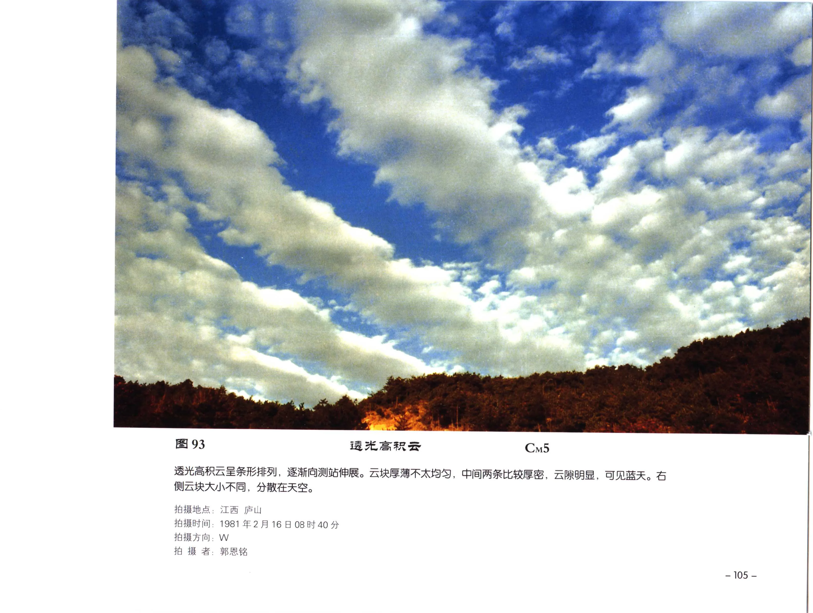

| 字段 | 内容 |
| --- | --- |
| 云类代码 | CM5 |
| 拍摄地点 | 江西 庐山 |
| 拍摄时间 | 1981年2月16日08时40分 |
| 拍摄方向 | W |
| 拍摄者 | 郭恩铭 |
| 原分页 | [PDF 第 117 页](../pages-101-120.md) |

透光高积云呈条形排列，逐渐向测站伸展。云块厚薄不太均匀，中间两条比较厚密，云隙明显，可见蓝天。右侧云块大小不同，分散在天空。

### 图 94：透光高积云

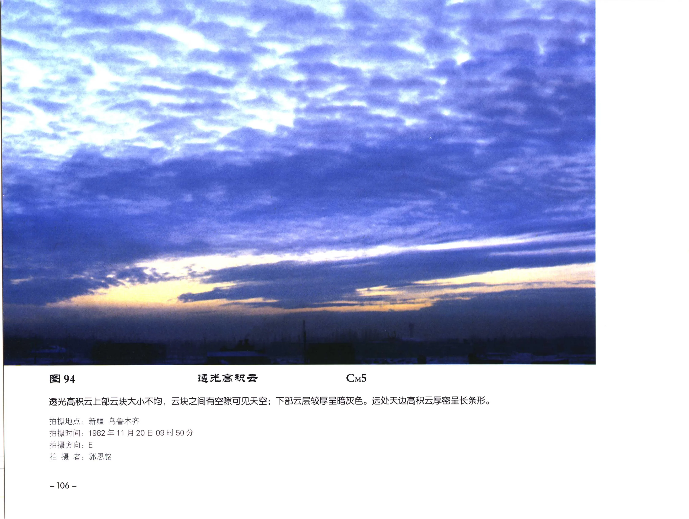

| 字段 | 内容 |
| --- | --- |
| 云类代码 | CM5 |
| 拍摄地点 | 新疆 乌鲁木齐 |
| 拍摄时间 | 1982年11月20日09时50分 |
| 拍摄方向 | E |
| 拍摄者 | 郭恩铭 |
| 原分页 | [PDF 第 118 页](../pages-101-120.md) |

透光高积云上部云块大小不均，云块之间有空隙可见天空；下部云层较厚呈暗灰色。远处天边高积云厚密呈长条形。

### 图 95：高积云

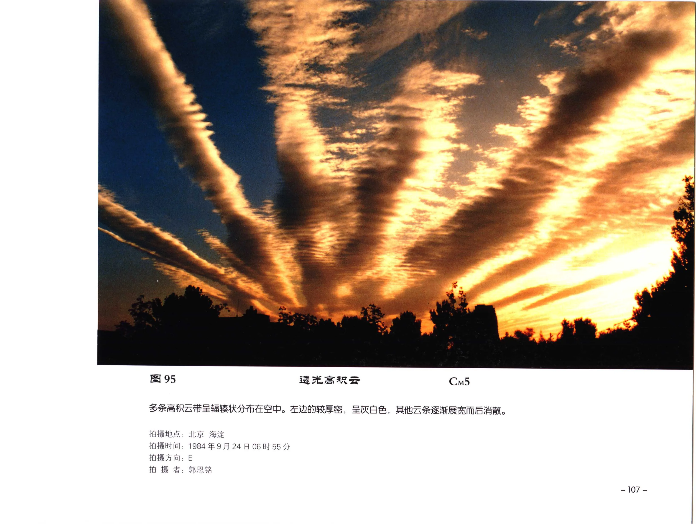

| 字段 | 内容 |
| --- | --- |
| 云类代码 | CM5 |
| 拍摄地点 | 北京 海淀 |
| 拍摄时间 | 1984年9月6日06时55分 |
| 拍摄方向 | E |
| 拍摄者 | 郭恩铭 |
| 原分页 | [PDF 第 119 页](../pages-101-120.md) |

多条高积云带呈辐辏状分布在空中。左边的较厚密，呈灰白色，其他云条逐渐展宽而后消散。

### 图 96：透光高积云

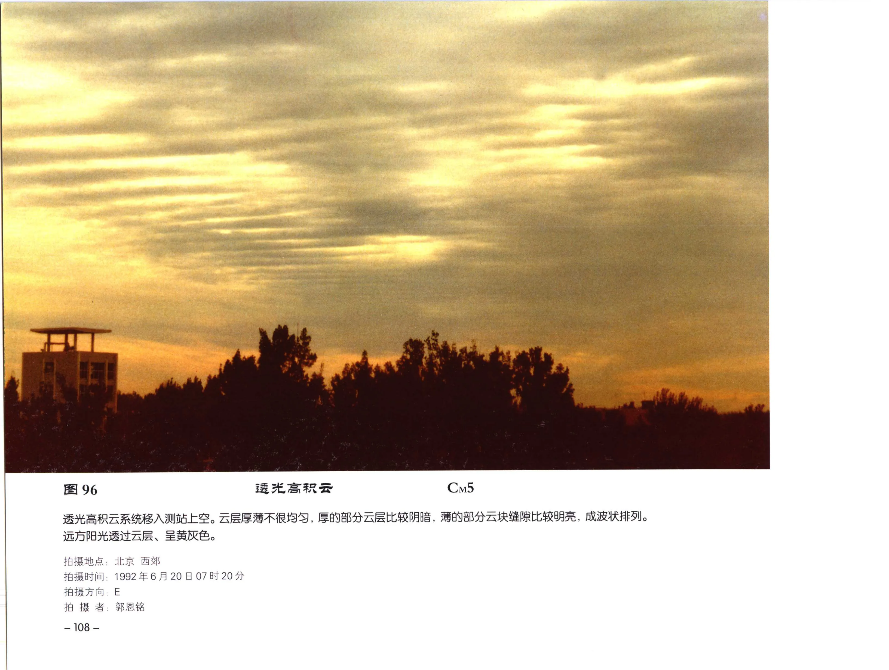

| 字段 | 内容 |
| --- | --- |
| 云类代码 | CM5 |
| 拍摄地点 | 北京 西郊 |
| 拍摄时间 | 1992年6月20日07时20分 |
| 拍摄方向 | E |
| 拍摄者 | 郭恩铭 |
| 原分页 | [PDF 第 120 页](../pages-101-120.md) |

透光高积云系统移入测站上空。云层厚薄不很均匀，厚的部分云层比较阴暗，薄的部分云块缝隙比较明亮，成波状排列。远方阳光透过云层，呈黄灰色。

### 图 97：透光高积云

| 字段 | 内容 |
| --- | --- |
| 云类代码 | CM5 |
| 拍摄地点 | 内蒙古 呼和浩特 |
| 拍摄时间 | 1982年8月26日08时20分 |
| 拍摄方向 | NW |
| 拍摄者 | 郭恩铭 |
| 原分页 | [PDF 第 121 页](../pages-121-140.md) |

高积云从测站西边向东移动，厚度比较均匀，边界非常清楚，云片较大，边缘有些散乱。这一大片高积云是由于高空风切变而形成的。

## 积云性高积云

### 图 98：积云性高积云

| 字段 | 内容 |
| --- | --- |
| 云类代码 | CM6 |
| 拍摄地点 | 西藏 拉萨 |
| 拍摄时间 | 1981年7月19日10时20分 |
| 拍摄方向 | NW |
| 拍摄者 | 郭恩铭 |
| 原分页 | [PDF 第 122 页](../pages-121-140.md) |

图中积云性高积云分布在天空，云体好似积云，呈白色，云底较平呈暗灰色，顶部仍向上凸起，排列不很整齐，透过云隙可见蓝天。

### 图 99：积云性高积云

| 字段 | 内容 |
| --- | --- |
| 云类代码 | CM6 |
| 拍摄地点 | 辽宁 荒地 |
| 拍摄时间 | 1989年7月2日06时05分 |
| 拍摄方向 | E |
| 拍摄者 | 范维东 |
| 原分页 | [PDF 第 123 页](../pages-121-140.md) |

图为积云性高积云。云块大小很不均匀，排列也不整齐，云体边缘散乱，呈暗灰色。远处高积云呈条状，透过云层可见太阳正在升起。

## 蔽光高积云与双层高积云

### 图 100：蔽光高积云

| 字段 | 内容 |
| --- | --- |
| 云类代码 | CM7 |
| 拍摄地点 | 北京 西郊 |
| 拍摄时间 | 1984年10月20日11时15分 |
| 拍摄方向 | NW |
| 拍摄者 | 郭恩铭 |
| 原分页 | [PDF 第 124 页](../pages-121-140.md) |

蔽光高积云，云条密集，排列起伏不平，呈灰色和深灰色。

### 图 101：蔽光高积云

| 字段 | 内容 |
| --- | --- |
| 云类代码 | CM7 |
| 拍摄地点 | 四川 成都 |
| 拍摄时间 | 1987年12月16日08时15分 |
| 拍摄方向 | SW |
| 拍摄者 | 郭恩铭 |
| 原分页 | [PDF 第 125 页](../pages-121-140.md) |

蔽光高积云布满全天，呈波状排列，云体有明有暗但无缝隙，不见日月位置。

### 图 102：蔽光高积云

| 字段 | 内容 |
| --- | --- |
| 云类代码 | CM7 |
| 拍摄地点 | 福建 厦门 |
| 拍摄时间 | 1987年7月5日14时30分 |
| 拍摄方向 | NE |
| 拍摄者 | 郭恩铭 |
| 原分页 | [PDF 第 126 页](../pages-121-140.md) |

蔽光高积云布满全天，呈灰色，云块较大，厚薄不均。低空有层积云，呈深灰色。

### 图 103：高积云和高层云

| 字段 | 内容 |
| --- | --- |
| 云类代码 | CM7 |
| 拍摄地点 | 上海 |
| 拍摄时间 | 1985年1月15日16时10分 |
| 拍摄方向 | SW |
| 拍摄者 | 俞香仁 |
| 原分页 | [PDF 第 127 页](../pages-121-140.md) |

图中有两层云。上层是透光高层云，比较明亮，可见日月位置；下层是高积云，云块大小不匀，呈暗灰色，排列也不整齐。

### 图 104：高积云和蔽光高层云

| 字段 | 内容 |
| --- | --- |
| 云类代码 | CM7 |
| 拍摄地点 | 山东 青岛 |
| 拍摄时间 | 1987年5月30日10时20分 |
| 拍摄方向 | SE |
| 拍摄者 | 郭恩铭 |
| 原分页 | [PDF 第 128 页](../pages-121-140.md) |

蔽光高层云布满全天，云层很厚，辨不清太阳位置。蔽光高层云下边分布着高积云，云块大小不同，呈灰色。

### 图 105：高积云（双层）

| 字段 | 内容 |
| --- | --- |
| 云类代码 | CM7 |
| 拍摄地点 | 辽宁 绥中 |
| 拍摄时间 | 1989年7月26日06时10分 |
| 拍摄方向 | SW |
| 拍摄者 | 范维东 |
| 原分页 | [PDF 第 129 页](../pages-121-140.md) |

上层分布着透光高积云，云块较薄，个体不大，呈灰色，云隙之间可见蓝天。下层是蔽光高积云，云体边缘呈灰白色，云底呈暗灰色。

## 堡状高积云与堡状层积云

### 图 106：堡状层积云

| 字段 | 内容 |
| --- | --- |
| 云类代码 | CM8 CH1 |
| 拍摄地点 | 辽宁 绥中 |
| 拍摄时间 | 1990年9月15日09时15分 |
| 拍摄方向 | NW |
| 拍摄者 | 马德明 |
| 原分页 | [PDF 第 130 页](../pages-121-140.md) |

层积云成条状，中部较厚，呈深灰色。远处层积云云底较平，呈白色，上部凸起数个云泡，即堡状层积云。空中还分布着卷云和高积云。

### 图 107：堡状高积云

| 字段 | 内容 |
| --- | --- |
| 云类代码 | CM8 CH2 |
| 拍摄地点 | 福建 厦门 |
| 拍摄时间 | 1987年6月3日07时10分 |
| 拍摄方向 | W |
| 拍摄者 | 郭恩铭 |
| 原分页 | [PDF 第 131 页](../pages-121-140.md) |

层积云成条状，暗灰色，云底较平。上部有多个凸起，呈白色，好似城堡。空中有零散的高积云，呈白色。还有密卷云呈深灰色、散片状。

### 图 108：堡状层积云

| 字段 | 内容 |
| --- | --- |
| 云类代码 | CM8 CH2 |
| 拍摄地点 | 海南 西沙群岛 |
| 拍摄时间 | 1982年6月2日10时15分 |
| 拍摄方向 | W |
| 拍摄者 | 郭恩铭 |
| 原分页 | [PDF 第 132 页](../pages-121-140.md) |

海面上空分布着细长云条，底部水平，顶部有数个凸起，远看好像城堡，即堡状层积云。高空分布着块状高积云和密卷云。

### 图 109：堡状高积云

| 字段 | 内容 |
| --- | --- |
| 云类代码 | CM8 |
| 拍摄地点 | 北京 海淀 |
| 拍摄时间 | 1986年9月8日06时50分 |
| 拍摄方向 | NE |
| 拍摄者 | 郭恩铭 |
| 原分页 | [PDF 第 133 页](../pages-121-140.md) |

图中有两层高积云。上层是透光高积云，下层是堡状高积云，云底较平，云顶向上凸起几个云峰，呈堡垒状。

### 图 110：堡状高积云

| 字段 | 内容 |
| --- | --- |
| 云类代码 | CM8 |
| 拍摄地点 | 新疆 乌苏 |
| 拍摄时间 | 1990年5月15日12时48分 |
| 拍摄方向 | NW |
| 拍摄者 | 施文全 |
| 原分页 | [PDF 第 134 页](../pages-121-140.md) |

测站的西北方向出现一长条堡状高积云。这条云中间部分云泡向上凸起非常明显。接近地平线的部分仍是透光高积云。

### 图 111：堡状高积云

| 字段 | 内容 |
| --- | --- |
| 云类代码 | CM8 |
| 拍摄地点 | 辽宁 绥中 |
| 拍摄时间 | 1990年9月15日08时10分 |
| 拍摄方向 | NW |
| 拍摄者 | 王永亮 |
| 原分页 | [PDF 第 135 页](../pages-121-140.md) |

图中下部的高积云云底灰暗，云顶有多个堡状凸起，它的上空还有透光高积云。

## 絮状高积云

### 图 112：絮状高积云

| 字段 | 内容 |
| --- | --- |
| 云类代码 | CM8 |
| 拍摄地点 | 北京 西郊 |
| 拍摄时间 | 2000年4月23日07时30分 |
| 拍摄方向 | NW |
| 拍摄者 | 郭恩铭 |
| 原分页 | [PDF 第 136 页](../pages-121-140.md) |

云块大小不一，边缘比较破碎，形如棉花，呈灰白色，排列不齐，变化较快，并出现了雪幡。

### 图 113：絮状高积云

| 字段 | 内容 |
| --- | --- |
| 云类代码 | CM8 |
| 拍摄地点 | 辽宁 鞍山 |
| 拍摄时间 | 1999年9月10日14时20分 |
| 拍摄方向 | NE |
| 拍摄者 | 张公良 |
| 原分页 | [PDF 第 137 页](../pages-121-140.md) |

图中的絮状高积云云块大小很不均匀，边缘破碎，排列不齐，呈白色。

### 图 114：絮状高积云

| 字段 | 内容 |
| --- | --- |
| 云类代码 | CM8 |
| 拍摄地点 | 北京 紫竹院 |
| 拍摄时间 | 2000年9月20日10时50分 |
| 拍摄方向 | N |
| 拍摄者 | 郭恩铭 |
| 原分页 | [PDF 第 138 页](../pages-121-140.md) |

图中絮状高积云云块大小不同，呈白色，边缘破碎，眼像棉絮团，排列也不整齐，分散在高空。

## 混乱天空高积云

### 图 115：混乱天空高积云

| 字段 | 内容 |
| --- | --- |
| 云类代码 | CM9 |
| 拍摄地点 | 辽宁 鞍山 |
| 拍摄时间 | 1999年6月19日14时20分 |
| 拍摄方向 | SW |
| 拍摄者 | 王绍良 |
| 原分页 | [PDF 第 139 页](../pages-121-140.md) |

不同形状的高积云出现在不同的高度。中部的高积云呈片状、白色，有逐渐抬升的趋势。上部是密卷云，正逐渐演变成波状卷积云。还有积云分布在低空。

### 图 116：混乱天空高积云

| 字段 | 内容 |
| --- | --- |
| 云类代码 | CM9 |
| 拍摄地点 | 辽宁 鞍山 |
| 拍摄时间 | 1998年7月20日16时20分 |
| 拍摄方向 | W |
| 拍摄者 | 郭恩铭 |
| 原分页 | [PDF 第 140 页](../pages-121-140.md) |

图中高积云呈白色片状，正逐渐抬高演变成卷积云。高空有大片密卷云，正向卷积云演变。低空有浓积云，呈暗灰色，还有零散的淡积云。
