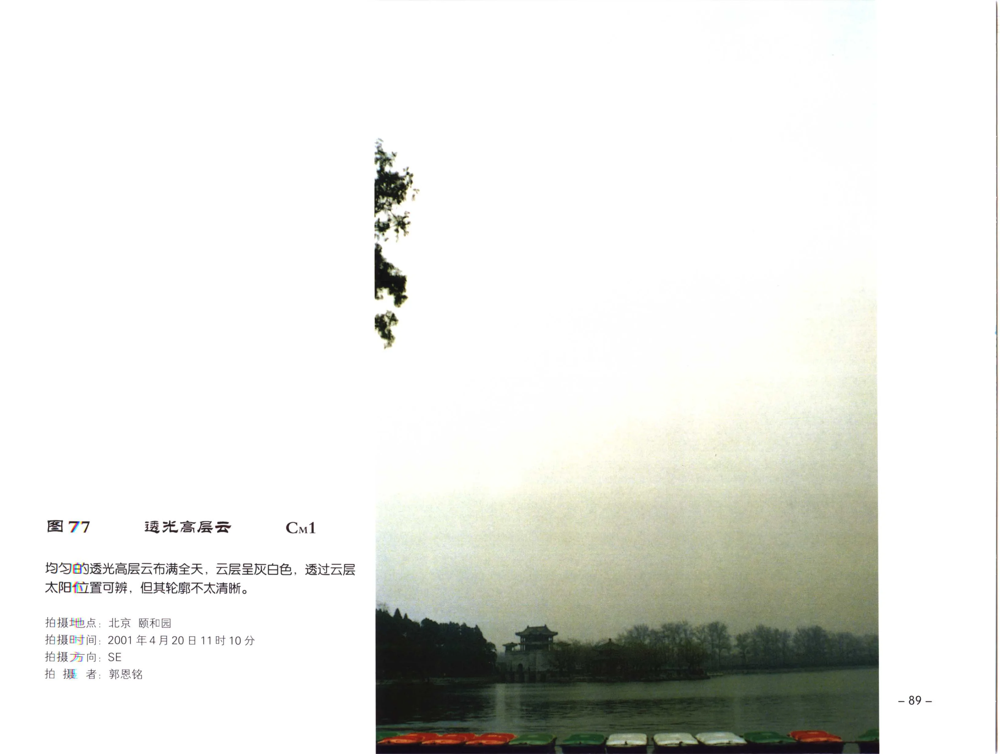
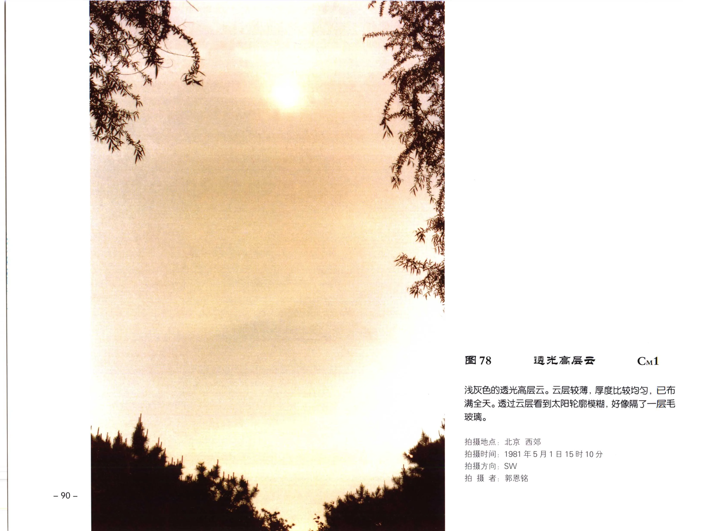
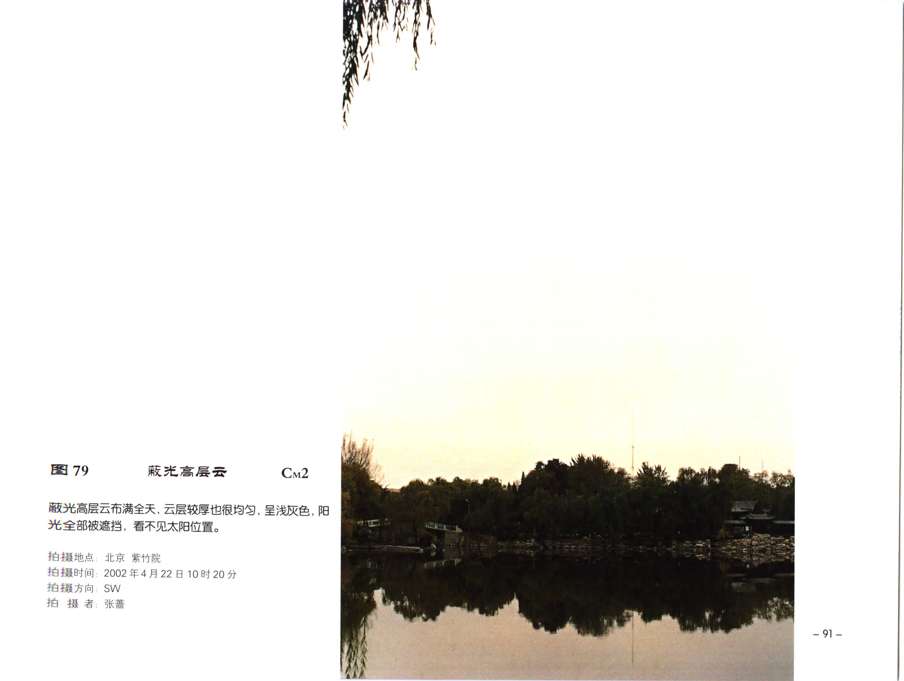
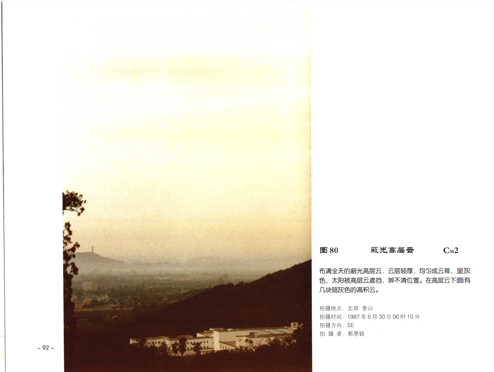

# 中云图版：高层云

本页整理《中国云图》中云部分的高层云图版，范围覆盖 PDF 第 101-104 页中的图 77-80。

!!! note "校订状态"
    本页以 OCR 文本和原页图像共同整理。图 77-80 的标题、代码、拍摄字段和说明文字已按可辨原页图像校订。

## 图版列表

| 图号 | 云类 | 代码 | PDF 页 | 主要内容 |
| --- | --- | --- | --- | --- |
| 图 77 | 透光高层云 | CM1 | 101 | 均匀的透光高层云布满全天，太阳位置可辨但轮廓不清。 |
| 图 78 | 透光高层云 | CM1 | 102 | 浅灰色透光高层云，云层较薄且较均匀。 |
| 图 79 | 蔽光高层云 | CM2 | 103 | 蔽光高层云布满全天，遮挡阳光，看不见太阳位置。 |
| 图 80 | 蔽光高层云 | CM2 | 104 | 蔽光高层云较厚，均匀成云幕，下方有暗灰色高积云。 |

## 透光高层云

### 图 77：透光高层云

| 字段 | 内容 |
| --- | --- |
| 云类代码 | CM1 |
| 拍摄地点 | 北京 颐和园 |
| 拍摄时间 | 2001年4月20日11时10分 |
| 拍摄方向 | SE |
| 拍摄者 | 郭恩铭 |
| 原分页 | [PDF 第 101 页](../pages-101-120.md) |

均匀的透光高层云布满全天，云层呈灰白色，透过云层太阳位置可辨，但其轮廓不太清晰。

### 图 78：透光高层云

| 字段 | 内容 |
| --- | --- |
| 云类代码 | CM1 |
| 拍摄地点 | 北京 西郊 |
| 拍摄时间 | 1981年5月1日15时10分 |
| 拍摄方向 | SW |
| 拍摄者 | 郭恩铭 |
| 原分页 | [PDF 第 102 页](../pages-101-120.md) |

浅灰色的透光高层云。云层较薄，厚度比较均匀，已布满全天。透过云层看到太阳轮廓模糊，好像隔了一层毛玻璃。

## 蔽光高层云

### 图 79：蔽光高层云

| 字段 | 内容 |
| --- | --- |
| 云类代码 | CM2 |
| 拍摄地点 | 北京 紫竹院 |
| 拍摄时间 | 2002年4月22日10时20分 |
| 拍摄方向 | SW |
| 拍摄者 | 张蕾 |
| 原分页 | [PDF 第 103 页](../pages-101-120.md) |

蔽光高层云布满全天，云层较厚也很均匀，呈浅灰色，阳光全部被遮挡，看不见太阳位置。

### 图 80：蔽光高层云

| 字段 | 内容 |
| --- | --- |
| 云类代码 | CM2 |
| 拍摄地点 | 北京 香山 |
| 拍摄时间 | 1987年5月30日06时10分 |
| 拍摄方向 | SE |
| 拍摄者 | 郭恩铭 |
| 原分页 | [PDF 第 104 页](../pages-101-120.md) |

布满全天的蔽光高层云，云层较厚，均匀成云幕，呈灰色，太阳被高层云遮挡，辨不清位置。在高层云下面有几块暗灰色的高积云。
