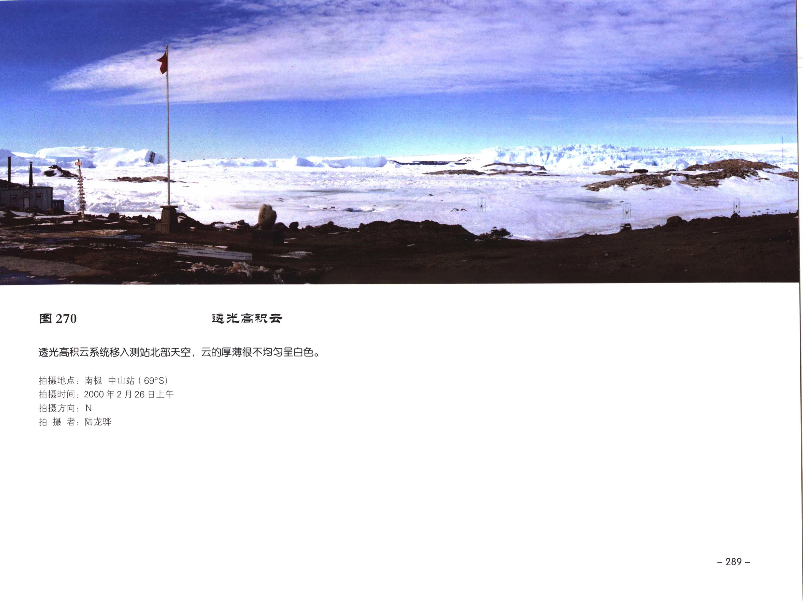
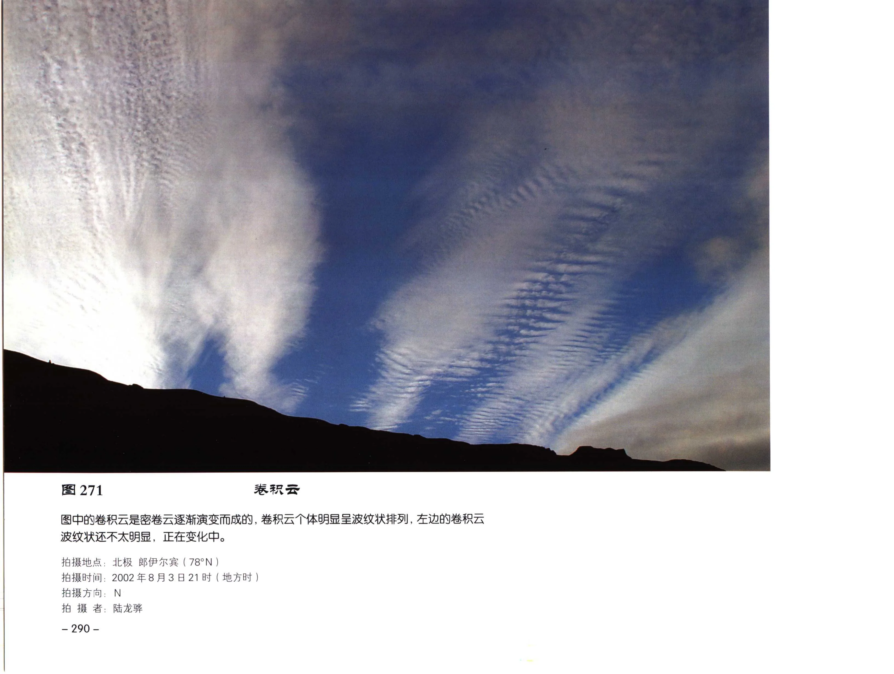
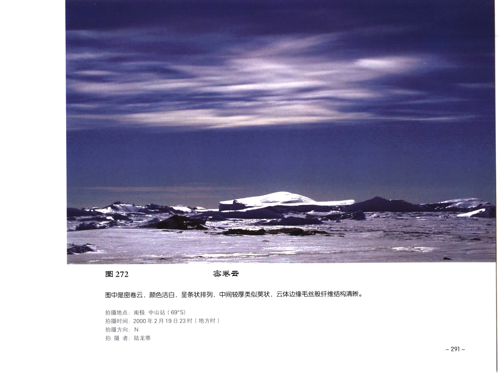
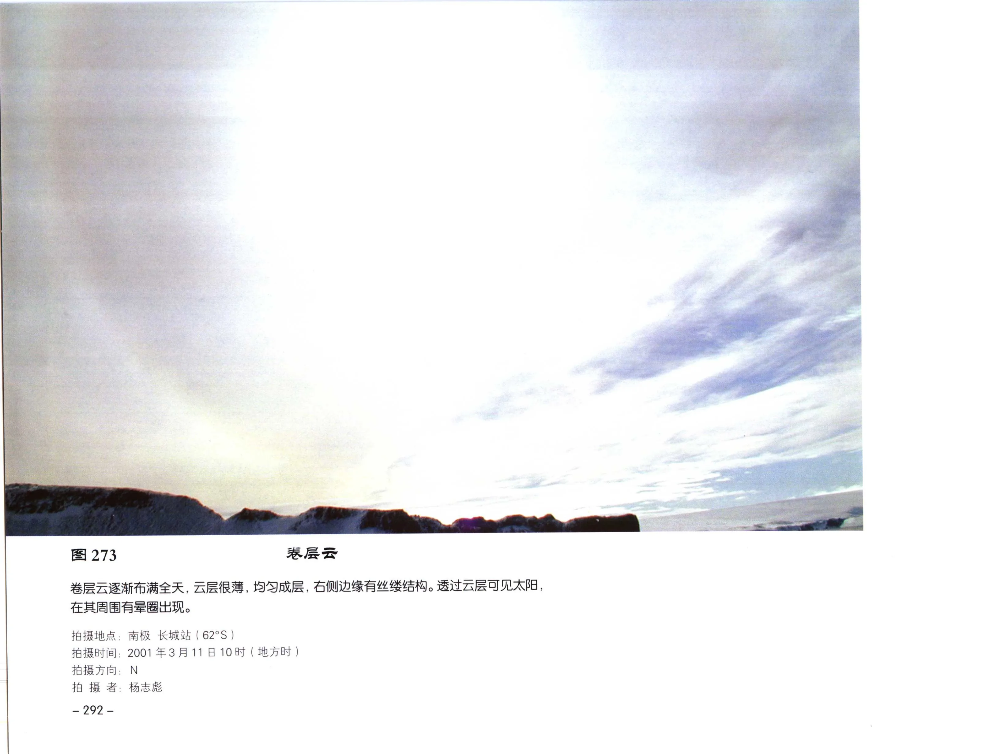
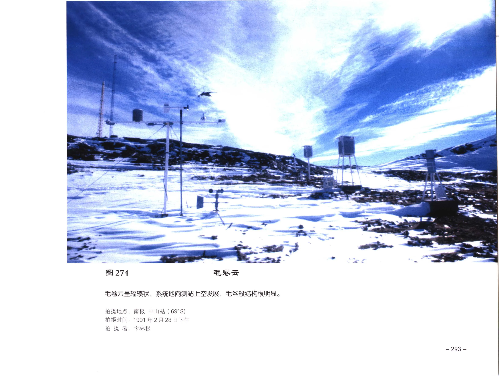
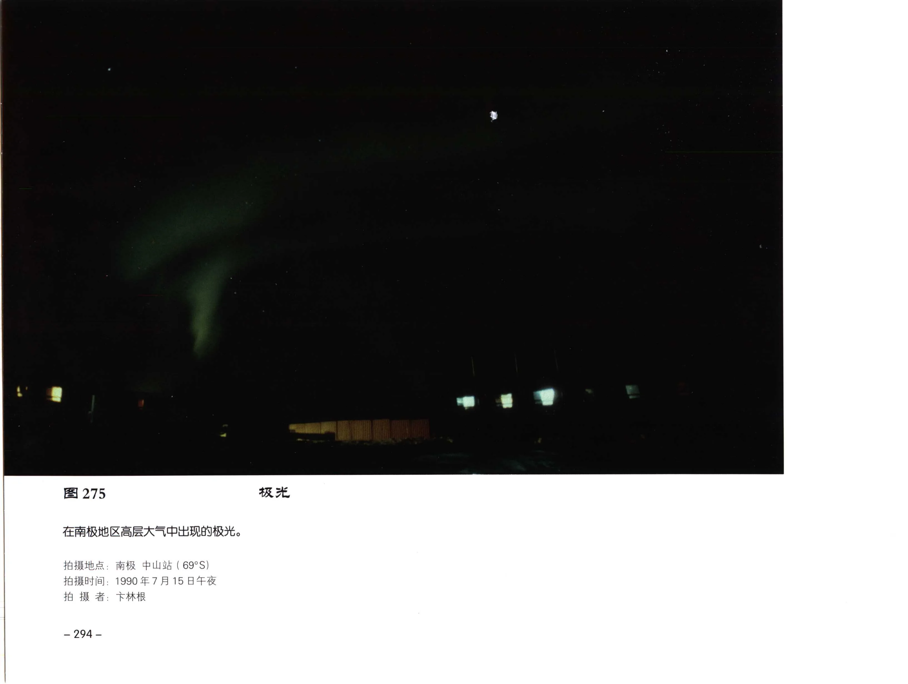
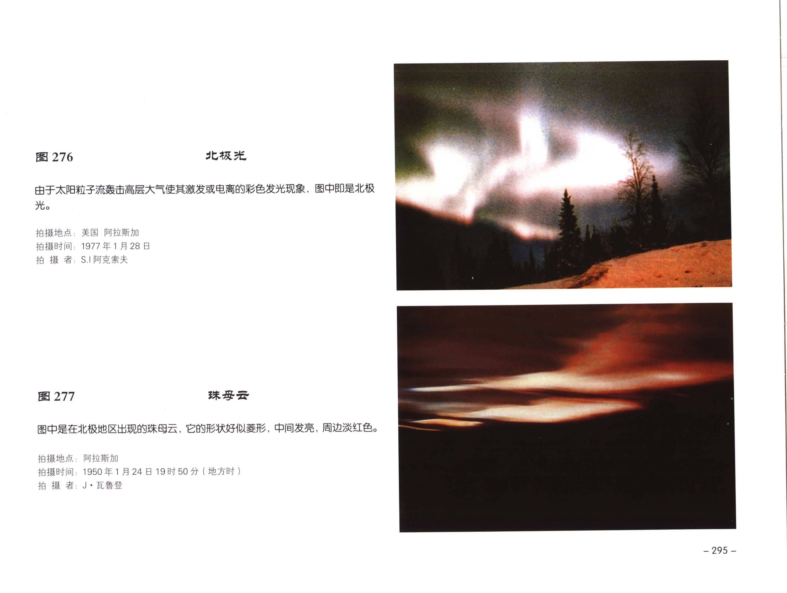
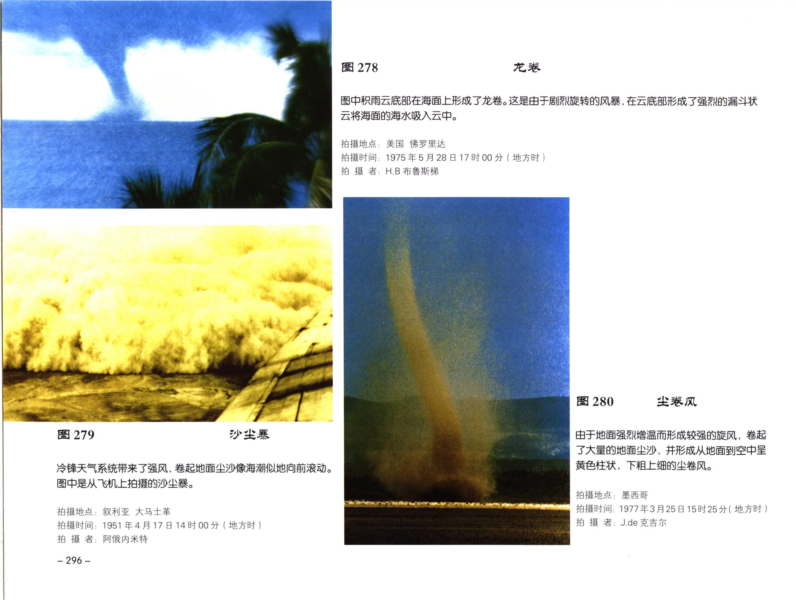

# 补充云和天气现象个例

本页整理《中国云图》后段补充个例中的极地、海外和特殊现象图版，范围覆盖 PDF 第 289-308 页中的过渡页和图 260-280。

!!! note "校订状态"
    PDF 第 289-290 页暂未识别出可靠正文，保留在原始分页中。图 262 和图 268 在 OCR 分页中图号未完整识别，但从页码连续性可定位；图 260-280 的标题、拍摄字段和说明文字已按可辨原页图像校订。图 260-265、267-268、274-280 原页未列出拍摄方向。

## 图版列表

| 图号 | 主题 | PDF 页 | 主要内容 |
| --- | --- | --- | --- |
| 图 260 | 北极上空的高积云（宝光） | 291 | 飞机飞越北极上空，高积云顶部出现飞机影子和宝光。 |
| 图 261 | 密卷云和高积云 | 292 | 乌克兰清晨旭日映照密卷云和高积云。 |
| 图 262 | 荚状层积云 | 293 | 黑海北岸地形影响下，海边上空出现荚状层积云。 |
| 图 263 | 淡积云和瀑布（虹） | 294 | 瀑布水滴受阳光照射出现虹和霓，远方有淡积云。 |
| 图 264 | 瀑布、虹、霓 | 295 | 尼亚加拉瀑布附近的虹霓个例。 |
| 图 265 | 宝光 | 296 | 高空航行时飞机影子投射到高积云顶部形成宝光。 |
| 图 266 | 淡积云 | 297 | 多个淡积云连接成长条形状。 |
| 图 267 | 层积云 | 298 | 低空层积云右部出现下垂雪幡。 |
| 图 268 | 层积云 | 299 | 较厚透光层积云，云顶部稍有起伏。 |
| 图 269 | 荚状高积云 | 300 | 北极傍晚荚状高积云，云块厚薄不均并受夕阳照射。 |
| 图 270 | 透光高积云 | 301 | 透光高积云系统移入南极中山站北部天空。 |
| 图 271 | 卷积云 | 302 | 密卷云逐渐演变成波纹状卷积云。 |
| 图 272 | 密卷云 | 303 | 密卷云洁白、条状排列，边缘毛丝结构清晰。 |
| 图 273 | 卷层云 | 304 | 卷层云布满全天，透过云层可见太阳和晕圈。 |
| 图 274 | 毛卷云 | 305 | 毛卷云呈辐辏状向测站上空发展。 |
| 图 275 | 极光 | 306 | 南极地区高层大气中出现的极光。 |
| 图 276 | 北极光 | 307 | 太阳粒子流激发高层大气发光。 |
| 图 277 | 珠母云 | 307 | 北极地区出现形似菱形、中心发亮的珠母云。 |
| 图 278 | 龙卷 | 308 | 佛罗里达积雨云底部在海面形成龙卷。 |
| 图 279 | 沙尘暴 | 308 | 冷锋强风卷起尘沙，形成向前滚动的沙尘暴。 |
| 图 280 | 尘卷风 | 308 | 地面强烈增温形成旋风，卷起尘沙呈黄色柱状。 |

## 极地和海外云例

### 图 260：北极上空的高积云（宝光）

| 字段 | 内容 |
| --- | --- |
| 拍摄地点 | 北极上空 |
| 航行高度 | 约 9000 米 |
| 拍摄时间 | 2001年8月30日 |
| 拍摄方向 | 原页未列出 |
| 拍摄者 | 郭恩铭 |
| 原分页 | [PDF 第 291 页](../pages-281-300.md) |

图中是飞机飞越北极上空，航行高度约 9000 米，从飞机上观测到的极地上空的高积云。云顶呈波状，起伏不平。当阳光映照飞机时，飞机的影子投射在高积云上，在它的周围出现了宝光。

### 图 261：密卷云和高积云

| 字段 | 内容 |
| --- | --- |
| 拍摄地点 | 乌克兰 第聂伯彼得罗夫斯克 |
| 拍摄时间 | 1995年9月5日06时30分（地方时） |
| 拍摄方向 | 原页未列出 |
| 拍摄者 | 郭恩铭 |
| 原分页 | [PDF 第 292 页](../pages-281-300.md) |

旭日东升，映照着高空的密卷云和高积云，呈红黄色，景象十分壮观。近地平线上空长条形的高积云较厚，呈暗灰色。

### 图 262：荚状层积云

| 字段 | 内容 |
| --- | --- |
| 拍摄地点 | 乌克兰 雅尔塔 |
| 拍摄时间 | 1995年9月7日16时40分（地方时） |
| 拍摄方向 | 原页未列出 |
| 拍摄者 | 郭恩铭 |
| 原分页 | [PDF 第 293 页](../pages-281-300.md) |

黑海北岸是高山，由于地形的影响，在海边上空出现荚状层积云，云底呈暗灰色，沿海岸排列成行，边缘有几块碎云，远处是高积云。

## 虹霓和宝光

### 图 263：淡积云和瀑布（虹）

| 字段 | 内容 |
| --- | --- |
| 拍摄地点 | 美国 尼亚加拉瀑布 |
| 拍摄时间 | 2001年8月14日11时17分（地方时） |
| 拍摄方向 | 原页未列出 |
| 拍摄者 | G. 简尼佛尔 |
| 原分页 | [PDF 第 294 页](../pages-281-300.md) |

图中是尼亚加拉瀑布。伊利湖水流到悬岩时，由于地形的落差，形成十分壮观的大瀑布；水滴受阳光照射，即出现美丽的虹和霓。远方还有淡积云。

### 图 264：瀑布、虹、霓

| 字段 | 内容 |
| --- | --- |
| 拍摄地点 | 美国 尼亚加拉瀑布 |
| 拍摄时间 | 2001年8月13日19时09分（地方时） |
| 拍摄方向 | 原页未列出 |
| 拍摄者 | G. 简尼佛尔 |
| 原分页 | [PDF 第 295 页](../pages-281-300.md) |

阳光照射在瀑布溅散的众多水滴上，由于水滴对阳光折射和反射作用，形成图中的虹和霓。

### 图 265：宝光

| 字段 | 内容 |
| --- | --- |
| 拍摄地点 | 美国 切汉思 |
| 拍摄时间 | 1977年9月13日 |
| 拍摄方向 | 原页未列出 |
| 拍摄者 | R.F. 兰肯 |
| 原分页 | [PDF 第 296 页](../pages-281-300.md) |

飞机在高空航行，高积云布满空中，阳光照射机身，投影在高积云顶部，出现宝光。

## 南极和北极个例

### 图 266：淡积云

| 字段 | 内容 |
| --- | --- |
| 拍摄地点 | 南极 长城站（62°S） |
| 拍摄时间 | 2001年2月2日09时39分（地方时） |
| 拍摄方向 | NW |
| 拍摄者 | 杨志彪 |
| 原分页 | [PDF 第 297 页](../pages-281-300.md) |

多个淡积云连接成长条形状，但云顶凸起仍很明显，高空是高积云。

### 图 267：层积云

| 字段 | 内容 |
| --- | --- |
| 拍摄地点 | 南极 中山站（69°S） |
| 拍摄时间 | 1990年1月15日下午 |
| 拍摄方向 | 原页未列出 |
| 拍摄者 | 卞林根 |
| 原分页 | [PDF 第 298 页](../pages-281-300.md) |

层积云分布在低空。云体右部出现下垂的雪幡。

### 图 268：层积云

| 字段 | 内容 |
| --- | --- |
| 拍摄地点 | 南极 长城站（62°S） |
| 拍摄时间 | 1985年10月16日下午 |
| 拍摄方向 | 原页未列出 |
| 拍摄者 | 卞林根 |
| 原分页 | [PDF 第 299 页](../pages-281-300.md) |

图中是大片透光层积云，云层较厚，云顶部稍有起伏。

### 图 269：荚状高积云

| 字段 | 内容 |
| --- | --- |
| 拍摄地点 | 北极 郎伊尔宾（78°N） |
| 拍摄时间 | 2002年8月27日 |
| 拍摄方向 | W |
| 拍摄者 | 陆龙骅 |
| 原分页 | [PDF 第 300 页](../pages-281-300.md) |

傍晚时，荚状高积云分布在北极地区，云块大小很不均匀，云块较厚，边缘受夕阳照射呈灰白色。

### 图 270：透光高积云

| 字段 | 内容 |
| --- | --- |
| 拍摄地点 | 南极 中山站（69°S） |
| 拍摄时间 | 2000年2月26日上午 |
| 拍摄方向 | N |
| 拍摄者 | 陆龙骅 |
| 原分页 | [PDF 第 301 页](../pages-301-314.md) |

透光高积云系统移入测站北部天空，云的厚薄很不均匀，呈白色。

### 图 271：卷积云

| 字段 | 内容 |
| --- | --- |
| 拍摄地点 | 北极 郎伊尔宾（78°N） |
| 拍摄时间 | 2002年8月3日21时（地方时） |
| 拍摄方向 | N |
| 拍摄者 | 陆龙骅 |
| 原分页 | [PDF 第 302 页](../pages-301-314.md) |

图中的卷积云是密卷云逐渐演变而成的，卷积云个体明显呈波纹状排列；左边的卷积云波纹状还不太明显，正在变化中。

### 图 272：密卷云

| 字段 | 内容 |
| --- | --- |
| 拍摄地点 | 南极 中山站（69°S） |
| 拍摄时间 | 2000年2月19日23时（地方时） |
| 拍摄方向 | N |
| 拍摄者 | 陆龙骅 |
| 原分页 | [PDF 第 303 页](../pages-301-314.md) |

图中是密卷云，颜色洁白，呈条状排列，中间较厚类似荚状，云体边缘毛丝般纤维结构清晰。

### 图 273：卷层云

| 字段 | 内容 |
| --- | --- |
| 拍摄地点 | 南极 长城站（62°S） |
| 拍摄时间 | 2001年3月11日10时（地方时） |
| 拍摄方向 | N |
| 拍摄者 | 杨志彪 |
| 原分页 | [PDF 第 304 页](../pages-301-314.md) |

卷层云逐渐布满全天，云层均匀成层，右侧边缘有丝缕结构。透过云层可见太阳，在其周围有晕圈出现。

### 图 274：毛卷云

| 字段 | 内容 |
| --- | --- |
| 拍摄地点 | 南极 中山站（69°S） |
| 拍摄时间 | 1991年2月28日下午 |
| 拍摄方向 | 原页未列出 |
| 拍摄者 | 卞林根 |
| 原分页 | [PDF 第 305 页](../pages-301-314.md) |

毛卷云呈辐辏状，系统地向测站上空发展，毛丝般结构很明显。

## 极光、珠母云和天气现象个例

### 图 275：极光

| 字段 | 内容 |
| --- | --- |
| 拍摄地点 | 南极 中山站（69°S） |
| 拍摄时间 | 1990年7月15日午夜 |
| 拍摄方向 | 原页未列出 |
| 拍摄者 | 卞林根 |
| 原分页 | [PDF 第 306 页](../pages-301-314.md) |

在南极地区高层大气中出现的极光。

### 图 276：北极光

| 字段 | 内容 |
| --- | --- |
| 拍摄地点 | 美国 阿拉斯加 |
| 拍摄时间 | 1977年1月28日 |
| 拍摄方向 | 原页未列出 |
| 拍摄者 | S.I. 阿克索夫 |
| 原分页 | [PDF 第 307 页](../pages-301-314.md) |

由于太阳粒子流轰击高层大气，使其激发或电离而出现彩色发光现象，图中即是北极光。

### 图 277：珠母云

| 字段 | 内容 |
| --- | --- |
| 拍摄地点 | 阿拉斯加 |
| 拍摄时间 | 1950年1月24日19时50分（地方时） |
| 拍摄方向 | 原页未列出 |
| 拍摄者 | J. 瓦鲁登 |
| 原分页 | [PDF 第 307 页](../pages-301-314.md) |

图中是在北极地区出现的珠母云，它的形状好似菱形，中间发亮，周边淡红色。

### 图 278：龙卷

| 字段 | 内容 |
| --- | --- |
| 拍摄地点 | 美国 佛罗里达 |
| 拍摄时间 | 1975年5月28日17时00分（地方时） |
| 拍摄方向 | 原页未列出 |
| 拍摄者 | H.B. 布鲁斯梯 |
| 原分页 | [PDF 第 308 页](../pages-301-314.md) |

图中积雨云底部在海面上形成了龙卷。这是由于剧烈旋转的风暴，在云底部形成了强烈的漏斗状云，将海面的海水吸入云中。

### 图 279：沙尘暴

| 字段 | 内容 |
| --- | --- |
| 拍摄地点 | 叙利亚 大马士革 |
| 拍摄时间 | 1951年4月17日14时00分（地方时） |
| 拍摄方向 | 原页未列出 |
| 拍摄者 | 阿俄内米特 |
| 原分页 | [PDF 第 308 页](../pages-301-314.md) |

冷锋天气系统带来了强风，卷起地面尘沙像海潮似地向前滚动。图中是从飞机上拍摄的沙尘暴。

### 图 280：尘卷风

| 字段 | 内容 |
| --- | --- |
| 拍摄地点 | 墨西哥 |
| 拍摄时间 | 1977年3月25日15时25分（地方时） |
| 拍摄方向 | 原页未列出 |
| 拍摄者 | J.de 克吉尔 |
| 原分页 | [PDF 第 308 页](../pages-301-314.md) |

由于地面强烈增温而形成较强的旋风，卷起了大量的地面尘沙，并形成从地面到空中呈黄色柱状、下粗上细的尘卷风。
