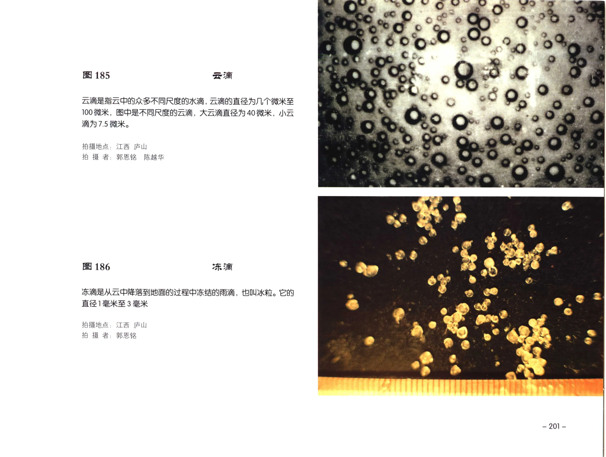
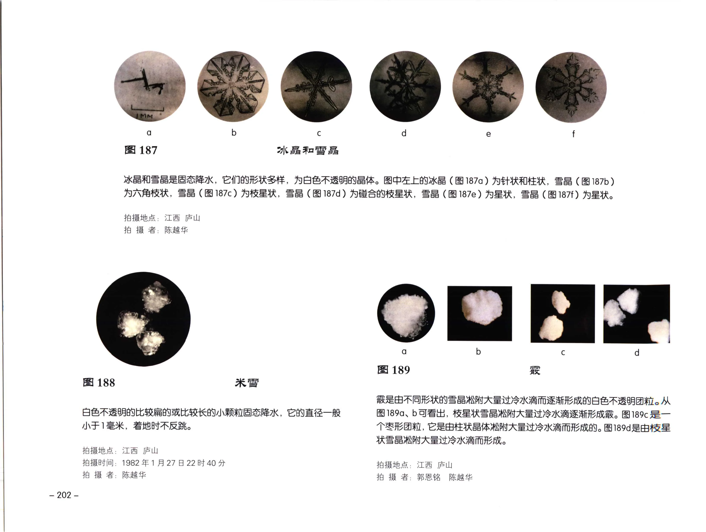
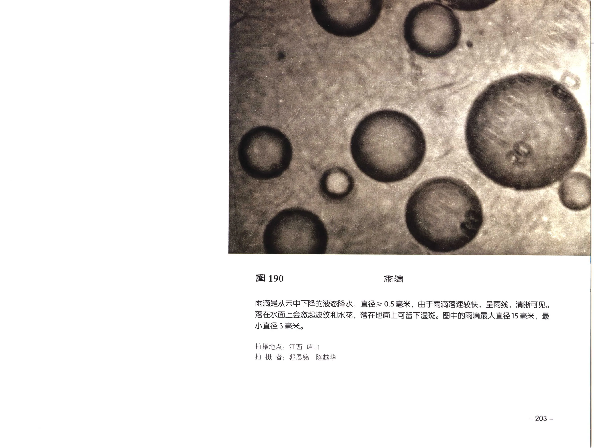
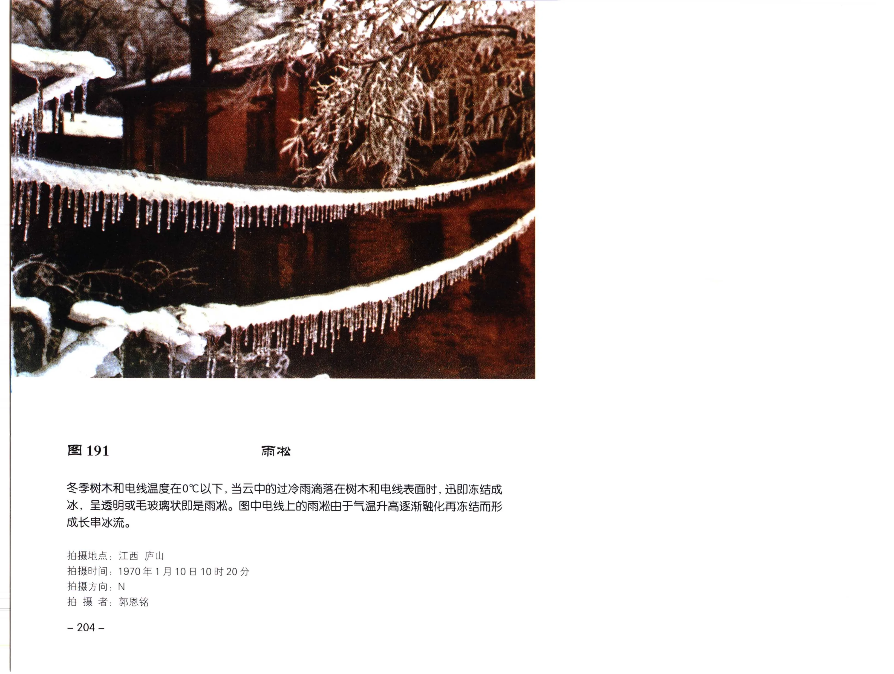
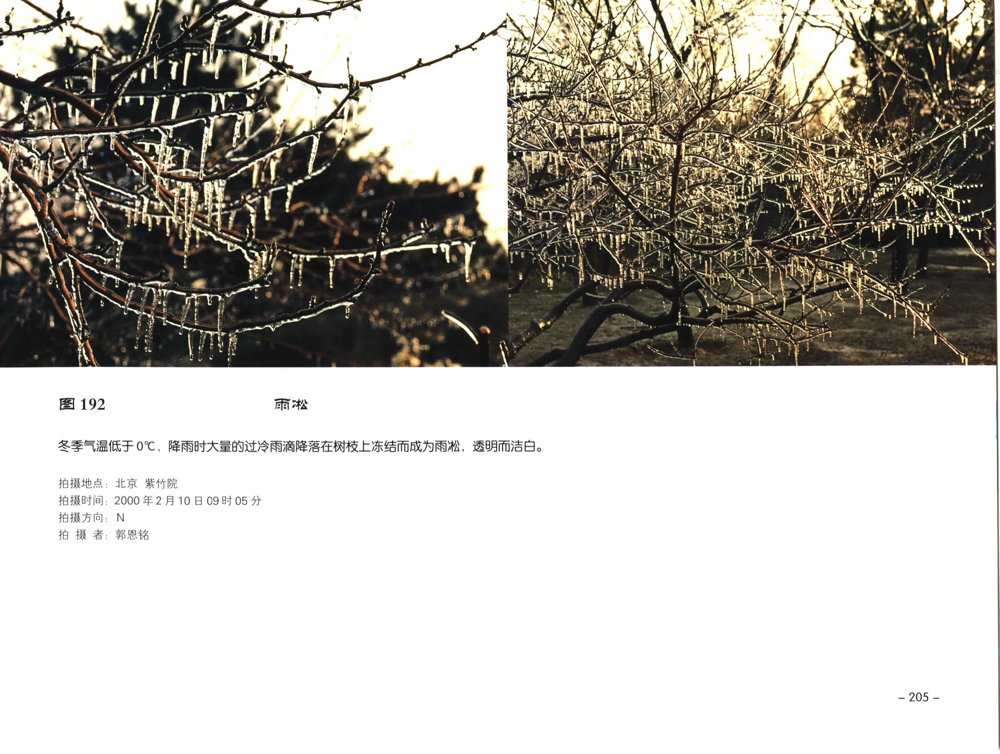
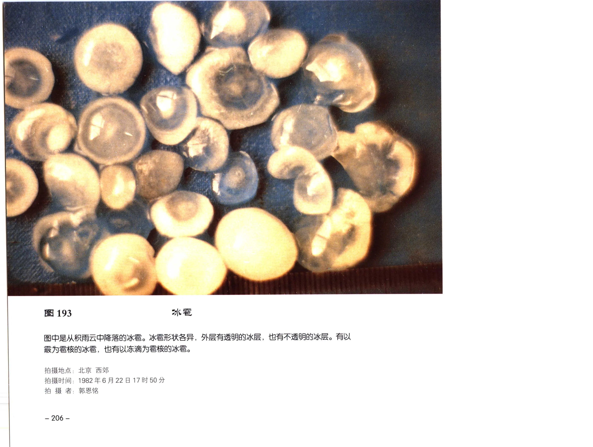
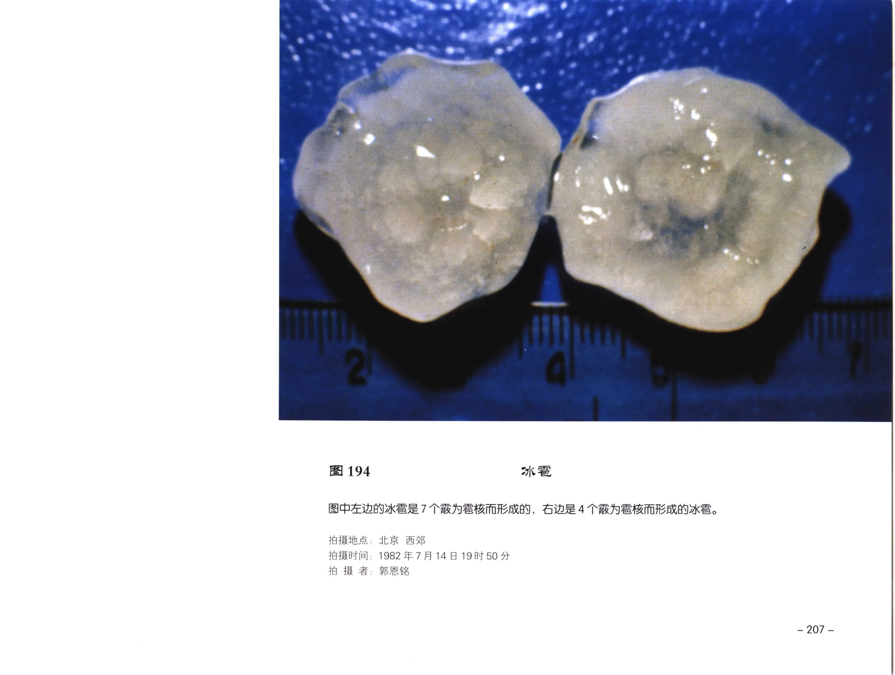
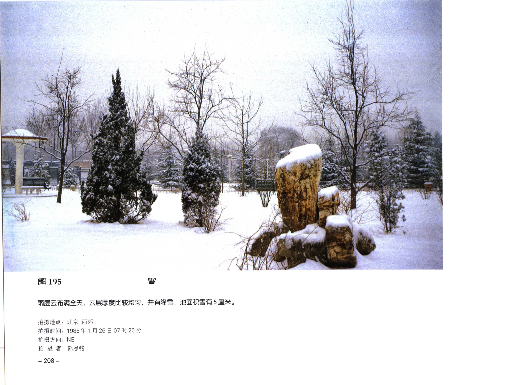

# 天气现象图版：降水粒子

本页整理《中国云图》天气现象部分中的降水粒子图版，范围覆盖 PDF 第 213-220 页中的图 185-195。

!!! note "校订状态"
    本页以 OCR 文本和原页图像共同整理。图 185-195 的现象名称、拍摄字段和说明文字已按可辨原页图像校订；原页未列出的字段标注为“原页未列出”。已复核 PDF 第 213-220 页字段区，图 185-187、189-190 未列出拍摄时间和方向，图 188、193-194 未列出拍摄方向。

## 图版列表

| 图号 | 现象 | PDF 页 | 主要内容 |
| --- | --- | --- | --- |
| 图 185 | 云滴 | 213 | 不同尺度云滴的微观照片。 |
| 图 186 | 冻滴 | 213 | 云中降落并冻结成冰粒的雨滴。 |
| 图 187 | 冰晶和雪晶 | 214 | 针状、柱状、枝星状等多种冰晶/雪晶。 |
| 图 188 | 米雪 | 214 | 白色不透明、较扁或较长的小颗粒固态降水。 |
| 图 189 | 霰 | 214 | 由雪晶粘附过冷水滴逐渐形成的团粒。 |
| 图 190 | 雨滴 | 215 | 液态降水雨滴的尺度示意。 |
| 图 191 | 雨凇 | 216 | 过冷雨滴落在树木和电线上冻结形成雨凇。 |
| 图 192 | 雨凇 | 217 | 过冷雨滴落在树枝上冻结形成透明雨凇。 |
| 图 193 | 冰雹 | 218 | 从积雨云中降落的冰雹。 |
| 图 194 | 冰雹 | 219 | 不同雪核形成的冰雹。 |
| 图 195 | 雪 | 220 | 均匀云层中的降雪与积雪。 |

## 云滴、冻滴、冰晶和雪晶

### 图 185：云滴

| 字段 | 内容 |
| --- | --- |
| 拍摄地点 | 江西 庐山 |
| 拍摄时间 | 原页未列出 |
| 拍摄方向 | 原页未列出 |
| 拍摄者 | 郭恩铭、陈越华 |
| 原分页 | [PDF 第 213 页](../pages-201-220.md) |

云滴是指云中的众多不同尺度的水滴，云滴的直径为几个微米至 100 微米。图中是不同尺度的云滴，大云滴直径为 40 微米，小云滴直径为 7.5 微米。

### 图 186：冻滴

| 字段 | 内容 |
| --- | --- |
| 拍摄地点 | 江西 庐山 |
| 拍摄时间 | 原页未列出 |
| 拍摄方向 | 原页未列出 |
| 拍摄者 | 郭恩铭 |
| 原分页 | [PDF 第 213 页](../pages-201-220.md) |

冻滴是从云中降落到地面的过程中冻结的雨滴，也叫冰粒。它的直径 1 毫米至 3 毫米。

### 图 187：冰晶和雪晶

| 字段 | 内容 |
| --- | --- |
| 拍摄地点 | 江西 庐山 |
| 拍摄时间 | 原页未列出 |
| 拍摄方向 | 原页未列出 |
| 拍摄者 | 陈越华 |
| 原分页 | [PDF 第 214 页](../pages-201-220.md) |

冰晶和雪晶为固态降水，形状多样，白色不透明晶体。图 187a 为针状和柱状，图 187b 为六角枝状，图 187c 为枝星状，图 187d 为碰合的枝星状，图 187e 为星状，图 187f 为星状。

### 图 188：米雪

| 字段 | 内容 |
| --- | --- |
| 拍摄地点 | 江西 庐山 |
| 拍摄时间 | 1982年1月27日22时40分 |
| 拍摄方向 | 原页未列出 |
| 拍摄者 | 陈越华 |
| 原分页 | [PDF 第 214 页](../pages-201-220.md) |

米雪是白色不透明、较扁的或较长的小颗粒固态降水，直径一般小于 1 毫米，着地时不反跳。

### 图 189：霰

| 字段 | 内容 |
| --- | --- |
| 拍摄地点 | 江西 庐山 |
| 拍摄时间 | 原页未列出 |
| 拍摄方向 | 原页未列出 |
| 拍摄者 | 郭恩铭、陈越华 |
| 原分页 | [PDF 第 214 页](../pages-201-220.md) |

霰是由不同形状的雪晶粘附大量过冷水滴而逐渐形成的白色不透明团粒。图 189a、189b 为枝星状雪晶粘附大量过冷水滴形成的霰，图 189c 为枣形团粒，由柱状晶体粘附大量过冷水滴形成，图 189d 为由枝星状雪晶粘附大量过冷水滴形成。

## 雨滴、雨凇、冰雹和雪

### 图 190：雨滴

| 字段 | 内容 |
| --- | --- |
| 拍摄地点 | 江西 庐山 |
| 拍摄时间 | 原页未列出 |
| 拍摄方向 | 原页未列出 |
| 拍摄者 | 郭恩铭、陈越华 |
| 原分页 | [PDF 第 215 页](../pages-201-220.md) |

雨滴是从云中下降的液态降水，直径 >= 0.5 毫米。由于雨滴落速较快，呈雨线，清晰可见。落在水面上会激起波纹和水花，落在地面上可留下湿斑。图中的雨滴最大直径 15 毫米，最小直径 3 毫米。

### 图 191：雨凇

| 字段 | 内容 |
| --- | --- |
| 拍摄地点 | 江西 庐山 |
| 拍摄时间 | 1970年1月10日10时20分 |
| 拍摄方向 | N |
| 拍摄者 | 郭恩铭 |
| 原分页 | [PDF 第 216 页](../pages-201-220.md) |

冬季树木和电线温度在 0℃ 以下，当云中的过冷雨滴落在树木和电线表面时，迅即冻结成冰，呈透明或毛玻璃状即是雨凇。图中电线上的雨凇由于气温升高逐渐融化再冻结而形成长串冰流。

### 图 192：雨凇

| 字段 | 内容 |
| --- | --- |
| 拍摄地点 | 北京 紫竹院 |
| 拍摄时间 | 2000年2月10日09时05分 |
| 拍摄方向 | N |
| 拍摄者 | 郭恩铭 |
| 原分页 | [PDF 第 217 页](../pages-201-220.md) |

冬季气温低于 0℃，降雨时大量的过冷雨滴降落在树枝上冻结而成为雨凇，透明而洁白。

### 图 193：冰雹

| 字段 | 内容 |
| --- | --- |
| 拍摄地点 | 北京 西郊 |
| 拍摄时间 | 1982年6月22日17时50分 |
| 拍摄方向 | 原页未列出 |
| 拍摄者 | 郭恩铭 |
| 原分页 | [PDF 第 218 页](../pages-201-220.md) |

图中是从积雨云中降落的冰雹。冰雹形状各异，外层有透明的冰层，也有不透明的冰层。有以霰为雹核的冰雹，也有以冻滴为雹核的冰雹。

### 图 194：冰雹

| 字段 | 内容 |
| --- | --- |
| 拍摄地点 | 北京 西郊 |
| 拍摄时间 | 1982年7月14日19时50分 |
| 拍摄方向 | 原页未列出 |
| 拍摄者 | 郭恩铭 |
| 原分页 | [PDF 第 219 页](../pages-201-220.md) |

图中左边的冰雹是 7 个霰为雹核形成的，右边是 4 个霰为雹核形成的冰雹。

### 图 195：雪

| 字段 | 内容 |
| --- | --- |
| 拍摄地点 | 北京 西郊 |
| 拍摄时间 | 1985年1月26日07时20分 |
| 拍摄方向 | NE |
| 拍摄者 | 郭恩铭 |
| 原分页 | [PDF 第 220 页](../pages-201-220.md) |

雨层云布满全天，云层厚度比较均匀，并有降雪，地面积雪有 5 厘米。
