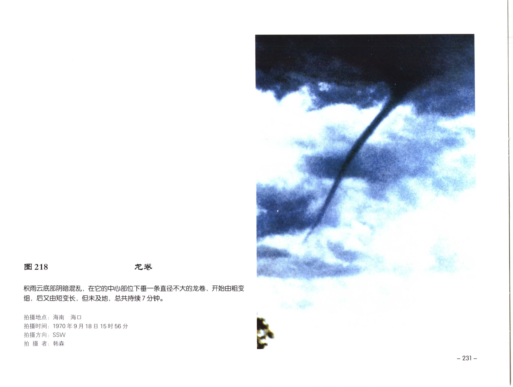
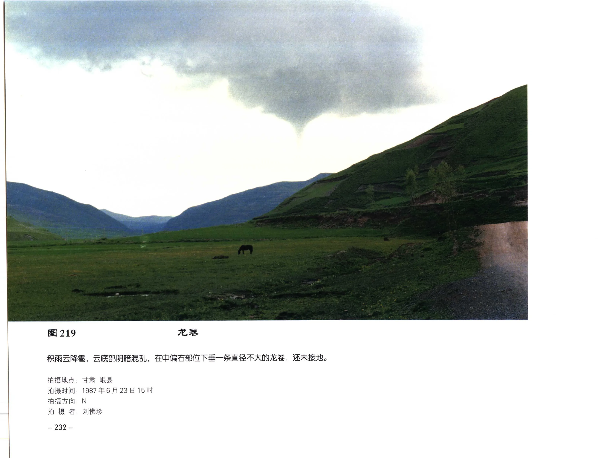
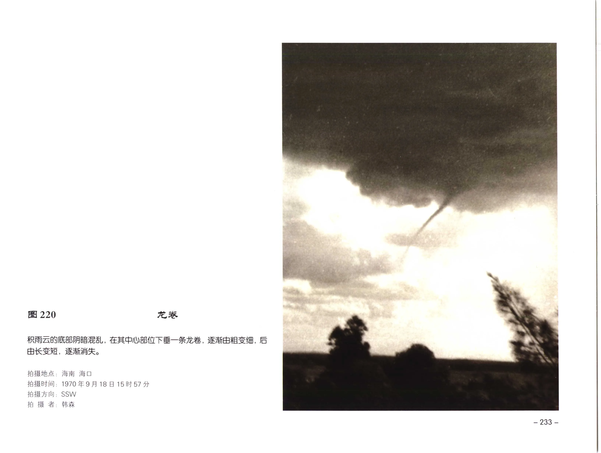
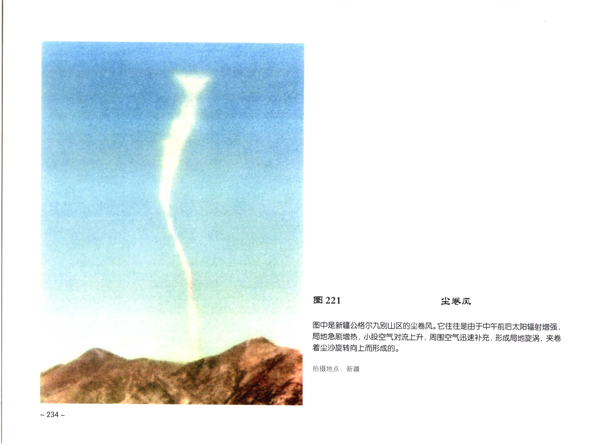
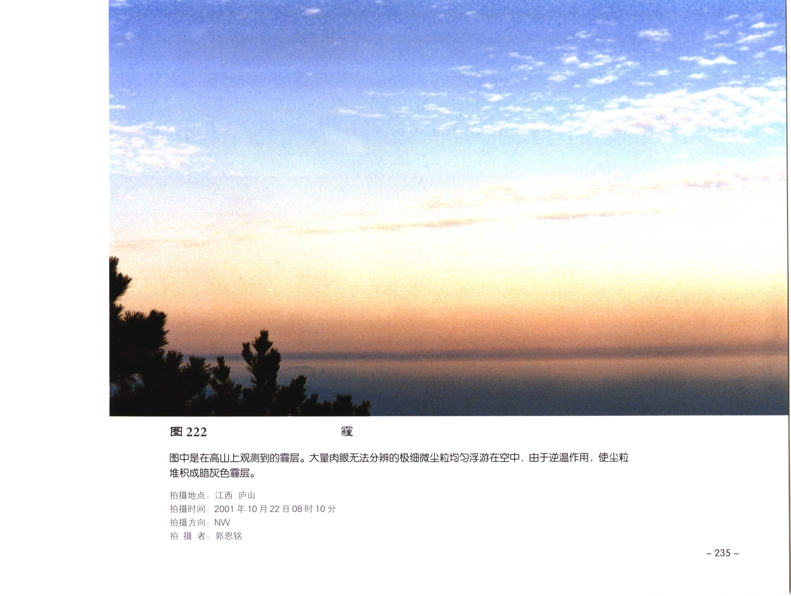
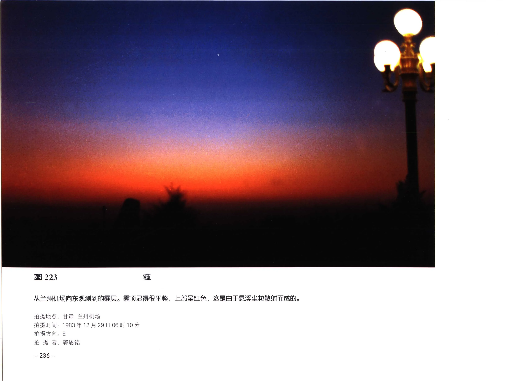
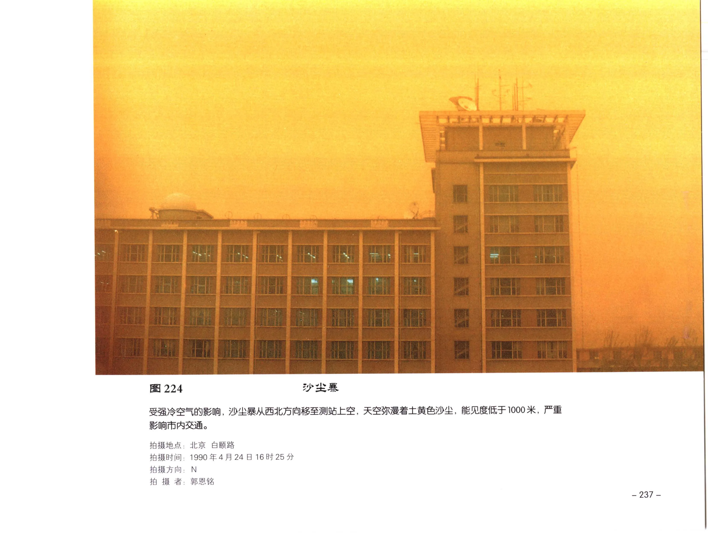
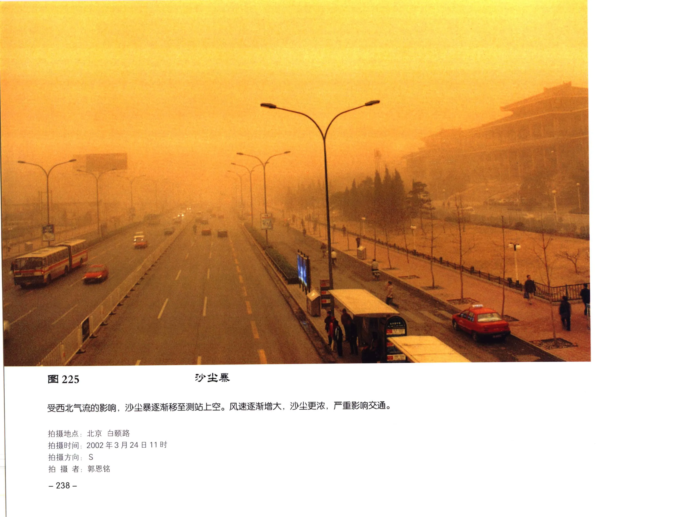
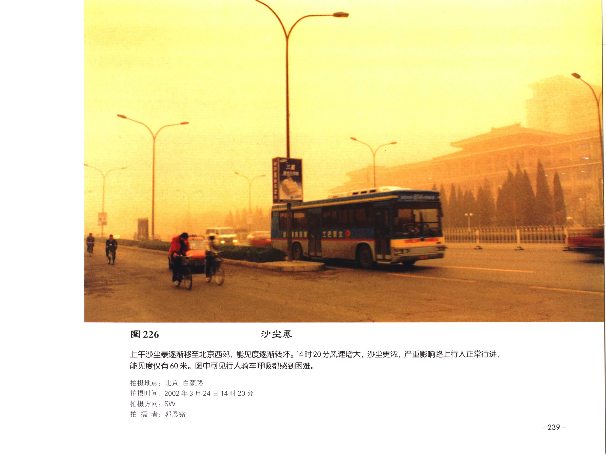
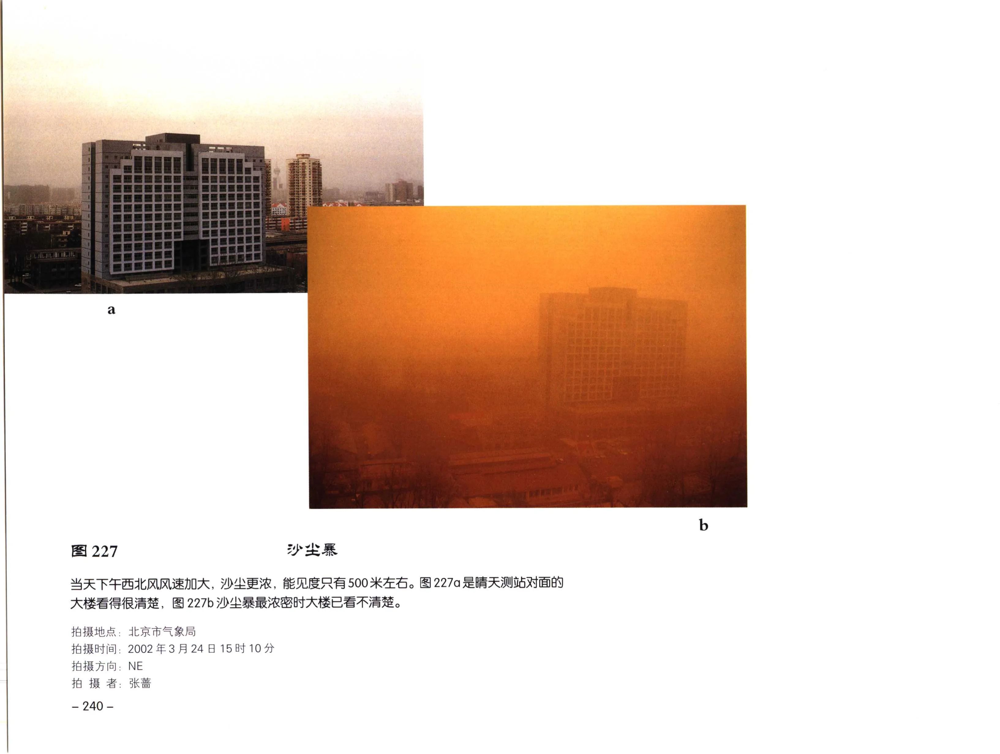

# 天气现象图版：龙卷、尘卷风和沙尘

本页整理《中国云图》天气现象部分中的龙卷、尘卷风、霾和沙尘暴图版，范围覆盖 PDF 第 243-252 页中的图 218-227。

!!! note "校订状态"
    本页以 OCR 文本和原页图像共同整理。图 222-223 原书题名为“霾”，OCR 易误识为“需层/才层”；图 218-227 的地点、时间、方向、拍摄者和说明文字已按可辨原页图像校订，原页未列出的字段标注为“原页未列出”。已复核 PDF 第 246 页字段区，图 221 原页只列出拍摄地点。

## 图版列表

| 图号 | 现象 | PDF 页 | 主要内容 |
| --- | --- | --- | --- |
| 图 218 | 龙卷 | 243 | 海南海口积雨云底部下垂龙卷，未及地，持续 7 分钟。 |
| 图 219 | 龙卷 | 244 | 甘肃岷县积雨云底部下垂龙卷，尚未接地。 |
| 图 220 | 龙卷 | 245 | 海南海口同一次龙卷过程，龙卷由长变短并逐渐消失。 |
| 图 221 | 尘卷风 | 246 | 新疆公格尔九别山区的尘卷风。 |
| 图 222 | 霾 | 247 | 江西庐山高山上观测到的霾。 |
| 图 223 | 霾 | 248 | 兰州机场向东观测到的霾，顶部平整并呈红色。 |
| 图 224 | 沙尘暴 | 249 | 强冷空气影响下，北京白颐路出现沙尘暴。 |
| 图 225 | 沙尘暴 | 250 | 沙尘暴逐渐移至测站上空，风速增大，沙尘更浓。 |
| 图 226 | 沙尘暴 | 251 | 北京西郊沙尘暴增强，能见度仅约 60 米。 |
| 图 227 | 沙尘暴 | 252 | 北京市气象局观测沙尘暴最浓密时的能见度变化。 |

## 龙卷

### 图 218：龙卷

| 字段 | 内容 |
| --- | --- |
| 拍摄地点 | 海南 海口 |
| 拍摄时间 | 1970年9月18日15时56分 |
| 拍摄方向 | SSW |
| 拍摄者 | 韩森 |
| 原分页 | [PDF 第 243 页](../pages-241-260.md) |

积雨云底部阴暗混乱，在它的中心部位下垂一条直径不大的龙卷，开始由粗变细，后又由短变长，但未及地，总共持续 7 分钟。

### 图 219：龙卷

| 字段 | 内容 |
| --- | --- |
| 拍摄地点 | 甘肃 岷县 |
| 拍摄时间 | 1987年6月23日15时 |
| 拍摄方向 | N |
| 拍摄者 | 刘佛珍 |
| 原分页 | [PDF 第 244 页](../pages-241-260.md) |

积雨云降雹，云底部阴暗混乱，在中偏右部位下垂一条直径不大的龙卷，还未接地。

### 图 220：龙卷

| 字段 | 内容 |
| --- | --- |
| 拍摄地点 | 海南 海口 |
| 拍摄时间 | 1970年9月18日15时57分 |
| 拍摄方向 | SSW |
| 拍摄者 | 韩森 |
| 原分页 | [PDF 第 245 页](../pages-241-260.md) |

积雨云的底部阴暗混乱，在其中心部位下垂一条龙卷，逐渐由粗变细，后由长变短，逐渐消失。

## 尘卷风和霾

### 图 221：尘卷风

| 字段 | 内容 |
| --- | --- |
| 拍摄地点 | 新疆 公格尔九别山区 |
| 拍摄时间 | 原页未列出 |
| 拍摄方向 | 原页未列出 |
| 拍摄者 | 原页未列出 |
| 原分页 | [PDF 第 246 页](../pages-241-260.md) |

图中是新疆公格尔九别山区的尘卷风。它往往是由于中午前后太阳辐射增强，局地急剧增热，小股空气对流上升，周围空气迅速补充，形成局地旋涡，卷着尘沙旋转向上而形成的。

### 图 222：霾

| 字段 | 内容 |
| --- | --- |
| 拍摄地点 | 江西 庐山 |
| 拍摄时间 | 2001年10月22日08时10分 |
| 拍摄方向 | NW |
| 拍摄者 | 郭恩铭 |
| 原分页 | [PDF 第 247 页](../pages-241-260.md) |

图中是在高山上观测到的霾层。大量肉眼无法分辨的极细微尘粒均匀浮游在空中；由于逆温作用，使尘粒堆积成暗灰色霾层。

### 图 223：霾

| 字段 | 内容 |
| --- | --- |
| 拍摄地点 | 甘肃 兰州机场 |
| 拍摄时间 | 1983年12月29日06时10分 |
| 拍摄方向 | E |
| 拍摄者 | 郭恩铭 |
| 原分页 | [PDF 第 248 页](../pages-241-260.md) |

兰州机场向东观测到的霾。霾顶显得很平整，上部呈红色，这是由于悬浮尘粒散射而成的。

## 沙尘暴

### 图 224：沙尘暴

| 字段 | 内容 |
| --- | --- |
| 拍摄地点 | 北京 白颐路 |
| 拍摄时间 | 1990年4月24日16时25分 |
| 拍摄方向 | N |
| 拍摄者 | 郭恩铭 |
| 原分页 | [PDF 第 249 页](../pages-241-260.md) |

受强冷空气的影响，沙尘暴从西北方向移至测站上空，天空弥漫着土黄色沙尘，能见度低于 1000 米，严重影响市内交通。

### 图 225：沙尘暴

| 字段 | 内容 |
| --- | --- |
| 拍摄地点 | 北京 白颐路 |
| 拍摄时间 | 2002年3月24日11时 |
| 拍摄方向 | S |
| 拍摄者 | 郭恩铭 |
| 原分页 | [PDF 第 250 页](../pages-241-260.md) |

受西北气流的影响，沙尘暴逐渐移至测站上空。风速逐渐增大，沙尘更浓，严重影响交通。

### 图 226：沙尘暴

| 字段 | 内容 |
| --- | --- |
| 拍摄地点 | 北京 白颐路 |
| 拍摄时间 | 2002年3月24日14时20分 |
| 拍摄方向 | SW |
| 拍摄者 | 郭恩铭 |
| 原分页 | [PDF 第 251 页](../pages-241-260.md) |

上午沙尘暴逐渐移至北京西郊，能见度逐渐转坏。14 时 20 分风速增大，沙尘更浓，严重影响路上行人正常行进，能见度仅有 60 米。图中可见行人骑车呼吸都感到困难。

### 图 227：沙尘暴

| 字段 | 内容 |
| --- | --- |
| 拍摄地点 | 北京市气象局 |
| 拍摄时间 | 2002年3月24日15时10分 |
| 拍摄方向 | NE |
| 拍摄者 | 张蕾 |
| 原分页 | [PDF 第 252 页](../pages-241-260.md) |

当天下午西北风风速加大，沙尘更浓，能见度只有 500 米左右。图 227a 是晴天测站对面的大楼，画面中大楼看得很清楚；图 227b 为沙尘暴最浓密时，大楼已看不清楚。
