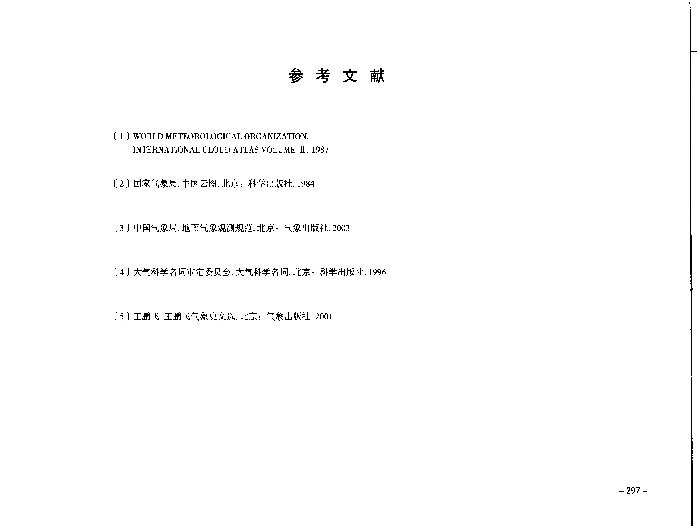
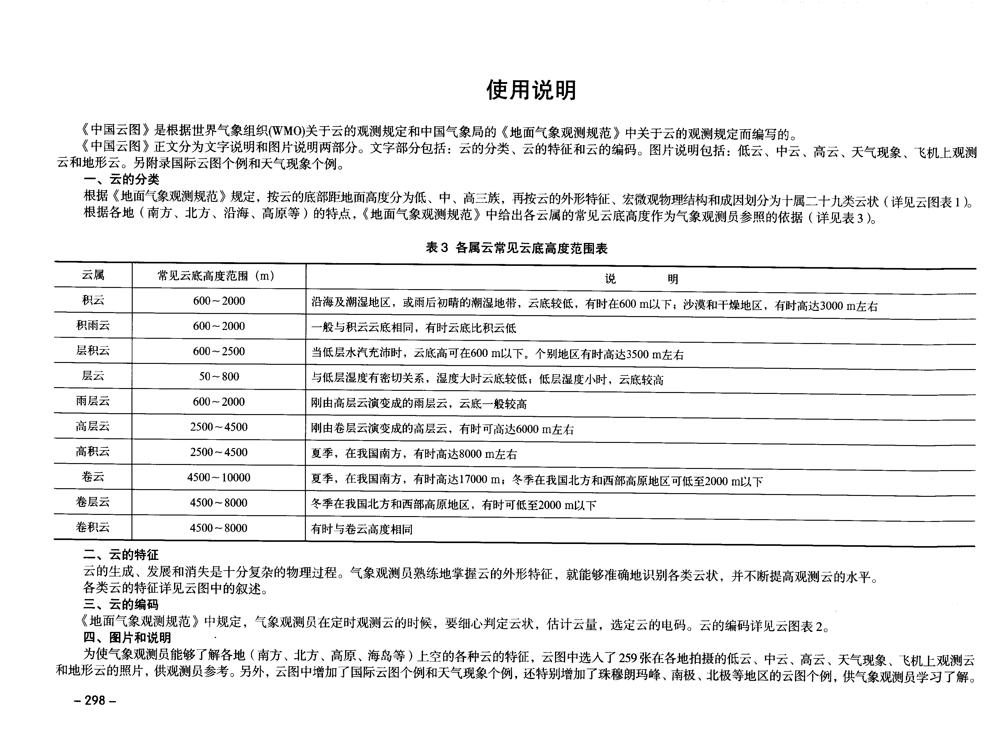
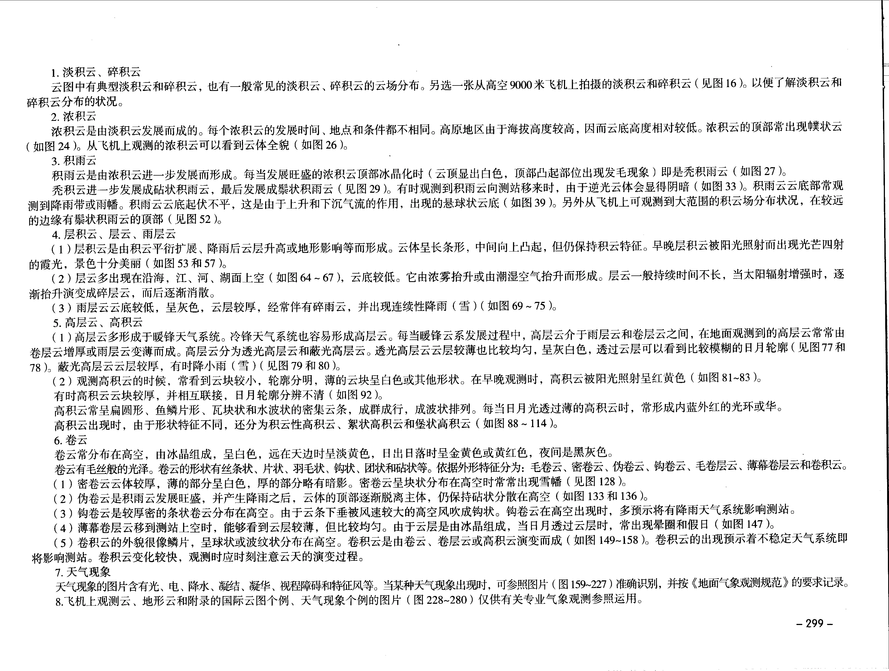
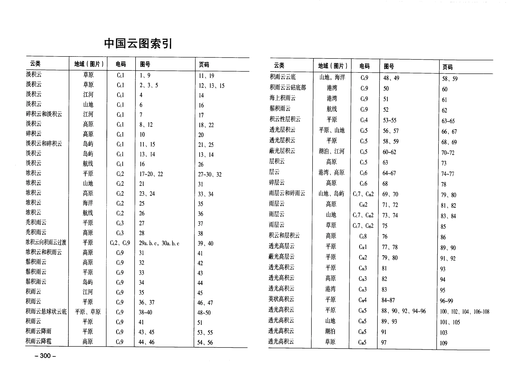
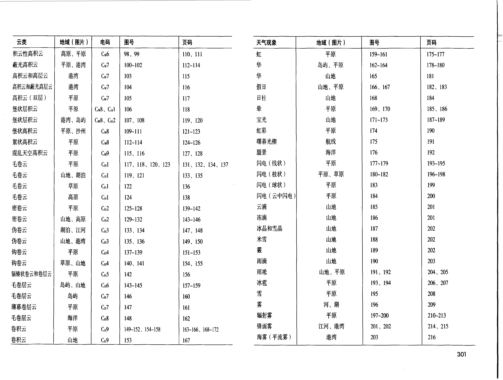
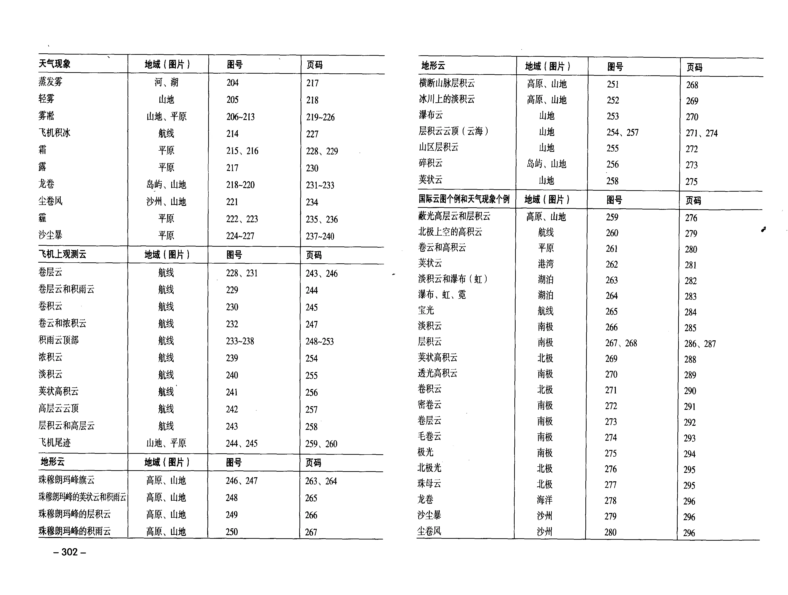

# 使用说明、参考文献和索引

本页整理《中国云图》PDF 第 309-314 页中的参考文献、使用说明和索引页。原页图像仍保留在 [第 301-314 页](pages-301-314.md) 中，供逐字校订。

!!! note "校订状态"
    本页为 OCR 底稿的结构化摘录，并已对照原页图像校订“使用说明”、表 3 和 PDF 第 312-314 页索引。索引页为多列表格，仍建议以原页图像作为最终复核依据。

## 参考文献

原书参考文献见 PDF 第 309 页：

OCR 可识别的条目包括：

| 序号 | 文献 |
| --- | --- |
| 1 | World Meteorological Organization. International Cloud Atlas Volume II. 1987. |
| 2 | 国家气象局：《中国云图》，北京：科学出版社，1984。 |
| 3 | 中国气象局：《地面气象观测规范》，北京：气象出版社，2003。 |
| 4 | 大气科学名词审定委员会：《大气科学名词》，北京：科学出版社，1996。 |
| 5 | 王鹏飞气象史文选，北京：气象出版社，2001。 |

## 使用说明

原书使用说明见 PDF 第 310-311 页：

《中国云图》根据世界气象组织（WMO）关于云的观测规定和中国气象局《地面气象观测规范》中关于云的观测规定编写。

正文分为文字说明和图片说明两部分：

- 文字部分包括云的分类、云的特征和云的编码。
- 图片说明包括低云、中云、高云、天气现象、飞机上观测云和地形云。
- 附录包括国际云图个例和天气现象个例。

原书说明强调：

- 云按云底距地面高度分为低云、中云、高云三族。
- 各云族再按外形特征、宏微观物理结构和成因划分为十属二十九类云状。
- 气象观测员应熟练掌握云的外形特征，以准确识别云状并提高观测水平。
- 定时观测云时，需要判定云状、估计云量并选定云的电码。
- 图版中选入各地低云、中云、高云、天气现象、飞机上观测云和地形云照片，另增加国际云图个例、天气现象个例以及珠穆朗玛峰、南极、北极等地区个例，供观测学习参考。

### 表 3：各属云常见云底高度范围表

| 云属 | 常见云底高度范围（m） | 说明 |
| --- | --- | --- |
| 积云 | 600-2000 | 沿海及潮湿地区，或雨后初晴的潮湿地带，云底较低，有时在 600 m 以下；沙漠和干燥地区，有时高达 3000 m 左右。 |
| 积雨云 | 600-2000 | 一般与积云云底相同，有时云底比积云低。 |
| 层积云 | 600-2500 | 当低层水汽充沛时，云底高可在 600 m 以下。个别地区有时高达 3500 m 左右。 |
| 层云 | 50-800 | 与低层湿度有密切关系，湿度大时云底较低；低层湿度小时，云底较高。 |
| 雨层云 | 600-2000 | 刚由高层云演变成的雨层云，云底一般较高。 |
| 高层云 | 2500-4500 | 刚由卷层云演变成的高层云，有时可高达 6000 m 左右。 |
| 高积云 | 2500-4500 | 夏季，在我国南方，有时高达 8000 m 左右。 |
| 卷云 | 4500-10000 | 夏季，在我国南方，有时高达 17000 m；冬季在我国北方和西部高原地区可低至 2000 m 以下。 |
| 卷层云 | 4500-8000 | 冬季在我国北方和西部高原地区，有时可低至 2000 m 以下。 |
| 卷积云 | 4500-8000 | 有时与卷云高度相同。 |

### 使用说明中的图版导读

原书第 299 页继续按图版类别说明读图重点：

| 类别 | 原书说明要点 |
| --- | --- |
| 淡积云、碎积云 | 云图中有典型淡积云和碎积云，也有一般常见的淡积云、碎积云云场分布；另选一张从高空 9000 米飞机上拍摄的淡积云和碎积云，用于了解其分布状况。 |
| 浓积云 | 浓积云由淡积云发展而成；每个浓积云的发展时间、地点和条件不同。高原地区因海拔较高，云底高度相对较低；浓积云顶部常出现嶙状云，从飞机上观测可看到云体全貌。 |
| 积雨云 | 积雨云由淡积云进一步发展而成；当发展旺盛的浓积云顶部冰晶化，即云顶显白、顶部凸起部位发毛时，就是秃积雨云。其后可发展为砧状积雨云。积雨云云底常可观测到降雨带或雨幡，云底起伏不平，有时出现悬球状云底。 |
| 层积云、层云、雨层云 | 层积云可由积云平衍扩展、降雨后云层升高或地形影响形成；层云多出现在沿海、江河湖面上空，云底较低，可由浓雾抬升或潮湿空气抬升形成；雨层云云底较低、灰色、云层较厚，常伴碎雨云并出现连续性降雨或降雪。 |
| 高层云、高积云 | 高层云多形成于暖锋天气系统，冷锋天气系统也容易形成；高层云分透光高层云和蔽光高层云。高积云云块较小、轮廓分明，早晚受阳光照射可呈红黄色；按形状特征还可分积云性高积云、荚状高积云和堡状高积云。 |
| 卷云 | 卷云常分布在高空，由冰晶组成，具有毛丝般光泽；形状有丝条状、片状、羽毛状、钩状、团状和砧状等。原书按外形特征提示毛卷云、密卷云、伪卷云、钩卷云、毛卷层云、薄幕卷层云和卷积云等识别要点。 |
| 天气现象 | 天气现象图片包含光、电、降水、凝结、凝华、视程障碍和特征风等，可参照图 159-227 识别，并按《地面气象观测规范》要求记录。 |
| 飞机上观测云、地形云和附录个例 | 图 228-280 仅供有关专业气象观测参照运用。 |

## 索引页

原书索引见 PDF 第 312-314 页：

索引页按云类、地域、云类代码、图号和页码组织。由于扫描 OCR 对表格结构识别不稳定，本节对照原页图像转写；日常检索也可配合 [图版清单](plate-catalog.md) 和各结构化图版页使用。

### 索引：低云

以下内容对照 PDF 第 312 页转写。

| 云类 | 地域（图片） | 电码 | 图号 | 页码 |
| --- | --- | --- | --- | --- |
| 淡积云 | 草原 | `C_L1` | 1、9 | 11、19 |
| 淡积云 | 草原 | `C_L1` | 2、3、5 | 12、13、15 |
| 淡积云 | 江河 | `C_L1` | 4 | 14 |
| 淡积云 | 山地 | `C_L1` | 6 | 16 |
| 碎积云和淡积云 | 江河 | `C_L1` | 7 | 17 |
| 淡积云 | 高原 | `C_L1` | 8、12 | 18、22 |
| 碎积云 | 高原 | `C_L1` | 10 | 20 |
| 淡积云和碎积云 | 岛屿 | `C_L1` | 11、15 | 21、25 |
| 淡积云 | 岛屿 | `C_L1` | 13、14 | 13、14 |
| 淡积云 | 航线 | `C_L1` | 16 | 26 |
| 浓积云 | 平原 | `C_L2` | 17-20、22 | 27-30、32 |
| 浓积云 | 山地 | `C_L2` | 21 | 31 |
| 浓积云 | 高原 | `C_L2` | 23、24 | 33、34 |
| 浓积云 | 海洋 | `C_L2` | 25 | 35 |
| 浓积云 | 航线 | `C_L2` | 26 | 36 |
| 秃积雨云 | 平原 | `C_L3` | 27 | 37 |
| 秃积雨云 | 高原 | `C_L3` | 28 | 38 |
| 浓积云向积雨云过渡 | 平原 | `C_L2`、`C_L9` | 29a、b、c，30a、b、c | 39、40 |
| 浓积云和积雨云 | 高原 | `C_L9` | 31 | 41 |
| 鬃积雨云 | 高原 | `C_L9` | 32 | 42 |
| 鬃积雨云 | 平原 | `C_L9` | 33 | 43 |
| 鬃积雨云 | 岛屿 | `C_L9` | 34 | 44 |
| 积雨云 | 江河 | `C_L9` | 35 | 45 |
| 积雨云 | 平原 | `C_L9` | 36、37 | 46、47 |
| 积雨云悬球状云底 | 平原、草原 | `C_L9` | 38-40 | 48-50 |
| 积雨云 | 平原 | `C_L9` | 41 | 51 |
| 积雨云降雨 | 平原 | `C_L9` | 42 | 52 |
| 积雨云降雨 | 平原 | `C_L9` | 43、45 | 53、55 |
| 积雨云降雹 | 高原 | `C_L9` | 44、46 | 54、56 |
| 积雨云云底碎雨云 | 平原 | `C_L9` | 47 | 57 |
| 积雨云云底 | 山地、海洋 | `C_L9` | 48、49 | 58、59 |
| 积雨云砧底部 | 港湾 | `C_L9` | 50 | 60 |
| 海上积雨云 | 港湾 | `C_L9` | 51 | 61 |
| 鬃积雨云 | 航线 | `C_L9` | 52 | 62 |
| 积云性层积云 | 平原 | `C_L4` | 53-55 | 63-65 |
| 透光层积云 | 平原、山地 | `C_L5` | 56、57 | 66、67 |
| 透光层积云 | 平原 | `C_L5` | 58、59 | 68、69 |
| 蔽光层积云 | 湖泊、江河 | `C_L5` | 60-62 | 70-72 |
| 层积云 | 高原 | `C_L5` | 63 | 73 |
| 层云 | 港湾、高原 | `C_L6` | 64-67 | 74-77 |
| 碎层云 | 高原 | `C_L6` | 68 | 78 |
| 雨层云和碎雨云 | 山地、岛屿 | `C_L7`、`C_M2` | 69、70 | 79、80 |
| 雨层云 | 高原 | `C_M2` | 71、72 | 81、82 |
| 雨层云 | 山地 | `C_L7`、`C_M2` | 73、74 | 83、84 |
| 雨层云 | 草原 | `C_L7`、`C_M2` | 75 | 85 |
| 积云和层积云 | 高原 | `C_L8` | 76 | 86 |

### 索引：中云前段

以下内容对照 PDF 第 312 页转写。

| 云类 | 地域（图片） | 电码 | 图号 | 页码 |
| --- | --- | --- | --- | --- |
| 透光高层云 | 平原 | `C_M1` | 77、78 | 89、90 |
| 蔽光高层云 | 平原 | `C_M2` | 79、80 | 91、92 |
| 透光高积云 | 平原 | `C_M3` | 81 | 93 |
| 透光高积云 | 高原 | `C_M3` | 82 | 94 |
| 透光高积云 | 港湾 | `C_M3` | 83 | 95 |
| 荚状高积云 | 平原 | `C_M4` | 84-87 | 96-99 |
| 透光高积云 | 平原 | `C_M5` | 88、90、92、94-96 | 100、102、104、106-108 |
| 透光高积云 | 山地 | `C_M5` | 89、93 | 101、105 |
| 透光高积云 | 湖泊 | `C_M5` | 91 | 103 |
| 透光高积云 | 草原 | `C_M5` | 97 | 109 |

### 索引：中云后段与高云

以下内容对照 PDF 第 313 页转写。

| 云类 | 地域（图片） | 电码 | 图号 | 页码 |
| --- | --- | --- | --- | --- |
| 积云性高积云 | 高原、平原 | `C_M6` | 98、99 | 110、111 |
| 蔽光高积云 | 平原、港湾 | `C_M7` | 100-102 | 112-114 |
| 高积云和高层云 | 港湾 | `C_M7` | 103 | 115 |
| 高积云和蔽光高层云 | 港湾 | `C_M7` | 104 | 116 |
| 高积云（双层） | 平原 | `C_M7` | 105 | 117 |
| 堡状层积云 | 平原 | `C_M8`、`C_H1` | 106 | 118 |
| 堡状层积云 | 港湾、岛屿 | `C_M8`、`C_H2` | 107、108 | 119、120 |
| 堡状高积云 | 平原、沙洲 | `C_M8` | 109-111 | 121-123 |
| 絮状高积云 | 平原 | `C_M8` | 112-114 | 124-126 |
| 混乱天空高积云 | 平原 | `C_M9` | 115、116 | 127、128 |
| 毛卷云 | 平原 | `C_H1` | 117、118、120、123 | 131、132、134、137 |
| 毛卷云 | 山地、湖泊 | `C_H1` | 119、121 | 133、135 |
| 毛卷云 | 草原 | `C_H1` | 122 | 136 |
| 毛卷云 | 高原 | `C_H1` | 124 | 138 |
| 密卷云 | 平原 | `C_H2` | 125-128 | 139-142 |
| 密卷云 | 山地、高原 | `C_H2` | 129-132 | 143-146 |
| 伪卷云 | 湖泊、江河 | `C_H3` | 133、134 | 147、148 |
| 伪卷云 | 山地、港湾 | `C_H3` | 135、136 | 149、150 |
| 钩卷云 | 平原 | `C_H4` | 137-139 | 151-153 |
| 钩卷云 | 草原、山地 | `C_H4` | 140、141 | 154、155 |
| 辐辏状卷云和卷层云 | 平原 | `C_H5` | 142 | 156 |
| 毛卷层云 | 岛屿、山地 | `C_H6` | 143-145 | 157-159 |
| 毛卷层云 | 岛屿 | `C_H7` | 146 | 160 |
| 薄幕卷层云 | 平原 | `C_H7` | 147 | 161 |
| 毛卷层云 | 海洋 | `C_H8` | 148 | 162 |
| 卷积云 | 平原 | `C_H9` | 149-152、154-158 | 163-166、168-172 |
| 卷积云 | 山地 | `C_H9` | 153 | 167 |

### 索引：天气现象

以下内容对照 PDF 第 313-314 页转写。

| 天气现象 | 地域（图片） | 图号 | 页码 |
| --- | --- | --- | --- |
| 虹 | 平原 | 159-161 | 175-177 |
| 华 | 岛屿、平原 | 162-164 | 178-180 |
| 华 | 山地 | 165 | 181 |
| 假日 | 山地、平原 | 166、167 | 182、183 |
| 日柱 | 山地 | 168 | 184 |
| 晕 | 平原 | 169、170 | 185、186 |
| 宝光 | 山地 | 171-173 | 187-189 |
| 虹彩 | 平原 | 174 | 190 |
| 曙暮光煇 | 航线 | 175 | 191 |
| 蜃景 | 海洋 | 176 | 192 |
| 闪电（线状） | 平原 | 177-179 | 193-195 |
| 闪电（枝状） | 平原、草原 | 180-182 | 196-198 |
| 闪电（球状） | 平原 | 183 | 199 |
| 闪电（云中闪电） | 平原 | 184 | 200 |
| 云滴 | 山地 | 185 | 201 |
| 冻滴 | 山地 | 186 | 201 |
| 冰晶和雪晶 | 山地 | 187 | 202 |
| 米雪 | 山地 | 188 | 202 |
| 霰 | 山地 | 189 | 202 |
| 雨滴 | 山地 | 190 | 203 |
| 雨凇 | 山地、平原 | 191、192 | 204、205 |
| 冰雹 | 平原 | 193、194 | 206、207 |
| 雪 | 平原 | 195 | 208 |
| 雾 | 河、湖 | 196 | 209 |
| 辐射雾 | 平原 | 197-200 | 210-213 |
| 锋面雾 | 江河、港湾 | 201、202 | 214、215 |
| 海雾（平流雾） | 港湾 | 203 | 216 |
| 蒸发雾 | 河、湖 | 204 | 217 |
| 轻雾 | 山地 | 205 | 218 |
| 雾凇 | 山地、平原 | 206-213 | 219-226 |
| 飞机积冰 | 航线 | 214 | 227 |
| 霜 | 平原 | 215、216 | 228、229 |
| 露 | 平原 | 217 | 230 |
| 龙卷 | 岛屿、山地 | 218-220 | 231-233 |
| 尘卷风 | 沙洲、山地 | 221 | 234 |
| 霾 | 平原 | 222、223 | 235、236 |
| 沙尘暴 | 平原 | 224-227 | 237-240 |

### 索引：飞机上观测云

以下内容对照 PDF 第 314 页转写。

| 云类或主题 | 地域（图片） | 图号 | 页码 |
| --- | --- | --- | --- |
| 卷层云 | 航线 | 228、231 | 243、246 |
| 卷层云和积雨云 | 航线 | 229 | 244 |
| 卷积云 | 航线 | 230 | 245 |
| 卷云和浓积云 | 航线 | 232 | 247 |
| 积雨云顶部 | 航线 | 233-238 | 248-253 |
| 浓积云 | 航线 | 239 | 254 |
| 淡积云 | 航线 | 240 | 255 |
| 荚状高积云 | 航线 | 241 | 256 |
| 高层云云顶 | 航线 | 242 | 257 |
| 层积云和高层云 | 航线 | 243 | 258 |
| 飞机尾迹 | 山地、平原 | 244、245 | 259、260 |

### 索引：地形云

以下内容对照 PDF 第 314 页转写。

| 地形云 | 地域（图片） | 图号 | 页码 |
| --- | --- | --- | --- |
| 珠穆朗玛峰旗云 | 高原、山地 | 246、247 | 263、264 |
| 珠穆朗玛峰的荚状云和积雨云 | 高原、山地 | 248 | 265 |
| 珠穆朗玛峰的层积云 | 高原、山地 | 249 | 266 |
| 珠穆朗玛峰的积雨云 | 高原、山地 | 250 | 267 |
| 横断山脉层积云 | 高原、山地 | 251 | 268 |
| 冰川上的淡积云 | 高原、山地 | 252 | 269 |
| 瀑布云 | 山地 | 253 | 270 |
| 层积云云顶（云海） | 山地 | 254、257 | 271、274 |
| 山区层积云 | 山地 | 255 | 272 |
| 碎积云 | 岛屿、山地 | 256 | 273 |
| 荚状云 | 山地 | 258 | 275 |

### 索引：国际云图个例和天气现象个例

以下内容对照 PDF 第 314 页转写。

| 个例 | 地域（图片） | 图号 | 页码 |
| --- | --- | --- | --- |
| 蔽光高层云和层积云 | 高原、山地 | 259 | 276 |
| 北极上空的高积云 | 航线 | 260 | 279 |
| 密卷云和高积云 | 平原 | 261 | 280 |
| 荚状层积云 | 港湾 | 262 | 281 |
| 淡积云和瀑布（虹） | 湖泊 | 263 | 282 |
| 瀑布、虹、霓 | 湖泊 | 264 | 283 |
| 宝光 | 航线 | 265 | 284 |
| 淡积云 | 南极 | 266 | 285 |
| 层积云 | 南极 | 267、268 | 286、287 |
| 荚状高积云 | 北极 | 269 | 288 |
| 透光高积云 | 南极 | 270 | 289 |
| 卷积云 | 北极 | 271 | 290 |
| 密卷云 | 南极 | 272 | 291 |
| 卷层云 | 南极 | 273 | 292 |
| 毛卷云 | 南极 | 274 | 293 |
| 极光 | 南极 | 275 | 294 |
| 北极光 | 北极 | 276 | 295 |
| 珠母云 | 北极 | 277 | 295 |
| 龙卷 | 海洋 | 278 | 296 |
| 沙尘暴 | 沙洲 | 279 | 296 |
| 尘卷风 | 沙洲 | 280 | 296 |
