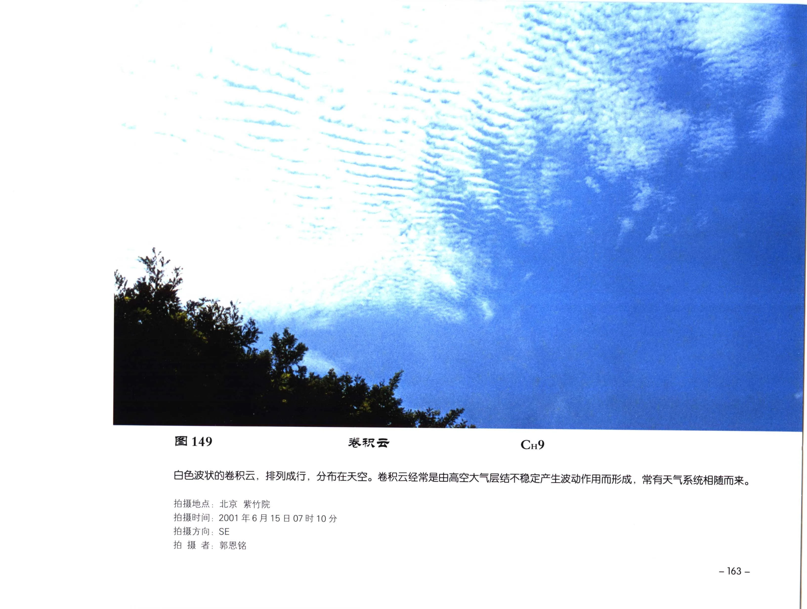

# 卷积云

**一句话识别**：卷积云是高空很小、很白的云块或波纹，常呈鱼鳞状、颗粒状或细小波状。

图 149 中白色小云块成波状排列，个体细小且无明显阴影；这类“高、白、小、细”的颗粒感是卷积云区别于高积云的关键。

## 属于哪里

| 项目 | 内容 |
| --- | --- |
| 云族 | [高云](high-clouds.md) |
| 云属 | 卷积云 |
| 云类 | 卷积云 |
| 简写 / 代码 | Cc / `CH9` |
| 拉丁名 | Cirrocumulus |

## 形态特征

- 云块很小、很白，通常无明显阴影。
- 可成行、成群、波纹状或鱼鳞片状。
- 常与密卷云同场，或由密卷云演变而成。

## 形成机制

卷积云可由高空层结不稳定、波动作用形成，也可由密卷云扩展、破碎、颗粒化而来。

## 天气意义

卷积云常短暂出现，可能伴随高空湿区或天气系统变化。单独一片卷积云不能直接作为降水预报，需连续观察云系是否增厚、降低。

## 与相似云的区别

| 相似云 | 区别 |
| --- | --- |
| 高积云 | 高积云云块更大，常有灰暗阴影，属于中云。 |
| [密卷云](cirrus-spissatus.md) | 密卷云更成片或团状，边缘纤维明显。 |
| [毛卷云](cirrus-fibratus.md) | 毛卷云是丝缕状，不是颗粒或鱼鳞状。 |

## 《中国云图》图版来源

- [高云图版：卷层云与卷积云](china-cloud-atlas/plates/high-clouds-cirrostratus-cirrocumulus.md)：图 149-158。
- 本页主图：图 149，PDF 第 175 页。

## 相关页面

[高云总览](high-clouds.md) · [密卷云](cirrus-spissatus.md) · [毛卷层云](cirrostratus-fibratus.md) · [云的分类体系](classification.md)
