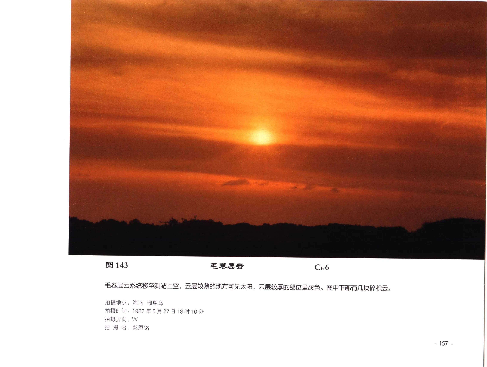

# 毛卷层云

**一句话识别**：毛卷层云是带有纤维结构的高空薄幕，既像一层卷层云，又能看出毛丝状纹理和厚薄变化。

图 143 中卷层云系统移至测站上空，薄处可见太阳，厚处呈灰色，下部还有碎积云；“成幕 + 纤维厚薄不均”让它区别于单条毛卷云。

## 属于哪里

| 项目 | 内容 |
| --- | --- |
| 云族 | [高云](high-clouds.md) |
| 云属 | 卷层云 |
| 云类 | 毛卷层云 |
| 简写 / 代码 | Cs fil / `CH6`、`CH7`、`CH8` |
| 拉丁名 | Cirrostratus fibratus / filosus 术语待校订 |

## 形态特征

- 云层呈乳白、灰白或灰色薄幕。
- 可见纤维状纹理，厚薄不均。
- 薄处能看见太阳，厚处可呈暗灰。

## 形成机制

高空冰晶云系系统性移入并扩展成幕，原本卷云状纤维逐渐连接、铺展，形成卷层云。

## 天气意义

若毛卷层云从某方向持续移入、增厚并降低，常是天气系统接近的早期线索。是否降水还需看后续是否转为高层云、雨层云。

## 与相似云的区别

| 相似云 | 区别 |
| --- | --- |
| [毛卷云](cirrus-fibratus.md) | 毛卷云是单条或分散丝缕，不形成连续薄幕。 |
| [薄幕卷层云](cirrostratus-nebulosus.md) | 薄幕卷层云更均匀，纤维结构不明显，常伴完整晕。 |
| 透光高层云 | 高层云更灰、更厚，太阳像隔毛玻璃，通常不产生典型晕。 |

## 《中国云图》图版来源

- [高云图版：卷层云与卷积云](china-cloud-atlas/plates/high-clouds-cirrostratus-cirrocumulus.md)：图 143-146、148。
- 本页主图：图 143，PDF 第 169 页。

## 相关页面

[高云总览](high-clouds.md) · [薄幕卷层云](cirrostratus-nebulosus.md) · [毛卷云](cirrus-fibratus.md) · [卷积云](cirrocumulus.md)
