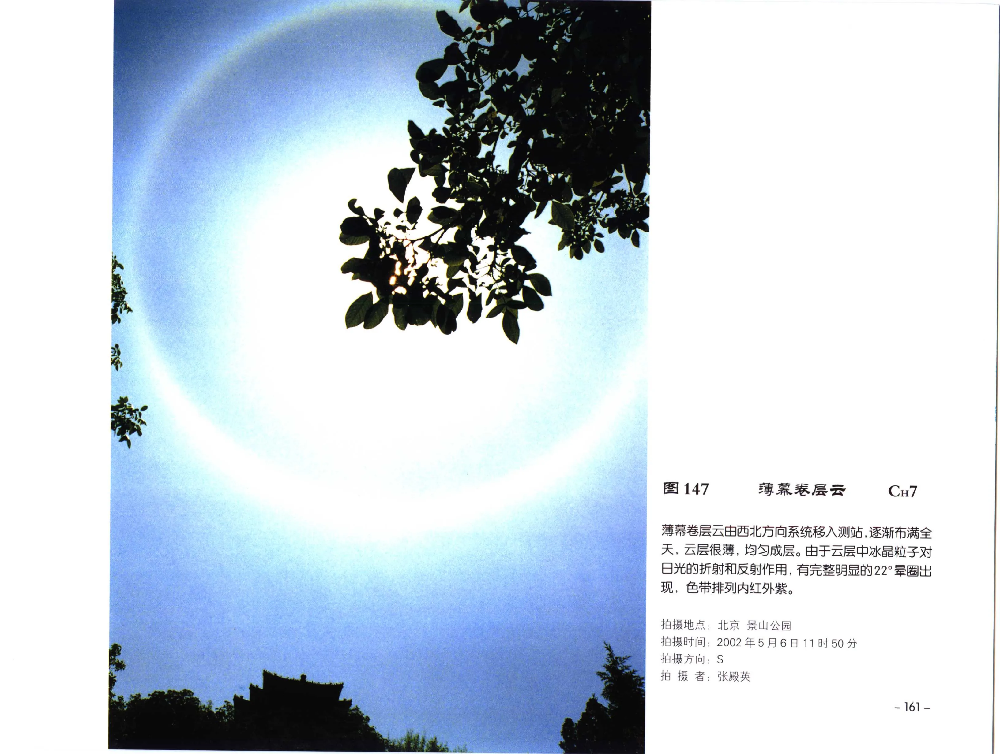

# 薄幕卷层云

**一句话识别**：薄幕卷层云是均匀、很薄的高空冰晶云幕，常能产生 22 度晕。

图 147 中云层很薄、均匀成幕，并出现完整明显的 22 度晕；晕来自冰晶折射，是识别薄幕卷层云的重要线索。

## 属于哪里

| 项目 | 内容 |
| --- | --- |
| 云族 | [高云](high-clouds.md) |
| 云属 | 卷层云 |
| 云类 | 薄幕卷层云 |
| 简写 / 代码 | Cs nebu / `CH7` |
| 拉丁名 | Cirrostratus nebulosus |

## 形态特征

- 均匀、薄、成幕，纤维结构不明显。
- 可布满全天，天空呈乳白或淡白。
- 常伴 22 度晕、幻日等冰晶光象。

## 形成机制

高空冰晶云层大范围铺展，冰晶形状和取向适合折射日光或月光时，可产生晕族光象。

## 天气意义

薄幕卷层云系统性移入并增厚时，可能是高空云系发展信号。它本身不直接等于降水预报，需要看后续是否降低、增厚。

## 与相似云的区别

| 相似云 | 区别 |
| --- | --- |
| [毛卷层云](cirrostratus-fibratus.md) | 毛卷层云纤维结构和厚薄变化更明显。 |
| 透光高层云 | 透光高层云更灰、更厚，太阳轮廓模糊，典型晕较少。 |
| 薄雾或霾 | 雾霾属于近地能见度现象，不是高空冰晶云幕。 |

## 《中国云图》图版来源

- [高云图版：卷层云与卷积云](china-cloud-atlas/plates/high-clouds-cirrostratus-cirrocumulus.md)：图 147。
- 本页主图：图 147，PDF 第 173 页。

## 相关页面

[高云总览](high-clouds.md) · [毛卷层云](cirrostratus-fibratus.md) · [云与天气现象](weather-phenomena.md)
