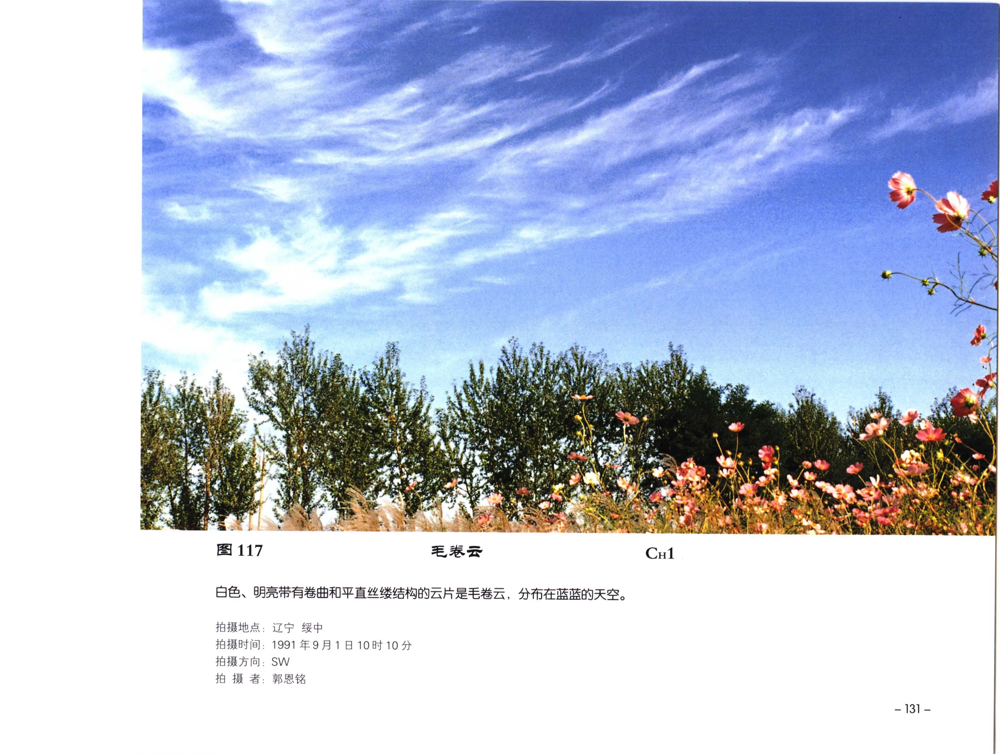

# 毛卷云

**一句话识别**：毛卷云是高空白色丝缕状卷云，像羽毛、马尾或被高空风拉长的细发。

图 117 中云体白而明亮，既有卷曲也有较平直的丝缕结构，分散在蓝天中；这种清楚的冰晶纤维感是毛卷云最可靠的入口特征。

## 属于哪里

| 项目 | 内容 |
| --- | --- |
| 云族 | [高云](high-clouds.md) |
| 云属 | 卷云 |
| 云类 | 毛卷云 |
| 简写 / 代码 | Ci fil / `CH1` |
| 拉丁名 | Cirrus fibratus / filosus 术语待校订 |

## 形态特征

- 白色、细长、丝缕状，边缘有毛丝结构。
- 可像羽毛、马尾或平行云丝。
- 通常无明显阴影，云体较薄。

## 形成机制

高空水汽凝华成冰晶，冰晶下落并被高空风拉伸成丝状。不同高度风速差会让云丝弯曲或散开。

## 天气意义

孤立毛卷云常只是高空湿区的表现。若系统性增多、增厚并逐渐铺展成卷层云，可能提示天气系统接近。

## 与相似云的区别

| 相似云 | 区别 |
| --- | --- |
| [钩卷云](cirrus-uncinus.md) | 钩卷云一端明显弯曲成钩状。 |
| [密卷云](cirrus-spissatus.md) | 密卷云更厚，成团、片或条状，常有雪幡。 |
| [毛卷层云](cirrostratus-fibratus.md) | 毛卷层云是薄幕状云层，覆盖范围更连续。 |

## 《中国云图》图版来源

- [高云图版：卷云](china-cloud-atlas/plates/high-clouds-cirrus.md)：图 117-124。
- 本页主图：图 117，PDF 第 143 页。

## 相关页面

[高云总览](high-clouds.md) · [密卷云](cirrus-spissatus.md) · [钩卷云](cirrus-uncinus.md) · [毛卷层云](cirrostratus-fibratus.md)
