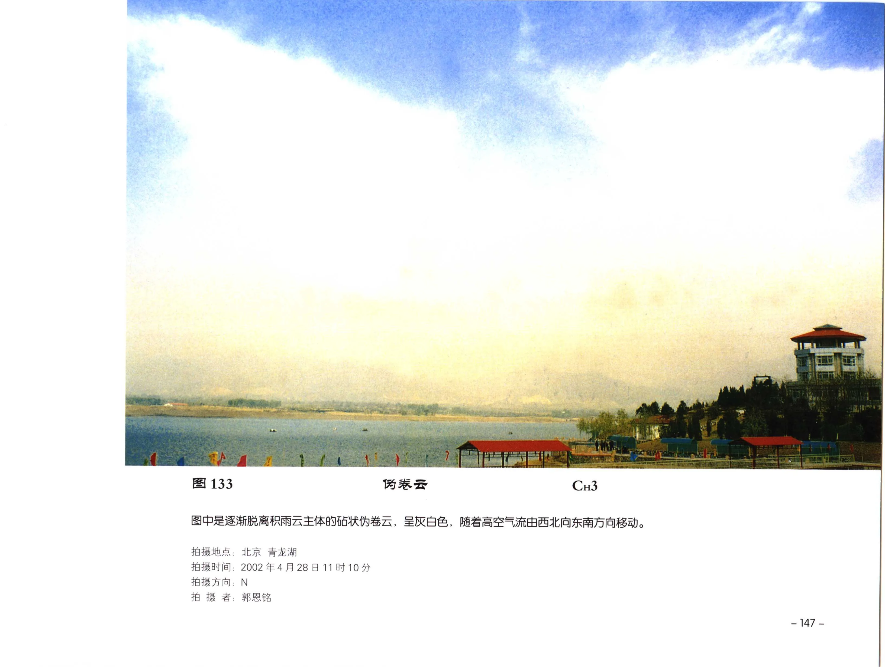

# 伪卷云

**一句话识别**：伪卷云是积雨云云砧或冰晶化云顶脱离母体后留下的卷云，常保留砧状残余的生成痕迹。

图 133 中砧状高云正逐渐脱离积雨云主体，随高空气流移动；这种“来自积雨云云砧”的历史，是伪卷云区别于普通密卷云的关键。

## 属于哪里

| 项目 | 内容 |
| --- | --- |
| 云族 | [高云](high-clouds.md) |
| 云属 | 卷云 |
| 云类 | 伪卷云 |
| 简写 / 代码 | Ci not / `CH3` |
| 拉丁名 | Cirrus spissatus cumulonimbogenitus / nothus 术语待校订 |

## 形态特征

- 可保留砧状、片状或伸展残余。
- 边缘逐渐出现卷云纤维结构。
- 常出现在雷阵雨后、积雨云消散后或积雨云下风侧。

## 形成机制

积雨云云顶冰晶化后形成云砧。云砧脱离低层对流主体，继续在高空风中伸展、变形，就形成伪卷云。

## 天气意义

伪卷云提示附近或上游曾有积雨云活动。它本身是高云残余，但可帮助回溯强对流发生位置和移动方向。

## 与相似云的区别

| 相似云 | 区别 |
| --- | --- |
| [密卷云](cirrus-spissatus.md) | 密卷云不一定与积雨云云砧有关；伪卷云依赖生成史。 |
| [鬃积雨云](cumulonimbus-capillatus.md) | 鬃积雨云仍有完整或可见的低层对流主体和降水结构。 |
| [毛卷层云](cirrostratus-fibratus.md) | 毛卷层云更成幕状，生成史不一定来自积雨云。 |

## 《中国云图》图版来源

- [高云图版：卷云](china-cloud-atlas/plates/high-clouds-cirrus.md)：图 133-136。
- 本页主图：图 133，PDF 第 159 页。

## 相关页面

[高云总览](high-clouds.md) · [密卷云](cirrus-spissatus.md) · [鬃积雨云](cumulonimbus-capillatus.md) · [积云与积雨云](cumulus-cumulonimbus.md)
