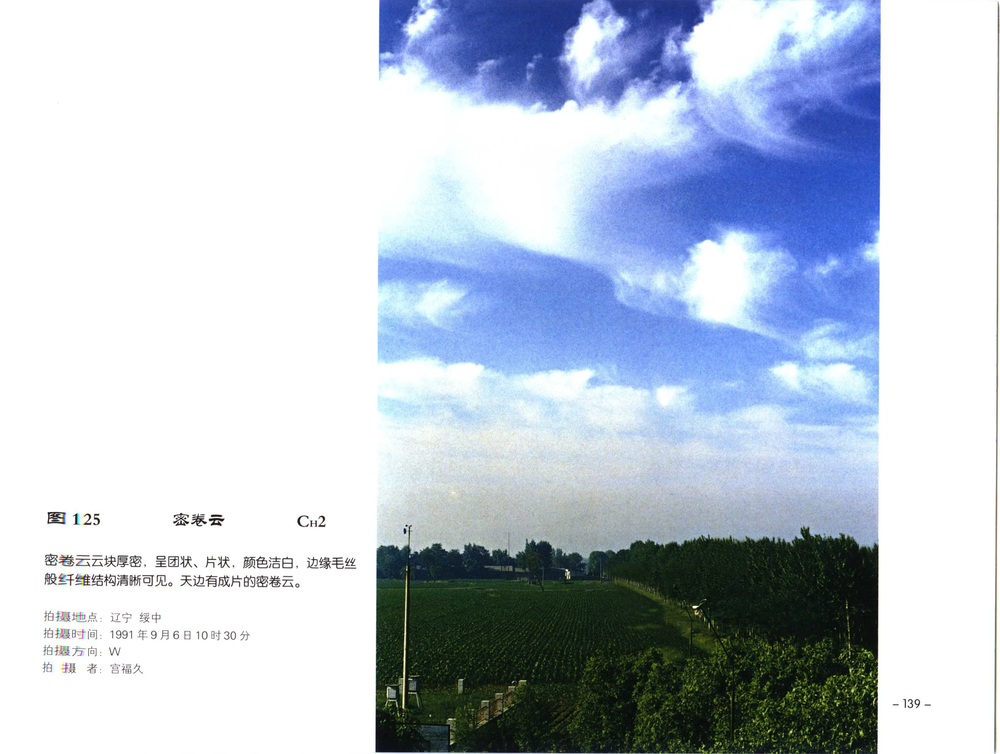

# 密卷云

**一句话识别**：密卷云是较厚密的卷云，呈团状、片状或长条状，但边缘仍保留冰晶纤维。

图 125 的云块比毛卷云厚得多，呈团片状；但它的边缘仍有卷云式纤维结构，所以不是高积云。

## 属于哪里

| 项目 | 内容 |
| --- | --- |
| 云族 | [高云](high-clouds.md) |
| 云属 | 卷云 |
| 云类 | 密卷云 |
| 简写 / 代码 | Ci dens / `CH2` |
| 拉丁名 | Cirrus spissatus / densus 术语待校订 |

## 形态特征

- 云体较厚，呈团状、片状或条状。
- 白色或灰白，厚处可发暗。
- 边缘仍有毛丝状冰晶结构，可有雪幡。

## 形成机制

密卷云可由高空冰晶云块增厚、合并形成，也可由其他高云演变而来。冰晶下落时会形成雪幡，但通常不及地。

## 天气意义

密卷云说明高空云量和厚度较大；若伴随卷层云、高层云系统性发展，可作为天气系统推进的线索。

## 与相似云的区别

| 相似云 | 区别 |
| --- | --- |
| [毛卷云](cirrus-fibratus.md) | 毛卷云更细、更丝缕状，厚云块少。 |
| 高积云 | 高积云由中云小云块构成，常有水滴云块阴影而非纤维边缘。 |
| [卷积云](cirrocumulus.md) | 卷积云由更小、更白的颗粒或波纹组成。 |

## 《中国云图》图版来源

- [高云图版：卷云](china-cloud-atlas/plates/high-clouds-cirrus.md)：图 125-132。
- 本页主图：图 125，PDF 第 151 页。

## 相关页面

[高云总览](high-clouds.md) · [毛卷云](cirrus-fibratus.md) · [伪卷云](cirrus-spissatus-cumulonimbogenitus.md) · [卷积云](cirrocumulus.md)
