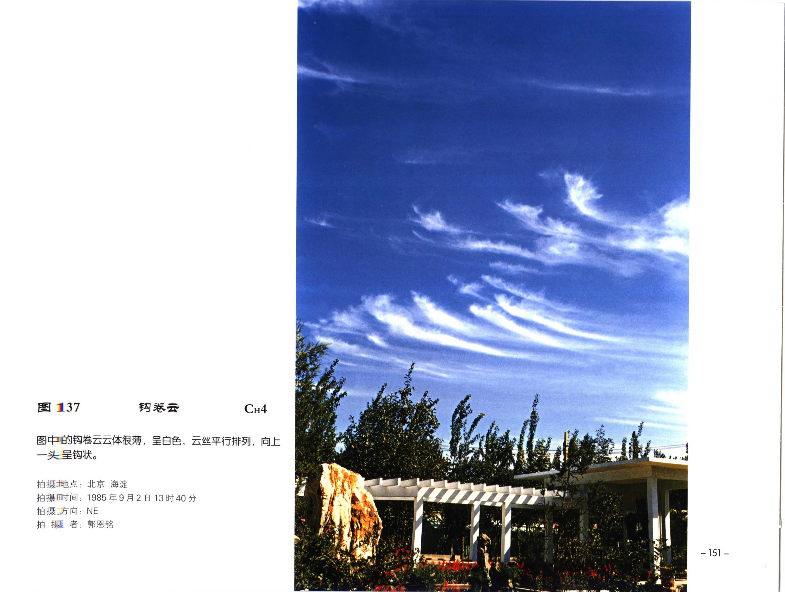

# 钩卷云

**一句话识别**：钩卷云是一端弯曲成钩状、逗号状或马尾状的细长卷云。

图 137 的云体很薄，云丝平行排列，末端明显卷曲成钩；这比普通毛卷云多了“下落冰晶被风切变拉出钩端”的形态信号。

## 属于哪里

| 项目 | 内容 |
| --- | --- |
| 云族 | [高云](high-clouds.md) |
| 云属 | 卷云 |
| 云类 | 钩卷云 |
| 简写 / 代码 | Ci unc / `CH4` |
| 拉丁名 | Cirrus uncinus |

## 形态特征

- 云丝细长、洁白，常平行或成行。
- 一端较密并卷曲成钩状或逗号状。
- 常带“马尾”式下垂和弯曲外观。

## 形成机制

高空冰晶下落时穿过不同风速或风向层，云丝被拉伸并弯曲。钩端通常记录了冰晶降落和风切变共同作用。

## 天气意义

钩卷云可显示高空湿度和风切变。大量、系统性出现并伴随卷层云增厚时，应继续观察后续云系变化。

## 与相似云的区别

| 相似云 | 区别 |
| --- | --- |
| [毛卷云](cirrus-fibratus.md) | 毛卷云以丝缕为主，不一定有明确钩端。 |
| [密卷云](cirrus-spissatus.md) | 密卷云更厚、更成片或团状。 |
| [卷积云](cirrocumulus.md) | 卷积云是颗粒或波纹状小云块，不是钩状丝缕。 |

## 《中国云图》图版来源

- [高云图版：卷云](china-cloud-atlas/plates/high-clouds-cirrus.md)：图 137-141。
- 本页主图：图 137，PDF 第 163 页。

## 相关页面

[高云总览](high-clouds.md) · [毛卷云](cirrus-fibratus.md) · [密卷云](cirrus-spissatus.md) · [毛卷层云](cirrostratus-fibratus.md)
