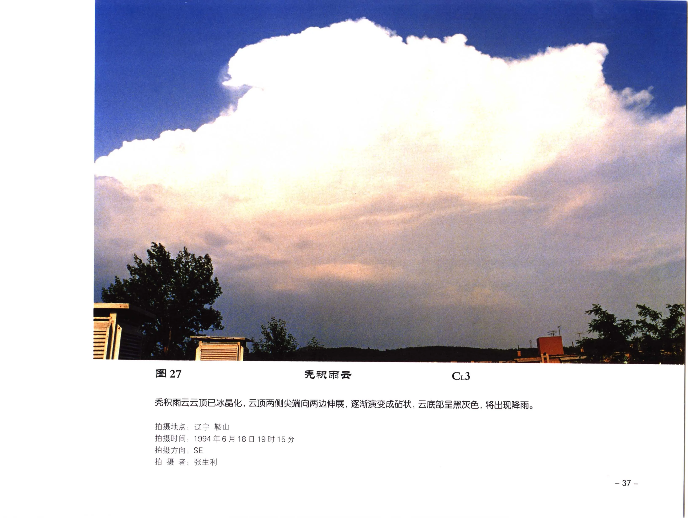

# 秃积雨云

**一句话识别**：秃积雨云是积雨云的早期成熟阶段，云顶已开始冰晶化，轮廓由清晰云泡转为模糊、平滑或外展。

图 27 中云体庞大，云顶不再是浓积云那种清楚的花椰菜泡体，两侧开始向外伸展；云底黑灰并将降雨，说明它已经越过浓积云阶段。

## 属于哪里

| 项目 | 内容 |
| --- | --- |
| 云族 | [低云](low-clouds.md)，但云体可贯穿多高度层 |
| 云属 | 积雨云 |
| 云类 | 秃积雨云 |
| 简写 / 代码 | Cb calv / `CL3` |
| 拉丁名 | Cumulonimbus calvus |

## 形态特征

- 云体高大厚重，云底黑灰。
- 云顶开始冰晶化，轮廓变模糊或平滑。
- 尚未形成明显毛丝状、鬃状或完整砧状云顶。

## 形成机制

秃积雨云通常由 [浓积云](cumulus-congestus.md) 继续增强而来。强上升气流把云顶推到低温高度，云滴开始冻结并转为冰晶结构。

## 天气意义

它标志对流已进入积雨云阶段，可伴阵雨或雷雨。若云顶继续外展并出现毛丝状、砧状结构，就会向 [鬃积雨云](cumulonimbus-capillatus.md) 发展。

## 与相似云的区别

| 相似云 | 区别 |
| --- | --- |
| [浓积云](cumulus-congestus.md) | 浓积云云顶泡体仍清楚，未明显冰晶化。 |
| [鬃积雨云](cumulonimbus-capillatus.md) | 鬃积雨云有明显毛丝、鬃状或砧状云顶。 |
| [雨层云](nimbostratus.md) | 雨层云是大范围层状降水云，缺少高耸对流主体。 |

## 《中国云图》图版来源

- [低云图版：浓积云与积雨云](china-cloud-atlas/plates/low-clouds-cumulonimbus.md)：图 27-28。
- 本页主图：图 27，PDF 第 49 页。

## 相关页面

[低云总览](low-clouds.md) · [积云与积雨云](cumulus-cumulonimbus.md) · [浓积云](cumulus-congestus.md) · [鬃积雨云](cumulonimbus-capillatus.md)
