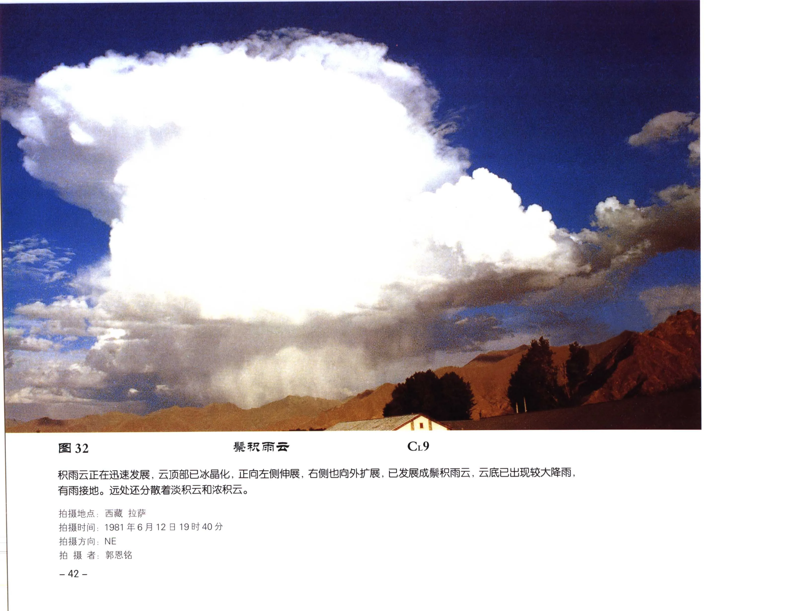

# 鬃积雨云

**一句话识别**：鬃积雨云是成熟积雨云，云顶冰晶化后呈毛丝状、鬃状或砧状，常伴雷雨、大风、冰雹或强阵雨。

图 32 中云顶已经明显冰晶化并向两侧扩展，下方有较大降雨；这种“高耸主体 + 毛丝状或砧状顶部 + 降水结构”的组合，是鬃积雨云的核心识别线索。

## 属于哪里

| 项目 | 内容 |
| --- | --- |
| 云族 | [低云](low-clouds.md)，但成熟云体可伸入中云和高云高度 |
| 云属 | 积雨云 |
| 云类 | 鬃积雨云 |
| 简写 / 代码 | Cb cap / `CL9` |
| 拉丁名 | Cumulonimbus capillatus |

## 形态特征

- 云体庞大，云底常黑暗、混乱或有降水带。
- 云顶毛丝状、鬃状，常水平展开成云砧。
- 可出现雨幡、降水带、泄雹带、悬球状云底等附属结构。

## 形成机制

强上升气流把云顶推到冰晶高度后，云顶在高空风作用下被拉伸、外展，形成鬃状或砧状结构。云内上升、下沉气流并存，支持强降水和冰雹增长。

## 天气意义

鬃积雨云常与雷雨、短时大风、强阵雨、冰雹相关。观测时应记录云体移动方向、云砧伸展方向、降水带是否接地、是否闻雷或见闪电。

## 与相似云的区别

| 相似云 | 区别 |
| --- | --- |
| [秃积雨云](cumulonimbus-calvus.md) | 秃积雨云云顶刚开始冰晶化，毛丝状结构尚不充分。 |
| [伪卷云](cirrus-spissatus-cumulonimbogenitus.md) | 伪卷云是积雨云云砧脱离母体后的高云残余，通常看不到完整低层对流主体。 |
| [浓积云](cumulus-congestus.md) | 浓积云云顶仍是清楚水滴泡体，未形成云砧。 |

## 《中国云图》图版来源

- [低云图版：浓积云与积雨云](china-cloud-atlas/plates/low-clouds-cumulonimbus.md)：图 29-38。
- [低云图版：积雨云降水与云砧](china-cloud-atlas/plates/low-clouds-cumulonimbus-precipitation.md)：图 39-52。
- 本页主图：图 32，PDF 第 54 页。

## 相关页面

[低云总览](low-clouds.md) · [积云与积雨云](cumulus-cumulonimbus.md) · [秃积雨云](cumulonimbus-calvus.md) · [伪卷云](cirrus-spissatus-cumulonimbogenitus.md)
