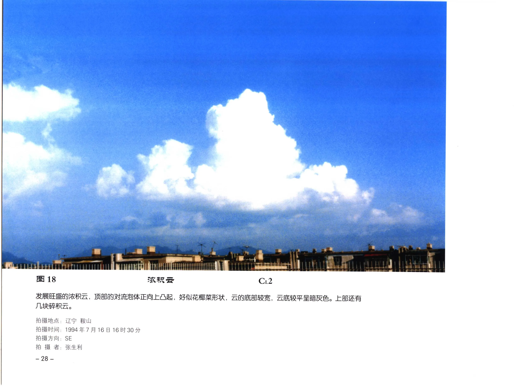

# 浓积云

**一句话识别**：浓积云是垂直发展旺盛的积云，云顶像花椰菜，云底常较暗，是积雨云前阶段的重要信号。

图 18 的云顶由清楚的对流泡体向上堆叠，外观像花椰菜；云底暗灰，说明云体厚度已经明显增大，但顶部仍主要是清晰水滴云泡，尚未进入秃积雨云的冰晶化外观。

## 属于哪里

| 项目 | 内容 |
| --- | --- |
| 云族 | [低云](low-clouds.md) |
| 云属 | 积云 |
| 云类 | 浓积云 |
| 简写 / 代码 | Cu cong / `CL2` |
| 拉丁名 | Cumulus congestus |

## 形态特征

- 云体高大，垂直厚度明显增加。
- 云顶泡状、塔状、花椰菜状，轮廓清楚。
- 云底较平且暗，强发展时可有雨幡或帽状云。

## 形成机制

强热力对流、地形抬升、冷锋前沿或低压系统可触发浓积云。云内上升气流越强，云顶越容易快速增高；若云顶达到足够低温并冰晶化，就可能转为积雨云。

## 天气意义

浓积云提示对流增强。若云顶继续拔高、云底变黑并出现雨幡，可能很快转为 [秃积雨云](cumulonimbus-calvus.md) 或 [鬃积雨云](cumulonimbus-capillatus.md)，伴阵雨、雷雨或冰雹风险。

## 与相似云的区别

| 相似云 | 区别 |
| --- | --- |
| [淡积云](cumulus-humilis.md) | 淡积云浅薄，水平宽度通常大于垂直厚度。 |
| [秃积雨云](cumulonimbus-calvus.md) | 秃积雨云云顶开始变模糊、平滑或冰晶化。 |
| 堡状高积云 | 堡状高积云处在中云高度，云体尺度较小，常有较连续的云层基部。 |

## 《中国云图》图版来源

- [低云图版：积云](china-cloud-atlas/plates/low-clouds-cumulus.md)：图 17-18。
- [低云图版：浓积云与积雨云](china-cloud-atlas/plates/low-clouds-cumulonimbus.md)：图 19-26。
- 本页主图：图 18，PDF 第 40 页。

## 相关页面

[低云总览](low-clouds.md) · [积云与积雨云](cumulus-cumulonimbus.md) · [秃积雨云](cumulonimbus-calvus.md) · [鬃积雨云](cumulonimbus-capillatus.md)
