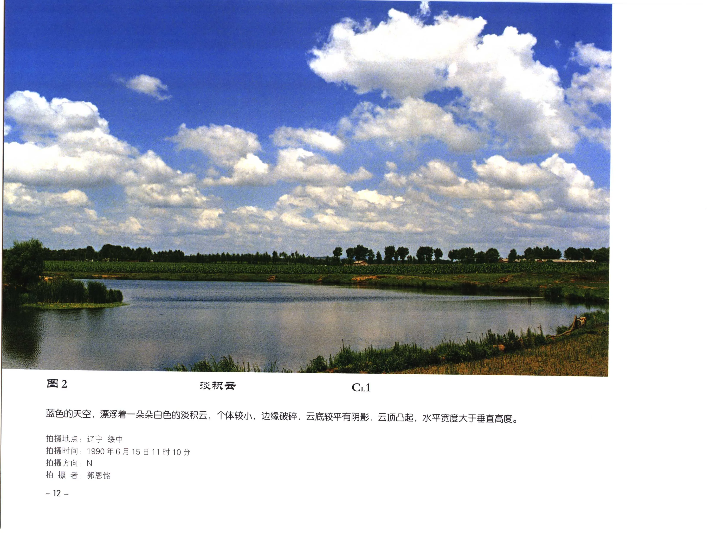

# 淡积云

**一句话识别**：淡积云是低空小而完整的积云，云底较平，云顶圆钝，通常水平宽度大于垂直厚度。

图 2 的云块个体小、边缘略破碎，但云底仍较平，云顶有圆弧形凸起；这正是弱对流阶段淡积云的典型外观，而不是已经高耸发展的浓积云。

## 属于哪里

| 项目 | 内容 |
| --- | --- |
| 云族 | [低云](low-clouds.md) |
| 云属 | 积云 |
| 云类 | 淡积云 |
| 简写 / 代码 | Cu hum / `CL1` |
| 拉丁名 | Cumulus humilis |

## 形态特征

- 白色云块清楚，背光侧或云底有阴影。
- 云底常接近同一高度，顶部圆钝或轻微凸起。
- 垂直发展弱，常散布在蓝天中，日变化明显。

## 形成机制

淡积云多由低层空气受日照加热、山地抬升、海陆风或局地辐合抬升后冷却凝结形成。上升气流较弱时，云体只形成浅薄的积状凸起。

## 天气意义

单独出现时多对应晴好或弱对流天气。若午后云体迅速增厚、云顶变成花椰菜状，应继续观察是否向 [浓积云](cumulus-congestus.md) 发展。

## 与相似云的区别

| 相似云 | 区别 |
| --- | --- |
| [碎积云](fractocumulus.md) | 碎积云更破碎、轮廓不完整，形状变化更快。 |
| [浓积云](cumulus-congestus.md) | 浓积云垂直发展强，云顶高耸，云底更暗。 |
| [积云性层积云](stratocumulus-cumulogenitus.md) | 积云性层积云更成片或成长条，由积云平衍、衰退形成。 |

## 《中国云图》图版来源

- [低云图版：积云](china-cloud-atlas/plates/low-clouds-cumulus.md)：图 2-5、8-16。
- 本页主图：图 2，PDF 第 24 页。

## 相关页面

[低云总览](low-clouds.md) · [积云与积雨云](cumulus-cumulonimbus.md) · [碎积云](fractocumulus.md) · [浓积云](cumulus-congestus.md)
