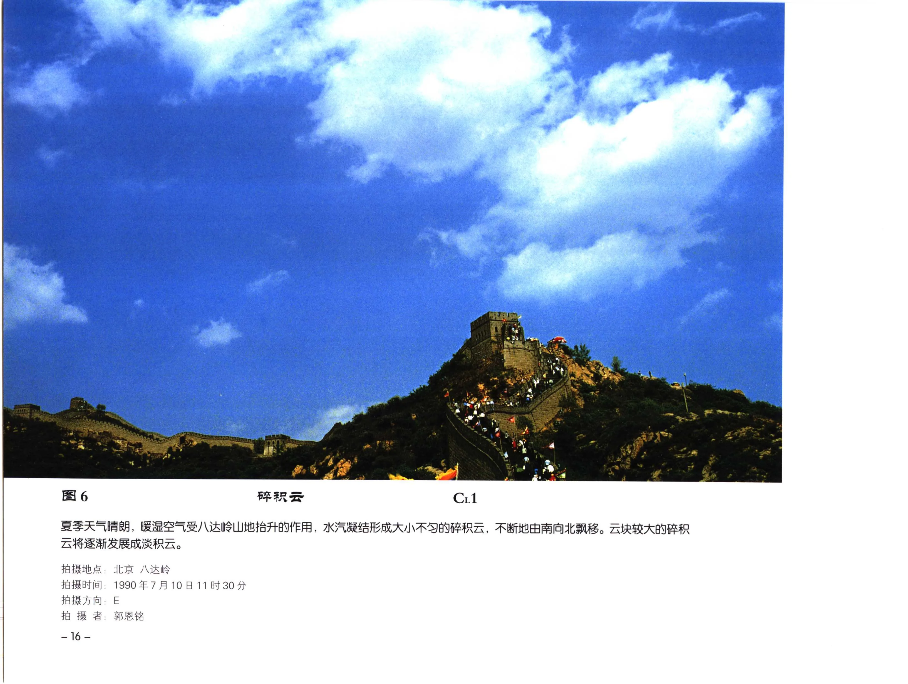

# 碎积云

**一句话识别**：碎积云是破碎、不规则、变化快的小积云云块，常是积云初生、破裂或局地湍流的表现。

图 6 中云块零散、不完整，较大云块正可能向淡积云发展；山地抬升提供了持续的弱上升气流，所以它不是均匀成层的碎层云。

## 属于哪里

| 项目 | 内容 |
| --- | --- |
| 云族 | [低云](low-clouds.md) |
| 云属 | 积云 |
| 云类 | 碎积云 |
| 简写 / 代码 | Fc / `CL1` |
| 拉丁名 | Fractocumulus |

## 形态特征

- 云块边缘破碎，大小不一，轮廓不完整。
- 形状变化快，可逐渐长大成淡积云，也可很快消散。
- 常出现在山地、海面弱对流、清晨或对流初生阶段。

## 形成机制

碎积云常由弱热力对流、山地抬升、局地湍流或原有积云破碎产生。若低层水汽和上升气流增强，破碎云块可并合为 [淡积云](cumulus-humilis.md)。

## 天气意义

单独出现时多不代表显著天气；若出现在积雨云或降水云底附近，要警惕它可能其实是碎雨云或降水云底附属低云。

## 与相似云的区别

| 相似云 | 区别 |
| --- | --- |
| [淡积云](cumulus-humilis.md) | 淡积云个体更完整，云底更平。 |
| [碎层云](fractostratus.md) | 碎层云更贴近层云、山坡或雾抬升背景，积状凸起较弱。 |
| [雨层云](nimbostratus.md) 下的碎雨云 | 碎雨云位于降水云底，常随雨雪出现，更暗且漫无定形。 |

## 《中国云图》图版来源

- [低云图版：积云](china-cloud-atlas/plates/low-clouds-cumulus.md)：图 6、7、10、15。
- 本页主图：图 6，PDF 第 28 页。

## 相关页面

[低云总览](low-clouds.md) · [积云与积雨云](cumulus-cumulonimbus.md) · [淡积云](cumulus-humilis.md) · [碎层云](fractostratus.md)
