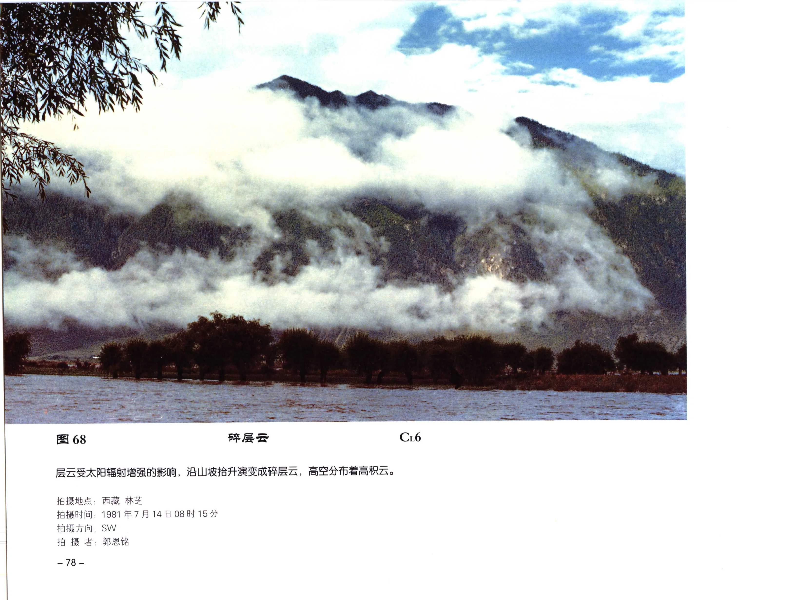

# 碎层云

**一句话识别**：碎层云是层云破碎后的低矮云片，常贴近山坡、谷地或层云消散区，形态短暂而不规则。

图 68 中层云受太阳辐射增强影响后沿山坡抬升、破碎，形成低而散乱的云片；它的背景是层云破裂，不是积云初生，因此归入碎层云。

## 属于哪里

| 项目 | 内容 |
| --- | --- |
| 云族 | [低云](low-clouds.md) |
| 云属 | 层云 |
| 云类 | 碎层云 |
| 简写 / 代码 | Fs / `CL6` |
| 拉丁名 | Fractostratus |

## 形态特征

- 低矮、破碎、边界不规则。
- 常贴近山坡、谷地或原层云云底。
- 变化快，可消散，也可重新并合为层云或层积云。

## 形成机制

层云受日照加热、湍流或地形抬升影响后破裂；饱和空气沿山坡缓慢抬升，也可生成碎层云。

## 天气意义

可表示层云正在消散，也可提示山地或近地层仍潮湿。若位于雨层云或积雨云云底并伴降水，应优先考虑碎雨云。

## 与相似云的区别

| 相似云 | 区别 |
| --- | --- |
| [碎积云](fractocumulus.md) | 碎积云更有积状凸起，常处于积云发展链条中。 |
| [层云](stratus.md) | 层云更均匀连续，破碎程度低。 |
| 碎雨云 | 碎雨云依附降水云底，常随雨雪出现。 |

## 《中国云图》图版来源

- [低云图版：层云与雨层云](china-cloud-atlas/plates/low-clouds-stratus-nimbostratus.md)：图 68。
- 本页主图：图 68，PDF 第 90 页。

## 相关页面

[低云总览](low-clouds.md) · [层状云](layered-clouds.md) · [层云](stratus.md) · [碎积云](fractocumulus.md)
