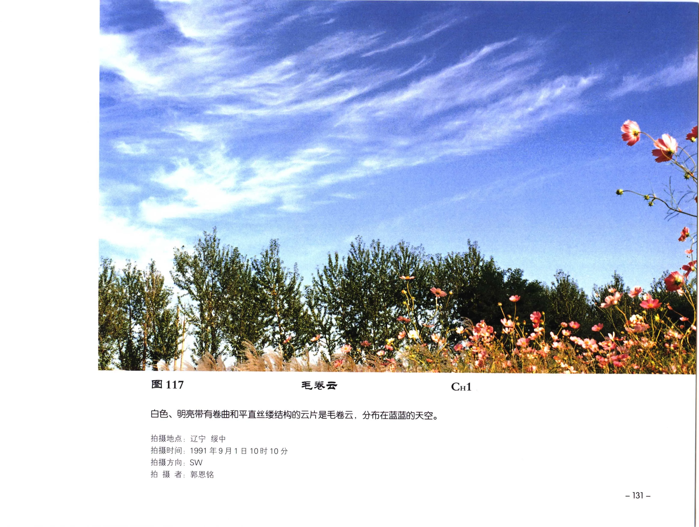

# 高云

## 定义

高云通常位于 5000 米以上，高原地区可较低。高云多由微小冰晶组成，常呈白色、纤维状、薄幕状或细小波纹状。

## 分类

| 云属 | 云类 | 识别关键词 |
| --- | --- | --- |
| 卷云 Ci | 毛卷云、密卷云、伪卷云、钩卷云 | 丝缕、羽毛、马尾、钩状或砧状残余 |
| 卷层云 Cs | 毛卷层云、薄幕卷层云 | 薄幕状，常产生晕 |
| 卷积云 Cc | 卷积云 | 小白云块，鱼鳞片或细波纹状 |

## 识别特征

卷云有明显毛丝般纤维结构。卷层云成层较均匀，日月轮廓清楚，常伴随晕圈。卷积云云块很小，成群、成行排列，像细小鱼鳞或水面微波。

## 形成机制

高云主要由高空冰晶构成。卷云可由高空水汽凝华形成，也可由积雨云云砧脱离后演变成伪卷云。卷积云常与高空大气层结不稳定和波动有关。

## 天气意义

孤立毛卷云常见于晴天。若卷云、卷层云系统性移入并逐渐增厚、降低，通常提示天气系统接近。卷层云中出现日晕或月晕时，需要继续观察云量和厚度变化，不能仅凭晕圈下结论。

## 典型图片

《中国云图》图 117：毛卷云，白色明亮，带卷曲和平直丝缕结构。

## 来源

- 《中国云图》“云的特征：高云”。
- [高云图版：卷云](china-cloud-atlas/plates/high-clouds-cirrus.md)。
- [高云图版：卷层云与卷积云](china-cloud-atlas/plates/high-clouds-cirrostratus-cirrocumulus.md)。
