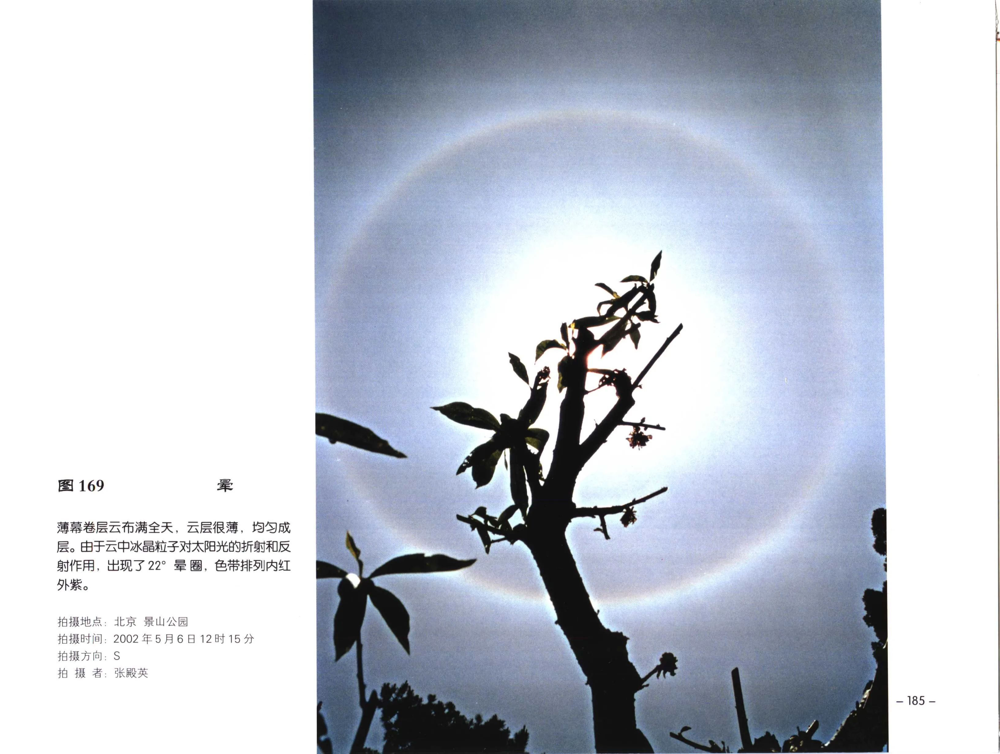

# 层状云

## 范围

层状云不是单一云属，而是一组以水平铺展、云层覆盖为主要特征的云。本页汇总层积云、层云、雨层云、高层云和卷层云。

## 分类

| 云类群 | 高度 | 主要特征 |
| --- | --- | --- |
| 层积云 Sc | 低云 | 片状、团状或条状，厚薄不均，可透光或蔽光 |
| 层云 St | 低云 | 低而均匀，类似雾但不接地 |
| 雨层云 Ns | 低云 | 厚而暗，常覆盖全天并产生连续性降水 |
| 高层云 As | 中云 | 灰白或灰色云幕，可透出模糊日月 |
| 卷层云 Cs | 高云 | 乳白薄幕，常有晕 |

## 识别特征

层状云应重点观察透光性和云底结构。薄的层积云或高层云可辨认日月位置；厚的蔽光层积云、高层云和雨层云则遮蔽日月。卷层云虽高而薄，但常因冰晶折射产生晕圈。

## 形成机制

层状云多与稳定层结、大范围抬升、辐射冷却、湍流混合或波动有关。雨层云常与锋面抬升和连续性降水相连；卷层云系统性增厚时，常是高空云系向测站推进的信号。

## 天气意义

层云有时只带来毛毛雨或低能见度；雨层云常对应连绵降水；高层云增厚降低可能进入降水云系；卷层云伴随晕圈并持续增厚时，需关注后续天气系统。

## 典型图片

《中国云图》图 169：薄幕卷层云布满全天，太阳光经冰晶折射和反射形成晕圈。

## 来源

- 《中国云图》“云的特征：层积云、层云、雨层云、高层云、卷层云”。
- [天气现象图版：光象](china-cloud-atlas/plates/weather-optical-phenomena.md)。
