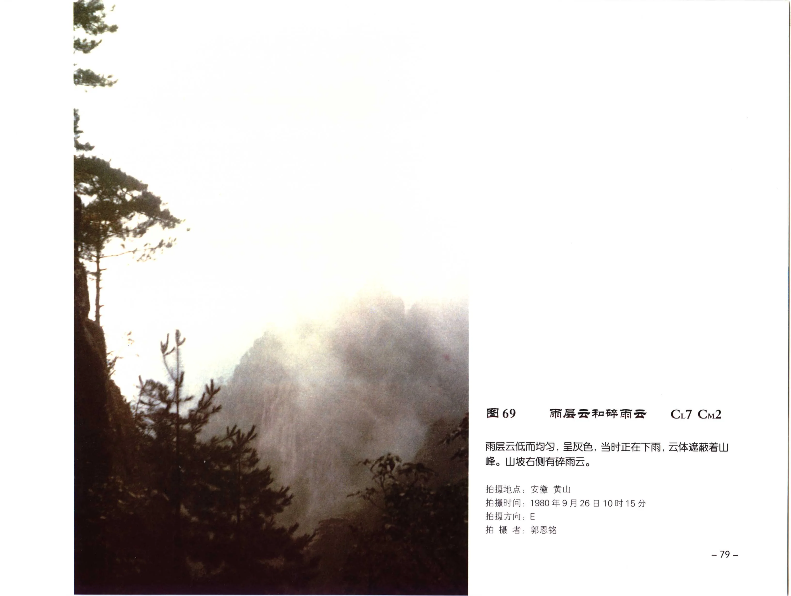

# 雨层云

**一句话识别**：雨层云是厚而暗、范围广、常产生连续性降雨或降雪的云层，云底可有破碎湿云。

图 69 中山体被低而均匀的雨层云遮蔽，正在下雨，山坡右侧还有碎雨云；连续降水和厚暗云幕是判断雨层云的关键。

## 属于哪里

| 项目 | 内容 |
| --- | --- |
| 云族 | [低云](low-clouds.md) / 多云族 |
| 云属 | 雨层云 |
| 云类 | 雨层云 |
| 简写 / 代码 | Ns / `CL7`、`CM2` 或并列 |
| 拉丁名 | Nimbostratus |

## 形态特征

- 云层厚、暗、范围大，常布满全天。
- 云底低而阴暗，山地或远处地物常被遮蔽。
- 常伴连续性降雨或降雪，下方可有碎雨云。

## 形成机制

雨层云多来自锋面或大范围抬升过程，中低层湿空气深厚，云层可贯穿多个高度层，所以不宜只按单一“低云高度”理解。

## 天气意义

雨层云是连续性降水的重要云类。它带来的降水通常比积雨云更稳定、更持久，雷电和强阵风特征不明显。

## 与相似云的区别

| 相似云 | 区别 |
| --- | --- |
| [蔽光层积云](stratocumulus-opacus.md) | 蔽光层积云仍有块状结构，降水通常弱或零星。 |
| 蔽光高层云 | 高层云较高，未必有明确降水；雨层云更厚暗并常在降水中。 |
| [鬃积雨云](cumulonimbus-capillatus.md) | 积雨云降水阵性强，常有高耸主体、云砧、雷电。 |

## 《中国云图》图版来源

- [低云图版：层云与雨层云](china-cloud-atlas/plates/low-clouds-stratus-nimbostratus.md)：图 69-75。
- 本页主图：图 69，PDF 第 91 页。

## 相关页面

[低云总览](low-clouds.md) · [层状云](layered-clouds.md) · [层云](stratus.md) · [蔽光层积云](stratocumulus-opacus.md)
