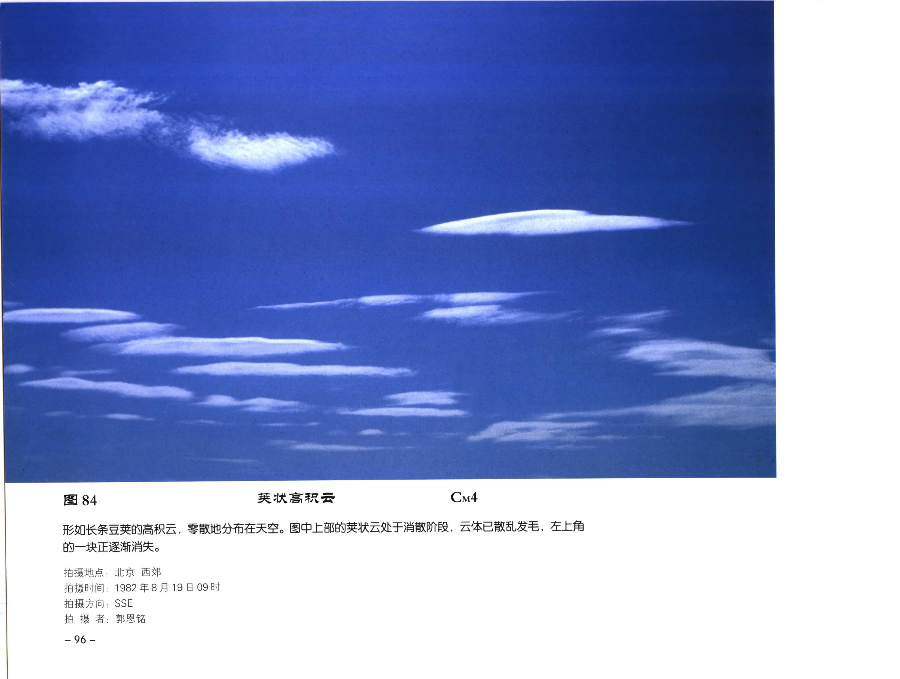

# 特殊云形

## 范围

特殊云形指在常规云属之外，因对流、地形、波动、强风、降水或人类活动而呈现的特殊形态。它们通常不能脱离母云单独判断，需要同时记录云属、环境和演变。

## 常见类型

| 云形 | 常见关联 | 识别要点 |
| --- | --- | --- |
| 堡状云 | 层积云、高积云 | 云条顶部有城堡状凸起，提示不稳定增强 |
| 荚状云 | 层积云、高积云 | 豆荚或透镜状，中间厚、边缘薄，常与地形波有关 |
| 悬球状云底 | 积雨云 | 云底下垂圆球状，常见于强对流云底 |
| 雨幡、雪幡 | 积雨云、高积云、密卷云等 | 降水粒子下落但可能未及地 |
| 旗云 | 山地云 | 山峰附近云体被强风拉伸，形似旗帜 |
| 飞机尾迹 | 高空飞行 | 飞机排放水汽和粒子在适宜条件下形成白色尾迹 |

## 形成机制

堡状云和絮状云常与不稳定层结和湍流有关。荚状云多由地形波或稳定层中的驻波形成。悬球状云底与积雨云中上升、下沉气流的相互作用有关。飞机尾迹则与高空低温、高湿环境和飞机排放有关。

## 天气意义

堡状高积云、堡状层积云可能提示局地不稳定增强。荚状云本身不一定意味着降水，但显示上空存在波动和较强气流。悬球状云底应结合积雨云状态关注强对流天气。

## 典型图片

《中国云图》图 84：荚状高积云，呈长条豆荚状，部分处于消散阶段。

## 来源

- 《中国云图》高积云、层积云、地形云和飞机观测图版。
- [地形云图版](china-cloud-atlas/plates/terrain-clouds.md)。
- [飞机上观测云图](china-cloud-atlas/plates/aircraft-observed-clouds.md)。
