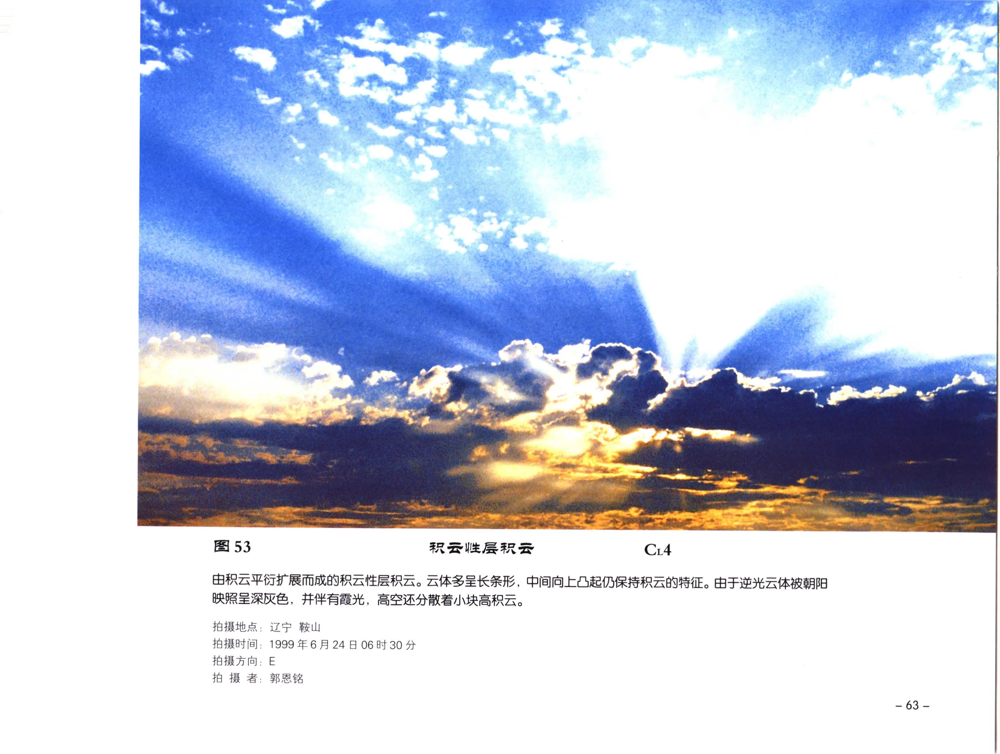

# 积云性层积云

**一句话识别**：积云性层积云由积云平衍、减弱或扩展而成，常成长条或片状，但仍保留积云凸起。

图 53 的云体由积云平衍扩展而来，整体呈长条形，中间仍有向上凸起；这说明它不是普通透光层积云，而是带有积云来源痕迹的层积云。

## 属于哪里

| 项目 | 内容 |
| --- | --- |
| 云族 | [低云](low-clouds.md) |
| 云属 | 层积云 |
| 云类 | 积云性层积云 |
| 简写 / 代码 | Sc cug / `CL4` |
| 拉丁名 | Stratocumulus cumulogenitus |

## 形态特征

- 云体多呈长条形、不规则片状或团块状。
- 云层中仍可见积云状凸起或原积云个体痕迹。
- 云块之间可有缝隙，晨昏逆光下常显深灰。

## 形成机制

积云发展受稳定层限制后水平扩展，或傍晚、清晨积云减弱后平衍、衰退，形成层积云。

## 天气意义

常表示低层对流正在减弱或被稳定层压制。若同场出现高积云、雨幡或其他云层，应分层记录，避免把所有云都归为低云。

## 与相似云的区别

| 相似云 | 区别 |
| --- | --- |
| [淡积云](cumulus-humilis.md) | 淡积云是独立积状云块，不以成层平衍为主。 |
| [透光层积云](stratocumulus-translucidus.md) | 透光层积云未必保留积云凸起或生成史。 |
| 透光高积云 | 高积云云块更小、位置更高。 |

## 《中国云图》图版来源

- [低云图版：层积云](china-cloud-atlas/plates/low-clouds-stratocumulus.md)：图 53-55。
- 本页主图：图 53，PDF 第 75 页。

## 相关页面

[低云总览](low-clouds.md) · [层状云](layered-clouds.md) · [淡积云](cumulus-humilis.md) · [透光层积云](stratocumulus-translucidus.md)
