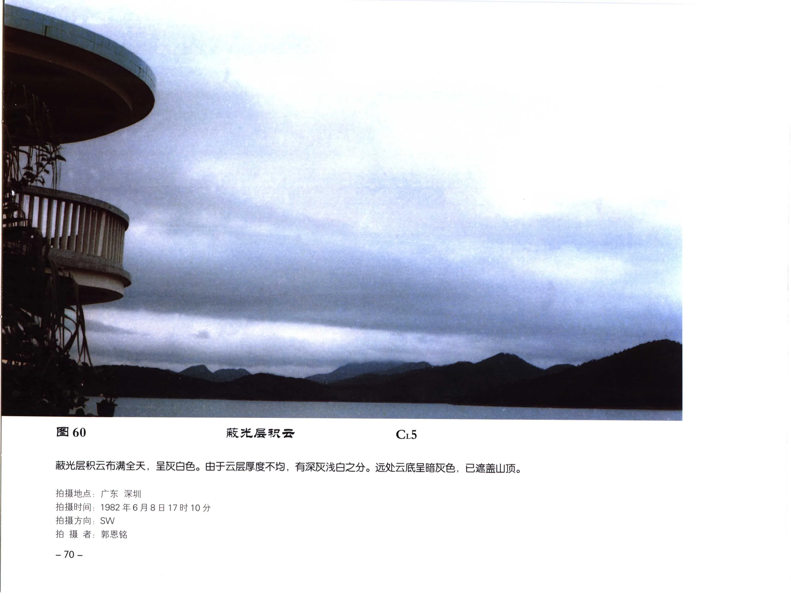

# 蔽光层积云

**一句话识别**：蔽光层积云是低空较厚的层积云，云层闭合或近乎闭合，遮住日月，常呈灰白到暗灰色。

图 60 中云层布满天空，厚薄不均但没有明显蓝天缝隙，远处云底还遮住山顶；它仍能看出块状和厚薄差异，所以不同于更均匀的层云或雨层云。

## 属于哪里

| 项目 | 内容 |
| --- | --- |
| 云族 | [低云](low-clouds.md) |
| 云属 | 层积云 |
| 云类 | 蔽光层积云 |
| 简写 / 代码 | Sc op / `CL5` |
| 拉丁名 | Stratocumulus opacus |

## 形态特征

- 云层较厚，日月位置不可见。
- 厚薄不均，灰白、灰色或暗灰色并存。
- 云底低时可遮山，局地可有零星小雨。

## 形成机制

低层湿空气在稳定层下大范围铺展，或原本透光的层积云继续增厚、云隙闭合，形成蔽光状态。

## 天气意义

可造成阴天和低云底，偶有零星小雨。若云层变得更均匀、更低并失去团块结构，应考虑 [层云](stratus.md)；若伴连续降水且云层厚暗，应考虑 [雨层云](nimbostratus.md)。

## 与相似云的区别

| 相似云 | 区别 |
| --- | --- |
| [透光层积云](stratocumulus-translucidus.md) | 透光层积云有明显云隙或亮区。 |
| [层云](stratus.md) | 层云更均匀，常像不接地的雾。 |
| [雨层云](nimbostratus.md) | 雨层云范围更大、更厚暗，常有连续性降水。 |

## 《中国云图》图版来源

- [低云图版：层积云](china-cloud-atlas/plates/low-clouds-stratocumulus.md)：图 60-62。
- 本页主图：图 60，PDF 第 82 页。

## 相关页面

[低云总览](low-clouds.md) · [层状云](layered-clouds.md) · [透光层积云](stratocumulus-translucidus.md) · [层云](stratus.md)
