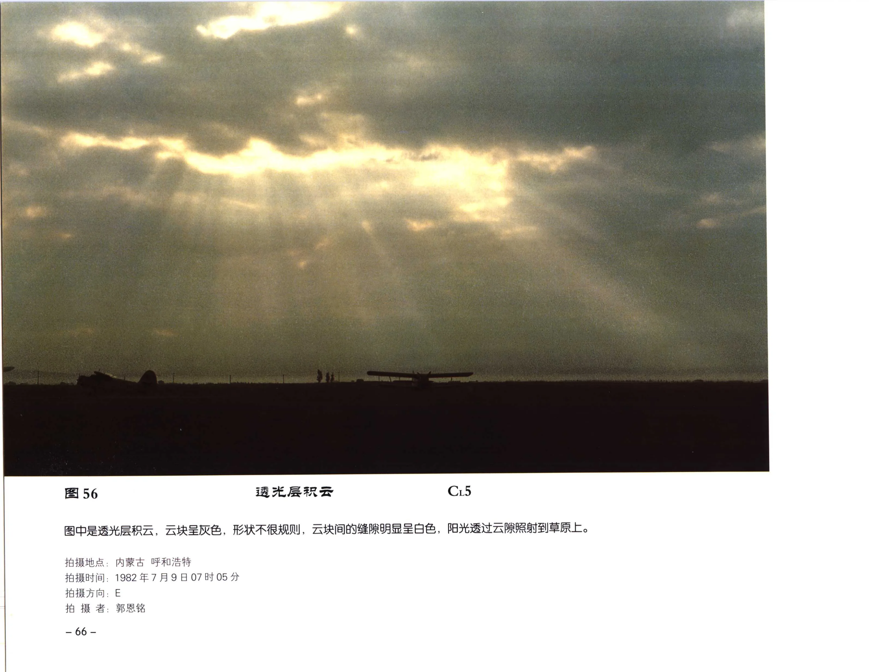

# 透光层积云

**一句话识别**：透光层积云是低空成片或成条的层积云，云块之间有缝隙，能看见蓝天或透出阳光。

图 56 的低云块灰色、不规则，云隙明显，阳光从缝隙中照到地面；“低空团块 + 缝隙透光”说明它是透光层积云，而不是更高、更细小的透光高积云。

## 属于哪里

| 项目 | 内容 |
| --- | --- |
| 云族 | [低云](low-clouds.md) |
| 云属 | 层积云 |
| 云类 | 透光层积云 |
| 简写 / 代码 | Sc tra / `CL5` |
| 拉丁名 | Stratocumulus translucidus |

## 形态特征

- 云块或云条较低、较大，常有灰色阴影。
- 云块间缝隙明显，可见蓝天、亮区或阳光。
- 可成平行长条、波状或不规则团块排列。

## 形成机制

低层湿空气在稳定层下被湍流或波动组织成云块。云层尚未完全闭合时，就表现为透光层积云。

## 天气意义

通常表示低层湿度较高和稳定层存在，本身未必带来明显降水。若云隙逐渐闭合、云层增厚，可转为 [蔽光层积云](stratocumulus-opacus.md)。

## 与相似云的区别

| 相似云 | 区别 |
| --- | --- |
| 透光高积云 | 高积云云块视角更小、更整齐，属中云。 |
| [积云性层积云](stratocumulus-cumulogenitus.md) | 积云性层积云保留更明显的积云凸起或衰退痕迹。 |
| [蔽光层积云](stratocumulus-opacus.md) | 蔽光层积云更厚，日月位置被遮蔽。 |

## 《中国云图》图版来源

- [低云图版：层积云](china-cloud-atlas/plates/low-clouds-stratocumulus.md)：图 56-59。
- 本页主图：图 56，PDF 第 78 页。

## 相关页面

[低云总览](low-clouds.md) · [层状云](layered-clouds.md) · [蔽光层积云](stratocumulus-opacus.md) · [积云性层积云](stratocumulus-cumulogenitus.md)
