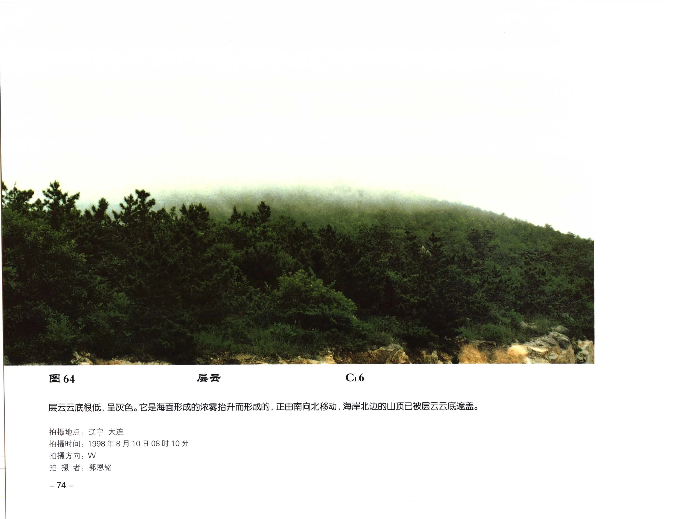

# 层云

**一句话识别**：层云是很低、均匀、灰色的云层，像雾抬离地面，常遮住山顶、高楼或低空地物。

图 64 中海面浓雾抬升形成低而均匀的层云，云底很低并遮盖山顶；关键不是云块，而是“雾状、成层、低云底”。

## 属于哪里

| 项目 | 内容 |
| --- | --- |
| 云族 | [低云](low-clouds.md) |
| 云属 | 层云 |
| 云类 | 层云 |
| 简写 / 代码 | St / `CL6` |
| 拉丁名 | Stratus |

## 形态特征

- 低而均匀，灰色或暗灰色。
- 云底很低，可遮山、高楼或海岸地物。
- 缺少明显团块结构，可伴毛毛雨或低能见度。

## 形成机制

层云常由海雾、浓雾或夜雨后浓雾抬升形成，也可由低层湿空气冷却凝结而成。雾接地，层云则云底离地。

## 天气意义

层云提示低层潮湿和低能见度环境，可伴毛毛雨。日照增强或低层混合加强后，层云可能抬升破碎为 [碎层云](fractostratus.md)。

## 与相似云的区别

| 相似云 | 区别 |
| --- | --- |
| 雾 | 雾接地，层云不接地。 |
| [蔽光层积云](stratocumulus-opacus.md) | 蔽光层积云仍能看出云块和厚薄不均。 |
| [雨层云](nimbostratus.md) | 雨层云更厚暗，常有连续性降水。 |

## 《中国云图》图版来源

- [低云图版：层云与雨层云](china-cloud-atlas/plates/low-clouds-stratus-nimbostratus.md)：图 64-67。
- 本页主图：图 64，PDF 第 86 页。

## 相关页面

[低云总览](low-clouds.md) · [层状云](layered-clouds.md) · [碎层云](fractostratus.md) · [雨层云](nimbostratus.md)
