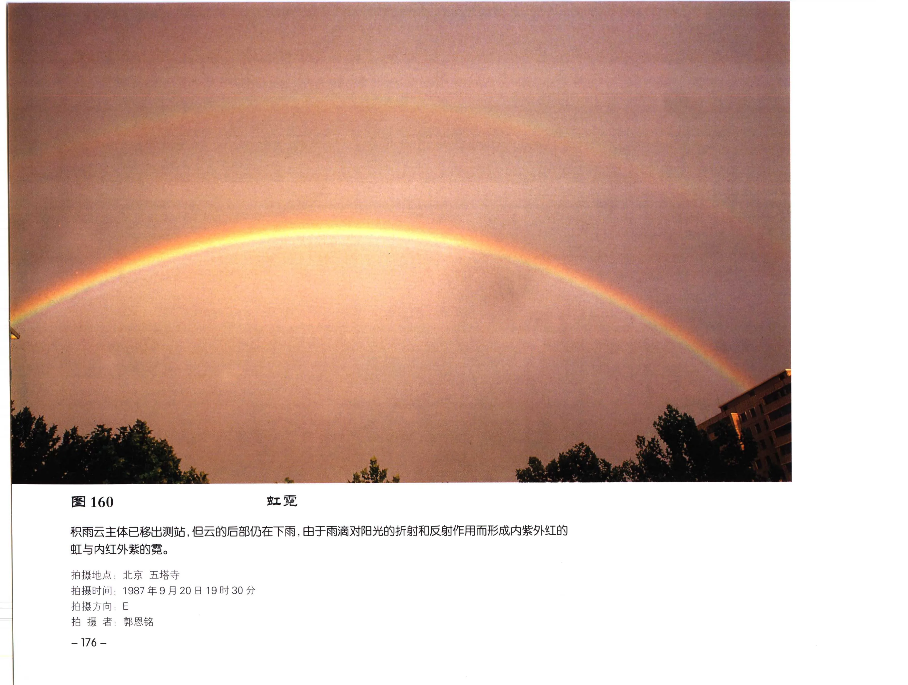

# 云与天气现象

## 范围

云与许多天气现象相互关联，包括降水、雷电、雾、霜、雾凇、积冰、光象、龙卷、沙尘等。本页以识别和来源追溯为主，不替代天气预报。

## 降水和强对流

积雨云常伴随阵性降水、雷电、大风和冰雹。雨层云多对应连续性降水。云底下方的雨幡或雪幡表示降水粒子正在下落，但不一定到达地面。

## 雾和近地面现象

雾与层云关系密切：雾抬升可形成层云或碎层云；层云云底接近地面时，也会显著影响能见度。雾凇、霜和积冰则与过冷水滴、低温和物体表面条件有关。

## 大气光象

| 现象 | 常见条件 | 识别要点 |
| --- | --- | --- |
| 虹、霓 | 阳光照射降水水滴 | 虹色带通常内紫外红，霓色序相反 |
| 华 | 薄云中水滴或冰晶衍射 | 日月附近彩色光环 |
| 晕 | 卷层云中冰晶折射和反射 | 常见 22 度晕 |
| 假日 | 卷层云冰晶 | 太阳两侧晕圈上的亮斑 |
| 宝光 | 人影投射到云雾上 | 影子周围彩色光环 |
| 虹彩 | 薄云中小水滴或冰晶衍射 | 云边或云顶彩色 |

## 沙尘、龙卷和尘卷风

龙卷通常与强烈旋转的风暴和积雨云云底有关。沙尘暴、尘卷风与强风、地面热力和下垫面尘沙条件相关，虽不一定属于云，但常与云图和天气现象一起记录。

## 典型图片

《中国云图》图 160：积雨云后部仍在下雨，阳光经雨滴折射和反射形成虹与霓。

## 来源

- 《中国云图》天气现象图版。
- [天气现象图版：光象](china-cloud-atlas/plates/weather-optical-phenomena.md)。
- [天气现象图版：龙卷、尘卷风和沙尘](china-cloud-atlas/plates/weather-tornado-dust.md)。
